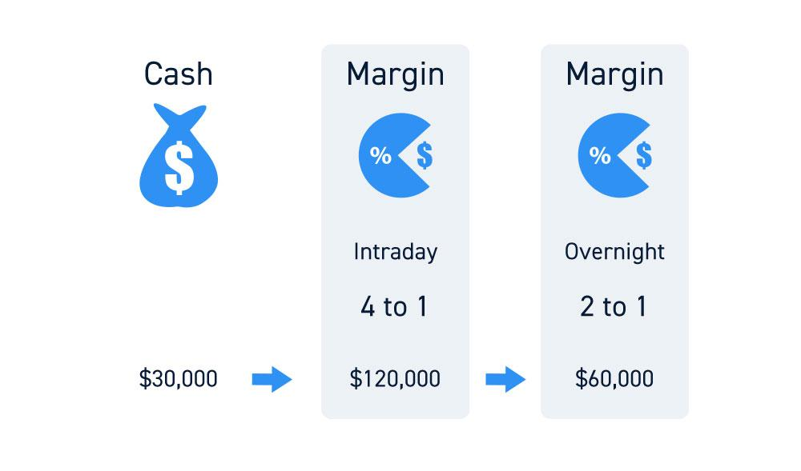

## Table of Contents

## What is a brokerage account?

A brokerage account is like a special bank account where you can buy and sell things like stocks, bonds, and mutual funds. It's different from a regular bank account because it's used for investing in the stock market and other financial markets. You need to open a brokerage account with a company called a brokerage firm, which helps you make your investments.

When you put money into a brokerage account, you can use it to buy different types of investments. The value of these investments can go up or down, which means you could make money or lose money. The brokerage firm charges fees for their services, so it's important to understand these costs before you start investing. Overall, a brokerage account is a tool that helps you grow your money by investing in various financial products.

## What is the difference between account value and cash value in a brokerage account?

In a brokerage account, the account value is the total worth of everything you own in that account. This includes the money you have in cash, plus the value of all your investments like stocks, bonds, and mutual funds. If you own a stock that's worth $100, and you have $50 in cash, your account value would be $150.

The cash value, on the other hand, is just the amount of money you have in your account that's not invested. It's like the money sitting in your wallet, ready to be used. If you sell a stock or get dividends, that money goes into your cash value. You can use this cash to buy new investments or take it out of your account if you need it.

## How is the account value calculated in a brokerage account?

The account value in a brokerage account is the total worth of everything you have in the account. This includes the money you have in cash, plus the value of all your investments like stocks, bonds, and mutual funds. For example, if you have $50 in cash and a stock that's worth $100, your account value would be $150.

To calculate the account value, you add up the current market value of all your investments and the cash you have on hand. The market value of your investments can change every day because the prices of stocks and other investments go up and down. So, your account value will change too, depending on how well your investments are doing.

## What does cash value represent in a brokerage account?

Cash value in a brokerage account is the amount of money you have that's not invested in anything. It's like the money sitting in your wallet, ready for you to use. If you sell a stock or get money from dividends, that money goes into your cash value.

You can use this cash to buy new investments whenever you want. Or, if you need money for something else, you can take the cash out of your brokerage account. The cash value is important because it shows how much money you have available to spend or invest right away.

## How can you increase the cash value in your brokerage account?

You can increase the cash value in your brokerage account in a few ways. One way is by selling investments like stocks or bonds. When you sell these, the money from the sale goes straight into your cash value. Another way is by getting dividends from stocks or interest from bonds. Dividends are like little payments companies give to people who own their stock, and these payments add to your cash value.

Another way to increase your cash value is by putting more money into your brokerage account from your bank account. You can do this by transferring money whenever you want. If you have a job and you get paid, you can take some of that money and add it to your brokerage account. This way, you'll have more cash ready to use for buying new investments or taking out if you need it.

## What is purchasing power in the context of a brokerage account?

Purchasing power in a brokerage account is the total amount of money you can use to buy investments like stocks, bonds, or mutual funds. It includes the cash you have in your account plus any money you can get from selling your investments. If you have $100 in cash and a stock worth $50, your purchasing power would be $150 because you could sell the stock and use that money to buy something else.

Purchasing power is important because it shows how much you can spend on new investments without adding more money to your account. It can change every day because the value of your investments goes up and down. If the stock market goes up and your investments are worth more, your purchasing power increases. If the market goes down, your purchasing power might decrease. Keeping an eye on your purchasing power helps you make smart decisions about when to buy or sell investments.

## How does purchasing power differ from cash value?

Purchasing power in a brokerage account is like the total amount of money you can use to buy new investments. It includes the cash you have in your account, plus the money you could get if you sold your stocks, bonds, or other investments. So, if you have $50 in cash and a stock worth $100, your purchasing power would be $150 because you could sell that stock and use the money to buy something else.

Cash value, on the other hand, is just the amount of money you have in your account that isn't invested in anything. It's the money sitting there, ready for you to use. If you sell a stock or get dividends, that money goes into your cash value. So, if you have $50 in cash, your cash value is $50, no matter what your other investments are worth.

## What factors affect the purchasing power in a brokerage account?

Purchasing power in a brokerage account is affected by many things. The main factor is the value of your investments, like stocks and bonds. If the stock market goes up and your investments are worth more, your purchasing power increases because you could sell them for more money. But if the market goes down and your investments lose value, your purchasing power goes down too. Another factor is the cash you have in your account. If you add more cash from your bank, your purchasing power goes up because you have more money to spend on new investments.

Also, the fees you pay to your brokerage firm can affect your purchasing power. If you have to pay high fees, that money comes out of your account and reduces your purchasing power. Dividends and interest from your investments can increase your purchasing power by adding more cash to your account. And if you sell some of your investments, the money you get from the sale adds to your cash and increases your purchasing power. So, keeping an eye on all these things helps you understand how much you can spend on new investments.

## How can you maximize your purchasing power in a brokerage account?

To maximize your purchasing power in a brokerage account, you need to keep an eye on the value of your investments and the cash you have. If the stock market is doing well and your investments are worth more, your purchasing power goes up because you could sell them for more money. But if the market goes down, your investments lose value, and your purchasing power goes down too. So, picking good investments that grow over time is important. Also, adding more cash to your account from your bank can boost your purchasing power because you'll have more money to spend on new investments.

Another way to maximize your purchasing power is to keep your fees low. Brokerage firms charge fees for their services, and these fees can eat into your account's value. If you can find a firm with lower fees, you'll have more money left to invest. Dividends and interest from your investments can also help. When you get dividends or interest, that money goes into your cash, making your purchasing power higher. So, choosing investments that pay dividends or interest can be a smart move. By managing these factors well, you can make the most of your purchasing power and have more money to invest.

## What are the implications of using margin on your account value and purchasing power?

Using margin in your brokerage account means you're borrowing money from your broker to buy more investments. When you use margin, it can increase your purchasing power because you have more money to spend on stocks or other investments. If the investments you buy with the borrowed money go up in value, your account value will go up too, and you could make more money than if you only used your own cash. But, using margin is risky. If the investments go down in value, you could lose more money than you started with because you have to pay back the loan with interest.

The big thing to remember about margin is that it can make your account value and purchasing power go up a lot, but it also makes things more dangerous. If the value of your investments falls below a certain point, your broker might ask you to add more money to your account or sell some of your investments to cover the loan. This is called a margin call, and it can happen quickly. So, using margin can help you buy more, but it's important to understand the risks and make sure you can handle them.

## How do different types of securities impact the account value and purchasing power?

Different types of securities, like stocks, bonds, and mutual funds, can change your account value and purchasing power in different ways. Stocks can go up and down a lot in value, which means your account value can change quickly. If the stock market is doing well and your stocks go up, your account value and purchasing power go up too because you could sell those stocks for more money. But if the market goes down and your stocks lose value, your account value and purchasing power go down as well. So, stocks can be risky but they also have the potential to grow your money a lot.

Bonds are usually less risky than stocks. They pay you interest over time, which adds to your cash value and can increase your purchasing power. But bonds don't usually go up in value as much as stocks, so they might not help your account value grow as fast. Mutual funds are a mix of stocks, bonds, and other investments. They can help spread out your risk because they hold many different types of securities. If the mutual fund does well, it can increase your account value and purchasing power. But if it doesn't do well, it can decrease them. So, the type of securities you choose can really affect how much money you have to work with in your brokerage account.

## What advanced strategies can be used to manage account value, cash value, and purchasing power effectively?

To manage your account value, cash value, and purchasing power effectively, one advanced strategy is to use dollar-cost averaging. This means you put a fixed amount of money into your investments at regular times, like every month. By doing this, you buy more shares when prices are low and fewer when prices are high, which can help you get a better average price over time. This can help grow your account value steadily and keep your cash value balanced because you're adding money regularly. Another strategy is to rebalance your portfolio. This means you check your investments from time to time and adjust them to make sure they still match your goals. If one type of investment has grown a lot, you might sell some of it and buy more of another type to keep your mix the right way. This can help you manage risk and keep your purchasing power strong.

Another advanced strategy is to use options trading. Options let you buy or sell stocks at a certain price in the future, which can help you manage your account value and purchasing power. For example, you can buy a put option to protect your stocks if you think the market might go down. This can help keep your account value from dropping too much. Or, you can sell a call option to earn some extra money, which adds to your cash value and increases your purchasing power. But options are risky and need a lot of knowledge, so it's important to learn about them before you start. By using these strategies, you can better manage your account and make the most of your money.

## What is the Role of Purchasing Power?

Purchasing power is an investor's total capacity to acquire securities, taking into account both available cash and margin lending facilities extended by the broker. This value is crucial as it determines the breadth of trading opportunities accessible to an investor. Unlike static metrics, purchasing power varies with market conditions, portfolio performance, and regulatory changes affecting margin requirements. 

Mathematically, purchasing power can be expressed as:

$$
\text{Purchasing Power} = \text{Cash Balance} + \text{Available Margin}
$$

Here, the cash balance is the liquid funds in an account, while the available margin is the additional amount a broker is willing to lend based on the securities held and the broker's margin policies.

Consider the following Python code snippet to compute purchasing power:

```python
def calculate_purchasing_power(cash_balance, available_margin):
    return cash_balance + available_margin

cash_balance = 15000  # Example cash balance in dollars
available_margin = 50000  # Example margin limit in dollars

purchasing_power = calculate_purchasing_power(cash_balance, available_margin)
print(f"Total Purchasing Power: ${purchasing_power}")
```

Investors need to understand that purchasing power is not fixed; it responds to fluctuations in their account's equity. Factors such as security price changes impact the marginable value of an account, thus altering the available margin. During volatile market periods, increased margin calls could curtail purchasing power, compelling traders to maintain a buffer of cash reserves to manage potential downgrades in leverage and avoid forced liquidation of assets.

Effective management of purchasing power allows investors to leverage the full spectrum of financial opportunities optimally. It ensures they can capitalize on market movements without the risk of exceeding borrowing limits or falling into margin call scenarios. By maximizing the use of available funds and borrowing facilities, investors can craft more responsive and dynamic investment strategies, aligning closely with their financial goals.

## How do you evaluate the value of a brokerage account?

In evaluating a brokerage account's value, or account equity, investors need to consider the total worth of all holdings within the account. This includes the cash readily available and the market value of investments such as stocks, bonds, mutual funds, and other securities. Account equity is a crucial metric because it reflects the investor's net worth in terms of their brokerage activities.

Understanding brokerage account value is essential for several reasons. First, it is directly linked to an investor's purchasing power, which is the capacity to buy additional securities. Brokers frequently use account equity to establish purchasing power, thus determining how much an investor can trade or invest at any given time. This relationship is especially relevant when considering margin accounts, where the broker lends funds based on the equity present in the investor's account.

The formula for calculating account equity can be simplified as:

$$
\text{Account Equity} = \text{Cash Balance} + \sum (\text{Market Value of each Investment})
$$

This straightforward approach helps clarify the investor's financial standing and assists in planning sustainable trading strategies.

A comprehensive grasp of account value is also vital in identifying margin limits. Brokerage firms impose margin requirements to mitigate risk, ensuring that investors maintain sufficient equity in their accounts relative to their borrowed funds. If the account equity falls below the required level, known as a maintenance margin, a margin call is issued, obligating the investor to deposit additional funds or sell certain holdings to cover the shortfall.

Accurate knowledge of brokerage account value is indispensable for planning profitable trading activities. By maintaining a clear picture of their financial holdings, investors can make informed decisions regarding risk management and portfolio diversification. Moreover, such understanding enables them to align their trading strategies with market conditions, ensuring that leverage and capital allocation are optimized effectively.

In conclusion, the evaluation of brokerage account value offers significant insights into an investor's financial status, influencing their ability to engage in trading activities. By calculating and monitoring account equity, investors can foster more strategic decision-making, ultimately contributing to more sustainable and profitable investment management.

## References & Further Reading

[1]: ["Advances in Financial Machine Learning"](https://www.amazon.com/Advances-Financial-Machine-Learning-Marcos/dp/1119482089) by Marcos Lopez de Prado

[2]: ["Evidence-Based Technical Analysis: Applying the Scientific Method and Statistical Inference to Trading Signals"](https://www.amazon.com/Evidence-Based-Technical-Analysis-Scientific-Statistical/dp/0470008741) by David Aronson

[3]: ["Machine Learning for Algorithmic Trading"](https://github.com/stefan-jansen/machine-learning-for-trading) by Stefan Jansen

[4]: ["Quantitative Trading: How to Build Your Own Algorithmic Trading Business"](https://www.amazon.com/Quantitative-Trading-Build-Algorithmic-Business/dp/1119800064) by Ernest P. Chan

[5]: Fabozzi, Frank J., Focardi, Sergio M., & Kolm, Petter N. (2010). ["Quantitative Equity Investing: Techniques and Strategies."](https://www.amazon.com/Quantitative-Equity-Investing-Techniques-Strategies/dp/0470262478) Wiley.

[6]: Kissell, Robert (2013). ["The Science of Algorithmic Trading and Portfolio Management."](https://storage.sandtears.com/06_Book/The%20Science%20of%20Algorithmic%20Trading%20and%20Portfolio%20Management%2C%20Robert%20Kissell.pdf) Academic Press.