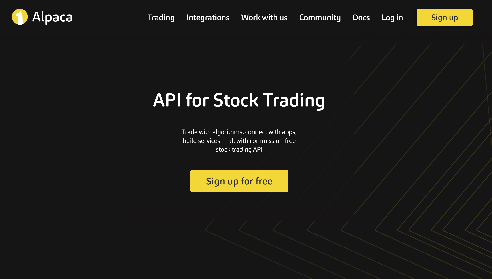

In today's fast-paced financial markets, algorithmic trading has transformed how trading is conducted by enabling institutions and individual traders to execute trades at speeds and frequencies that are impossible for human traders. This evolution relies heavily on sophisticated technologies, with the brokerage API (Application Programming Interface) playing a pivotal role. Brokerage APIs act as a critical bridge, connecting cutting-edge trading algorithms with the broker's trading platform, facilitating automated and efficient trading operations.

Brokerage APIs are integral to the functioning of algorithmic trading setups. They empower traders by providing direct access to market data and the ability to execute trades without manual intervention, thus enhancing decision-making speed and reducing latency. Through these APIs, traders can leverage real-time and historical data, allowing the development and execution of complex trading strategies that seek to capitalize on fleeting market opportunities.



An essential attribute of brokerage APIs is their ability to enhance trading efficiency. By automating tasks that were traditionally performed manually, they reduce the likelihood of human error and ensure disciplined execution following predefined rules and strategies. This automation not only enables traders to focus more on developing robust strategies but also aids in rapidly scaling trading operations.

In this article, we explore the significance of brokerage APIs in algorithmic trading, detailing the benefits they offer, the array of features they include, and their role in optimizing trading workflows. We aim to provide a comprehensive understanding of how these digital tools are shaping and fostering the evolution of modern trading practices.

## Table of Contents

## What is a Brokerage API?

A brokerage API (Application Programming Interface) comprises a set of tools and protocols that enable traders to automate trading operations and access market data directly from a broker's trading platform. It functions as a critical component in [algorithmic trading](/wiki/algorithmic-trading) strategies by streamlining processes such as automated trade execution, data retrieval, and account management.

The fundamental role of a brokerage API is to bridge the communication gap between trading algorithms and the broker's infrastructure. By facilitating automated trading, it eliminates the need for manual intervention, thereby enhancing trading speed and efficiency. This automation is crucial in executing trades based on pre-defined algorithms, which can operate at speeds and frequencies unmatched by human traders. Furthermore, APIs allow access to real-time and historical market data, enabling traders to make informed decisions and backtest their strategies under historical conditions.

Brokerage APIs are available in various forms, among which RESTful and WebSocket APIs are prominent. A RESTful API is based on representational state transfer (REST) principles, using standard HTTP requests to enable communication between client and server. It is well-suited for batch operations and is typically stateless, making it a popular choice for retrieving market data and executing trades. RESTful APIs use standard HTTP methods such as GET (to retrieve data), POST (to create or update data), and DELETE (to remove data).

On the other hand, WebSocket APIs provide full-duplex communication channels over a single, long-lived connection, allowing for real-time data streams with lower latency compared to traditional HTTP-based methods. This makes WebSocket APIs ideal for applications requiring instantaneous updates, such as live market feeds and real-time order execution status. WebSocket APIs are particularly beneficial for traders who engage in high-frequency trading ([HFT](/wiki/high-frequency-trading-strategies)), where milliseconds can determine profitability.

Python code is often employed to interface with these APIs, leveraging libraries such as `requests` for RESTful APIs or `websocket-client` for WebSocket APIs. For instance, using Python, traders can execute a simple GET request to retrieve market data:

```python
import requests

response = requests.get('https://api.broker.com/marketdata')
data = response.json()
print(data)
```

In contrast, a WebSocket connection for real-time data might look like this:

```python
from websocket import create_connection

ws = create_connection('wss://api.broker.com/real-time')
ws.send('{"type": "subscribe", "symbol": "AAPL"}')
while True:
    result = ws.recv()
    print(result)
```

Both types of APIs offer unique features tailored to diverse trading needs, allowing traders to choose the most suitable option based on their specific algorithmic trading requirements.

## The Role of Brokerage API in Algorithmic Trading

In algorithmic trading, brokerage APIs are crucial for enabling traders to implement sophisticated trading strategies without requiring human intervention. By offering real-time access to market data, these APIs allow algorithms to execute trades promptly based on the latest market movements. This capability is particularly important in fast-moving markets, where timely decision-making can significantly impact the outcome of trades.

Brokerage APIs facilitate various order types, accommodating the diverse needs of traders. For instance, they can process market orders, limit orders, stop orders, and more complex conditional orders. This versatility supports the execution of multiple trading strategies, ranging from high-frequency trading, where strategies may involve placing thousands of trades in a very short time, to statistical [arbitrage](/wiki/arbitrage), which seeks to exploit inefficiencies in pricing between related instruments.

A noteworthy advantage of brokerage APIs is their support for [backtesting](/wiki/backtesting), a process where traders apply trading strategies to historical data to gauge their potential effectiveness. By using historical data, traders can simulate their trading algorithms in past market conditions, allowing them to refine strategies before putting real capital at risk. This approach aids in the identification of strategies that are likely to perform well in live markets, as well as those that [carry](/wiki/carry-trading) higher risks.

Overall, by integrating real-time data access, diverse order functionalities, and backtesting capabilities, brokerage APIs provide a robust framework for traders to design, test, and implement algorithmic trading strategies efficiently and effectively.

## Benefits of Using Brokerage APIs

Brokerage APIs considerably enhance the efficiency of trading operations by automating repetitive tasks. This automation allows traders to redirect their efforts towards developing and refining trading strategies, which is essential for maintaining a competitive edge in fast-paced financial markets. With brokerage APIs, tasks such as order placement, position updates, and data retrieval are executed seamlessly without the constant supervision of a trader.

A significant advantage of using brokerage APIs is the reduction in human errors. By executing trades based on predefined rules and algorithms, APIs ensure discipline and accuracy in order execution. Human traders can make mistakes stemming from emotional biases or fatigue, which can lead to substantial financial losses. APIs, on the other hand, strictly adhere to programmed strategies, executing trades as intended without deviation.

Moreover, brokerage APIs enable traders to handle vast datasets in real-time. This capability is crucial for modern trading strategies that rely on large volumes of market data for analysis and decision-making. Real-time data analysis allows traders to identify profitable trading opportunities more effectively. For example, an API can pull real-time data feeds and input them into an algorithm designed to detect patterns indicative of potential market movements.

Incorporating mathematical models, such as moving averages or stochastic oscillators, can further refine the decision-making process. Below is a simple example in Python that demonstrates how a brokerage API might use a moving average crossover strategy for trade signals:

```python
def moving_average_crossover(api, symbol, short_window=40, long_window=100):
    # Retrieve historical market data
    data = api.get_historical_data(symbol)

    # Calculate short and long moving averages
    data['Short_MA'] = data['Close'].rolling(window=short_window).mean()
    data['Long_MA'] = data['Close'].rolling(window=long_window).mean()

    # Generate buy/sell signals
    data['Signal'] = 0
    data['Signal'][short_window:] = np.where(data['Short_MA'][short_window:] > data['Long_MA'][short_window:], 1, -1)

    # Execute trades based on the signals
    for i in range(1, len(data)):
        if data['Signal'][i] != data['Signal'][i-1]:
            if data['Signal'][i] == 1:
                api.place_order(symbol, 'buy', quantity=1)
            elif data['Signal'][i] == -1:
                api.place_order(symbol, 'sell', quantity=1)
```

This program retrieves historical data for a given symbol, calculates short- and long-term moving averages, and generates buy or sell signals based on their crossover point. Such automated systems can efficiently interpret large datasets and make informed trades without human intervention, thus enhancing the trading process's overall effectiveness and profitability.

## Factors to Consider When Choosing a Brokerage API

When selecting a brokerage API, traders should assess several critical factors to ensure that the API effectively supports their trading strategies and operational requirements. One primary consideration is the type of API offered. Different APIs, such as RESTful, WebSocket, or FIX, provide varying capabilities and performance characteristics. Traders must ensure the API's architecture aligns with their needs for data retrieval and order execution.

The ability to access market data is paramount. A robust API should offer comprehensive access to both real-time and historical data, which is essential for developing and backtesting trading algorithms. Real-time data allow traders to respond to market movements promptly, while historical data support strategy refinement and validation by enabling simulations of trading rules in past market conditions.

API reliability and support are crucial aspects that can significantly affect trading performance. Reliable APIs minimize downtime and ensure consistent data feeds and order execution. Adequate technical support from the broker can help resolve any issues promptly, maintaining smooth trading operations.

Latency is another critical [factor](/wiki/factor-investing), particularly for high-frequency trading strategies where delays can result in missed opportunities or suboptimal trade execution. Traders need to evaluate the latency of the API, which refers to the time taken for the data to travel from the broker's servers to the trader's system and vice versa. 

Cost is an inevitable consideration, as brokerage APIs may come with different pricing models, including fixed fees, variable costs based on usage, or commission-based charges. Traders must weigh the costs against the expected benefits of the API to determine its economic viability.

Ensuring a seamless integration between the brokerage API and existing trading systems is essential. This includes confirming compatibility with the programming languages and software tools that traders use, as well as the ease of implementing and maintaining the integration.

Therefore, a thorough evaluation of these factors can guide traders in choosing an appropriate brokerage API that enhances their trading efficiency and strategy effectiveness.

## Top Brokerage API Providers for Algo Trading

Several brokerage firms offer formidable API solutions that are particularly suitable for algorithmic trading, helping traders automate and optimize their strategies. Among these are [Interactive Brokers](/wiki/interactive-brokers-api), Alpaca Markets, and TD Ameritrade, each providing unique features aimed at enhancing trading efficiency and fluidity.

1. **Interactive Brokers**: Renowned for its extensive API capabilities, Interactive Brokers offers a comprehensive suite of tools that support trading across multiple asset classes, including equities, options, futures, currencies, and bonds. Their API is designed to cater to both individual traders and institutional investors, granting global market access. Interactive Brokers' API can be accessed using various programming languages such as Java, C++, and Python, making it versatile for different trading system architectures. This flexibility allows for seamless integration with trading models, enabling traders to execute complex strategies across international markets.

2. **Alpaca Markets**: Alpaca Markets distinguishes itself with its commission-free API, specifically tailored for stock trading. This API is optimized for simplicity and strong integration capabilities, which are highly appealing to both novice and experienced algorithmic traders. Alpaca's API is based on REST and WebSocket technologies, providing real-time data streaming and efficient handling of trade orders. The platform is designed to be accessible, offering comprehensive documentation and examples to aid developers in building trading algorithms effectively. Additionally, Alpaca supports paper trading, allowing users to test their strategies in a risk-free environment before executing live trades, adding a valuable layer of strategy development and testing.

These brokerage APIs are instrumental for traders seeking to automate and refine their trading strategies, offering the essential infrastructure to operate effectively in fast-paced and complex trading environments.

## Case Study: Successful Algo Trading with Brokerage APIs

In a notable case, QuantAlpha, a boutique [quantitative trading](/wiki/quantitative-trading) firm, successfully leveraged brokerage APIs to enhance their trading performance significantly. QuantAlpha specializes in employing algorithmic trading strategies that capitalize on intraday market inefficiencies across various asset classes, including equities and futures.

To optimize their trading operations, QuantAlpha integrated an API provided by Interactive Brokers. This API offered comprehensive functionalities, including real-time market data access, historical data retrieval, and automated order execution capabilities. With these features, QuantAlpha could implement advanced trading strategies with precision and speed.

One of the main strategies employed by QuantAlpha is [statistical arbitrage](/wiki/statistical-arbitrage). This strategy involves identifying price discrepancies between related securities, exploiting short-term mispricings. By harnessing the power of the brokerage API, QuantAlpha was able to conduct extensive backtesting using historical data to refine their statistical arbitrage models. The API's robust historical data capabilities enabled QuantAlpha to assess their strategy across multiple time frames and market conditions, ensuring a resilient approach.

Moreover, the real-time data feed provided by the API allowed QuantAlpha to monitor market fluctuations continuously. This was crucial for implementing their intraday trading strategies that require rapid response to market movements. The API facilitated seamless and instant order placements by allowing the trading algorithms to send and execute buy or sell orders based on predefined instructions.

The results achieved by integrating the brokerage API were impressive. QuantAlpha reported a 20% increase in their annualized returns within the first year of implementation. The reliability and efficiency of the API reduced latency in trade execution, thereby allowing QuantAlpha to capitalize on opportunities that their previous manual systems could not exploit. Additionally, automation minimized human errors, leading to more consistent trading performance.

QuantAlpha's successful implementation of brokerage APIs highlights the critical role of technology in enhancing trading strategies. By leveraging APIs, trading firms can achieve a higher degree of operational efficiency, enabling them to execute complex strategies effectively in highly competitive financial markets.

## Challenges and Considerations

Despite their numerous benefits, brokerage APIs in algorithmic trading come with distinct challenges that traders must navigate. One of the primary obstacles is the requirement for technical expertise. Using a brokerage API effectively often demands proficiency in programming languages, such as Python or Java, and a deep understanding of both the trading environment and the specific API's functionality. This technical barrier can be daunting for traders without a solid technical background and could necessitate the hiring of skilled developers, thus increasing operational costs.

Security risks also represent a significant consideration when dealing with brokerage APIs. Ensuring the secure transmission of data and protecting sensitive financial information is paramount. APIs can become potential entry points for malicious attacks if not properly secured. Implementing robust authentication mechanisms, such as OAuth, and employing encryption protocols like TLS can mitigate these risks. Nonetheless, traders must remain vigilant and continuously update their security measures to fend off evolving threats.

API rate limits and downtime are additional hurdles that can affect trading performance. Brokerage APIs often impose rate limits, restricting the number of simultaneous requests to prevent server overload. Exceeding these limits can result in slowed responses or complete service denial, jeopardizing timely trade execution. Moreover, unexpected downtime can disrupt trading activities, leading to missed opportunities or unintentional exposure to market risks. Traders should have contingency plans, such as redundancy measures or backup APIs, to mitigate these disruptions.

Continuous evaluation of trading strategies and consistent updates to the API are crucial for maintaining alignment with dynamic market conditions. As market behaviors evolve, strategies that were once profitable may lose their edge. Regular backtesting against new data and refining algorithms are necessary practices to ensure sustained performance. API updates, whether due to broker upgrades or software changes, also require traders to adapt their setups promptly to maintain compatibility and leverage new features.

In summary, while brokerage APIs greatly enhance the capabilities of algorithmic trading, traders must remain cognizant of the accompanying challenges to maximize their effectiveness and mitigate potential risks.

## Conclusion

Brokerage APIs have become indispensable tools for algorithmic traders, providing the necessary infrastructure to automate and optimize trading strategies. These APIs facilitate seamless communication between trading algorithms and brokerage platforms, allowing for efficient trade execution and rapid data retrieval. By offering real-time access to market data and supporting a variety of order types, brokerage APIs allow traders to deploy complex algorithmic strategies with precision and consistency.

When selecting a brokerage API, several factors must be assessed to align with specific trading needs. Data access is crucial, as APIs should provide both real-time and historical data to support comprehensive market analysis and strategy backtesting. Order execution capabilities are also vital, ensuring that the API can handle diverse order types and execute them without delay, minimizing latency. Additionally, robust broker support is essential to address any technical challenges and ensure smooth integration with the trading system. 

The strategic choice of a brokerage API can offer a significant competitive edge in algorithmic trading. By automating repetitive tasks and reducing human error, traders can focus more on developing and refining their strategies. A well-chosen API also allows for the analysis of large volumes of data in real-time, enabling the identification of profitable trading opportunities that manual processes might miss. By leveraging the right API, traders position themselves to exploit market inefficiencies effectively, enhancing their trading performance and achieving superior results in the highly competitive world of algorithmic trading.

## References & Further Reading

[1]: Bergstra, J., Bardenet, R., Bengio, Y., & Kégl, B. (2011). ["Algorithms for Hyper-Parameter Optimization."](https://proceedings.neurips.cc/paper/2011/file/86e8f7ab32cfd12577bc2619bc635690-Paper.pdf) Advances in Neural Information Processing Systems 24.

[2]: ["Advances in Financial Machine Learning"](https://www.amazon.com/Advances-Financial-Machine-Learning-Marcos/dp/1119482089) by Marcos Lopez de Prado

[3]: ["Evidence-Based Technical Analysis: Applying the Scientific Method and Statistical Inference to Trading Signals"](https://www.amazon.com/Evidence-Based-Technical-Analysis-Scientific-Statistical/dp/0470008741) by David Aronson

[4]: ["Machine Learning for Algorithmic Trading"](https://github.com/stefan-jansen/machine-learning-for-trading) by Stefan Jansen

[5]: ["Quantitative Trading: How to Build Your Own Algorithmic Trading Business"](https://books.google.com/books/about/Quantitative_Trading.html?id=j70yEAAAQBAJ) by Ernest P. Chan