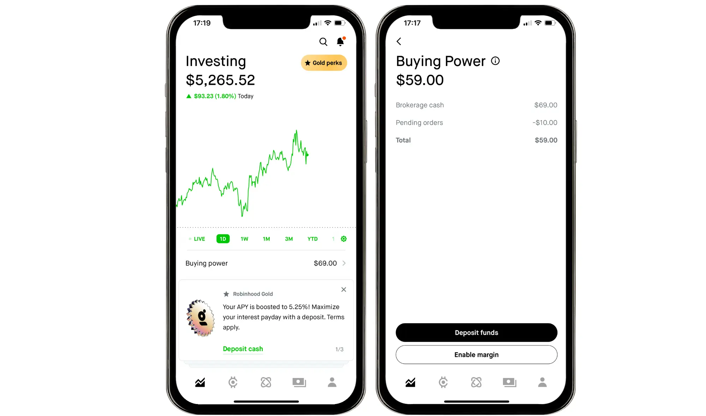

## Table of Contents

## What is brokerage cash?

Brokerage cash is the money you keep in your investment account at a brokerage firm. It's like having cash in a bank account, but this cash is used for buying and selling stocks, bonds, or other investments. When you deposit money into your brokerage account, it becomes brokerage cash, which you can use to make trades or keep as a safety net for future investments.

Sometimes, brokerage cash can also earn a small amount of interest, similar to a savings account. However, the interest rates are usually lower than what you might get from a regular savings account. It's important to keep some cash in your brokerage account to take advantage of investment opportunities quickly, but you should also be mindful of how much you're keeping there, as it might not be the best place for your money if you're not planning to invest it soon.

## How is brokerage cash different from other types of cash in financial accounts?

Brokerage cash is money you keep in a brokerage account, which is different from the cash you might have in a regular bank account or a savings account. In a brokerage account, this cash is mainly used for buying and selling investments like stocks and bonds. It's not meant for everyday spending like the money in your checking account. Sometimes, you might earn a little interest on the cash in your brokerage account, but usually, it's less than what you'd get from a savings account.

The main purpose of keeping cash in a brokerage account is to be ready to invest quickly when you see a good opportunity. It's like having money on hand to buy things when you're shopping, but instead of buying regular items, you're buying investments. However, if you're not planning to invest soon, it might be better to keep your money in a savings account where it can earn more interest. So, brokerage cash is a tool for investing, not for saving or spending on daily needs.

## What are the common sources of brokerage cash?

Brokerage cash comes from money you put into your brokerage account. You might transfer money from your bank account into your brokerage account to have it ready for investing. This is the most common way people get brokerage cash. Another way is by selling investments like stocks or bonds. When you sell these, the money from the sale goes into your brokerage account as cash.

Sometimes, you might get brokerage cash from dividends. Dividends are payments companies give to people who own their stocks. When you receive these payments, they go into your brokerage account as cash. Another source can be interest earned on the cash you keep in your brokerage account, though this is usually a small amount. So, brokerage cash mainly comes from your own money, selling investments, dividends, and a little bit of interest.

## How can brokerage cash be used within a brokerage account?

Brokerage cash is the money you keep in your brokerage account, and you can use it to buy investments like stocks, bonds, or mutual funds. When you see a good investment opportunity, you can use your brokerage cash to buy it quickly. This is helpful because you don't have to wait to transfer money from your bank account, which can take a few days.

You can also use brokerage cash to cover any fees that come with buying and selling investments. Sometimes, if you're waiting to invest more money, you might keep some cash in your account as a safety net. This way, you're ready to buy more investments when the time is right. So, brokerage cash is mainly for buying investments and paying fees, and it helps you be ready to invest whenever you want.

## What are the benefits of maintaining brokerage cash?

Keeping some cash in your brokerage account can be really helpful. It's like having money ready to spend when you see a good deal in a store. In the same way, having brokerage cash means you can quickly buy stocks or other investments when you think it's a good time. You don't have to wait to move money from your bank, which can take a few days. This can help you take advantage of investment opportunities as soon as they come up.

Another benefit is that you can use brokerage cash to pay for any fees that come with buying and selling investments. Sometimes, you might not want to sell your investments just to cover these fees. Having cash in your account can help you avoid this. Also, keeping some cash can give you peace of mind. It's like having a safety net, so you're ready for any changes in the market or new investment chances that come your way.

## Are there any risks associated with holding brokerage cash?

Yes, there are some risks to keeping money as brokerage cash. One big risk is that you might miss out on [earning](/wiki/earning-announcement) more money. The interest you get on brokerage cash is usually very low, much lower than what you could earn by investing that money in stocks, bonds, or even keeping it in a high-yield savings account. So, if you keep too much money as cash, it might not grow as much as it could if you invested it.

Another risk is that the value of your money could go down because of inflation. Inflation means that the price of things goes up over time, so the same amount of money buys less. If you keep a lot of money as brokerage cash and don't invest it, its buying power could decrease. It's important to find a good balance between having enough cash to be ready for investments and not keeping so much that you lose out on better opportunities to make your money grow.

## How does interest work with brokerage cash?

When you keep money as brokerage cash, you might earn a little bit of interest. Interest is like a small reward you get for keeping your money in the account. But the [interest rate](/wiki/interest-rate-trading-strategies) for brokerage cash is usually very low. It's not as much as you might get from a savings account at a bank. So, if you're looking to earn more interest, keeping a lot of money as brokerage cash might not be the best choice.

The interest you earn on brokerage cash is added to your account automatically. It's like getting a tiny bonus on your money. But because the interest rate is so low, it won't make your money grow very much. That's why it's good to think about other ways to use your money, like investing in stocks or bonds, where you might earn more over time.

## Can brokerage cash be invested, and if so, how?

Yes, brokerage cash can be invested. When you have money in your brokerage account, you can use it to buy different types of investments like stocks, bonds, or mutual funds. All you need to do is choose the investment you want and use your brokerage cash to buy it. This is easy because the cash is already in your account, so you don't have to wait to transfer money from your bank.

Investing your brokerage cash is a good way to make your money grow. Instead of just sitting in your account earning a tiny bit of interest, you can put it to work by buying investments that might give you bigger returns over time. Just remember to think about your investment goals and how much risk you're okay with before you decide where to put your money.

## What are the tax implications of brokerage cash?

When you keep money as brokerage cash, it usually doesn't have many tax implications. The interest you earn on your brokerage cash is very small, and you might have to pay taxes on it, just like you would with interest from a savings account. But because the interest rate is so low, the tax you owe on it is usually not very much. So, for most people, the tax on brokerage cash interest is not a big deal.

If you use your brokerage cash to buy investments like stocks or bonds, then the tax situation can change. When you sell those investments and make a profit, you might have to pay capital gains tax. This tax depends on how long you held the investment and how much money you made from selling it. But the tax is on the profit from the investment, not on the brokerage cash itself. So, it's important to think about the taxes when you invest, but the cash in your account before you invest it doesn't usually cause many tax issues.

## How does brokerage cash affect overall portfolio management?

Brokerage cash plays an important role in managing your investments. It's like having money ready to spend when you see a good deal in a store. In the same way, keeping some cash in your brokerage account helps you buy investments quickly when you think it's a good time. This can be really helpful because you don't have to wait to move money from your bank, which can take a few days. Having cash ready means you can take advantage of investment opportunities as soon as they come up.

But it's also important to not keep too much money as cash. The interest you earn on brokerage cash is usually very low, so if you keep a lot of money there, it might not grow as much as it could if you invested it. Also, if you keep too much cash, its value could go down because of inflation. Inflation means that the price of things goes up over time, so the same amount of money buys less. So, it's good to find a balance. You want enough cash to be ready for investments, but not so much that you miss out on better ways to make your money grow.

## What strategies can be employed to optimize the use of brokerage cash?

Keeping the right amount of cash in your brokerage account is important for making smart investments. One way to do this is to set a goal for how much cash you want to keep. This could be a certain percentage of your total investments, like 5% or 10%. Having this goal helps you know when to move money from your bank to your brokerage account or when to invest the cash you already have. It's like having a plan for how much money you want to keep in your wallet for quick spending.

Another strategy is to use your brokerage cash to buy investments when prices are low. If you see that a stock or bond you like is cheaper than usual, you can use your cash to buy it right away. This can help you make more money over time. But if you don't see any good deals, you might want to move some of your cash to a savings account where it can earn more interest. It's all about finding the right balance so your money is working hard for you, whether it's in cash or investments.

## How do regulatory requirements impact the management of brokerage cash?

Regulatory requirements can affect how you manage your brokerage cash. One big rule is the Securities and Exchange Commission's (SEC) requirement for brokerages to keep customer cash safe. This means your brokerage cash is protected, but it also means that brokerages have to follow strict rules about how they handle your money. For example, they might need to keep your cash in special accounts or invest it in very safe ways, like government bonds, to make sure it's secure.

These rules can also impact how quickly you can use your brokerage cash for investments. Sometimes, there might be a delay in moving your cash from one type of account to another because of these regulations. This can affect your investment strategy, especially if you want to buy or sell investments quickly. So, it's important to understand these rules and how they might change the way you manage your brokerage cash to make the best decisions for your investments.

## References & Further Reading

[1]: ["Advances in Financial Machine Learning"](https://www.amazon.com/Advances-Financial-Machine-Learning-Marcos/dp/1119482089) by Marcos Lopez de Prado

[2]: ["Quantitative Trading: How to Build Your Own Algorithmic Trading Business"](https://www.amazon.com/Quantitative-Trading-Build-Algorithmic-Business/dp/1119800064) by Ernest P. Chan

[3]: ["Machine Learning for Algorithmic Trading"](https://github.com/stefan-jansen/machine-learning-for-trading) by Stefan Jansen

[4]: ["Evidence-Based Technical Analysis: Applying the Scientific Method and Statistical Inference to Trading Signals"](https://www.amazon.com/Evidence-Based-Technical-Analysis-Scientific-Statistical/dp/0470008741) by David Aronson

[5]: Bergstra, J., Bardenet, R., Bengio, Y., & Kégl, B. (2011). ["Algorithms for Hyper-Parameter Optimization."](https://dl.acm.org/doi/10.5555/2986459.2986743) Advances in Neural Information Processing Systems 24.