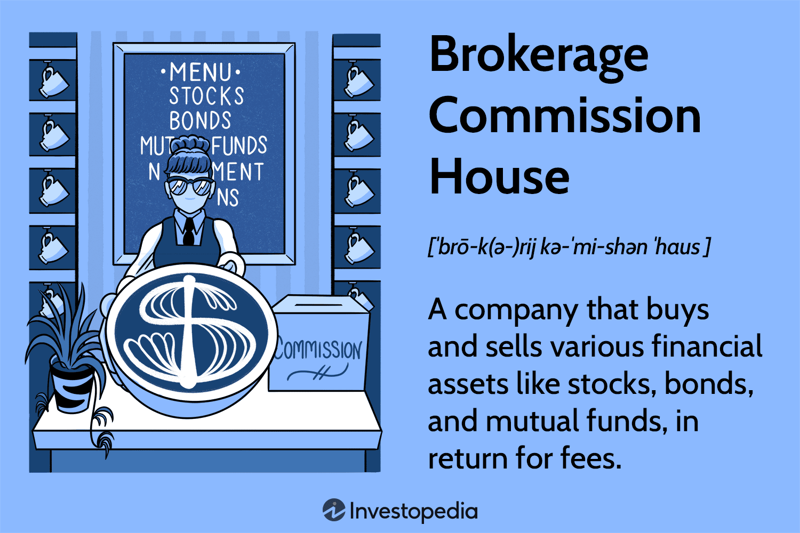

Commission house financial services play a crucial role in the functioning of financial markets by facilitating the execution of trades and providing necessary liquidity. These institutions, synonymous with brokerage firms, offer a range of services that help investors, both institutional and retail, engage efficiently in market trading. A brokerage service in finance can be defined as a financial intermediary that facilitates the buying and selling of financial securities between a buyer and a seller. It connects market participants, providing essential services such as executing trades, offering investment advice, and managing financial assets on behalf of clients.

The rise of algorithmic trading has markedly shifted the landscape of modern trading environments. This sophisticated form of trading employs algorithms, which are essentially sets of rules or instructions coded into software, to execute trades at speeds and frequencies beyond human capability. Algorithmic trading’s significance is underscored by its benefits, including enhanced speed of execution, precision, and the reduction of emotional biases or human errors in trading decisions. It allows for the automatic execution of large orders by slicing them into smaller parts, optimizing order placement according to specific parameters.



The purpose of this article is to explore the interconnectedness of commission house services, brokerage commissions, and algorithmic trading. By examining how these elements interact, we seek to understand their combined impact on market operations and efficiency. The analysis will extend into how technological innovations and regulatory frameworks are shaping these interactions, ensuring the continued evolution of financial services.

## Table of Contents

## Understanding Commission House Financial Services

A commission house is a financial entity specializing in executing trades on behalf of clients in exchange for a commission. These institutions play a pivotal role in financial markets, serving as intermediaries between buyers and sellers. Commission houses facilitate transactions across various asset classes, including equities, commodities, and derivatives. They are integral to the structure of financial markets, contributing to market efficiency and liquidity by ensuring orders are matched and executed promptly and accurately.

### Definition and Core Functions

At its core, a commission house functions as a broker, executing buy and sell orders for its clients. This execution is typically the primary service but not the only one. The core functions of commission houses include:

1. **Trade Execution**: The primary role of commission houses is to execute trades on behalf of clients. This involves buying and selling financial instruments like stocks, bonds, and commodities. The efficiency and speed of execution are critical, as they directly impact the transaction costs and potential gains for clients.

2. **Clearing and Settlement**: After executing a trade, commission houses often handle the clearing and settlement process, ensuring that the transaction is completed and that securities are transferred to the buyer and funds are transferred to the seller.

3. **Investment Advisory**: Many commission houses offer investment advisory services, providing clients with research and analysis to inform their trading decisions. This can include market analysis, risk assessment, and strategy development.

4. **Risk Management**: Commission houses assist clients in managing risk through a variety of strategies and tools, including derivatives and hedging.

### Services Offered

Commission houses offer diverse services that cater to the needs of different market participants. These services can be categorized broadly into:

- **Trading Services**: Including the execution of buy and sell orders, market making, and providing liquidity in specific securities.
- **Investment Advisory**: Offering research, analysis, and strategy recommendations tailored to client goals and risk tolerance.
- **Custodial Services**: Holding and managing securities on behalf of clients to ensure safe storage and accurate record-keeping.
- **Financing Services**: Providing margin loans and other financing facilities to enable clients to leverage their positions.

### Market Operations and Liquidity

The importance of commission houses extends to their role in facilitating efficient market operations and [liquidity](/wiki/liquidity-risk-premium). By bridging the gap between buyers and sellers, commission houses ensure that financial markets operate smoothly. Liquidity, a crucial aspect of market health, is bolstered by the activities of commission houses as they constantly match buy and sell orders, minimizing price [volatility](/wiki/volatility-trading-strategies) and enabling participants to execute large transactions with minimal impact on market prices.

### Evolution with Technological Advancements

The services provided by commission houses have evolved considerably in response to technological advancements. Automation and digitalization have revolutionized trade execution, resulting in faster and more cost-effective services. Algorithmic trading systems now handle a significant proportion of trades, reducing human error and allowing for complex trading strategies to be implemented with precision. Commission houses have also integrated sophisticated analytics and [artificial intelligence](/wiki/ai-artificial-intelligence) to enhance their advisory services and provide more tailored investment recommendations. As technology continues to advance, commission houses are likely to further incorporate innovations like blockchain for clearing and settlement, enhancing transparency and reducing costs.

In conclusion, commission houses are vital entities within the financial markets, executing trades and providing a suite of services that contribute to market efficiency and liquidity. Their evolution in response to technological advancements highlights their adaptability and ongoing importance in a rapidly changing financial landscape.

## Deconstructing Brokerage Commissions

Brokerage commissions serve as a vital component of financial services, primarily involving fees charged by brokers for executing trades or providing investment guidance. Essentially, these commissions represent the cost to the client for accessing the broker's expertise and market access. They are generally calculated as a percentage of the total transaction value, though the specific structure may vary depending on the brokerage firm or the financial product in question.

For example, a common commission structure might involve a flat fee plus a percentage of the trade's value. This can be expressed as:

$$
\text{Total Commission} = \text{Flat Fee} + (\text{Percentage Fee} \times \text{Trade Value})
$$

Aligning the interests of both brokers and clients, brokerage commissions incentivize brokers to execute trades efficiently and effectively, ensuring that the client's assets are managed well. By tying compensation to transaction size or [volume](/wiki/volume-trading-strategy), brokers are encouraged to focus on trades that are beneficial from both a performance and a financial standpoint.

There are several factors that influence brokerage commission rates. These include the type of security being traded, the volume of trades executed, and the level of service provided. Additionally, market competition and client negotiation power can significantly affect commission structures. High competition among brokerage firms often results in lower commissions as firms strive to attract more clients.

The advent of digital platforms and online trading has significantly transformed traditional brokerage commission structures. With the rise of online trading, many brokerage firms have opted for a flat-rate commission model, reducing costs for clients and enhancing transparency in pricing. Moreover, some platforms offer commission-free trades on certain securities, appealing to cost-sensitive investors. This shift has been fueled by advancements in technology, which have lowered the operational costs associated with executing trades and managing client accounts.

Thus, in an increasingly digital trading environment, traditional commission models have evolved to meet new demands. This evolution reflects the broader trend towards more accessible and cost-effective trading services, driving increased participation in financial markets.

## Algo Trading: Revolutionizing the Financial Landscape

Algorithmic trading, commonly referred to as algo trading, represents a significant evolution in the domain of financial markets, leveraging computer algorithms to automate and optimize trading decisions. This method traces its origins back to the 1970s with the introduction of electronic trading systems. The first wave of electronic trading emerged with the establishment of the NASDAQ market in 1971, paving the way for further advancements in automated trading. The evolution continued with the New York Stock Exchange (NYSE) implementing its own designated order turnaround (DOT) system, automating order routing and execution processes.

In essence, [algorithmic trading](/wiki/algorithmic-trading) utilizes complex mathematical models and formulas to decide on the timing, price, and quantity of stock trades. These algorithms analyze vast datasets quickly, enabling traders to execute orders at speeds and efficiencies not achievable through manual trading. Unlike traditional trading methods where decisions are made based on a combination of human intuition and analysis, algo trading is driven by sophisticated computer instructions known as algorithms. These algorithms operate on predefined criteria such as timing, price, quantity, or any mathematical model, without the direct involvement of human emotion and bias. For instance, a simple algorithm might be:

```python
def simple_moving_average(prices, window):
    weights = np.repeat(1.0, window) / window
    smas = np.convolve(prices, weights, 'valid')
    return smas

# Calculate moving average on a list of prices
prices = [1, 2, 3, 4, 5, 6, 7, 8, 9, 10]
moving_avg = simple_moving_average(prices, window=3)
print(moving_avg)
```

The simplification of moving average calculations serves as a foundation in certain trading strategies.

The adoption of algorithmic trading has brought considerable benefits, offering unprecedented speed, precision, and a reduction in human error. The ability to execute trades in milliseconds allows investors to capitalize on minor price fluctuations that are impossible for human traders to detect and act upon in the same timeframe. Algo trading reduces the chances of manual error by adhering strictly to its programmed set of rules, unaffected by emotional influences which might cloud decision-making processes in traditional contexts.

However, the transition to algorithmic trading is not without challenges and risks. One major concern is the phenomenon known as "flash crashes," where rapid, automated selling can lead to severe market volatility. One of the most notable examples occurred on May 6, 2010, when the Dow Jones Industrial Average plummeted by about 1,000 points within minutes due in part to algorithmic trading mechanisms. Additionally, the complexity of coding and maintaining these algorithms requires significant expertise and infrastructure, raising the barrier to entry for smaller firms. Moreover, reliance on these systems can lead to significant losses if the algorithms are misinformed or faulty, as they can execute large numbers of trades based on erroneous data or unanticipated market conditions.

Algorithmic trading has undeniably reshaped the landscape of contemporary financial markets, offering benefits that enhance efficiency and execution capabilities, while also presenting new challenges that necessitate careful management and regulatory oversight.

## The Synergy Between Brokerage Commissions and Algo Trading

Algorithmic trading has significantly reshaped brokerage commission models, making them more dynamic and responsive to the needs of modern traders. Traditionally, brokerage commissions were primarily based on a fixed fee per trade or a percentage of the trade value. However, with the advent of algorithmic trading, which emphasizes speed, precision, and efficiency, brokerage models have had to adapt to accommodate the intricacies of automated trading strategies.

Algorithmic trading involves the use of computer algorithms to execute trades at speeds and frequencies that are beyond human capability. This necessitates a commission structure that supports high-frequency trading and reduced transaction costs. As a result, many brokers have shifted towards competitive pricing strategies, including tiered pricing models where the commission rate decreases with higher trading volumes. This not only incentivizes frequent trading but also aligns the commissions more closely with the volumes typically associated with algorithmic trading.

For instance, some commission houses have adopted a maker-taker model, where liquidity providers (makers) receive a rebate, while liquidity takers pay a fee. This model benefits algorithmic traders who often act as liquidity providers, thus reducing their overall transaction costs. Moreover, subscription-based models have also emerged, offering a fixed monthly fee for an unlimited number of trades, appealing particularly to high-frequency traders reliant on algorithms.

Case studies of commission houses like [Interactive Brokers](/wiki/interactive-brokers-api) and TradeStation illustrate the incorporation of algo trading to optimize services. Interactive Brokers, known for its tiered pricing structure, offers low commission rates for trades executed through its API, which is frequently used by algorithmic traders. This has allowed them to maintain competitiveness while enabling clients to leverage algorithmic strategies effectively. Similarly, TradeStation provides sophisticated trading platforms with integrated algorithmic solutions, encouraging traders to use automated strategies while benefiting from cost-effective commissions.

The symbiotic relationship between brokerage commissions and algorithmic trading has profound economic implications. Algorithmic trading has democratized access to markets by reducing the cost per trade, enabling retail investors to engage in strategies once reserved for institutional players. This increased participation enhances market liquidity and can lead to more efficient price discovery. However, it also necessitates significant investment in technology and infrastructure by brokerages to maintain competitive commissions and platform reliability.

Looking to the future, the synergy between brokerage commissions and algorithmic trading is likely to evolve further with the integration of artificial intelligence (AI) and [machine learning](/wiki/machine-learning). As trading algorithms become more sophisticated, there will be greater demand for adaptive commission models that can cater to real-time data analytics and predictive trading. This could lead to personalized commission plans tailored to individual trading behavior and strategy efficacy.

Additionally, regulatory developments will continue to play a pivotal role. Potential changes in market regulation could impact commission structures, driving further innovation in how brokerages manage their fees in relation to algorithmic trading. Thus, continuous adaptation and investment in technology will be essential for commission houses aiming to thrive in this evolving landscape.

## Technological Innovations in Brokerage Services

Technology has played a pivotal role in transforming brokerage services, reshaping commission structures, and enhancing the overall efficiency of financial transactions. The integration of advanced technologies has not only streamlined traditional processes but also introduced new paradigms like algorithmic trading that leverage the power of automation and data analytics.

### The Role of Technology in Transforming Brokerage Services

Technological advancements have redefined brokerage services by enabling electronic trading platforms that offer direct market access, real-time data, and analytical tools to clients. This shift has empowered individual investors and institutional players to execute trades with unprecedented speed and precision. The transition from manual trading to electronic platforms has also shifted commission structures, often leading to reduced commission fees due to increased competition and lower operational costs.

### Emerging Technologies: AI and Machine Learning in Algo Trading

Artificial Intelligence (AI) and Machine Learning (ML) are at the forefront of technological innovations in brokerage services. These technologies enhance algorithmic trading by facilitating complex data analysis and predictive modeling. AI algorithms are capable of processing large datasets to identify patterns and trends that are not easily discernible by human traders. This capability allows for more informed trading decisions, minimizing risks and optimizing profitability. Machine learning models continuously learn from new data, adapting to evolving market conditions and improving trading strategies over time.

```python
# Example of a simple moving average crossover strategy using Python
def moving_average(data, window_size):
    return data.rolling(window=window_size).mean()

def moving_average_crossover(data, short_window=40, long_window=100):
    short_ma = moving_average(data['Close'], short_window)
    long_ma = moving_average(data['Close'], long_window)

    signals = pd.DataFrame(index=data.index)
    signals['Signal'] = 0.0
    signals['Signal'][short_window:] = np.where(short_ma[short_window:] > long_ma[short_window:], 1.0, 0.0)
    signals['Positions'] = signals['Signal'].diff()

    return signals
```

### Impact of Technological Innovations on Regulatory Compliance and Security

The rise of complex algorithmic strategies and electronic trading platforms necessitates robust regulatory frameworks to ensure fair and secure trading practices. Technological innovations aid regulatory compliance by enhancing transparency, enabling real-time monitoring, and improving risk assessment capabilities. However, these innovations also present challenges such as cybersecurity threats and the need for regulatory bodies to keep pace with rapidly evolving technologies. Ensuring secure trading environments requires brokerages to implement advanced security measures such as encryption, multi-[factor](/wiki/factor-investing) authentication, and continuous monitoring to combat potential vulnerabilities.

### Success Stories of Brokerages through Technological Adoption

Several brokerages have emerged as industry leaders by harnessing technology to transform their operations. For instance, Interactive Brokers has been a pioneer in electronic trading, offering low-cost commissions and a wide array of trading tools powered by technology. Their platform's efficiency and user-friendly interface have attracted a diverse clientele, ranging from retail investors to sophisticated traders. Similarly, Robinhood disrupted traditional brokerage models by offering commission-free trades, leveraging technology to appeal to millennial users and democratize trading access. These success stories underscore the competitive advantage gained by embracing technological innovation, enabling brokerages to capture market share and enhance customer satisfaction.

In summary, technological innovations continue to redefine brokerage services and commission structures, with emerging technologies like AI and machine learning setting new benchmarks in algorithmic trading. While these advancements bring efficiency and strategic advantages, they also necessitate robust security measures and adaptive regulatory frameworks to ensure sustainable growth and trust within financial markets.

## Regulatory Considerations in Algo Trading and Brokerage Commissions

The regulatory landscape for algorithmic trading and brokerage commissions is shaped by a blend of domestic and international bodies that ensure the integrity, transparency, and efficiency of financial markets. Key regulatory institutions include the U.S. Securities and Exchange Commission (SEC), the Commodity Futures Trading Commission (CFTC), the European Securities and Markets Authority (ESMA), and the Financial Conduct Authority (FCA) in the UK, among others. These organizations are tasked with setting rules and guidelines that govern trading practices, including algorithmic trading and the structuring of brokerage commissions.

Regulations impact commission house operations by enforcing transparency in fee structures to protect investors and maintain market fairness. For instance, the SEC's Regulation NMS focuses on ensuring that investors receive the best possible price when they execute trades, which indirectly affects how commissions are structured. Additionally, the Markets in Financial Instruments Directive II (MiFID II) in Europe requires detailed reporting of transaction fees, thus ensuring that brokerage commissions are transparent and justifiable.

Globally, regulations such as MiFID II have significant implications, as they require firms to unbundle research and trading fees, thus altering traditional commission structures. This push for transparency has led to increased scrutiny on the part of commission houses to justify their fees, especially in a competitive, digital-first context. For firms operating across borders, adherence to these varying regulations requires a comprehensive understanding of different compliance frameworks, which can dictate strategic trading decisions on a global scale.

Looking forward, regulatory challenges include adapting to new financial technologies that continue to emerge. Firms must anticipate changes such as increased scrutiny on high-frequency trading ([HFT](/wiki/high-frequency-trading-strategies)) algorithms, tighter data privacy regulations, and enhanced cybersecurity protocols to protect against sophisticated cyber threats. Firms can prepare by investing in robust compliance programs, adopting advanced analytics to monitor trading activities, and fostering a culture of regulatory awareness among their employees. By staying proactive, firms can adeptly navigate the evolving regulatory landscape, ensuring both compliance and competitive advantage in the dynamic world of algorithmic trading and brokerage services.

## Conclusion

Commission houses, crucial intermediaries in financial markets, bridge the gap between clients and exchanges, offering essential services such as trading execution and investment advisory. These entities play a significant role in ensuring market efficiency and liquidity, serving as facilitators for both retail and institutional investors. Brokerage commissions, the fees charged for executing trades or providing financial services, are integral to the business models of commission houses. These fees align the interests of brokers and clients, incentivizing brokers to seek the best possible trading outcomes.

Algorithmic trading, a transformative force in financial markets, has revolutionized how trades are executed. By deploying pre-programmed instructions to automate trading, algo trading enhances speed, precision, and reduces human error. This advancement has influenced brokerage commission structures, as commission houses integrate algorithmic strategies to optimize their trading services and maintain competitive edges. Digital platforms have further disrupted traditional models, reducing costs and increasing accessible trading opportunities for a broader audience.

However, the integration of technology in financial trading brings both benefits and challenges. While speed and efficiency are undeniable advantages, technological advancements necessitate heightened security measures and adherence to regulatory requirements. The evolving landscape of algo trading requires commission houses to continuously innovate and adapt their services. A call to action is warranted for firms to embrace technological advancements while preparing for future regulatory challenges. 

Future prospects for financial services and trading markets depend on a delicate balance. Commission houses must continue leveraging technology to streamline operations and enhance trading experiences while ensuring compliance with evolving regulations. As technology continues to reshape financial markets, the ability of commission houses to innovate and adapt will determine their success in a rapidly changing environment.

## References & Further Reading

[1]: Bergstra, J., Bardenet, R., Bengio, Y., & Kégl, B. (2011). ["Algorithms for Hyper-Parameter Optimization."](https://papers.nips.cc/paper/4443-algorithms-for-hyper-parameter-optimization) Advances in Neural Information Processing Systems 24.

[2]: ["Advances in Financial Machine Learning"](https://www.amazon.com/Advances-Financial-Machine-Learning-Marcos/dp/1119482089) by Marcos Lopez de Prado

[3]: ["Evidence-Based Technical Analysis: Applying the Scientific Method and Statistical Inference to Trading Signals"](https://www.amazon.com/Evidence-Based-Technical-Analysis-Scientific-Statistical/dp/0470008741) by David Aronson

[4]: ["Machine Learning for Algorithmic Trading"](https://github.com/stefan-jansen/machine-learning-for-trading) by Stefan Jansen

[5]: ["Quantitative Trading: How to Build Your Own Algorithmic Trading Business"](https://www.amazon.com/Quantitative-Trading-Build-Algorithmic-Business/dp/1119800064) by Ernest P. Chan