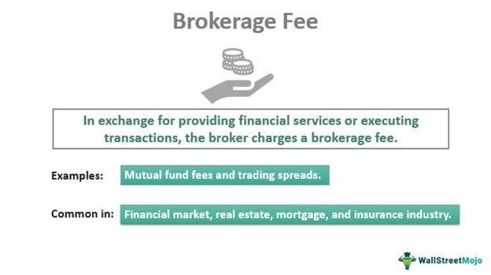

In the world of investing, managing costs is crucial to maximizing returns. Investors face a variety of fees that can erode their profits, including brokerage fees, financial fees, and investment costs. These costs can significantly impact the bottom line by reducing the overall returns on investments. Brokerage fees, for example, are charges imposed by brokers for executing trades or maintaining an account. These fees vary widely depending on the broker and the type of trading account. Financial fees, on the other hand, encompass a broader range of costs, such as mutual fund management fees and advisory fees, all of which can add up over time and diminish net gains.

The emergence of algorithmic trading has added another layer to the cost structure of investing. Algorithmic trading uses complex computer algorithms to execute trades swiftly and optimally. While this can lead to lower trading costs by optimizing execution and timing, it can also introduce new expenses related to technology and programming. Therefore, understanding how algorithmic trading influences these investment costs is vital for investors seeking to maximize returns.

This article aims to shed light on the different fees and costs associated with investing, and how they affect investment performance. By exploring these elements, investors can gain insights into cost management strategies that can help maximize their returns. We will also examine the role that algorithmic trading plays in shaping these costs. Through careful cost management, investors can enhance their financial outcomes in an ever-evolving investment landscape.

## Table of Contents

## Understanding Brokerage Fees

Brokerage fees are an integral part of the investing process, representing costs imposed by brokers for facilitating trades or maintaining accounts. These fees are structured in various forms, primarily including commission fees, account maintenance fees, and inactivity fees. Each of these fees impacts the overall cost of investment and understanding them is crucial for effective investment management.

Commission fees are typically charged on a per-transaction basis and are one of the most common types of brokerage fees. They represent a percentage or a fixed amount paid to brokers for executing buy or sell orders. Investors must be aware of these fees, as frequent trading can lead to substantial costs, eroding potential profits.

Account maintenance fees are charged by brokers to keep an account active. These can apply regardless of the trading activity and may cover administrative costs incurred by the brokerage firm. Such fees are often based on the value of the investment portfolio or a fixed annual rate. For example, some brokers might charge a fee if an account's assets fall below a specified threshold.

Inactivity fees are imposed when an account has infrequent transaction activity over a defined period. Brokers use these fees to encourage regular trading or account engagement. Investors who follow a buy-and-hold strategy should be particularly mindful of such fees to avoid unnecessary costs.

Given the variety of fee structures, understanding your broker's fees is essential. This knowledge enables investors to make informed decisions about where and how to conduct transactions. Online discount brokers, for instance, have revolutionized the brokerage industry by offering lower commission fees and sometimes eliminating account maintenance and inactivity fees altogether. They achieve these savings by leveraging technology and reducing overhead costs associated with traditional brokerage firms.

To ensure cost-effectiveness, investors should conduct thorough comparisons of brokerage fees across different providers. This comparison might include evaluating the fee structure for commission-based versus flat-rate brokers, as well as assessing any hidden costs associated with trading platforms. By taking into account these factors, investors can select brokerage services that align with their trading habits and financial goals, ultimately managing investment costs more effectively.

## Examining Financial Fees and Investment Costs

Financial fees and investment costs extend beyond mere brokerage fees and encompass various charges that can have a profound impact on an investor's financial returns. Among these are mutual fund management fees, advisor fees, and a variety of other expenses. To effectively manage these costs, understanding expense ratios is crucial. The expense ratio represents the percentage of a fund's assets used for administrative, management, advertising, and operational expenses. For example, a mutual fund with an expense ratio of 1% will use $10 for expenses out of every $1,000 invested each year. Therefore, lower expense ratios can enhance net returns for investors over time.

Hidden costs, such as trading spreads and market impact costs, further complicate the landscape of investment expenses. Trading spreads are the difference between the bid and ask price of a security and can subtly erode investment returns, especially for high-frequency traders. Market impact costs refer to the effect a significant trade can have on the market price of a security. Large trades can move the market against the trader, resulting in less favorable prices for the execution of trades. Awareness of these hidden costs is crucial for investors looking to preserve their capital.

To optimize investment returns, reducing these costs is essential. Investors can utilize various tools and resources to quantitatively analyze and minimize fees. Financial analytics software and platforms offer insights into expense ratios, trading spreads, and other costs. These tools can also assist in benchmarking against industry standards to ensure investors are not overpaying. Furthermore, strategies such as investing in index funds, which typically have lower expense ratios due to passive management, can be effective. Leveraging tax-advantaged accounts and considering tax-efficient investments can also help lower the overall burden of investment costs.

The impact of financial fees and investment costs on long-term returns cannot be overstated. By diligently analyzing and minimizing these fees, investors can potentially enhance their portfolio's performance significantly over time. Tools and technology, combined with a strategic approach to investment, enable investors to manage these costs effectively, thereby achieving better financial outcomes.

## The Impact of Algorithmic Trading on Investment Costs

Algorithmic trading utilizes sophisticated computer algorithms to execute trades under pre-defined parameters, significantly impacting investment costs. These algorithms improve trade execution timing and efficiency, primarily through strategies like [market making](/wiki/market-making), [arbitrage](/wiki/arbitrage), and [trend following](/wiki/trend-following). By reducing manual intervention, [algorithmic trading](/wiki/algorithmic-trading) can substantially lower trading costs.

The primary cost benefit of algorithmic trading lies in its ability to minimize the bid-ask spread—the difference between the highest price a buyer is willing to pay and the lowest price a seller is willing to accept. For instance, algorithms can execute large trades by breaking them into smaller orders and spreading them over time, thereby reducing market impact and avoiding significant price fluctuations. This process is known as "order slicing." 

However, deploying algorithmic trading systems incurs costs. Setting up these systems requires advanced technology, including high-speed internet connections, powerful computing infrastructure, and specialized software, all contributing to overhead costs. Moreover, developing algorithms demands skilled programming and quantitative expertise, often requiring significant investment in talent and research.

From a financial calculus perspective, consider the total transaction cost (TTC), which can be expressed as:

$$
\text{TTC} = \text{Fixed Costs} + \text{Variable Costs} - \text{Cost Reductions}
$$

Where:
- Fixed Costs include the initial technological setup and ongoing maintenance.
- Variable Costs cover the expenses related to executing each trade.
- Cost Reductions refer to savings accrued through optimized trading strategies, such as lower spreads and minimal market impact.

Investors must evaluate these costs against the potential savings. For instance, while initial setup costs may be high, the reduction in transaction costs and enhanced trading efficiency can result in substantial net savings over time. This evaluation involves understanding the specific trading strategies employed by the algorithm and their expected return on investment.

Moreover, algorithmic trading has introduced competitive pressure on traditional brokerage models, often resulting in reduced fees and commissions industry-wide. Nonetheless, the effectiveness of algorithmic trading in reducing costs also depends on market conditions, such as [liquidity](/wiki/liquidity-risk-premium) and [volatility](/wiki/volatility-trading-strategies). Algorithms designed for different market scenarios can either capitalize on or lose efficiency due to shifting dynamics.

Ultimately, assessing the role of algorithmic trading in investment costs requires a nuanced consideration of both technological expenses and strategic savings. Investors and institutions adopting algorithmic trading must thoroughly analyze its cost-benefit landscape to maximize its potential for reducing overall investment expenditures.

## Strategies to Minimize Investment Costs

Investors can adopt several effective strategies to minimize investment costs and fees, enhancing their portfolio performance over time. One of the most impactful strategies is selecting low-cost brokerage firms and investment funds that offer low expense ratios. Low-cost brokerages often have reduced commission fees and minimal or no account maintenance fees, making them an attractive option for cost-conscious investors. Furthermore, choosing funds with low expense ratios can substantially increase net returns. For example, if a fund has an expense ratio of 0.20% compared to another with 1.00%, the cost difference over an extended period can be significant.

Optimizing trading strategies is another critical approach to reducing transaction costs. By analyzing past trading patterns and adjusting strategies accordingly, investors can limit the number of unnecessary trades and corresponding fees. Algorithmic trading tools can assist in this optimization by timing trades more efficiently and reducing market impact costs.

Tax-efficient investment methods also play a crucial role in lowering overall costs. Utilizing tax-advantaged accounts such as Individual Retirement Accounts (IRAs) and 401(k) plans allows investors to defer or even eliminate certain tax liabilities, thereby preserving more capital for investment growth. Strategies such as tax-loss harvesting, which involves selling securities at a loss to offset taxable gains, can further enhance tax efficiency.

Regularly reviewing and adjusting portfolios ensures that investments remain aligned with financial goals while minimizing costs. This involves assessing the performance of individual securities and funds, rebalancing asset allocations as needed, and staying informed about changes in fee structures or tax laws. Continuous monitoring helps investors avoid cost creep, ensuring that fees don’t erode returns over time.

By implementing these strategies, investors can significantly reduce the impact of costs on their investment portfolios, thereby increasing the potential for achieving their long-term financial objectives.

## Conclusion

Investment costs, including brokerage and financial fees, are fundamental determinants of investment success. A thorough understanding of these costs enables investors to make informed decisions, as it influences both short-term and long-term financial strategies. With the advent of algorithmic trading, the landscape of investment costs has evolved, offering both opportunities and challenges in managing these expenses. Algorithmic trading can reduce costs through optimized trade execution but may introduce new costs related to technology and programming.

Proactive cost management is essential for achieving favorable financial outcomes. Investors should continuously seek methods to minimize fees, such as opting for low-cost brokerage firms and investment vehicles with favorable expense ratios. Additionally, regularly reviewing and adjusting portfolios is crucial in maintaining cost-efficiency. As the investment world continues to innovate, staying informed about changes in fee structures and trading technologies is vital to ensuring that cost considerations remain front and center in investment decisions.

In a rapidly changing financial environment, vigilance in monitoring costs can yield substantial benefits. By keeping a close eye on the ever-evolving fee landscape and utilizing available technology wisely, investors can enhance their financial performance and secure more promising investment outcomes.

## References & Further Reading

[1]: Bergstra, J., Bardenet, R., Bengio, Y., & Kégl, B. (2011). ["Algorithms for Hyper-Parameter Optimization."](https://papers.nips.cc/paper/4443-algorithms-for-hyper-parameter-optimization) Advances in Neural Information Processing Systems 24.

[2]: ["Advances in Financial Machine Learning"](https://www.amazon.com/Advances-Financial-Machine-Learning-Marcos/dp/1119482089) by Marcos Lopez de Prado

[3]: ["Evidence-Based Technical Analysis: Applying the Scientific Method and Statistical Inference to Trading Signals"](https://www.amazon.com/Evidence-Based-Technical-Analysis-Scientific-Statistical/dp/0470008741) by David Aronson

[4]: ["Machine Learning for Algorithmic Trading"](https://github.com/PacktPublishing/Machine-Learning-for-Algorithmic-Trading-Second-Edition) by Stefan Jansen

[5]: ["Quantitative Trading: How to Build Your Own Algorithmic Trading Business"](https://github.com/LucindaYa/quant-resources/blob/master/Quantitative%20Trading%20How%20to%20Build%20Your%20Own%20Algorithmic%20Trading%20Business.pdf) by Ernest P. Chan