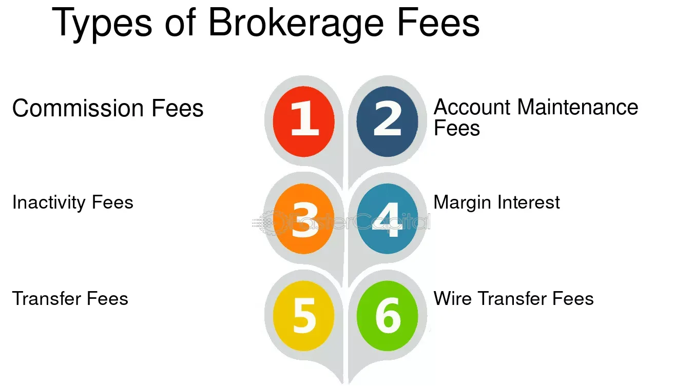

## Table of Contents

## What are brokerage fees?

Brokerage fees are charges that you pay when you buy or sell investments like stocks, bonds, or mutual funds through a broker. A broker is a person or a company that helps you make these trades. The fee is like a service charge for using the broker's services. The amount of the fee can be different depending on the broker and the type of investment you are making. Some brokers have a flat fee, which means you pay the same amount no matter how much you are buying or selling. Others might charge a percentage of the total amount of your trade.

These fees can add up over time, so it's a good idea to understand them before you start trading. For example, if you are buying $1,000 worth of stock and the broker charges a 1% fee, you will pay $10 just for the trade. If you trade often, these fees can reduce your overall investment returns. That's why many people look for brokers with low fees or even no fees at all. Some online brokers offer very low or no fees to attract more customers. Always check the fee structure of a broker before you start using their services to make sure it fits your investment plans.

## Why do brokerages charge fees?

Brokerages charge fees to make money and cover their costs. They need to pay for things like staff, technology, and office space. When you use a broker to buy or sell stocks, bonds, or other investments, they do a lot of work for you. They handle the paperwork, make sure everything is done correctly, and sometimes even give you advice. All of this costs money, so they charge you a fee to cover these expenses and make a profit.

Not all fees are the same. Some brokers charge a flat fee, which means you pay the same amount no matter how much you are trading. Others might charge a percentage of the total amount you are buying or selling. The type of fee can depend on the broker and the kind of service they offer. For example, a full-service broker, who gives you a lot of advice and help, might charge more than a discount broker, who just helps you make the trade without much extra help.

## What are the common types of brokerage fees?

There are several common types of brokerage fees that you might come across. One type is the trading commission, which is what you pay every time you buy or sell a stock or other investment. This can be a flat fee, like $5 or $10 per trade, or it can be a percentage of the total amount you're trading. Another type is the account maintenance fee, which is charged just for having an account with the broker, even if you're not trading. This fee might be charged monthly or yearly.

Another common fee is the inactivity fee, which some brokers charge if you don't make any trades for a certain period of time. This is to encourage people to use their accounts actively. There are also management fees, which you might see if you invest in mutual funds or ETFs through your broker. These fees are charged by the fund manager for managing the investments in the fund. Lastly, there can be fees for additional services, like getting research reports or talking to a financial advisor, which are not included in the basic trading fees.

Understanding these fees is important because they can affect how much money you make from your investments. Always check what fees a broker charges before you start using their services. Some brokers have lower fees than others, and choosing the right one can save you a lot of money over time.

## How do commission fees work?

Commission fees are what you pay to a broker every time you buy or sell a stock or other investment. It's like a service charge for using their help to make the trade. Some brokers charge a flat fee, which means you pay the same amount no matter how much you are trading. For example, they might charge $5 every time you make a trade. Other brokers might charge a percentage of the total amount you are buying or selling. If you're buying $1,000 worth of stock and the fee is 1%, you would pay $10 for that trade.

These fees can add up over time, so it's important to know how much you're paying. If you trade a lot, even small fees can take a big chunk out of your investment returns. That's why many people look for brokers with low or no commission fees. Some online brokers offer very low fees or even no fees at all to attract more customers. Always check the fee structure of a broker before you start using their services to make sure it fits your investment plans.

## What is the difference between a flat fee and a tiered fee structure?

A flat fee is a simple type of fee where you pay the same amount every time you make a trade, no matter how much money you are investing. For example, if your broker charges a flat fee of $5 per trade, you will pay $5 whether you are buying $100 worth of stock or $10,000 worth of stock. This can be good if you are making small trades because the fee stays the same, but it might not be the best if you are trading large amounts of money.

A tiered fee structure is different because the fee changes based on how much you are trading. With this system, the more money you invest, the higher the fee might be. For example, a broker might charge 1% for trades up to $1,000, but only 0.5% for trades over $10,000. This can be better if you are making big trades because the percentage fee might end up being less than a flat fee. But for smaller trades, a tiered fee could end up costing you more than a flat fee.

## Can you explain how management fees are calculated?

Management fees are charges that you pay for someone to manage your investments. These fees are often seen when you invest in things like mutual funds or ETFs. The fee is usually a percentage of the total amount of money you have invested in the fund. For example, if you have $10,000 in a mutual fund and the management fee is 1%, you will pay $100 each year just for the fund manager to handle your investments.

These fees are taken out of the fund's assets, so you don't have to pay them directly. Instead, the value of your investment in the fund is reduced by the fee. The exact percentage can vary depending on the fund, but it's important to know what you're paying because these fees can add up over time. If you're comparing different funds, always check the management fee to see how much it will cost you in the long run.

## What are inactivity fees and how can they be avoided?

Inactivity fees are charges that some brokers put on your account if you don't make any trades for a while. They want you to keep using their services, so they might charge you a fee if your account is quiet for too long. This fee can be taken out of your account every month or every year, depending on the broker's rules. It's important to know about these fees because they can slowly take money out of your account even if you're not doing anything.

To avoid inactivity fees, you need to keep your account active. This means making at least one trade every so often, like once a month or once a year, depending on what the broker says. Another way to avoid these fees is to choose a broker that doesn't charge them. Many online brokers don't have inactivity fees because they want to attract more customers. Always read the fine print about fees before you open an account so you know what to expect and how to keep your money safe.

## How do transaction fees vary between different types of investments?

Transaction fees can be different depending on what kind of investment you are making. When you buy or sell stocks, you might pay a commission fee. This fee can be a flat amount, like $5 per trade, or a percentage of the total money you are trading. For example, if you buy $1,000 worth of stock and the fee is 1%, you would pay $10. On the other hand, if you invest in mutual funds or ETFs, you might pay a management fee instead. This fee is usually a small percentage of the total amount you have in the fund, and it's taken out of the fund's value each year.

For other types of investments, like bonds or options, the fees can be different too. Bonds might have a fee for buying or selling them, but it could be lower than the fee for stocks. Options trading can be more complicated and might have higher fees because it involves more risk and work for the broker. Overall, the type of investment you choose can affect how much you pay in fees, so it's a good idea to look at the fee structure before you start investing.

## What should investors consider when comparing brokerage fees?

When comparing brokerage fees, investors should first look at the different types of fees they might have to pay. Some brokers charge a flat fee for every trade, which means you pay the same amount no matter how much you are buying or selling. Other brokers might charge a percentage of the total amount you are trading, which can be good if you are making small trades but might cost more if you are trading a lot of money. It's also important to check for other fees like account maintenance fees, inactivity fees, and management fees for things like mutual funds or ETFs. Knowing all these fees helps you see the total cost of using a broker.

Another thing to consider is how often you plan to trade. If you trade a lot, even small fees can add up and take a big chunk out of your investment returns. That's why it's good to look for brokers with low or no fees, especially if you are an active trader. Some online brokers offer very low fees or even no fees at all to attract more customers. Always read the fine print and understand the fee structure before you start using a broker's services. This way, you can choose the one that fits your investment plans and helps you keep more of your money.

## How have brokerage fee structures evolved in recent years?

In recent years, brokerage fee structures have changed a lot. Many brokers have started to offer lower fees or even no fees at all to attract more customers. This is especially true for online brokers who want to compete with each other. Before, you might have had to pay a lot of money every time you made a trade, but now, you can find brokers who let you trade for free or for just a few dollars. This has made it easier and cheaper for people to start investing.

Another big change is that some brokers have gotten rid of inactivity fees. These are fees that you used to have to pay if you didn't make any trades for a while. Now, many brokers don't charge these fees anymore because they want to keep their customers happy. Also, the way management fees are handled has changed a bit. Some investment funds now have lower management fees, which means you get to keep more of your money. Overall, these changes have made investing more affordable and accessible for everyone.

## What impact do regulatory changes have on brokerage fees?

Regulatory changes can have a big impact on brokerage fees. When the government makes new rules about how brokers can charge fees, it can make fees go up or down. For example, if a new rule says brokers have to be more clear about their fees, they might have to change how they charge. This can make fees lower because brokers want to keep their customers happy and follow the rules. But sometimes, new rules can make fees go up if brokers have to spend more money to follow them.

These changes can also make the whole market more fair. When regulators step in, they can stop brokers from charging too much or hiding fees. This helps investors know exactly what they are paying for and can save them money. Over time, regulatory changes have helped make investing cheaper and easier for everyone by pushing brokers to offer lower fees and be more open about their costs.

## How can advanced investors negotiate or minimize brokerage fees?

Advanced investors can negotiate or minimize brokerage fees by talking directly to their brokers. If they trade a lot, they can ask for a lower fee because they are good customers. Brokers might say yes because they want to keep these customers happy. Another way is to trade bigger amounts of money. Some brokers have a tiered fee structure where you pay less if you trade more. So, if you can make bigger trades, you might pay less in fees.

Another way to minimize fees is to choose the right broker. Some brokers have lower fees or even no fees at all. Advanced investors can look for these brokers and switch if they find a better deal. They can also use different brokers for different kinds of trades. For example, they might use a broker with low fees for stocks and another one for options. By being smart about which broker they use, advanced investors can save a lot of money on fees.

## What is the impact of algorithmic trading on investment costs?

Algorithmic trading utilizes sophisticated computer algorithms to execute trades under pre-defined parameters, significantly impacting investment costs. These algorithms improve trade execution timing and efficiency, primarily through strategies like [market making](/wiki/market-making), [arbitrage](/wiki/arbitrage), and [trend following](/wiki/trend-following). By reducing manual intervention, [algorithmic trading](/wiki/algorithmic-trading) can substantially lower trading costs.

The primary cost benefit of algorithmic trading lies in its ability to minimize the bid-ask spread—the difference between the highest price a buyer is willing to pay and the lowest price a seller is willing to accept. For instance, algorithms can execute large trades by breaking them into smaller orders and spreading them over time, thereby reducing market impact and avoiding significant price fluctuations. This process is known as "order slicing." 

However, deploying algorithmic trading systems incurs costs. Setting up these systems requires advanced technology, including high-speed internet connections, powerful computing infrastructure, and specialized software, all contributing to overhead costs. Moreover, developing algorithms demands skilled programming and quantitative expertise, often requiring significant investment in talent and research.

From a financial calculus perspective, consider the total transaction cost (TTC), which can be expressed as:

$$
\text{TTC} = \text{Fixed Costs} + \text{Variable Costs} - \text{Cost Reductions}
$$

Where:
- Fixed Costs include the initial technological setup and ongoing maintenance.
- Variable Costs cover the expenses related to executing each trade.
- Cost Reductions refer to savings accrued through optimized trading strategies, such as lower spreads and minimal market impact.

Investors must evaluate these costs against the potential savings. For instance, while initial setup costs may be high, the reduction in transaction costs and enhanced trading efficiency can result in substantial net savings over time. This evaluation involves understanding the specific trading strategies employed by the algorithm and their expected return on investment.

Moreover, algorithmic trading has introduced competitive pressure on traditional brokerage models, often resulting in reduced fees and commissions industry-wide. Nonetheless, the effectiveness of algorithmic trading in reducing costs also depends on market conditions, such as [liquidity](/wiki/liquidity-risk-premium) and [volatility](/wiki/volatility-trading-strategies). Algorithms designed for different market scenarios can either capitalize on or lose efficiency due to shifting dynamics.

Ultimately, assessing the role of algorithmic trading in investment costs requires a nuanced consideration of both technological expenses and strategic savings. Investors and institutions adopting algorithmic trading must thoroughly analyze its cost-benefit landscape to maximize its potential for reducing overall investment expenditures.

## References & Further Reading

[1]: Bergstra, J., Bardenet, R., Bengio, Y., & Kégl, B. (2011). ["Algorithms for Hyper-Parameter Optimization."](https://papers.nips.cc/paper/4443-algorithms-for-hyper-parameter-optimization) Advances in Neural Information Processing Systems 24.

[2]: ["Advances in Financial Machine Learning"](https://www.amazon.com/Advances-Financial-Machine-Learning-Marcos/dp/1119482089) by Marcos Lopez de Prado

[3]: ["Evidence-Based Technical Analysis: Applying the Scientific Method and Statistical Inference to Trading Signals"](https://www.amazon.com/Evidence-Based-Technical-Analysis-Scientific-Statistical/dp/0470008741) by David Aronson

[4]: ["Machine Learning for Algorithmic Trading"](https://github.com/PacktPublishing/Machine-Learning-for-Algorithmic-Trading-Second-Edition) by Stefan Jansen

[5]: ["Quantitative Trading: How to Build Your Own Algorithmic Trading Business"](https://github.com/LucindaYa/quant-resources/blob/master/Quantitative%20Trading%20How%20to%20Build%20Your%20Own%20Algorithmic%20Trading%20Business.pdf) by Ernest P. Chan