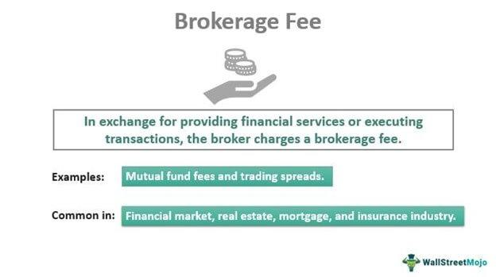

The financial services industry is an integral part of the global economy, promoting capital formation, liquidity, and wealth creation. As it continues to evolve, it becomes increasingly complex due to advancements in technology, globalization, and regulatory changes. Among the critical components of modern financial services are brokerage and algorithmic trading, both of which play a significant role in facilitating efficient market operations.

Brokerage services are essential for investors looking to buy and sell financial instruments. Brokers act as intermediaries between buyers and sellers, assisting in the execution of trades and providing various services such as investment advice and market research. Traditional brokerage involves direct interaction with human brokers, whereas electronic systems facilitate trades in algorithmic trading. Algorithmic trading leverages computer algorithms to execute trades at high speed and efficiency, often avoiding the emotional biases that can affect human traders.

Understanding the fees associated with financial services is crucial for investors, as these costs can significantly impact investment outcomes. Brokerage fees, including commissions, account maintenance fees, and more, can vary widely depending on the service provider and type of investment. Similarly, algorithmic trading, while offering potential cost savings through automation and efficiency, involves distinct costs such as platform fees and slippage costs.

The purpose of this article is to explore the various fees associated with financial services, focusing on brokerage and algorithmic trading. By examining these costs, investors can better assess the impact of fees on their investment returns and make informed decisions.

Readers can expect a comprehensive exploration of financial services fees throughout this article, structured to provide clarity on brokerage fees, the cost implications of algorithmic trading, and a comparative analysis of these two trading methods. Additionally, strategies for managing and reducing fees will be discussed to help investors maximize their net returns.

## Table of Contents

## Understanding Financial Services Fees

Financial services fees are charges that investors might encounter when engaging with various financial products and services. These fees compensate financial service providers for transactions, advisory services, and other related activities. Understanding these fees is crucial for investors as they directly impact overall investment returns.

### Definition and Types of Financial Services Fees

Investors can encounter several types of fees when accessing financial services. The primary categories include transaction fees, advisory fees, management fees, and performance fees. 

1. **Transaction Fees**: These are charges incurred during the buying or selling of financial instruments. Common examples include brokerage commissions and mutual fund transaction fees.

2. **Advisory Fees**: Financial advisors often charge fees for providing investment advice. These fees can be based on a flat rate, hourly rate, or a percentage of assets under management (AUM).

3. **Management Fees**: These fees are typically charged by fund managers for overseeing investment portfolios. They are usually expressed as an annual percentage of the total fund's value.

4. **Performance Fees**: These are based on the fund's performance relative to a benchmark. They are more common in hedge funds and are designed to align the interests of the fund manager with those of the investors.

### Variation of Fees Based on Service Provider and Investment Type

Financial services fees can significantly vary depending on the service provider and the type of investment. A discount brokerage might charge reduced transaction fees but offer limited personalized advice, whereas a full-service brokerage could charge higher fees due to the additional services provided. For example, a mutual fund might have a higher management fee compared to an index fund due to the active management involved.

### Role of Financial Advisors and Diverse Fee Structures

Financial advisors play a critical role in helping investors make informed decisions, and their fee structures reflect the services they offer. These structures include:

- **Fee-only advisors**: Charge a flat rate or hourly fee and do not earn commissions from selling financial products.
- **Commission-based advisors**: Earn commissions from the financial products they sell, which may lead to potential conflicts of interest.
- **Fee-based advisors**: Combination of the above two, typically charging a flat fee while also earning commissions.

Understanding these structures helps investors choose advisors aligned with their financial goals without conflicts of interest.

### Common Misconceptions and Need for Clarity

There are common misconceptions regarding financial services fees. One misconception is that higher fees always equate to better services or higher returns. In reality, higher fees do not necessarily correlate with superior performance or advice. Additionally, investors might not fully realize the cumulative effect fees can have on long-term investment outcomes, often underestimating their impact.

To make informed decisions, investors require clarity and transparency regarding fees. Service providers should provide detailed breakdowns of all fees and potential costs associated with their services. Utilizing tools such as fee calculators and investment fee comparison platforms can further assist investors in evaluating and managing these costs effectively.

## Exploring Brokerage Fees

Brokerage plays a vital role in facilitating the trading process by acting as an intermediary between investors and financial markets. Brokers provide investors with access to securities such as stocks, bonds, and mutual funds, enabling them to execute buy and sell orders. This process is essential for maintaining market [liquidity](/wiki/liquidity-risk-premium) and providing investors with opportunities to engage in financial markets.

Brokerage fees are charges that brokers levy for the services they provide. These fees can take many forms, with commission fees being one of the most common. Commission fees are typically a percentage of the trade value or a fixed fee per trade, encompassing both online and traditional brokers. Some brokers may charge account maintenance fees, often as an annual or monthly rate, to cover administrative costs and additional services.

Several factors influence brokerage fees. The type of account can impact the fee structure; for instance, retirement accounts may have different fees compared to taxable accounts. The level of service provided by the broker is another determinant, with full-service brokers generally charging higher fees due to offering personalized advice and research compared to discount brokers, which focus on executing trades with minimal advisory services.

To minimize brokerage fees, investors can employ various strategies. One effective approach is comparing brokers to find those offering competitive rates and services that align with the investor's needs. Utilizing brokers with commission-free trading options, especially for stocks and exchange-traded funds (ETFs), can significantly reduce costs. Additionally, understanding the fee schedule and selecting only necessary services can help in managing costs. Choosing electronic statements instead of paper ones and consolidating accounts might also lead to fee reductions. By actively seeking out lower-cost options and reevaluating brokerage choices regularly, investors can optimize their investment strategies and enhance overall profitability.

## Algorithmic Trading and Associated Costs

Algorithmic trading, also known as algo trading, is an approach to trading that utilizes computer algorithms to execute trades at optimal times and prices. Unlike traditional trading, which relies on human decision-making and manual processes, [algorithmic trading](/wiki/algorithmic-trading) leverages pre-defined and automated instructions to assess trading variables and execute orders without human intervention. This automation offers distinct advantages over traditional methods, facilitating greater speed and efficiency in executing trades and providing potential cost savings.

## Benefits of Algorithmic Trading

1. **Speed**: Algorithms are capable of analyzing market conditions and executing trades within milliseconds. This is significantly faster compared to manual trading, allowing traders to capitalize on tiny price fluctuations that might otherwise be too short-lived for human traders to exploit.

2. **Efficiency**: Automated trading reduces the likelihood of human error and allows for trades to be executed with precision. Algorithms can perform complex calculations involving large data sets, adjusting trading strategies according to real-time market data. 

3. **Cost Savings**: By minimizing human involvement, algorithmic trading can reduce transaction costs, such as those related to manual execution time and potential errors. Additionally, the ability to execute trades rapidly can minimize opportunity costs and slippage.

## Fee Structures in Algorithmic Trading

The costs associated with algorithmic trading can vary depending on the trading platform, the algorithms used, and other market-related factors. Fee structures generally encompass the following:

- **Platform Fees**: These are charges levied by brokerage firms or trading platforms for the use of their algo trading infrastructure. They may include fees for API access, data feed subscriptions, and software usage.

- **Slippage Costs**: Slippage refers to the difference between the expected price of a trade and the price at which it is actually executed. Although algorithms are designed to minimize slippage by executing orders at optimal times, extreme market volatility can still lead to discrepancies between expected and executed prices.

- **Commission Fees**: Some platforms might charge per trade executed, even in algorithmic trading. This fee is usually determined by the brokerage service.

- **Latency Costs**: The efficiency of algorithmic trading is partly dependent on system speed, and latency costs may arise from delays in order processing and execution times.

## Evaluating Cost-Effectiveness

The cost-effectiveness of algorithmic trading varies for individual and institutional investors depending on several factors:

- **For Individual Investors**: Algorithmic trading can be cost-effective if the investor trades frequently and can effectively utilize automated systems to outperform the market. However, the fees associated with establishing and maintaining algorithmic systems can be high, potentially outweighing the benefits for less frequent traders.

- **For Institutional Investors**: Large-scale traders such as hedge funds and investment banks may find algorithmic trading more cost-effective due to economies of scale. The large volumes traded can justify the infrastructure costs, and the speed advantage plays a critical role in arbitrage and high-frequency trading strategies.

Ultimately, the choice to employ algorithmic trading is influenced by trading objectives, the availability of resources to develop or purchase the necessary technology, and the ability to manage and adapt trading algorithms to evolving market conditions.

## Comparing Costs: Brokerage vs. Algorithmic Trading

Traditional brokerage and algorithmic trading represent two distinct approaches in the financial markets, each with unique cost structures. Understanding these variances is crucial for investors seeking to optimize trading costs relative to their investment goals.

### Cost Comparison

**Traditional Brokerage Costs**
Traditional brokerage primarily involves costs such as:

1. **Commission Fees**: Charged per trade, often a fixed amount or percentage of the trade value.
2. **Account Maintenance Fees**: Regular charges for maintaining an account with a brokerage.
3. **Transaction Fees**: Additional fees for processing specific transactions.

For example, if an investor executes a trade worth $10,000 with a brokerage charging a 0.5% commission, the fee would be:

$$
\text{Commission Fee} = 10,000 \times 0.005 = 50
$$

**Algorithmic Trading Costs**
Algorithmic trading incurs different expenses, including:

1. **Platform Fees**: Charges for using the algorithmic trading platform.
2. **Slippage Costs**: The difference between the expected price and the actual execution price due to market movements.
3. **Data and Connectivity Fees**: Costs for accessing high-quality market data and maintaining fast connections for execution.

Algorithmic trading can reduce costs through increased trade execution speed and efficiency, potentially minimizing the impact of slippage.

### Pros and Cons

**Traditional Brokerage Pros and Cons**
- **Pros**: Simplicity, personal advisory services, suitable for infrequent traders.
- **Cons**: Higher per-trade costs, potential for higher fees over time due to fixed charges.

**Algorithmic Trading Pros and Cons**
- **Pros**: Often lower costs per transaction, efficient execution, and reduced human error.
- **Cons**: Requires technical expertise, initial setup can be costly, ongoing data fees.

### Cost-Effectiveness Examples

A study comparing trading strategies might demonstrate that for high-frequency traders, algorithmic trading can save costs through reduced slippage and lower transaction fees, despite the initial platform setup costs.

Conversely, an investor engaging in long-term positions with minimal trading may find traditional brokerage more cost-effective due to its simpler fee structure and fewer transactions over time.

### Tips for Choosing the Right Method

1. **Assess Trading Frequency**: High-frequency traders may benefit from algorithmic trading due to potential savings on a per-trade basis.
2. **Consider Investment Goals**: Long-term investors with infrequent trades might prioritize simplicity and personal advice offered by traditional brokerages.
3. **Evaluate Technical Expertise**: Algorithmic trading requires technical skills and infrastructure, which may not be suitable for all.
4. **Compare Fees Transparently**: Conduct a detailed comparison of all fees associated with each method to ensure alignment with financial goals.

In summary, the choice between traditional brokerage and algorithmic trading depends significantly on an investor's trading frequency, technical capabilities, and cost priorities. Careful analysis and understanding of both cost structures enable informed decision-making.

## The Impact of Fees on Investment Returns

Fees play a significant role in the dynamics of investment returns and can substantially impact the eventual net gains of an investor. Over time, even seemingly minor fees can accumulate to reduce overall returns. Consider an investment with an annual return rate $r$, affected by a fee rate $f$. The net return rate becomes $r_{\text{net}} = r - f$. This seemingly small difference can compound significantly over time.

To illustrate, assume an investor starts with an initial capital $C_0$. The compound growth of the investment, factoring in fees, over $n$ years can be expressed as:

$$
C_n = C_0 \times (1 + r - f)^n
$$

where $C_n$ is the capital after $n$ years. This formula underscores how fees can erode investment gains, as the power of compounding affects not only returns but also the fees charged, leading to what is often referred to as the "multiplicative erosion" of capital.

## Strategies for Managing and Reducing Fees

Investors can adopt several strategies to manage and minimize fees, maximizing their net returns. Key strategies include:

1. **Comparative Analysis of Service Providers**: Regularly comparing brokerage and trading platforms can reveal more cost-effective options. This includes analyzing commission rates, account maintenance fees, and any hidden charges.

2. **Opting for Low-Cost Index Funds or ETFs**: These investment vehicles often have lower fees compared to actively managed funds. They track market indices and incur fewer operational costs.

3. **Negotiating Fees**: In some cases, investors may have the leverage to negotiate lower fees with their brokers, particularly if they have substantial assets under management.

4. **Leveraging Technology**: Utilizing financial technology platforms that offer lower fees due to automation and algorithmic processes can be beneficial, particularly for smaller investors.

## Importance of Fee Transparency and Ongoing Assessment

Transparency is crucial in fee structures to ensure investors can make informed decisions. Financial advisors and brokerage services should provide clear, upfront disclosures of all applicable fees. Transparency allows investors to assess the true cost of investment services and adjust their strategies accordingly.

Ongoing fee assessment is also vital. As markets and personal financial situations evolve, so too should the evaluation of fee structures. Regular review ensures that investors aren't unnecessarily overpaying and that any changes in fee structures are promptly addressed.

## Tools and Resources

Several tools and resources assist investors in understanding and evaluating fees:

- **Online Calculators**: Various websites offer fee calculators that help investors understand the impact of fees on long-term investment returns.

- **Investment Platforms**: Many modern trading platforms include analytics and reporting features that break down the fees incurred, providing insights into their financial impact.

- **Financial Advisory Services**: Engaging with fee-only financial advisors can provide expert guidance tailored to individual financial goals, without the potential conflict of incentives tied to specific products.

In conclusion, while fees are an inherent aspect of financial services, understanding and managing these costs effectively can lead to enhanced investment outcomes and significant cumulative savings over time.

## Conclusion and Key Takeaways

Financial services fees, particularly in brokerage and algorithmic trading, play a significant role in shaping investment outcomes. Throughout this article, we have explored various aspects of these fees, highlighting their potential to influence the net returns of investors. This conclusion synthesizes the main points and offers guidance for investors seeking to navigate the complexities of financial services costs.

A critical consideration for investors when evaluating financial services fees is the transparency and structure of these fees. Brokerage fees often encompass a range of costs, such as commission fees and account maintenance charges, that can vary significantly between service providers. In contrast, algorithmic trading, while offering benefits like speed and efficiency, entails its own set of costs, including platform fees and potential slippage costs. Investors must weigh these costs against the expected benefits to determine the most cost-effective trading approach.

Balancing cost with service quality is essential in the financial services industry. Investors should not only focus on minimizing fees but also assess the level of service provided, as certain higher-cost options may offer more comprehensive support or better execution. A carefully considered strategy involves comparing brokers, analyzing fee structures, and potentially adopting hybrid approaches that combine traditional brokerage with algorithmic trading, tailored to individual investment goals and risk tolerance.

In conclusion, staying informed and proactive about financial services costs is paramount for investors aiming to optimize their investment returns. Regularly assessing the impact of fees, revisiting investment strategies, and leveraging available tools and resources can empower investors to make informed decisions. By understanding the intricacies of financial services fees, investors can effectively manage costs, thus enhancing their long-term investment success.

## References & Further Reading

[1]: Bergstra, J., Bardenet, R., Bengio, Y., & Kégl, B. (2011). ["Algorithms for Hyper-Parameter Optimization."](https://papers.nips.cc/paper/4443-algorithms-for-hyper-parameter-optimization) Advances in Neural Information Processing Systems 24.

[2]: ["Advances in Financial Machine Learning"](https://www.amazon.com/Advances-Financial-Machine-Learning-Marcos/dp/1119482089) by Marcos Lopez de Prado

[3]: ["Evidence-Based Technical Analysis: Applying the Scientific Method and Statistical Inference to Trading Signals"](https://www.amazon.com/Evidence-Based-Technical-Analysis-Scientific-Statistical/dp/0470008741) by David Aronson

[4]: ["Machine Learning for Algorithmic Trading"](https://github.com/stefan-jansen/machine-learning-for-trading) by Stefan Jansen

[5]: ["Quantitative Trading: How to Build Your Own Algorithmic Trading Business"](https://www.amazon.com/Quantitative-Trading-Build-Algorithmic-Business/dp/1119800064) by Ernest P. Chan