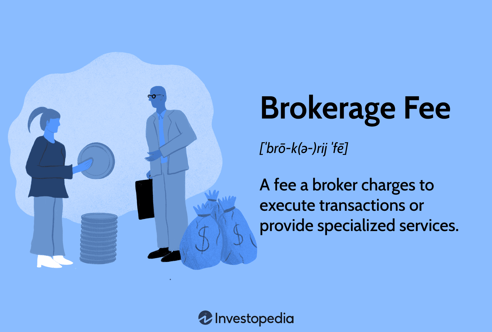

## Table of Contents

## What are brokerage fees?

Brokerage fees are charges that you pay when you buy or sell investments like stocks, bonds, or mutual funds through a broker. A broker is a person or a company that helps you make these transactions. These fees can vary depending on the broker and the type of investment you are making. Some brokers charge a flat fee for each trade, while others might charge a percentage of the total amount of the transaction.

Understanding brokerage fees is important because they can affect how much money you make or lose from your investments. If the fees are high, they can eat into your profits or increase your losses. That's why it's a good idea to compare different brokers and their fee structures before you decide where to invest your money. Some brokers even offer commission-free trades, which can be a big advantage if you plan to trade often.

## Why do brokerages charge fees?

Brokerages charge fees to cover the costs of doing business and to make money. When you buy or sell stocks, bonds, or other investments, the brokerage needs to pay for things like technology, staff, and research. These costs add up, so they charge you a fee to help pay for them. Also, brokerages are businesses, so they need to make a profit. The fees they charge help them earn money and stay in business.

Sometimes, the fees also depend on the type of service you get. If you use a full-service broker who gives you advice and does a lot of the work for you, the fees might be higher. But if you use a discount broker where you do most of the work yourself, the fees are usually lower. Either way, the fees help the brokerage cover their costs and make a profit, which is why they charge them.

## How do brokerage fees impact investment returns?

Brokerage fees can lower your investment returns. When you buy or sell stocks, you pay a fee. This fee comes out of your money. So, if you make a profit, the fee makes your profit smaller. If you lose money, the fee makes your loss bigger. Over time, these fees can add up and take a big chunk out of what you earn from your investments.

For example, if you invest $1,000 and make a 10% return, you would have $1,100. But if you pay a $10 fee to buy and another $10 fee to sell, you lose $20. Now, your $1,100 becomes $1,080. That's an 8% return instead of 10%. If you trade often, these fees can really eat into your profits. It's important to think about fees when you choose where to invest your money.

## What are the different types of brokerage fees?

Brokerage fees come in different forms. The most common type is the commission fee, which is what you pay every time you buy or sell a stock or other investment. Some brokers charge a flat fee, like $5 or $10 per trade, no matter how much you are buying or selling. Other brokers charge a percentage of the total amount of your trade, so if you buy a lot of stocks, you pay more in fees.

There are also other types of fees to watch out for. Some brokers charge an account maintenance fee, which is a small amount you pay each month or year just to keep your account open. If you don't trade often, these fees can add up. Another fee to know about is the inactivity fee, which some brokers charge if you don't make any trades for a while. Lastly, there might be fees for things like transferring money in or out of your account, or for getting research and advice from the broker.

Understanding all these fees is important because they can affect how much money you keep from your investments. Always read the fine print and ask questions about any fees you don't understand before you start investing.

## Can you explain the difference between a commission and a management fee?

A commission is a fee you pay every time you buy or sell a stock or other investment. It's like a one-time charge for making a trade. Some brokers might charge you a fixed amount, like $5 every time you trade, while others might take a small percentage of the money you're spending or getting from the trade. This fee comes out of your pocket right away, so it can make your profits smaller or your losses bigger.

A management fee is different. It's a fee you pay for having someone else manage your investments for you. This fee is usually a percentage of the total amount of money you have invested, and it's charged regularly, like every month or every year. For example, if you have $10,000 invested and the management fee is 1%, you would pay $100 every year just for the service of having your investments managed. This type of fee is common with things like mutual funds or when you hire a financial advisor to handle your portfolio.

## How can investors minimize brokerage fees?

Investors can minimize brokerage fees by choosing brokers that offer low or no commission trades. Many online brokers now provide commission-free trading for stocks and ETFs, which means you don't pay any fee when you buy or sell these investments. It's a good idea to compare different brokers and see which ones have the lowest fees for the types of investments you want to make. Also, if you plan to trade often, [picking](/wiki/asset-class-picking) a broker with low or no fees can save you a lot of money over time.

Another way to reduce fees is to avoid unnecessary trades. Every time you buy or sell, you might have to pay a commission, so the less you trade, the less you pay in fees. If you're investing for the long term, it's often better to hold onto your investments instead of trying to time the market. This can help you keep more of your money working for you instead of going to fees. Also, be aware of other fees like account maintenance or inactivity fees, and choose a broker that doesn't charge these if you can.

## What are no-commission trading platforms and how do they make money?

No-commission trading platforms are places where you can buy and sell stocks without paying a fee each time you make a trade. They let you invest without worrying about losing money to commissions. Some popular no-commission platforms are Robinhood, Webull, and some big banks that have started offering this service too. They make it easier for more people to start investing because you don't need a lot of money to get started.

These platforms make money in different ways even though they don't charge you for trading. One way is by getting paid for order flow, which means they get a little money from other companies that actually handle your trades. Another way is by lending out the stocks you own to other traders who want to bet that the stock price will go down. They also make money from things like interest on money you keep in your account and by selling you other financial products or services. So, even though you don't pay to trade, the platform finds other ways to earn money.

## How do brokerage fees vary across different countries?

Brokerage fees can be different in different countries. In the United States, many brokers offer no-commission trades for stocks and ETFs, but in other countries, you might have to pay a fee every time you buy or sell. For example, in some European countries, the fees might be a bit higher than in the U.S., and they might charge you a percentage of the money you're trading instead of a flat fee. In Asia, like in Japan or Hong Kong, the fees can also be different, sometimes higher or lower depending on the broker and the type of investment.

The reasons for these differences can include things like local laws, how much competition there is between brokers, and the cost of doing business in each country. In places where there are lots of brokers competing for customers, the fees might be lower because they want to attract more people. But in countries where there are fewer brokers or where it costs more to run a business, the fees might be higher. It's always a good idea to check what the fees are in your country and compare different brokers to find the best deal for you.

## What should investors look for in a brokerage fee structure?

When choosing a broker, investors should look at the fee structure to see how much they will have to pay for trading and other services. A good fee structure is one that fits what you want to do with your investments. If you plan to trade a lot, you might want a broker that offers no-commission trades or very low fees per trade. This way, you can keep more of your money instead of losing it to fees. Also, check if there are any other fees, like account maintenance fees or inactivity fees, because these can add up over time and eat into your profits.

It's also important to understand how the broker makes money. Some brokers might offer free trades but make money in other ways, like by lending out your stocks or getting paid for order flow. Knowing this can help you decide if the broker is right for you. Comparing different brokers and their fee structures can help you find the best deal. Remember, the goal is to keep as much of your investment returns as possible, so choosing a broker with a fee structure that works for you is key.

## How have brokerage fees evolved over the past decade?

Over the past ten years, brokerage fees have changed a lot. A big change is that more and more brokers now offer trades with no commissions. This means you can buy and sell stocks without paying a fee each time. This started with companies like Robinhood, and now even big banks and other brokers have started offering no-commission trades. This has made it easier for more people to start investing because you don't need a lot of money to begin.

Brokers have found other ways to make money even though they don't charge for trades. They get paid for order flow, which means other companies pay them a little bit to handle your trades. They also make money by lending out the stocks you own to other traders and by charging interest on the money you keep in your account. These changes have made investing cheaper for many people, but it's still important to understand all the fees and how brokers make money so you can choose the best one for you.

## What are the regulatory considerations regarding brokerage fees?

Governments and financial watchdogs have rules about brokerage fees to make sure they are fair and clear. In the United States, the Securities and Exchange Commission (SEC) and the Financial Industry Regulatory Authority (FINRA) keep an eye on brokers to make sure they follow the rules. These rules say that brokers have to tell you about all the fees they charge, so you know what you're paying for. They also have to make sure the fees are not too high and that they treat everyone the same.

In other countries, there are similar rules but they can be different. For example, in the European Union, the Markets in Financial Instruments Directive (MiFID) sets rules about fees and how brokers should act. These rules are there to protect investors and make sure the market is fair. No matter where you are, it's good to know about these rules so you can understand your rights and make sure you're not paying too much in fees.

## How do advanced trading strategies affect brokerage fee calculations?

Advanced trading strategies can make brokerage fees more complicated. When you use strategies like [day trading](/wiki/day-trading-spy), options trading, or margin trading, you might have to pay different kinds of fees. For example, if you're day trading, you might trade a lot in one day, so even if the fees per trade are low, they can add up quickly. With options trading, you might have to pay a fee for each contract you buy or sell, and these fees can be higher than regular stock trading fees. Margin trading, where you borrow money to buy stocks, can also come with extra fees like interest on the money you borrow.

These strategies can also affect how much you pay in other ways. Some brokers might charge extra for using their advanced trading platforms or for getting real-time data and research. If you're using a lot of these services, the fees can get higher. It's important to understand all these fees before you start using advanced trading strategies. That way, you can plan your trades better and keep more of your money instead of losing it to fees.

## What are the cost differences between Brokerage and Algorithmic Trading?

Traditional brokerage and [algorithmic trading](/wiki/algorithmic-trading) represent two distinct approaches in the financial markets, each with unique cost structures. Understanding these variances is crucial for investors seeking to optimize trading costs relative to their investment goals.

### Cost Comparison

**Traditional Brokerage Costs**
Traditional brokerage primarily involves costs such as:

1. **Commission Fees**: Charged per trade, often a fixed amount or percentage of the trade value.
2. **Account Maintenance Fees**: Regular charges for maintaining an account with a brokerage.
3. **Transaction Fees**: Additional fees for processing specific transactions.

For example, if an investor executes a trade worth $10,000 with a brokerage charging a 0.5% commission, the fee would be:

$$
\text{Commission Fee} = 10,000 \times 0.005 = 50
$$

**Algorithmic Trading Costs**
Algorithmic trading incurs different expenses, including:

1. **Platform Fees**: Charges for using the algorithmic trading platform.
2. **Slippage Costs**: The difference between the expected price and the actual execution price due to market movements.
3. **Data and Connectivity Fees**: Costs for accessing high-quality market data and maintaining fast connections for execution.

Algorithmic trading can reduce costs through increased trade execution speed and efficiency, potentially minimizing the impact of slippage.

### Pros and Cons

**Traditional Brokerage Pros and Cons**
- **Pros**: Simplicity, personal advisory services, suitable for infrequent traders.
- **Cons**: Higher per-trade costs, potential for higher fees over time due to fixed charges.

**Algorithmic Trading Pros and Cons**
- **Pros**: Often lower costs per transaction, efficient execution, and reduced human error.
- **Cons**: Requires technical expertise, initial setup can be costly, ongoing data fees.

### Cost-Effectiveness Examples

A study comparing trading strategies might demonstrate that for high-frequency traders, algorithmic trading can save costs through reduced slippage and lower transaction fees, despite the initial platform setup costs.

Conversely, an investor engaging in long-term positions with minimal trading may find traditional brokerage more cost-effective due to its simpler fee structure and fewer transactions over time.

### Tips for Choosing the Right Method

1. **Assess Trading Frequency**: High-frequency traders may benefit from algorithmic trading due to potential savings on a per-trade basis.
2. **Consider Investment Goals**: Long-term investors with infrequent trades might prioritize simplicity and personal advice offered by traditional brokerages.
3. **Evaluate Technical Expertise**: Algorithmic trading requires technical skills and infrastructure, which may not be suitable for all.
4. **Compare Fees Transparently**: Conduct a detailed comparison of all fees associated with each method to ensure alignment with financial goals.

In summary, the choice between traditional brokerage and algorithmic trading depends significantly on an investor's trading frequency, technical capabilities, and cost priorities. Careful analysis and understanding of both cost structures enable informed decision-making.

## What is the impact of fees on investment returns?

Fees play a significant role in the dynamics of investment returns and can substantially impact the eventual net gains of an investor. Over time, even seemingly minor fees can accumulate to reduce overall returns. Consider an investment with an annual return rate $r$, affected by a fee rate $f$. The net return rate becomes $r_{\text{net}} = r - f$. This seemingly small difference can compound significantly over time.

To illustrate, assume an investor starts with an initial capital $C_0$. The compound growth of the investment, factoring in fees, over $n$ years can be expressed as:

$$
C_n = C_0 \times (1 + r - f)^n
$$

where $C_n$ is the capital after $n$ years. This formula underscores how fees can erode investment gains, as the power of compounding affects not only returns but also the fees charged, leading to what is often referred to as the "multiplicative erosion" of capital.

## References & Further Reading

[1]: Bergstra, J., Bardenet, R., Bengio, Y., & Kégl, B. (2011). ["Algorithms for Hyper-Parameter Optimization."](https://papers.nips.cc/paper/4443-algorithms-for-hyper-parameter-optimization) Advances in Neural Information Processing Systems 24.

[2]: ["Advances in Financial Machine Learning"](https://www.amazon.com/Advances-Financial-Machine-Learning-Marcos/dp/1119482089) by Marcos Lopez de Prado

[3]: ["Evidence-Based Technical Analysis: Applying the Scientific Method and Statistical Inference to Trading Signals"](https://www.amazon.com/Evidence-Based-Technical-Analysis-Scientific-Statistical/dp/0470008741) by David Aronson

[4]: ["Machine Learning for Algorithmic Trading"](https://github.com/stefan-jansen/machine-learning-for-trading) by Stefan Jansen

[5]: ["Quantitative Trading: How to Build Your Own Algorithmic Trading Business"](https://www.amazon.com/Quantitative-Trading-Build-Algorithmic-Business/dp/1119800064) by Ernest P. Chan