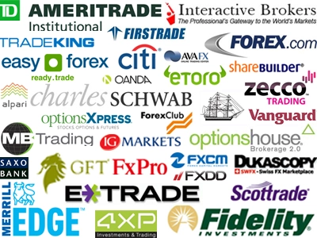

In the dynamic world of financial markets, brokerage firms are essential in facilitating transactions and offering a wide range of investment services. These firms connect investors with the financial markets, enabling the buying and selling of stocks, bonds, options, and various other financial instruments. As technology advances, brokerage firms must adapt to new methods and tools that enhance trading efficiency and decision-making processes. One such innovation is algorithmic trading, which has become a transformative force in the way trades are executed. 

Algorithmic trading, commonly known as algo trading, uses complex algorithms to automate trading decisions, leading to faster, more accurate, and more efficient trading outcomes. This practice has gained prominence because it allows for high-frequency trading, capitalizing on minor price fluctuations not easily observed by human traders. The integration of these algorithms into brokerage services is revolutionizing the trading landscape, providing advantages such as reduced emotional trading errors and precise execution of intricate strategies.



This article explores the various aspects of brokerage firms that offer these innovative services. It examines the functions of different types of brokerage firms, including both traditional and online platforms. Furthermore, it discusses the substantial impact of algo trading on the investment ecosystem. By understanding these elements, investors can make informed decisions and select brokerage services that align with their financial goals and strategies, thereby navigating the complexities of modern financial markets more effectively.

## Table of Contents

## Understanding Brokerage Firms

Brokerage firms serve as essential conduits in financial markets by connecting buyers and sellers to facilitate the exchange of securities, including stocks, bonds, and options. Acting as intermediaries, these firms provide a platform that simplifies the complex processes inherent in financial trading, ensuring transactions are executed efficiently and transparently.

Historically, brokerage firms have generated revenue primarily through commissions and fees charged for executing trades on behalf of investors. With the evolution of trading practices and increased competition, many firms have transitioned towards a zero-commission trading model. This new model focuses on alternative revenue streams such as payment for order flow, interest on margin accounts, and offering premium services that bring about additional costs to the consumer.

Understanding the services and financial models of various brokerage firms is crucial for investors. Knowledge of these can lead to more informed decisions about which firm aligns best with their financial goals and trading strategies. Traditional brokerage firms often provide a high-touch service with personalized investment advice and financial planning, but at a cost. On the other hand, newer online brokerage platforms offer a low-cost alternative with minimal fees but require investors to take a more self-directed approach to manage their portfolio.

Each type of brokerage service offers distinct advantages, and the choice often depends on the investor’s level of expertise, investment strategy, and willingness to engage in self-directed research and trading. By evaluating these elements, investors can select a brokerage partner that not only meets their immediate trading needs but also aligns with their long-term financial ambitions.

## Types of Brokerage Firms

Brokerage firms operate in various forms, each designed to meet specific market needs and investor preferences. The main types include full-service brokerages, discount brokers, and robo-advisors.

Full-service brokerages provide a wide range of services that go beyond just executing trades. They offer personalized investment advice, financial planning, wealth management, and retirement planning services. These firms employ financial advisors who work closely with clients to devise investment strategies tailored to individual financial goals and risk tolerance. The comprehensive nature of their offerings justifies higher fees compared to other types. Examples of full-service brokers include Merrill Lynch and Morgan Stanley.

Discount brokers have emerged as a cost-effective alternative for investors who are comfortable with trading independently. These brokers focus primarily on executing trades with minimal assistance, offering a streamlined platform for stock, [ETF](/wiki/etf-trading-strategies), and mutual fund transactions. Discount brokers leverage online platforms to lower operational costs, transferring these savings to clients through reduced commission fees. Notable discount brokers include Charles Schwab and TD Ameritrade.

Robo-advisors represent a technological advancement in the brokerage sector, utilizing algorithms to manage investment portfolios. They offer automated and algorithm-driven financial planning services, making investment decisions based on a client's risk profile, financial goals, and investment horizon. Robo-advisors generally charge lower fees than traditional brokers, making them accessible to a broader audience. This type of broker is ideal for investors seeking a hands-off approach with lower entry requirements. Prominent robo-advisors in the market include Betterment and Wealthfront.

Each type of brokerage firm serves different investment styles and preferences, allowing investors to select the level of service and customization that best aligns with their financial strategies.

## Investment Services Offered by Brokerage Firms

Brokerage firms provide a wide range of investment services tailored to meet the diverse needs of investors. These services aim to support investors in reaching their financial goals through strategic planning and expert guidance.

Wealth management is a cornerstone service offered by many brokerage firms, focusing on comprehensive financial planning and management. This service involves a detailed analysis of an investor's financial situation, leading to the creation of an integrated plan that addresses assets, liabilities, estate planning, and insurance considerations. Wealth management typically includes continuous monitoring to adapt the strategy as market conditions and personal circumstances change.

Retirement planning is another essential service provided by brokerage firms. This involves analyzing an investor’s current financial status and future goals to design a plan that ensures financial security post-retirement. The planning process often includes calculating expected retirement expenses, identifying sources of retirement income, implementing tax-efficient savings strategies, and selecting suitable retirement accounts like IRAs or 401(k)s.

Brokerage firms offer access to a diverse range of investment vehicles, enabling investors to construct well-diversified portfolios. These include:

- **Stocks**: Representing ownership in companies, stocks allow investors to participate in a firm's profits and growth. Brokerages support clients in buying, holding, or selling stock assets based on market conditions and investment goals.

- **Exchange-Traded Funds (ETFs)**: Offering the flexibility of a stock with the diversification of mutual funds, ETFs provide investors with a vehicle to invest in a basket of securities. Brokerages often provide tools and resources to help investors select ETFs based on specific criteria such as sector, region, or strategy.

- **Mutual Funds**: These pooled investment vehicles, which collect funds from many investors to purchase a diverse portfolio of stocks, bonds, or other assets, are managed by professional fund managers. Brokerages assist clients in selecting mutual funds that align with their risk tolerance and investment horizon.

In addition to these primary services, brokerage firms frequently offer tailored investment strategies, enabling investors to customize their portfolios in line with specific financial objectives, risk appetites, and timelines. Professional guidance from certified financial advisors can aid investors in decision-making, ensuring that their portfolios are periodically reviewed and adjusted in response to changes in market conditions or personal financial circumstances.

By leveraging these services, investors can construct robust financial plans and maintain disciplined investment approaches, ultimately achieving greater financial stability and growth.

## Algorithmic Trading: The Future of Investment

Algorithmic trading leverages powerful algorithms to automate trading decisions, significantly enhancing the speed, accuracy, and efficiency of executing trades compared to traditional methods. At its core, [algorithmic trading](/wiki/algorithmic-trading) involves using mathematical models and computational technology to determine trading strategies and execute orders. This method capitalizes on opportunities such as minor price fluctuations and fast market changes, often invisible to human traders. The ability to react within milliseconds enables high-frequency trading ([HFT](/wiki/high-frequency-trading-strategies)), a form of algorithmic trading that executes a large number of orders at extremely high speeds.

High-frequency trading can benefit from statistical [arbitrage](/wiki/arbitrage) and market-making strategies. Statistical arbitrage, for instance, involves using statistical methods to exploit price discrepancies in markets, while [market making](/wiki/market-making) provides [liquidity](/wiki/liquidity-risk-premium) by continuously quoting buy and sell prices for financial instruments. These strategies demand rapid execution, a characteristic intrinsic to algorithmic trading.

Many trading platforms now offer user-friendly interfaces that allow traders to create, back-test, and execute their trading algorithms without deep technical expertise. These platforms often provide libraries and frameworks for model development. For example, a simple moving average crossover strategy can be implemented in Python as follows:

```python
import numpy as np
import pandas as pd

# Example data: assume 'data' is a DataFrame with 'Close' prices
def moving_average_strategy(data, short_window=50, long_window=200):
    signals = pd.DataFrame(index=data.index)
    signals['Short_MA'] = data['Close'].rolling(window=short_window, min_periods=1).mean()
    signals['Long_MA'] = data['Close'].rolling(window=long_window, min_periods=1).mean()
    signals['Signal'] = 0
    signals['Signal'][short_window:] = np.where(
        signals['Short_MA'][short_window:] > signals['Long_MA'][short_window:], 1, 0)
    signals['Position'] = signals['Signal'].diff()
    return signals

# Usage
# signals = moving_average_strategy(data)
```

The above code demonstrates how traders can create a simple algorithm for moving average crossovers, a common trading strategy. These platforms have broadened market access, allowing more investors to develop and test customized trading strategies that suit their goals and risk profiles.

Overall, algorithmic trading signifies a transformative shift in investment practices, offering tools and strategies that were once reserved for institutional players to a broader audience. As these technologies become more accessible and sophisticated, algorithmic trading will likely become an integral part of the investment toolkit, driving further innovation and efficiency in financial markets.

## Benefits and Challenges of Algorithmic Trading

Algorithmic trading has revolutionized the investment landscape by automating trading processes and enhancing efficiency. One of the primary benefits of this approach is the increased transaction speed. Traditional manual trading is limited by human processing and reaction times, whereas algorithms can execute trades in milliseconds, significantly improving the ability to capitalize on fleeting market opportunities.

Another key advantage of algorithmic trading is the reduction of errors related to human emotions. Traders often make decisions influenced by fear, greed, or stress, which can lead to suboptimal outcomes. Algorithms, being devoid of emotional influence, can follow predefined strategies to ensure consistent and rational decision-making. This objectivity leads to precise execution of complex strategies, particularly beneficial in high-frequency trading where the rapid identification and exploitation of price discrepancies are paramount.

Despite its advantages, algorithmic trading also presents several challenges. Technology dependence is a critical concern; any system malfunction or latency issues can lead to significant financial losses. Moreover, the initial setup costs for algorithmic trading systems can be substantial, requiring investments in both hardware and software. 

Furthermore, the design and management of trading algorithms demand a high level of technical expertise. Investors or firms must either acquire this expertise or hire specialists, which entails additional costs. Developing effective algorithms involves rigorous testing and validation to ensure they perform as intended under various market conditions. 

Given these factors, investors need to balance the benefits and risks associated with algorithmic trading. They must assess their technological infrastructure, financial capacity for setup, and the availability of skilled personnel to maintain and optimize trading algorithms. By carefully considering these elements, investors can harness the potential of algorithmic trading, mitigating its challenges while maximizing its strategic advantages.

## Conclusion

Financial products brokerage firms, along with their diverse investment services, have played a crucial role in enhancing the efficiency and accessibility of trading in today's financial markets. Among these services, algorithmic trading stands out as a transformative approach, automating trading processes and enabling transactions at speeds and accuracies beyond human capability. This advancement has been instrumental in opening up new avenues for both institutional and retail investors, facilitating engagement with the market in a more dynamic and efficient manner.

Understanding the various roles and services offered by different types of brokerage firms is vital for investors aiming to navigate the financial landscape effectively. With options ranging from full-service brokerages providing personalized investment solutions to discount brokers and robo-advisors offering cost-effective online trading opportunities, investors have the flexibility to select services that best align with their financial objectives and risk tolerance.

As algorithmic trading technology progresses, it promises to further reshape the investment landscape. The continuous improvements in algorithms and computing power could lead to more sophisticated trading strategies, capable of exploiting even minute market inefficiencies. These advancements might also democratize access to complex financial markets, making sophisticated trading techniques more accessible to a broader range of investors.

In conclusion, the ongoing evolution of financial brokerage services and algorithmic trading technologies is setting the stage for a more inclusive and efficient trading environment. These developments are poised to offer exciting prospects for market participants, as they equip investors with the tools and strategies needed to capitalize on emerging opportunities in the global financial markets.

## References & Further Reading

[1]: Lo, A. W. (2010). ["Algorithmic Trading and High-Frequency Trading: An Overview."](https://assets.cambridge.org/97811070/91146/frontmatter/9781107091146_frontmatter.pdf) SSRN Electronic Journal.

[2]: Aldridge, I. (2013). ["High-Frequency Trading: A Practical Guide to Algorithmic Strategies and Trading Systems"](https://books.google.com/books/about/High_Frequency_Trading.html?id=6l0DDQAAQBAJ) (2nd ed.). Wiley.

[3]: Narang, R. K. (2013). ["Inside the Black Box: A Simple Guide to Quantitative and High-Frequency Trading"](https://onlinelibrary.wiley.com/doi/book/10.1002/9781118662717) (2nd ed.). Wiley.

[4]: Das, S. (2012). ["High-Frequency Trading: A Regulatory Strategy"](http://lawreview.richmond.edu/files/2014/03/Korsmo-482-AC.pdf) Journal of Economic Perspectives, 26(2), 45-66.

[5]: Hendershott, T., Jones, C. M., & Menkveld, A. J. (2011). ["Does Algorithmic Trading Improve Liquidity?"](https://onlinelibrary.wiley.com/doi/full/10.1111/j.1540-6261.2010.01624.x) The Review of Financial Studies, 24(3), 835-869.