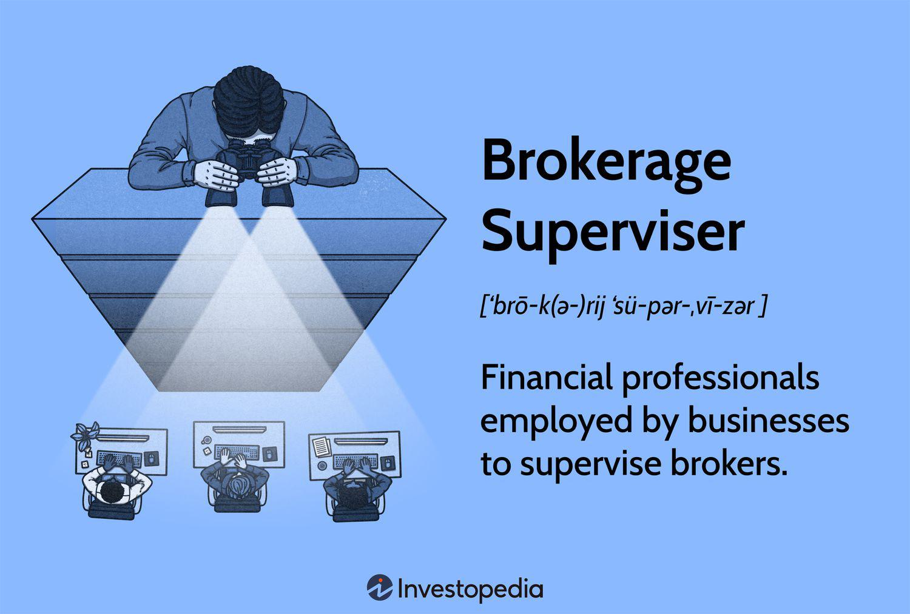

In the evolving landscape of finance, the roles of supervisors and brokers are being redefined by technological advancements. The financial sector is witnessing a transformative shift, primarily driven by the rapid adoption of digital technologies and innovative trading methodologies. Among these innovations, algorithmic trading stands out as a significant development, reshaping how financial transactions are executed and managed.

Algorithmic trading, often referred to as algo trading, involves the use of computer algorithms to automate trading strategies. This approach enables the execution of orders at speeds and frequencies that are impossible for human traders, leveraging mathematical models to make decisions based on market data. Consequently, algo trading has become integral to modern finance, optimizing trading efficiency and expanding market liquidity.



As we explore the intersection of supervision in finance, brokerage activities, and algo trading, it becomes imperative to understand how these elements interact within the financial ecosystem. Supervisors play a vital role in ensuring market integrity and compliance with financial regulations. They oversee and manage risk, adapting to the challenges posed by new technologies and the complex algorithms that drive today's financial transactions. 

Simultaneously, brokers, acting as intermediaries, are tasked with providing clients access to markets and investment advice. The advent of online platforms and digital technologies has transformed the brokerage industry, increasing market accessibility and efficiency. Brokers must continuously evolve to meet client demands and incorporate technological advancements into their operations.

Understanding these elements is crucial for navigating the modern financial ecosystem. As the financial landscape continues to evolve, professionals in the industry must remain vigilant and adaptable, recognizing the potential and challenges presented by technological advancements. The following sections outline the key aspects and implications of these roles in today's market, providing insights into how supervisors, brokers, and algo trading converge to define the future of finance.

## Table of Contents

## Role of a Supervisor in Finance

Supervisors in finance serve as fundamental pillars to ensure compliance and manage risks, maintaining the financial system's integrity. They are responsible for setting standards, monitoring financial operations, and enforcing laws and regulations. These functions are critical in safeguarding against systemic risks and fraud, thereby fostering trust within the financial ecosystem.

The role of supervisors encompasses several key activities:

1. **Compliance Oversight:** Supervisors ensure that all financial activities conform to applicable laws, rules, and standards. This involves regular audits and assessments to detect and rectify non-compliance issues. In recent years, regulatory frameworks have become more complex, necessitating a more sophisticated approach to compliance.

2. **Risk Management:** Identifying, evaluating, and mitigating financial risks are among the primary duties of supervisors. They employ various tools and metrics to assess risk levels across financial institutions. The use of technology, such as machine learning algorithms, can enhance risk prediction and management strategies by processing and analyzing large datasets.

3. **Technological Impact:** Technological advancements significantly affect supervisory roles, with supervisors increasingly depending on sophisticated software and analytical tools. Innovations such as big data analytics, artificial intelligence, and blockchain technology provide supervisors with enhanced capabilities to monitor and analyze financial activities in real-time. However, these technologies also introduce new risks, necessitating continuous adaptation and learning.

4. **Enforcement of Regulations:** Supervisors enforce financial regulations by monitoring the adherence of institutions to established laws and policies. They have the authority to impose sanctions and corrective measures on entities that fail to comply, ensuring that financial markets function smoothly and ethically.

5. **Adapting to Innovation:** As financial markets evolve, supervisors must embrace new tools and techniques to remain effective. This includes adopting regulatory technology (RegTech) solutions that streamline compliance processes and enhance the ability to monitor market activities efficiently. Supervisors must also stay informed of emerging trends and threats, such as cyber risks, which can have significant implications for financial stability.

Overall, the modern financial marketplace demands that supervisors not only understand current technologies but also anticipate future developments. Effective supervision requires a balance of regulatory knowledge, technological expertise, and a proactive approach to oversee an increasingly complex financial landscape.

## Understanding Finance Brokerage

Brokers function as essential intermediaries in the buying and selling of financial instruments, such as stocks, bonds, and derivatives. Their primary role is to connect buyers and sellers, thereby facilitating smooth transactions in the financial markets. Brokerage firms provide clients with critical services, including market access and investment advice, ensuring informed decision-making and enhanced trading experiences.

Historically, brokers operated through physical exchanges, where transactions were manually conducted. However, the landscape of finance brokerage has undergone a significant transformation with the advent of online platforms and digital technologies. These advancements have revolutionized the brokerage industry, leading to increased efficiency and accessibility in the financial markets.

The proliferation of online trading platforms has democratized access to financial markets by allowing retail investors to trade without requiring extensive traditional brokerage services. This shift has lowered transaction costs, reduced the time needed to execute trades, and provided real-time data analysis and insights. As a result, the entry barriers for individual investors have significantly decreased, enabling a broader participation in financial markets.

Digital technologies, such as [algorithmic trading](/wiki/algorithmic-trading) systems and high-frequency trading, have further enhanced market efficiency. These systems leverage sophisticated algorithms to execute trades at considerable speeds, often within milliseconds, based on predefined criteria and market conditions. This capability allows brokers to capitalize on minute price fluctuations, optimizing trading outcomes for their clients.

In response to these technological advancements and evolving client demands, the role of brokers has expanded beyond mere transaction facilitation. Modern brokers are increasingly expected to offer value-added services, such as personalized investment strategies, comprehensive market research, and sophisticated risk management tools. This evolution necessitates a deep understanding of both traditional financial principles and cutting-edge technology.

Moreover, regulatory changes and market developments require brokers to continually adapt, ensuring compliance and ethical practices in a rapidly shifting landscape. As clients grow more technologically adept and expect seamless digital experiences, brokers must integrate innovative solutions into their service offerings to maintain competitiveness.

In summary, finance brokerage has been profoundly influenced by technological advancements. Brokers continue to play a crucial role in market intermediation, yet their responsibilities and services are continuously evolving to meet new challenges and opportunities presented by the digital age.

## What is Algo Trading?

Algorithmic trading, commonly known as algo trading, is a method of executing trades using automated systems guided by pre-set rules or instructions. These systems employ mathematical models and quantitative analysis to make trading decisions, aiming to enhance efficiency and effectiveness in the financial markets. 

The core mechanism of algo trading involves the automation of trade processes, allowing for the execution of trades at speeds and accuracies unattainable by human traders. Algorithms can analyze vast datasets rapidly, identifying trading opportunities based on statistical models and patterns. This capability is crucial in a trading environment dominated by high-frequency transactions where milliseconds can significantly impact profitability.

Python, among other programming languages, is often used to develop algorithmic trading systems due to its robust libraries and ease of use. A simple example of an algorithmic trading strategy could be based on moving averages, where trades are executed when the short-term average crosses the long-term average. A basic Python implementation might look like this:

```python
import numpy as np
import pandas as pd

# Sample data: closing prices
prices = pd.Series([100, 101, 102, 100, 98, 97, 96, 95, 94, 93])

# Calculate moving averages
short_window = 3
long_window = 5

signals = pd.DataFrame(index=prices.index)
signals['price'] = prices
signals['short_mavg'] = prices.rolling(window=short_window, min_periods=1, center=False).mean()
signals['long_mavg'] = prices.rolling(window=long_window, min_periods=1, center=False).mean()

# Generate signals
signals['signal'] = 0.0
signals['signal'][short_window:] = np.where(signals['short_mavg'][short_window:] > signals['long_mavg'][short_window:], 1.0, 0.0)
signals['positions'] = signals['signal'].diff()

print(signals)
```
This script illustrates the basic logic behind detecting crossover points in moving averages, a common technique in algo trading to identify buy and sell signals.

In today's financial markets, algorithmic trading is highly prevalent due to its capability to execute complex strategies with precision. Traders employ various strategies, including [arbitrage](/wiki/arbitrage), [market making](/wiki/market-making), and [trend following](/wiki/trend-following), each requiring different algorithmic approaches and levels of sophistication.

Understanding algo trading is crucial for remaining competitive in the financial industry. As algorithmic systems continue to evolve, staying knowledgeable about the basics and intricacies of these systems becomes increasingly important. Practitioners must be aware of both the advantages, such as reduced trading costs and increased execution speed, and the potential risks, including algorithm failures or unforeseen market impacts. Embracing and mastering algo trading is vital for any participant looking to succeed in modern finance.

## Intersection of Supervision, Brokerage, and Algo Trading

The integration of algorithmic trading into brokerage services necessitates enhanced supervisory measures to ensure compliance with financial regulations and to avert market instability. As algorithmic trading systems are employed to execute trades based on pre-set instructions and sophisticated mathematical models, supervisors must rigorously ensure these systems comply with legal standards. Furthermore, brokers employing algorithmic trading strategies must balance efficiency with ethical trading, maintaining adherence to both market regulations and ethical standards.

Effective supervision of algorithmic trading mitigates risks associated with automation, such as potential systemic risk or market manipulation. By incorporating adaptive monitoring tools and robust compliance checks, supervisors can ensure that algorithmic systems function within regulatory frameworks. Surveillance systems can detect irregularities or suspicious trading patterns that may indicate misconduct or technical anomalies. This level of vigilance is crucial in environments where automated systems operate at high frequencies and volumes, potentially impacting market stability.

Collaboration among supervisors, brokers, and technology developers is instrumental in achieving successful integration of algorithmic trading into brokerage operations. By fostering communication channels and partnerships, stakeholders can integrate regulatory insights with technological advancements to create systems that are both innovative and compliant. This collaboration facilitates the sharing of knowledge and the development of best practices, ensuring that all parties involved are prepared to address challenges and leverage opportunities in algorithmic trading.

As algorithmic trading continues to evolve, its integration into brokerage services highlights the importance of establishing a comprehensive supervisory framework. This framework must be dynamic, capable of adapting to technological advancements, and robust enough to maintain financial market integrity. By prioritizing supervision, ethical standards, and collaborative efforts, stakeholders can navigate the complexities of algorithmic trading, ensuring its alignment with broader financial objectives.

## Challenges and Opportunities

Supervisors in the financial sector encounter significant challenges and opportunities presented by the rapid pace of technological advances in algorithmic trading. The speed at which algorithmic trading systems can evolve poses a substantial challenge for maintaining robust oversight mechanisms. Such systems, driven by complex algorithms, require supervisors to continually update their knowledge and tools to ensure these technologies do not contribute to systemic risks or market manipulation. The very efficiency and automation that makes algorithmic trading appealing also increase the risk of unintended consequences, necessitating vigilant monitoring and regulatory adjustments.

Systemic risk and potential market manipulation are critical threats in algorithmic trading. These risks arise because algorithms can interact unpredictably under certain market conditions, potentially leading to rapid price movements or "flash crashes." To mitigate these risks, supervisors must employ advanced data analytics and [machine learning](/wiki/machine-learning) models to detect unusual trading patterns and their potential influences on market stability. Such tools can help preemptively identify strategies that might disrupt markets or violate regulations.

In parallel, there are significant opportunities for innovation in developing more sophisticated regulatory tools. As the financial landscape transforms, it opens avenues for creating advanced analytics platforms capable of real-time monitoring and assessment of trading activities. By leveraging big data, [artificial intelligence](/wiki/ai-artificial-intelligence), and machine learning, regulators can devise systems that not only comply with current regulations but also predict future trends and irregularities.

Brokers also stand to benefit from the integration of algorithmic trading into their service offerings. With the ability to analyze large datasets quickly and implement complex strategies, brokers can provide their clients with enhanced services, such as bespoke investment strategies tailored to specific risk profiles and market conditions. This capability can make brokerage services more competitive by providing additional value to clients through insights and efficiencies unattainable through traditional trading methods.

However, embracing these technological advancements must be balanced with a strong commitment to compliance and ethical trading practices. Brokers and supervisors alike have the responsibility to ensure that their operations adhere to established protocols that protect market integrity and client interests. Technology offers opportunities for growth, but this growth must be pursued within a framework that prioritizes ethical standards and regulatory compliance to maintain trust in financial markets.

In conclusion, while the challenges posed by rapid technological changes in algorithmic trading are formidable, they are matched by opportunities for growth and innovation. Emphasis on developing sophisticated oversight mechanisms and ethical trading practices will enable professionals in this space to navigate the evolving financial landscape effectively.

## Conclusion

In finance, the intertwining of supervision and brokerage roles with technology-driven mechanisms like algorithmic trading is reshaping the landscape. As technological advancements continue to evolve, finance supervisors and brokers find themselves at a critical juncture where proactive adaptation becomes essential for maintaining compliance and ensuring competitive advantage. Effective adaptation requires embracing new technologies and integrating them into existing frameworks to optimize operations and enhance market efficiency.

Collaboration between stakeholders is paramount for fostering a dynamic and robust financial market. With technology blurring traditional boundaries, finance supervisors, brokers, and technology developers must work in tandem to create a cohesive environment where regulations are met without stifling innovation. This collaboration can help mitigate risks, enhance transparency, and ensure that the systems in place evolve alongside technological advancements.

Understanding the synergy between supervision, brokerage activities, and algo trading is not merely beneficial but imperative for defining future market leaders. This synergy lies at the heart of transforming traditional financial operations into more agile, responsive, and data-driven processes, allowing market participants to leverage algorithmic tools efficiently. Leaders in this field will be those who can anticipate changes, adapt swiftly, and harness technology to its fullest potential.

To thrive in this rapidly evolving landscape, stakeholders must prioritize continuous learning and adaptation. This involves staying abreast of technological trends, understanding regulatory frameworks, and fostering an environment conducive to innovation. By doing so, finance supervisors and brokers can ensure that they remain at the forefront of the industry, capable of navigating the complexities and leveraging the opportunities presented by algorithmic trading and other financial technologies. This proactive approach will be key to sustaining long-term stability and growth in the financial markets.

## References & Further Reading

[1]: Bergstra, J., Bardenet, R., Bengio, Y., & Kégl, B. (2011). ["Algorithms for Hyper-Parameter Optimization."](https://papers.nips.cc/paper/4443-algorithms-for-hyper-parameter-optimization) Advances in Neural Information Processing Systems 24.

[2]: ["Advances in Financial Machine Learning"](https://www.amazon.com/Advances-Financial-Machine-Learning-Marcos/dp/1119482089) by Marcos Lopez de Prado

[3]: ["Evidence-Based Technical Analysis: Applying the Scientific Method and Statistical Inference to Trading Signals"](https://www.amazon.com/Evidence-Based-Technical-Analysis-Scientific-Statistical/dp/0470008741) by David Aronson

[4]: ["Machine Learning for Algorithmic Trading"](https://github.com/stefan-jansen/machine-learning-for-trading) by Stefan Jansen

[5]: ["Quantitative Trading: How to Build Your Own Algorithmic Trading Business"](https://www.amazon.com/Quantitative-Trading-Build-Algorithmic-Business/dp/1119800064) by Ernest P. Chan