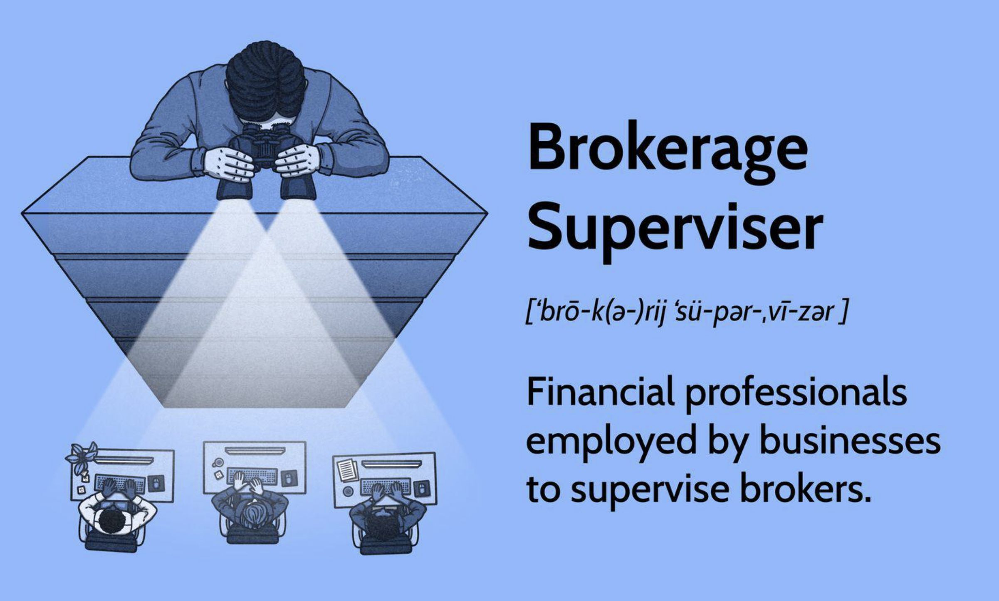

## Table of Contents

## What is a Brokerage Supervisor?

A Brokerage Supervisor is someone who oversees the operations of a brokerage firm. They make sure that the firm follows all the rules and regulations set by financial authorities. They also manage the brokers and other staff, making sure they are doing their jobs correctly and helping them when they need it.

Their job involves a lot of responsibility. They have to keep an eye on the market trends and make sure the firm's strategies are up to date. They also deal with any problems that come up, like customer complaints or issues with trades. This role requires good leadership skills and a deep understanding of the financial industry.

## What are the primary responsibilities of a Brokerage Supervisor?

A Brokerage Supervisor's main job is to make sure the brokerage firm runs smoothly and follows all the rules. They watch over the brokers and other workers to make sure everyone is doing their job right. They also check that the firm is following the rules set by financial authorities, like the SEC. If there are any problems, like a customer complaint or a mistake in a trade, the Brokerage Supervisor steps in to fix it.

Another big part of their job is keeping up with what's happening in the market. They need to know about new trends and changes so they can keep the firm's strategies fresh and effective. They also help train new brokers and give advice to the team. This means they need to be good leaders and have a lot of knowledge about the financial world.

## What qualifications are needed to become a Brokerage Supervisor?

To become a Brokerage Supervisor, you usually need a bachelor's degree in finance, business, or a related field. Many people in this role also have a master's degree, like an MBA, which can help them stand out. It's important to have a good understanding of financial markets, regulations, and trading practices. You also need to get a license, like the Series 7 and Series 24 licenses from the Financial Industry Regulatory Authority (FINRA), to legally work in this job.

Experience is another big part of becoming a Brokerage Supervisor. Most people start as brokers or in other financial roles and work their way up. This means you need to have several years of experience in the industry, usually at least 5 to 10 years. During this time, you learn how to handle clients, manage trades, and understand the ins and outs of the brokerage business. Good leadership and communication skills are also very important because you'll be managing a team and dealing with complex situations.

## How does a Brokerage Supervisor ensure compliance with financial regulations?

A Brokerage Supervisor makes sure the firm follows financial rules by keeping a close eye on everything that happens in the firm. They check that all the brokers and staff are doing things the right way and following the rules set by groups like the SEC. They also make sure that all the paperwork and reports are done correctly and on time. If there are any new rules or changes, the Brokerage Supervisor learns about them and teaches the team so everyone knows what to do.

They also use special tools and systems to watch for any problems. These tools can catch mistakes or suspicious activities that might break the rules. If something goes wrong, like a mistake in a trade or a customer complaint, the Brokerage Supervisor steps in to fix it quickly. They might need to talk to the people involved, look at the records, and make sure the issue is solved in a way that follows the rules. By doing all these things, the Brokerage Supervisor helps keep the firm out of trouble and keeps everyone's trust.

## What is the typical career path to becoming a Brokerage Supervisor?

The typical career path to becoming a Brokerage Supervisor starts with getting a good education. You usually need a bachelor's degree in finance, business, or something similar. Some people also get a master's degree, like an MBA, to stand out. After school, you need to get licenses like the Series 7 and Series 24 from FINRA. These licenses let you work in the financial industry legally.

Once you have the right education and licenses, you start working as a broker or in another financial job. You spend several years, often 5 to 10, learning the business. During this time, you handle clients, manage trades, and learn how the brokerage world works. As you gain experience, you might move up to roles with more responsibility, like a senior broker or a team leader.

After you've worked your way up and shown that you're good at your job, you can become a Brokerage Supervisor. This role needs you to have strong leadership skills and a deep understanding of the financial markets. You'll be in charge of making sure the firm follows the rules and that everyone on your team is doing their job right. It's a big job, but if you've followed this career path, you'll be ready for it.

## How does a Brokerage Supervisor manage and motivate their team?

A Brokerage Supervisor manages and motivates their team by being a good leader. They set clear goals for everyone and make sure each person knows what they need to do. They also check in with the team often to see how everyone is doing and to help with any problems. By giving regular feedback and praise, the Brokerage Supervisor helps the team feel valued and supported. They also make sure everyone has the tools and training they need to do their job well.

To keep the team motivated, the Brokerage Supervisor creates a positive work environment. They encourage teamwork and make sure everyone feels like they are part of a group. They also set up rewards and recognition programs to celebrate when someone does a good job. By showing that they care about their team's success and well-being, the Brokerage Supervisor helps keep everyone motivated and happy at work.

## What are the key performance indicators for a Brokerage Supervisor?

Key performance indicators (KPIs) for a Brokerage Supervisor help show how well they are doing their job. Some important KPIs include how well the team is doing, like the number of trades they handle and how much money they make for the firm. Another KPI is how well the firm follows the rules. The Brokerage Supervisor needs to make sure there are no big problems or fines from not following the rules. They also look at how happy the clients are. If clients are happy, it usually means the team is doing a good job.

Another set of KPIs for a Brokerage Supervisor is about how well they manage their team. This includes things like how often the team meets their goals and how well new brokers are trained. The Brokerage Supervisor also needs to keep an eye on how much the team improves over time. If the team is getting better and doing more trades or making more money, it shows the Brokerage Supervisor is doing a good job leading them. Keeping the team motivated and working well together is also a big part of their job.

## How does technology impact the role of a Brokerage Supervisor?

Technology has a big impact on the job of a Brokerage Supervisor. It helps them keep track of everything that's happening in the firm. They use special software to watch trades and make sure everyone is following the rules. This technology can catch mistakes or suspicious activities quickly, so the Brokerage Supervisor can fix them before they become big problems. They also use technology to talk with their team and clients, making it easier to share information and solve issues.

Another way technology helps is by giving the Brokerage Supervisor a lot of information about the market. They can use this information to make better decisions and keep the firm's strategies up to date. Technology also helps them train new brokers and keep everyone on the team learning and improving. By using technology, a Brokerage Supervisor can do their job better and make the firm run more smoothly.

## What are the challenges faced by Brokerage Supervisors in today's market?

Brokerage Supervisors face a lot of challenges in today's market. One big challenge is keeping up with all the new rules and regulations. Financial authorities are always making changes, and it's the Brokerage Supervisor's job to make sure the firm follows these rules. This means they have to learn about the new rules and teach their team about them too. It can be hard to keep everything straight and make sure nothing gets missed.

Another challenge is dealing with new technology. Technology is always changing, and Brokerage Supervisors need to use it to watch over trades and keep the firm running smoothly. But sometimes, the technology can be hard to understand or it might not work the way it should. This can cause problems and make the Brokerage Supervisor's job more difficult. They also have to make sure their team knows how to use the new technology correctly.

Keeping the team motivated and working well together is also a challenge. The market can be stressful, and sometimes the team might feel overwhelmed. The Brokerage Supervisor needs to help them stay focused and positive. They have to make sure everyone feels supported and knows what they need to do. This can be tough, especially when there are a lot of other things to worry about.

## How do Brokerage Supervisors handle risk management?

Brokerage Supervisors handle risk management by keeping a close eye on what's happening in the firm. They use special tools and systems to watch trades and make sure nothing goes wrong. If they see something that looks risky, like a big trade that might lose a lot of money, they step in to stop it or fix it. They also make sure everyone on the team knows about the risks and how to handle them. By doing this, they help keep the firm safe and avoid big problems.

Another way Brokerage Supervisors manage risk is by following the rules set by financial authorities. They make sure all the trades and other activities follow these rules. If there's a new rule or a change, they learn about it and teach their team. This helps prevent mistakes that could lead to fines or other issues. By staying on top of the rules and using technology to watch for risks, Brokerage Supervisors keep the firm running smoothly and safely.

## What advanced strategies can a Brokerage Supervisor use to enhance client services?

A Brokerage Supervisor can enhance client services by using technology to make things easier for clients. They can set up online platforms where clients can see their accounts, make trades, and get help whenever they need it. This makes it more convenient for clients and helps them feel more in control of their money. The Brokerage Supervisor can also use data from these platforms to understand what clients want and need. By knowing this, they can offer better advice and services that fit each client's goals.

Another strategy is to focus on building strong relationships with clients. The Brokerage Supervisor can make sure the team talks to clients regularly, not just when there's a problem. They can set up meetings or calls to check in and see how clients are doing. By listening to clients and understanding their needs, the team can give better advice and help them reach their financial goals. This personal touch makes clients feel valued and more likely to stay with the firm.

## How can a Brokerage Supervisor stay updated with industry trends and regulations?

A Brokerage Supervisor can stay updated with industry trends and regulations by regularly reading financial news and industry reports. They can subscribe to newsletters from financial authorities like the SEC and follow industry blogs and websites. This helps them know about new rules and what's happening in the market. They can also join professional groups and go to meetings or conferences where people talk about the latest trends and changes in the industry. By doing this, they learn from others and keep their knowledge fresh.

Another way to stay updated is by using technology. A Brokerage Supervisor can use special software and tools that track market trends and alert them to any new rules or changes. This makes it easier to stay on top of things without spending a lot of time searching for information. They can also set up regular training sessions for their team to make sure everyone knows about the new trends and regulations. By keeping themselves and their team informed, a Brokerage Supervisor can help the firm do well and avoid problems.

## References & Further Reading

[1]: Bergstra, J., Bardenet, R., Bengio, Y., & Kégl, B. (2011). ["Algorithms for Hyper-Parameter Optimization."](https://papers.nips.cc/paper/4443-algorithms-for-hyper-parameter-optimization) Advances in Neural Information Processing Systems 24.

[2]: ["Advances in Financial Machine Learning"](https://www.amazon.com/Advances-Financial-Machine-Learning-Marcos/dp/1119482089) by Marcos Lopez de Prado

[3]: ["Evidence-Based Technical Analysis: Applying the Scientific Method and Statistical Inference to Trading Signals"](https://www.amazon.com/Evidence-Based-Technical-Analysis-Scientific-Statistical/dp/0470008741) by David Aronson

[4]: ["Machine Learning for Algorithmic Trading"](https://github.com/stefan-jansen/machine-learning-for-trading) by Stefan Jansen

[5]: ["Quantitative Trading: How to Build Your Own Algorithmic Trading Business"](https://www.amazon.com/Quantitative-Trading-Build-Algorithmic-Business/dp/1119800064) by Ernest P. Chan