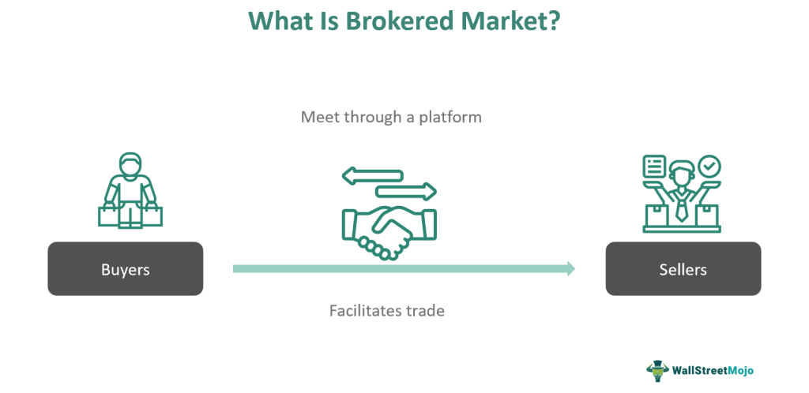

In today’s rapidly evolving financial landscape, brokered markets, financial market structures, and algorithmic trading are pivotal components shaping the way trading is executed and transactions are processed. Each element plays a crucial role: brokered markets provide the necessary liquidity and facilitate efficient transactions through intermediaries; financial market structures determine the organization and flow of trading activities; and algorithmic trading employs advanced technological tools to ensure speed, accuracy, and cost-effectiveness in executing trades.

Understanding the interplay between these components is critical for both institutional and individual investors aiming to optimize their trading strategies. Brokered markets are vital in connecting buyers and sellers, ensuring that transactions occur seamlessly. They serve as essential parts of the financial ecosystem where intermediaries, known as brokers, facilitate deals and stabilize liquidity.

Market structures, on the other hand, influence how markets function by dictating how trades are organized and executed. They play a significant role in shaping market dynamics, impacting everything from price discovery to transaction costs. The architecture of these structures—be it dealer markets, auction markets, or electronic communication networks (ECNs)—directly affects the efficiency of the markets and the nature of trading activities.

Algorithmic trading introduces an additional layer of complexity and efficiency by employing algorithms to automate the trading process. These computer-driven strategies are designed for precision and speed, executing trades based on pre-defined criteria without emotional interference. The use of algorithms helps in reducing transaction costs and enhancing the trading process, making it possible to capitalize on market movements that may not be detectable by human traders in real-time.

This article explores the interconnectedness of brokered markets, financial market structures, and algorithmic trading, providing examples to illustrate their impact and effectiveness in real-world scenarios. Recognizing how these components interact not only helps in crafting robust trading strategies but also offers insights into the future direction of financial markets, where technology continues to drive innovation and transform investment landscapes. Understanding these dynamics is essential for maintaining a competitive edge in today's global markets.

## Table of Contents

## Understanding Brokered Markets

A brokered market operates through intermediaries, known as brokers, who match buyers with sellers, facilitating transactions and providing essential liquidity. This structure is crucial in ensuring efficient market operations by helping participants find counter-parties for trade, thereby reducing the time and effort required to complete transactions. Brokers provide value by offering expert knowledge, executing trades at optimal prices, and sometimes even providing advice on the best strategies to employ in specific market conditions.

Brokers play a pivotal role in stock exchanges, one of the most prominent examples of brokered markets. Here, brokers act on behalf of institutional or retail investors to execute buy and sell orders. They provide access to the exchange, which might be challenging for individual investors to navigate independently. By aggregating the interests of multiple clients, brokers can negotiate better prices and execute large orders more efficiently, thereby maintaining market [liquidity](/wiki/liquidity-risk-premium).

Another significant example of brokered markets is the real estate market. Real estate brokers assist buyers and sellers in property transactions, ensuring that these high-value trades are conducted smoothly. They conduct market analyses, suggest appropriate pricing, and handle the negotiation process. Brokers also ensure that all legal requirements are met during the transaction, providing a layer of security to the involved parties.

The foreign exchange (Forex) market is also heavily reliant on brokers. Forex brokers provide trading platforms that offer real-time access to currency markets. These platforms are equipped with tools and resources that enable traders to make informed decisions about currency pair movements. Forex brokers often facilitate leverage, allowing traders to control more substantial positions than their actual capital would permit, thus enhancing liquidity.

A practical example of a brokered market is the New York Stock Exchange (NYSE), where transactions occur via a combination of human brokers and electronic systems. Brokers here are responsible for ensuring that orders are executed at the best available prices by interacting directly with the market, either electronically or physically on the trading floor. This interaction helps maintain market order and efficiency.

In summary, brokered markets are integral to various sectors, underpinning the efficiency and liquidity of financial and transactional activities. By facilitating transactions, providing expertise, and ensuring regulatory compliance, brokers create smoother and more accessible markets for participants, enhancing overall market functionality.

## Financial Market Structure

Market structure refers to the various ways a market is organized, influencing trading dynamics, efficiency, and liquidity. Different structures cater to distinct needs of market participants, with two predominant types being dealer markets and auction markets.

**Dealer Markets:** In a dealer market, participants trade through intermediaries known as dealers or market makers. These dealers hold inventories of assets and stand ready to buy or sell at publicly quoted prices, thus providing liquidity. For example, the foreign exchange market operates as a dealer market where banks often act as dealers. A primary advantage is that dealer markets can facilitate continuous trading, even in less liquid instruments, by using dealers to mitigate the gap between buyers and sellers. However, the presence of dealers may lead to wider bid-ask spreads, affecting transaction costs negatively.

**Auction Markets:** Conversely, auction markets bring buyers and sellers together directly to trade at prices determined by supply and demand dynamics. Stock exchanges like the New York Stock Exchange (NYSE) function as auction markets where participants bid against each other, and transactions occur at the intersection of bids and offers. Auction markets tend to offer greater transparency as prices are a direct reflection of collective market sentiment. In an auction market, price discovery is typically efficient due to the competitive nature of bidding, which can result in narrower spreads than dealer markets.

Market structure significantly impacts price discovery—the process through which markets determine the price of a security. In auction markets, transparent order [books](/wiki/algo-trading-books) help reveal intrinsic values efficiently, leading to rapid price discovery. Dealer markets might achieve this through dealer expertise, albeit with less transparency. Transaction costs, another crucial [factor](/wiki/factor-investing) influenced by market structure, usually consist of explicit costs like fees and implicit costs such as bid-ask spreads. Dealer markets often incur higher implicit costs due to the need for dealers to profit from spread, whereas auction markets can keep these costs lower due to competitive bidding environments.

The structure of a market also influences brokered markets and [algorithmic trading](/wiki/algorithmic-trading). Brokered markets, reliant on intermediaries for transaction facilitation, can benefit from the liquidity provided by dealer markets but may face challenges in terms of higher transaction costs. Automation and algorithmic strategies can thrive in both structures, but market liquidity and transparency are vital. Algorithms in dealer markets may prioritize rapid execution to capitalize on spreads, whereas in auction markets, they can focus on optimizing bid strategies for better price discovery.

In summary, understanding various financial market structures is crucial for participants looking to optimize trading strategies. The choice between dealer and auction markets can significantly affect transaction outcomes, with each offering unique advantages in terms of liquidity, price discovery, and cost efficiency. As the financial landscape evolves, the adaptation of new trading technologies continues to reshape these structures, further influencing their impact on brokered markets and algorithmic trading.

 to Algorithmic Trading

Algorithmic trading refers to the use of computer algorithms to automate the process of buying and selling financial instruments. This approach aims to execute trades with high speed, precision, and without the influence of human emotions, which can often lead to suboptimal trading decisions. Algorithms can analyze large volumes of data at speeds far beyond human capabilities, allowing them to identify profitable trading opportunities and execute orders in fractions of a second.

### Strategies in Algorithmic Trading

Various strategies are employed in algorithmic trading, each with distinct objectives and methodologies. One common approach is trend-following, which involves identifying and following existing market trends. Algorithms can detect patterns in historical price movements, enabling traders to capitalize on the [momentum](/wiki/momentum) of a security without the interference of human biases.

Another widely used strategy is [arbitrage](/wiki/arbitrage), which seeks to exploit price discrepancies between different markets or instruments. For example, if a stock is trading at different prices on two exchanges, an algorithm can simultaneously buy the stock at the lower price and sell it at the higher price, thus locking in a risk-free profit. Such opportunities are typically fleeting, reinforcing the necessity for rapid execution inherent in algorithmic systems.

### Advantages of Algorithmic Trading

The primary advantage of algorithmic trading is its capacity to reduce transaction costs. By minimizing the time between identifying a trading opportunity and executing the order, algorithms can take advantage of the best available prices, which might be lost in manual trading due to delays. Additionally, algorithmic trading enhances efficiency by streamlining the process of trade execution, reducing the likelihood of errors and slippage that might occur with human traders.

Moreover, algorithms can operate continuously without the need for breaks, unlike human traders who require rest and may suffer from fatigue. This allows for consistent market monitoring and the exploitation of opportunities across multiple time zones and markets, providing a significant edge in the fast-paced financial environment.

### Challenges and Risks

Despite its advantages, algorithmic trading is not without challenges and risks. One significant risk involves the potential for unexpected market conditions, which can render an algorithm's assumptions invalid, leading to substantial financial losses. Additionally, algorithms are only as good as their programming; erroneous code or insufficient testing can result in costly errors. 

Market impact and liquidity risk also present notable challenges, as the swift execution of large orders can move prices unfavorably or exhaust available liquidity. Furthermore, the reliance on technology makes algorithmic traders vulnerable to system failures and cybersecurity threats, which could disrupt operations or compromise sensitive data.

In conclusion, algorithmic trading offers a powerful tool for enhancing trading performance through speed and precision. However, traders must carefully design, test, and monitor their algorithms to address the inherent risks and maximize their potential benefits.

## Algorithmic Trading in Brokered Markets

Algorithmic trading tools have transformed brokered markets by enhancing transaction efficiency and execution speed. Brokers, who traditionally play critical roles in facilitating transactions, now synergize their market expertise with advanced algorithmic systems. This integration enables rapid, precise trade execution and real-time market adjustments, maximizing the benefits of brokered transactions.

The synergy between brokers and algorithmic execution is evident in several ways. Brokers possess an acute understanding of market conditions, investor psychology, and regulatory frameworks. When coupled with the computational power and speed of trading algorithms, they can not only execute trades swiftly but also optimize entry and [exit](/wiki/exit-strategy) points with a precision that human traders alone could not achieve. For instance, algorithms can swiftly analyze vast datasets to identify optimal trading opportunities based on criteria set by brokers, ensuring decisions are informed and timely.

A significant benefit of this integration is the potential for reduced transaction costs. Algorithmic systems can segment large transactions into smaller, strategically timed trades to minimize market impact and slippage. This is particularly advantageous in brokered markets where liquidity is facilitated by intermediaries who connect buyers and sellers. The ability to adjust trade strategies in real time based on market conditions further enhances the cost-effectiveness of trades.

Consider a case study of algorithmic trading in brokered markets: A financial services firm implementing an algorithmic trading system within its brokerage division achieved notable success. The firm developed an algorithm that amalgamated real-time market data with historical trade patterns, allowing brokers to make informed decisions instantly. By automating routine trading tasks, brokers focused more on client relationships and strategic decision-making. The algorithm's rapid execution capability allowed the firm to execute large volumes of trades with minimal market disruption, thereby reducing transaction costs significantly and improving overall client satisfaction.

In conclusion, the integration of algorithmic trading tools in brokered markets exemplifies the powerful combination of human expertise and technological advancement. This synergy not only enhances the efficiency of market transactions but also provides a competitive edge by enabling brokers to leverage the full potential of algorithmic systems in crafting strategies that optimize financial outcomes. This evolution underscores the critical role of technology in shaping the future dynamics of brokered markets.

## Real-World Examples of Algorithmic Trading

Algorithmic trading has become a crucial component in the financial sector, particularly within equities and foreign exchange markets. Its application has led to improved efficiency and execution of trades, especially in brokered markets.

### Equities Market

In the equities market, algorithmic trading has enabled institutions to handle large order volumes while minimizing market impact and transaction costs. For instance, in volatile market conditions where rapid price fluctuations are common, algorithms have been employed to slice orders into smaller batches, executing them incrementally to reduce visibility and possibility of price manipulation by other market participants. This process is often facilitated through VWAP (Volume Weighted Average Price) strategies. The VWAP formula is:

$$
\text{VWAP} = \frac{\sum (\text{Price}_i \times \text{Volume}_i)}{\sum \text{Volume}_i}
$$

Using this strategy, firms can match or outperform the market's average price over a given period, achieving transactions closer to an asset's intrinsic value.

### Foreign Exchange Markets

In the foreign exchange ([forex](/wiki/forex-system)) markets, algorithmic trading similarly manages large currency trades across multiple time zones efficiently. Algorithms can capitalize on minor price discrepancies across various brokers and platforms through arbitrage strategies. For example, if EUR/USD is quoted differently across platforms, algorithms can simultaneously buy low and sell high to capture risk-free profit, balancing supply and demand without the intervention of a human trader. This process occurs within seconds, illustrating the power of algorithmic efficiency.

### Successful Arbitrage and Trend-Following Strategies

Two primary strategies—arbitrage and trend-following—demonstrate the robustness of algorithmic trading in brokered markets.

1. **Arbitrage**: Algorithms seek out price inefficiencies between correlated markets or assets, making instantaneous trades that exploit these discrepancies. Algorithmic arbitrage is prevalent in high-frequency trading scenarios, where transaction speed is crucial in capturing fleeting opportunities.

2. **Trend Following**: This strategy involves algorithms that identify and follow market trends, typically using moving averages to determine entry and exit points. A moving average crossover is a popular method, where a short-term moving average crossing above a long-term moving average triggers a buy signal, and vice versa for a sell signal. The efficiency and emotionless decision-making of algorithms allow for consistent application of these strategies, particularly beneficial in trending markets.

### Case Studies in Volatile Conditions

The 2010 "Flash Crash" serves as a testament to algorithmic trading's impact under volatile conditions. During this event, liquidity evaporated as high-frequency trading algorithms withdrew from the market, leading to sudden price declines. Despite this negative manifestation, it showcased the significant role algorithms play in maintaining market equilibrium by providing liquidity.

These real-world examples underscore algorithmic trading's capacity to enhance trading outcomes and mitigate risks through precision, speed, and strategic execution. By leveraging sophisticated mathematical models and computational power, traders can navigate complex market dynamics effectively.

## The Future of Trading: Automation and Beyond

The future of trading is increasingly characterized by automation, propelled by the continual advancement of algorithmic processes. Central to this transition are algorithms designed to enhance efficiency, accuracy, and speed in trading operations. Financial technology developments are poised to redefine market structures, with significant implications for all participants.

One of the most prominent trends is the adoption of [artificial intelligence](/wiki/ai-artificial-intelligence) (AI) in trading strategies. AI systems, particularly those leveraging [machine learning](/wiki/machine-learning), are capable of analyzing vast datasets with high variability and velocity. These systems can identify patterns and trends that may elude human traders, providing a competitive advantage in formulating and executing trading strategies. For instance, predictive algorithms can enhance decision-making by estimating future price movements based on historical data trends and real-time market information. 

AI's impact is also evident in risk management and portfolio optimization. Advanced AI models can simulate a multitude of market scenarios, optimizing portfolios according to risk thresholds and return objectives. This automated approach facilitates rapid response to market changes, minimizing potential losses and maximizing gains.

Another significant trend is the expansion of smart contracts and blockchain technology. By automating the execution, verification, and enforcement of trading contracts, smart contracts reduce the need for intermediaries, thus lowering transaction costs and enhancing trust in transactions. Blockchain's immutable ledger provides enhanced transparency and security, which is critical in high-frequency trading environments where speed and accuracy are paramount.

Cloud computing and big data analytics further influence trading strategies. Cloud-based platforms offer scalable solutions for data storage and processing, enabling traders to access and analyze real-time data streams efficiently. These platforms support sophisticated analytical tools that can process complex algorithms in fractions of a second, which is crucial for latency-sensitive trading operations.

Looking ahead, we anticipate increased integration of these technologies within brokered markets. Brokers are expected to increasingly rely on AI-enhanced tools to offer tailored services to clients, such as personalized trading recommendations and automated wealth management solutions. Algorithmic trading models will likely become more adaptive and self-learning, driving further efficiencies in trade execution and market analysis.

In terms of market evolution, we foresee a future where traditional trading practices converge with technological innovations. Algorithmic trading may continue to dominate in sectors with high liquidity and [volatility](/wiki/volatility-trading-strategies). Meanwhile, brokered markets will likely retain their importance in providing liquidity and specialized services, albeit with enhanced algorithmic support.

As these technological advancements continue to unfold, traders and investors must remain vigilant and adaptable. Understanding the capabilities and limitations of automated systems is crucial to leveraging their full potential while mitigating associated risks. The convergence of AI, blockchain, cloud computing, and big data analytics marks a transformative era in trading, offering promising prospects for enhanced market dynamics and strategy optimization.

## Conclusion

Brokered markets, financial market structures, and algorithmic trading are integral to the modern trading landscape. Each component holds a distinct role, yet their synergistic interaction defines the efficiency and success of trading activities. Brokered markets, with their reliance on intermediaries, ensure liquidity and facilitate effective transactions, while financial market structures provide the organizational framework that impacts dynamics such as price discovery and transaction costs. Meanwhile, algorithmic trading enhances the precision, speed, and efficiency of trades, minimizing emotional influences and reducing transaction costs.

Understanding the interplay between these components offers significant advantages in optimizing trading strategies. For example, recognizing the role of brokers within certain market structures can help investors better exploit the benefits of algorithmic trading. By aligning algorithmic strategies with the liquidity and structural characteristics of specific markets, investors can enhance their potential returns while managing their risks more effectively.

As technology advances, the integration of these components will be critical for the future of financial markets. Emerging technologies such as artificial intelligence and machine learning are poised to further revolutionize trading environments. These technologies can enhance the capabilities of algorithmic trading, offering even greater speed, predictive accuracy, and adaptability.

Investors and traders must stay informed of these developments to maintain competitive edges in the global markets. This involves continuous education on market changes, technological advancements, and evolving trading strategies. By doing so, they can leverage these insights to make informed decisions, ensuring successful adaptation to the ever-evolving financial landscape.

## References & Further Reading

[1]: Harris, L. (2003). ["Trading and Exchanges: Market Microstructure for Practitioners."](https://academic.oup.com/book/52292) Oxford University Press.

[2]: Aldridge, I. (2013). ["High-Frequency Trading: A Practical Guide to Algorithmic Strategies and Trading Systems."](https://www.wiley.com/en-us/High+Frequency+Trading%3A+A+Practical+Guide+to+Algorithmic+Strategies+and+Trading+Systems%2C+2nd+Edition-p-9781118343500) John Wiley & Sons.

[3]: Fabozzi, F. J., Focardi, S. M., & Kolm, P. N. (2010). ["Quantitative Equity Investing: Techniques and Strategies."](https://www.semanticscholar.org/paper/Quantitative-Equity-Investing%3A-Techniques-and-Fabozzi-Focardi/1c49a2a53919f7e65cb96f16691b8ff726fd3cd7) John Wiley & Sons.

[4]: Narang, R. K. (2013). ["Inside the Black Box: A Simple Guide to Quantitative and High-Frequency Trading."](https://onlinelibrary.wiley.com/doi/book/10.1002/9781118662717) John Wiley & Sons.

[5]: Derman, E. (2011). ["Models. Behaving. Badly: Why Confusing Illusion with Reality Can Lead to Disaster, on Wall Street and in Life."](https://archive.org/details/modelsbehavingba0000derm) Free Press.