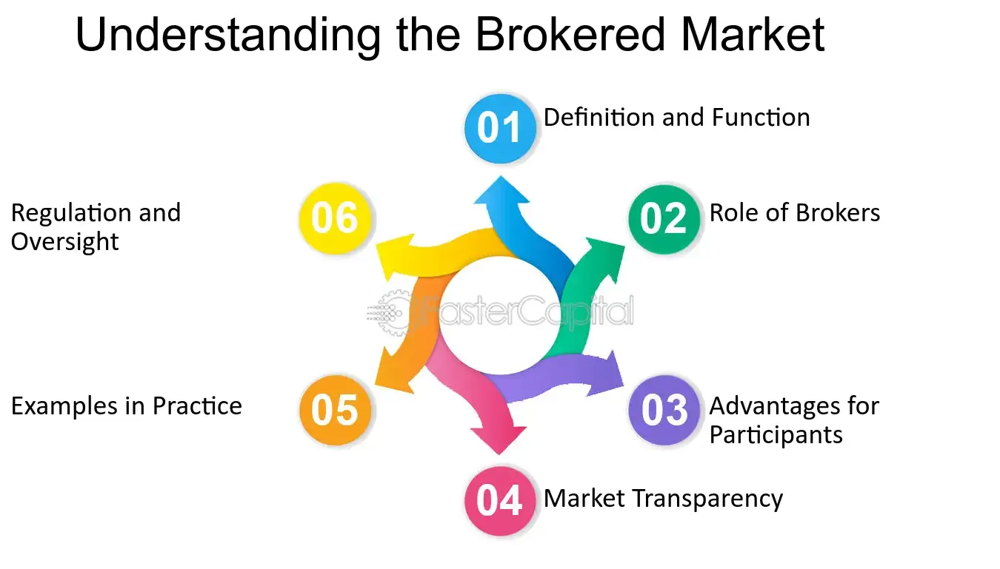

## Table of Contents

## What is a brokered market?

A brokered market is a type of market where buyers and sellers don't deal directly with each other. Instead, they use a middleman, called a broker, to help them make trades. The broker's job is to find a buyer for a seller's goods or a seller for a buyer's money. This can be helpful because brokers often have a lot of information and connections that can make trading easier and more efficient.

In a brokered market, the broker earns money by charging a fee or commission for their services. This fee is usually a small percentage of the total value of the trade. Brokered markets are common in industries like real estate, where people buy and sell homes, and in financial markets, where people trade stocks and bonds. Using a broker can be a good idea if you need help finding the right buyer or seller, or if you want to make sure you're getting a fair price.

## How does a brokered market differ from other types of markets?

A brokered market is different from other types of markets because it uses a middleman, called a broker, to help buyers and sellers trade. In other markets, like direct markets, buyers and sellers deal directly with each other without any help. In a direct market, if you want to buy something, you find the seller yourself and agree on a price. But in a brokered market, the broker does the work of finding the right buyer or seller for you, and they charge a fee for this service.

Another type of market is an auction market, where buyers bid against each other to buy goods from a seller. In an auction market, the price is decided by how much buyers are willing to pay, and the highest bidder wins. This is different from a brokered market, where the broker helps set the price and makes sure the trade goes smoothly. In a brokered market, the broker's knowledge and connections can help make the trade happen faster and at a fair price, which is not always the case in an auction market where the price can go up a lot if many people want the same thing.

## Who are the main participants in a brokered market?

The main participants in a brokered market are buyers, sellers, and brokers. Buyers are people or businesses looking to purchase goods or services. Sellers are those who have goods or services to sell. Brokers are the middlemen who help buyers and sellers connect and complete their trades.

Brokers play a key role in a brokered market. They use their knowledge and connections to find the right buyer for a seller's goods or the right seller for a buyer's money. Brokers earn money by charging a fee or commission for their services, which is usually a small percentage of the total value of the trade. This setup helps make trading easier and more efficient for both buyers and sellers.

## What role do brokers play in a brokered market?

Brokers are very important in a brokered market. They help buyers and sellers find each other and make trades happen. When a seller wants to sell something, the broker uses their knowledge and connections to find a buyer who wants to buy it. The same goes for buyers; if someone wants to buy something, the broker helps them find a seller who has what they need. This makes trading easier and faster because the broker does a lot of the work.

Brokers also help set the price for trades. They know a lot about the market and can help make sure buyers and sellers get a fair deal. For their work, brokers charge a fee or commission, which is usually a small part of the total value of the trade. This fee is how brokers make money. By using a broker, buyers and sellers can feel more confident that they are making good trades at fair prices.

## Can you explain the basic mechanism of how transactions occur in a brokered market?

In a brokered market, when someone wants to buy or sell something, they go to a broker for help. Let's say a person wants to sell their house. They tell the broker about their house, and the broker uses their knowledge and connections to find someone who wants to buy it. The broker talks to the seller about what they want for the house and then looks for a buyer who is willing to pay that price. Once the broker finds a buyer, they bring the buyer and seller together to make a deal.

Once the buyer and seller agree on a price, the broker helps them complete the transaction. The broker makes sure all the paperwork is done correctly and that both the buyer and seller are happy with the deal. For their work, the broker gets paid a fee, which is usually a small percentage of the total price of the house. This way, the broker makes money, and the buyer and seller get help making the trade happen smoothly and at a fair price.

## What are the advantages of using a brokered market for trading?

Using a brokered market for trading has many advantages. One big advantage is that brokers have a lot of knowledge about the market. They know who wants to buy or sell things and can help you find the right person to trade with. This makes trading easier because you don't have to spend time looking for buyers or sellers yourself. Brokers also know a lot about prices, so they can help you get a fair deal. This can save you money and help you feel more confident about your trades.

Another advantage is that brokers make trading more efficient. They take care of a lot of the work involved in making a trade, like finding the right person and helping with the paperwork. This means you can focus on other things while the broker handles the trade. Brokers also help make sure everything goes smoothly and that both the buyer and seller are happy with the deal. This can make trading less stressful and more successful.

## What are the potential disadvantages or risks associated with brokered markets?

One potential disadvantage of using a brokered market is the cost. Brokers charge a fee or commission for their services, which can add to the total cost of the trade. This fee is usually a small percentage of the total value of the trade, but it can still be a lot of money, especially for big trades. If you are trying to save money, using a broker might not be the best choice.

Another risk is that you have to trust the broker to do a good job. Brokers have a lot of power in a brokered market because they control who buys and sells and at what price. If a broker is not honest or does not work hard to find the best deal, you might end up with a bad trade. It's important to choose a broker you can trust and to keep an eye on what they are doing to make sure they are working in your best interest.

## How is pricing determined in a brokered market?

In a brokered market, pricing is determined with the help of a broker. The broker knows a lot about what things are worth because they have a lot of information about the market. When a seller wants to sell something, they tell the broker what they think it's worth. The broker then uses their knowledge to help the seller set a good price. They look at what similar things have sold for and what buyers are willing to pay.

Once the broker has helped set the price, they start looking for a buyer. If the price is too high, it might be hard to find a buyer. If it's too low, the seller might not get as much money as they could. The broker talks to both the buyer and the seller to help them agree on a price that works for both. This way, the broker helps make sure the price is fair and that the trade happens smoothly.

## What types of assets are typically traded in brokered markets?

In brokered markets, you can find all sorts of things being traded. One common type of asset is real estate, like houses and land. People who want to buy or sell a home often use a real estate broker to help them. Brokers know a lot about the housing market and can help find the right buyer or seller at the right price. Another big type of asset is financial securities, like stocks and bonds. If someone wants to buy or sell stocks, they might use a stockbroker who knows a lot about the stock market and can help them make the trade.

Besides real estate and financial securities, other assets like art, jewelry, and collectibles are also traded in brokered markets. People who want to buy or sell these special items often use brokers who specialize in those areas. These brokers have a lot of knowledge about what these items are worth and can help find the right buyer or seller. No matter what type of asset is being traded, brokers help make the process easier and more efficient by using their expertise and connections.

## How do regulations impact the functioning of brokered markets?

Regulations are rules made by the government that affect how brokered markets work. These rules help keep things fair and safe for everyone involved. For example, there are laws that say brokers have to be honest and tell the truth about what they are selling. This helps protect buyers and sellers from being tricked. Regulations also make sure that brokers are properly trained and licensed, so they know what they are doing and can be trusted to help with trades.

Another way regulations impact brokered markets is by setting rules for how trades are made. For example, there might be rules about how prices are set or how much brokers can charge for their services. These rules help keep prices fair and stop brokers from charging too much. Regulations can also make it easier for people to understand what they are buying or selling by requiring clear information and paperwork. Overall, regulations help make brokered markets work better and more safely for everyone.

## What advanced strategies can traders use to optimize their performance in brokered markets?

One advanced strategy traders can use to optimize their performance in brokered markets is to build strong relationships with their brokers. By getting to know their broker well, traders can gain valuable insights into market trends and opportunities. A good relationship can also lead to better deals, as the broker might be more motivated to find the best price for someone they trust. Traders can also ask their broker for advice on timing their trades, which can help them buy or sell at the best possible moment.

Another strategy is to use data and analysis to make smarter decisions. Traders can look at past trades and market data to see patterns and trends. This information can help them predict what might happen next and make better choices about when to buy or sell. By using tools like charts and graphs, traders can see the big picture and spot good opportunities. This kind of analysis can give traders an edge over others who might not be as informed.

## How have technological advancements influenced the operations and efficiency of brokered markets?

Technological advancements have made brokered markets work better and faster. Computers and the internet have changed how brokers find buyers and sellers. Now, brokers can use online platforms to list things for sale and reach more people. This means they can find the right buyer or seller quicker than before. Also, technology helps brokers keep track of all their trades and information in one place, making it easier to manage everything and make sure nothing gets missed.

Another way technology has helped is by making it easier for traders to get information. With the internet, traders can look up prices and market trends anytime they want. This helps them make smarter choices about when to buy or sell. Technology also lets traders talk to their brokers more easily, using emails, chats, or video calls. This makes it simpler to ask questions and get advice, which can lead to better trades and happier customers.

## What are some real-world examples of algorithmic trading?

Algorithmic trading has become a crucial component in the financial sector, particularly within equities and foreign exchange markets. Its application has led to improved efficiency and execution of trades, especially in brokered markets.

### Equities Market

In the equities market, algorithmic trading has enabled institutions to handle large order volumes while minimizing market impact and transaction costs. For instance, in volatile market conditions where rapid price fluctuations are common, algorithms have been employed to slice orders into smaller batches, executing them incrementally to reduce visibility and possibility of price manipulation by other market participants. This process is often facilitated through VWAP (Volume Weighted Average Price) strategies. The VWAP formula is:

$$
\text{VWAP} = \frac{\sum (\text{Price}_i \times \text{Volume}_i)}{\sum \text{Volume}_i}
$$

Using this strategy, firms can match or outperform the market's average price over a given period, achieving transactions closer to an asset's intrinsic value.

### Foreign Exchange Markets

In the foreign exchange ([forex](/wiki/forex-system)) markets, algorithmic trading similarly manages large currency trades across multiple time zones efficiently. Algorithms can capitalize on minor price discrepancies across various brokers and platforms through arbitrage strategies. For example, if EUR/USD is quoted differently across platforms, algorithms can simultaneously buy low and sell high to capture risk-free profit, balancing supply and demand without the intervention of a human trader. This process occurs within seconds, illustrating the power of algorithmic efficiency.

### Successful Arbitrage and Trend-Following Strategies

Two primary strategies—arbitrage and trend-following—demonstrate the robustness of algorithmic trading in brokered markets.

1. **Arbitrage**: Algorithms seek out price inefficiencies between correlated markets or assets, making instantaneous trades that exploit these discrepancies. Algorithmic arbitrage is prevalent in high-frequency trading scenarios, where transaction speed is crucial in capturing fleeting opportunities.

2. **Trend Following**: This strategy involves algorithms that identify and follow market trends, typically using moving averages to determine entry and exit points. A moving average crossover is a popular method, where a short-term moving average crossing above a long-term moving average triggers a buy signal, and vice versa for a sell signal. The efficiency and emotionless decision-making of algorithms allow for consistent application of these strategies, particularly beneficial in trending markets.

### Case Studies in Volatile Conditions

The 2010 "Flash Crash" serves as a testament to algorithmic trading's impact under volatile conditions. During this event, liquidity evaporated as high-frequency trading algorithms withdrew from the market, leading to sudden price declines. Despite this negative manifestation, it showcased the significant role algorithms play in maintaining market equilibrium by providing liquidity.

These real-world examples underscore algorithmic trading's capacity to enhance trading outcomes and mitigate risks through precision, speed, and strategic execution. By leveraging sophisticated mathematical models and computational power, traders can navigate complex market dynamics effectively.

## References & Further Reading

[1]: Harris, L. (2003). ["Trading and Exchanges: Market Microstructure for Practitioners."](https://academic.oup.com/book/52292) Oxford University Press.

[2]: Aldridge, I. (2013). ["High-Frequency Trading: A Practical Guide to Algorithmic Strategies and Trading Systems."](https://www.wiley.com/en-us/High+Frequency+Trading%3A+A+Practical+Guide+to+Algorithmic+Strategies+and+Trading+Systems%2C+2nd+Edition-p-9781118343500) John Wiley & Sons.

[3]: Fabozzi, F. J., Focardi, S. M., & Kolm, P. N. (2010). ["Quantitative Equity Investing: Techniques and Strategies."](https://www.semanticscholar.org/paper/Quantitative-Equity-Investing%3A-Techniques-and-Fabozzi-Focardi/1c49a2a53919f7e65cb96f16691b8ff726fd3cd7) John Wiley & Sons.

[4]: Narang, R. K. (2013). ["Inside the Black Box: A Simple Guide to Quantitative and High-Frequency Trading."](https://onlinelibrary.wiley.com/doi/book/10.1002/9781118662717) John Wiley & Sons.

[5]: Derman, E. (2011). ["Models. Behaving. Badly: Why Confusing Illusion with Reality Can Lead to Disaster, on Wall Street and in Life."](https://archive.org/details/modelsbehavingba0000derm) Free Press.