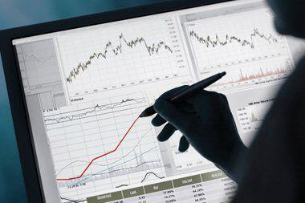

Financial markets have undergone substantial transformations over the years, with the onset of algorithmic trading marking a pivotal change in trading dynamics. Traditionally, stock trading relied heavily on human expertise and the manual execution of trades. However, today's markets are increasingly driven by sophisticated computer algorithms that can execute complex trading strategies at lightning speeds.

Algorithmic trading, also known as algo trading, leverages the power of computer algorithms to make trades based on predetermined criteria. This innovation has not only reshaped how trades are conducted but has also influenced market liquidity, volatility, and overall efficiency. Unlike human traders who are susceptible to emotional biases, algorithms operate based on logic and data, thus minimizing errors and potentially enhancing returns.

The modern stock market is a multifaceted environment where financial advice, broker's calls, and algo trading all intertwine to empower traders. Financial advice forms the backbone of sound investment decisions, guiding traders in selecting assets and managing risk. Meanwhile, the broker's call or call loan rate is a critical component, impacting borrowing costs and trading margins for investors utilizing margin accounts.

Understanding these components is crucial for anyone participating in today's complex financial marketplaces. By mastering the interplay of financial advice, broker's calls, and algorithmic trading, traders can better position themselves for success. As technology continues to evolve, staying informed and adaptable will be key to capitalizing on the opportunities presented within the dynamic world of stock market trading.

## Table of Contents

## Understanding Stock Market Financial Advice

Financial advice often serves as the backbone for investment decisions in the stock market, providing essential guidance across several key areas. It fundamentally involves the selection of assets, where advisors help in identifying suitable securities such as equities, bonds, and mutual funds that align with an investor’s financial goals and risk tolerance. Risk management is another critical component, where strategies are crafted to mitigate potential losses. Techniques such as diversification—spreading investments across various asset classes—and using financial derivatives like options and futures to hedge against market volatility are commonly employed.

Long-term investment strategies form the strategic framework within which asset selection and risk management operate. Financial advisors guide investors in developing these strategies, emphasizing the importance of time horizon, compounding returns, and regular portfolio rebalancing to adhere to desired asset allocations. They also provide insights into maximizing tax efficiency and structuring investments to achieve sustainable growth.

Professional financial advisors play an indispensable role in navigating the complexities of stock market dynamics. Their expertise ensures that investors make informed choices, adapting strategies to changing market conditions and economic climates. They provide a personalized approach to financial planning, addressing the unique circumstances and objectives of individual investors. By leveraging data analytics and maintaining up-to-date knowledge of market trends, advisors enhance their ability to predict potential pitfalls and opportunities, ensuring a higher likelihood of achieving financial success.

## Exploring the Broker's Call

Broker's call, or the call loan rate, represents the [interest rate](/wiki/interest-rate-trading-strategies) that banks charge brokerage firms for loans. These loans serve as a fundamental mechanism for providing traders with leveraged positions through margin accounts. By borrowing additional capital via these accounts, traders can potentially enhance their returns. However, leveraging comes with increased risk, making understanding broker's call rates vital for investors and traders alike.

The dynamic nature of broker's call rates can significantly influence borrowing costs for traders. Typically, when broker's call rates increase, the cost of borrowing for margin trading rises, discouraging excessive risk-taking by investors. Conversely, lower call rates can entice traders to borrow more, increasing their market exposure through leverage. Brokerage firms, therefore, must assess the suitability of offering leveraged products based on the prevailing call loan rates and their risk management strategies.

The broker’s call affects trading margins, which are the collateral required for borrowing funds. A change in the broker's call rate can lead to adjustments in the margin requirements, impacting trader strategies. For instance, if the call loan rate climbs, brokers might demand higher margins to safeguard against potential defaults. This, in turn, would require traders to either increase their account equity or reduce their leveraged positions.

For traders, understanding and monitoring broker's call can provide insights into market conditions and potential cost implications of leveraged trading. Reactive strategies to shifting rates involve recalibrating investment portfolios to maintain a balanced risk profile. Furthermore, traders can employ tools and software that analyze historical call rate data to predict potential trends and adjust their leveraging strategies accordingly. 

Given the complexity and significance of broker's call to margin trading, investors should continuously stay informed about rate fluctuations and anticipate their effects on trading costs, allowing for more strategic financial planning and trading decisions.

## Algorithmic Trading: The New Frontier

Algorithmic trading, characterized by the use of computer algorithms and predefined instructions for executing trades, has revolutionized financial markets. By harnessing computational power, this approach enables traders to execute transactions at speeds and frequencies unattainable by manual processes. Algorithmic trading has brought about transformative benefits, including the elimination of emotional biases from trading decisions, enhanced market [liquidity](/wiki/liquidity-risk-premium), and reduced transaction costs.

Emotion often drives irrational decision-making in traditional trading, leading to suboptimal outcomes. Algorithms operate on logic and predefined criteria, providing a level of discipline and precision that mitigates human emotional interference. This objectivity allows for consistent and repeatable trading decisions based on historical and real-time data, significantly improving the reliability of trading outcomes.

Moreover, [algorithmic trading](/wiki/algorithmic-trading) contributes to improved liquidity in the markets. By executing a large number of trades quickly and efficiently, algorithms help smooth out price fluctuations, providing a more stable trading environment. Increased liquidity ensures that securities can be bought and sold with lower price spreads, benefiting investors through more competitive pricing.

Transaction costs are another critical concern for traders. By automating the trading process, algorithmic strategies can reduce these costs by minimizing the bid-ask spreads and optimizing execution prices. Advanced algorithms can identify the most cost-effective venues and times to execute trades, offering substantial savings over manual trading strategies.

However, the advantages of algorithmic trading are not without their challenges. Implementing effective algorithmic strategies demands robust technological infrastructure capable of handling high-frequency data streams and executing trades with minimal latency. This infrastructure includes powerful computing hardware, stable internet connections, and sophisticated software capable of handling complex algorithms and large datasets.

Additionally, algorithmic trading introduces certain risks, such as technical failures and exacerbated market [volatility](/wiki/volatility-trading-strategies). Technical glitches can lead to unintended trades or significant financial losses. Furthermore, the speed and [volume](/wiki/volume-trading-strategy) of algorithmic transactions can sometimes create market anomalies, contributing to flash crashes or sudden market volatility. Traders must vigilantly monitor their systems and incorporate fail-safes and contingency plans to mitigate these risks.

In summary, while algorithmic trading offers significant potential for enhancing financial market efficiency and trader success, it necessitates a balancing act between leveraging its benefits and managing its inherent risks. A well-equipped infrastructure and rigorous risk management strategies are essential for those engaging in this modern trading method.

## Choosing the Right Broker for Algo Trading

Selecting the right broker is critical for successful algorithmic trading, as it directly influences the effectiveness and efficiency of trading strategies. Key considerations include regulatory compliance, reliability of trading software, and fee structures. Regulatory oversight is essential to ensure the broker's operations align with industry standards, protecting traders from fraudulent activities and ensuring a fair trading environment. Trustworthy brokers are typically registered with reputable regulatory bodies like the Securities and Exchange Commission (SEC) in the United States or the Financial Conduct Authority (FCA) in the United Kingdom.

Software reliability is another crucial [factor](/wiki/factor-investing); traders rely on advanced technology to execute rapid and precise trades. Trading platforms such as TradeStation and [Interactive Brokers](/wiki/interactive-brokers-api) are recognized for their robust infrastructure, offering a suite of tools to develop, test, and deploy algorithmic strategies. These platforms often provide access to APIs, enabling traders to program trading strategies using languages like Python, facilitating seamless integration with their systems.

Moreover, a broker's approach to algorithmic trading provisions is vital. Access to historical data is fundamental for [backtesting](/wiki/backtesting) strategies, allowing traders to evaluate the performance of their algorithms under different market conditions. Comprehensive backtesting capabilities enable the refinement of strategies before deploying them in live markets, mitigating potential risks.

Market connectivity is equally important, ensuring low latency and high-speed execution, essential for profiting in fast-paced markets. Brokers should provide features like direct market access (DMA) to enhance execution speed and efficiency. The fee structure should align with trading strategies, with consideration given to commissions, spreads, and any hidden fees that could erode trading profits.

Traders must perform thorough due diligence to understand the offerings and limitations of brokers regarding algorithmic trading features. By prioritizing regulation, software reliability, and cost-effectiveness, traders can choose brokers that enhance their trading capabilities and align with their strategic goals.

## Balancing Traditional and Digital Trading Strategies

Combining human insight with algorithmic precision can enhance stock trading strategies. Traditional investment strategies emphasize human judgment, considering variables such as market trends, company performance, and economic indicators. These strategies rely on the investor's ability to interpret qualitative data and make decisions based on experience and intuition.

Algorithmic trading, by contrast, uses computer algorithms to analyze historical data, identify trading opportunities, and execute trades at speeds humans cannot match. The key advantage of algorithmic trading lies in its ability to process large datasets and execute transactions based on predetermined criteria without human intervention, reducing the emotional biases that often affect human traders.

A hybrid strategy that leverages the strengths of both traditional and algorithmic approaches may offer the best of both worlds. By combining human intuition and experience with the data-driven precision of algorithms, traders can potentially improve their decision-making processes. For instance, an investor might use algorithmic models to screen and evaluate stocks based on quantitative criteria and apply traditional analysis to assess qualitative factors like management quality and competitive position.

Investors should strive to stay informed about technological advancements and market trends to effectively balance traditional and digital strategies. Continuous education and adaptation are crucial in ensuring that strategies remain effective in changing market conditions. Tools that integrate Big Data and [machine learning](/wiki/machine-learning) can provide valuable insights when used alongside traditional methods.

By maintaining a flexible strategy that incorporates both human and technological inputs, investors can better position themselves to capitalize on opportunities and mitigate risks in the modern stock market environment. This dynamic approach can help traders respond to the rapid pace of change characteristic of today's financial markets.

## Conclusion: Navigating the Modern Stock Market

The integration of financial advice, broker's calls, and algorithmic trading creates an essential framework for contemporary stock trading. Financial advice serves as the foundation, providing essential guidance on asset selection and risk management, guiding investors to make more informed decisions. This expertise is crucial in navigating complex markets, ensuring that trading strategies align with individual investment goals.

Broker's calls play a pivotal role by determining the costs associated with leverage through margin accounts. Understanding and strategically utilizing broker's calls can optimize borrowing decisions, affecting both potential returns and trading margins. Such insights enable investors to manage the cost of capital efficiently, thereby enhancing profitability.

Algorithmic trading represents a significant advancement, primarily by increasing execution speeds and minimizing emotional biases. The use of predefined instructions and computer programs allows traders to operate with greater efficiency, offering improvements in liquidity and reductions in transaction costs. However, it necessitates careful consideration of technological infrastructure and monitoring of potential risks such as technical failures.

Informed decision-making, supported by technological advancements and sound financial strategies, is critical in enhancing investor success. By keeping abreast of these developments, traders can better navigate volatile markets and make strategic, data-driven choices. As technology continues to evolve, maintaining an adaptive approach is vital to capitalize on emerging opportunities within the stock market. Remaining updated on trading practices and integrating financial advice with advanced trading techniques ensures a comprehensive approach to modern stock trading.

## References & Further Reading

[1]: Bergstra, J., Bardenet, R., Bengio, Y., & Kégl, B. (2011). ["Algorithms for Hyper-Parameter Optimization."](https://papers.nips.cc/paper/4443-algorithms-for-hyper-parameter-optimization) Advances in Neural Information Processing Systems 24.

[2]: Lopez de Prado, M. (2018). ["Advances in Financial Machine Learning."](https://www.amazon.com/Advances-Financial-Machine-Learning-Marcos/dp/1119482089) John Wiley & Sons.

[3]: Aronson, D. (2006). ["Evidence-Based Technical Analysis: Applying the Scientific Method and Statistical Inference to Trading Signals."](https://www.amazon.com/Evidence-Based-Technical-Analysis-Scientific-Statistical/dp/0470008741) John Wiley & Sons.

[4]: Jansen, S. (2020). ["Machine Learning for Algorithmic Trading: Second Edition."](https://github.com/stefan-jansen/machine-learning-for-trading) Packt Publishing.

[5]: Chan, E. P. (2008). ["Quantitative Trading: How to Build Your Own Algorithmic Trading Business."](https://github.com/ftvision/quant_trading_echan_book) John Wiley & Sons.