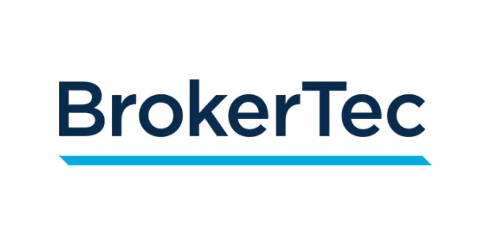

## Table of Contents

## What is the BrokerTec Trading Platform?

The BrokerTec Trading Platform is a system used for trading bonds and other fixed income securities. It helps banks, dealers, and other financial institutions buy and sell these securities easily and quickly. The platform is electronic, which means it uses computers and the internet to connect buyers and sellers from all over the world.

BrokerTec was started in 1999 and has become a very important part of the global bond market. It is owned by CME Group, a big company that runs many trading platforms. BrokerTec makes trading faster and more efficient by using technology to match buyers and sellers, and it also helps to keep the market fair and transparent.

## Who owns and operates BrokerTec?

BrokerTec is owned and operated by CME Group. CME Group is a big company that runs many different trading platforms.

CME Group bought BrokerTec to help people trade bonds and other fixed income securities more easily. They use technology to make trading fast and fair for everyone.

## What types of financial instruments can be traded on BrokerTec?

BrokerTec is mainly used for trading bonds. Bonds are like IOUs that governments or companies give to people who lend them money. On BrokerTec, you can trade different kinds of bonds, like U.S. Treasury bonds, which are issued by the U.S. government, and European government bonds, which are issued by countries in Europe.

Besides bonds, BrokerTec also lets you trade other fixed income securities. Fixed income securities are investments that pay a steady amount of interest over time. This can include things like mortgage-backed securities, which are based on home loans, and repurchase agreements, which are short-term loans between banks.

BrokerTec helps make trading these financial instruments easier and faster. It connects buyers and sellers from all over the world using computers and the internet. This makes the market more efficient and helps keep things fair for everyone involved.

## How does BrokerTec ensure the security and integrity of trades?

BrokerTec works hard to keep trades safe and fair. They use strong computer security to protect the information about trades. Only people who are supposed to see this information can access it. They also watch the trading activity all the time to make sure no one is doing anything wrong. If they see something suspicious, they can stop it quickly.

BrokerTec also has rules that everyone must follow when they trade. These rules help make sure that all trades are done honestly and fairly. If someone breaks the rules, BrokerTec can take action against them. This helps keep the market a safe place for everyone to trade bonds and other fixed income securities.

## What are the basic steps to start trading on BrokerTec?

To start trading on BrokerTec, you first need to sign up with a firm that uses the platform. This could be a bank, a broker-dealer, or another financial institution that is already connected to BrokerTec. Once you are part of such a firm, they will help you get set up on the platform. You'll need to fill out some forms and provide information about yourself to meet the rules and regulations.

After you're set up, you can start trading. You'll use a computer to log into the BrokerTec system. There, you can see what bonds and other fixed income securities are available to buy or sell. You can place your orders through the platform, and BrokerTec will match you with other traders. The whole process is done electronically, making it quick and easy to trade.

## What are the fees associated with using BrokerTec?

Using BrokerTec comes with some fees. There are transaction fees, which are small charges for each trade you make. These fees help pay for the cost of running the platform. The exact amount of the transaction fee can change depending on what you are trading and how much you are trading. Your firm might also charge you extra fees for using their services to access BrokerTec.

Besides transaction fees, there can be other costs too. For example, there might be fees for data services, which give you information about what is happening in the market. These fees help you make better trading decisions. It's important to talk to your firm to understand all the fees you might have to pay when you use BrokerTec.

## How does BrokerTec's trading technology work?

BrokerTec's trading technology is like a big computer system that helps people buy and sell bonds and other fixed income securities. It connects traders from all over the world through the internet. When someone wants to buy or sell something, they enter their order into the system. BrokerTec's computers quickly look at all the orders from other traders and try to match them up. If there's a match, the trade happens right away. This makes trading fast and easy.

The technology also keeps everything safe and fair. It uses special security measures to protect the information about trades. Only people who are supposed to see this information can access it. BrokerTec's computers also watch all the trading to make sure no one is cheating. If they see anything suspicious, they can stop it quickly. This helps keep the market a trustworthy place for everyone to trade.

## Can you explain the different trading protocols available on BrokerTec?

BrokerTec uses different ways, or protocols, to help traders buy and sell bonds and other fixed income securities. One common protocol is called the Central Limit Order Book (CLOB). In this system, traders can see all the buy and sell orders from other traders. When someone places an order, the system matches it with the best available order from the other side. This makes trading fair because everyone can see the same information and the trades happen quickly.

Another protocol used by BrokerTec is the Request for Quote (RFQ) system. With RFQ, a trader who wants to buy or sell can ask for price quotes from other traders. Once they get these quotes, they can choose the best one to make a trade. This system is helpful when someone wants to trade a large amount or a less common security because it lets them find the best price before making a trade. Both protocols help make trading on BrokerTec efficient and fair for everyone involved.

## What advanced features does BrokerTec offer to professional traders?

BrokerTec offers several advanced features that help professional traders do their job better. One important feature is the ability to use algorithms for trading. These are special computer programs that can automatically buy or sell securities based on certain rules. This helps traders make quick decisions and take advantage of market opportunities without having to watch the market all the time. Another feature is real-time data and analytics. Traders can see up-to-date information about what's happening in the market, which helps them make smart trading choices.

BrokerTec also has a feature called 'straight-through processing' (STP). This means that once a trade is made, it goes through all the steps needed to finish it without any delays. This makes the whole trading process faster and more efficient. Additionally, BrokerTec offers tools for risk management. These tools help traders keep track of their trades and make sure they are not taking too much risk. All these features together make BrokerTec a powerful platform for professional traders.

## How does BrokerTec integrate with other financial systems and platforms?

BrokerTec works well with other financial systems and platforms to make trading easier for its users. It connects with other trading platforms so that traders can see and use information from different places all in one spot. This helps them make better trading decisions because they have more information. BrokerTec also links up with systems that handle clearing and settlement. This means that after a trade is made, it can be processed quickly and smoothly without the trader having to do extra work.

Additionally, BrokerTec can connect with the systems that firms use to manage their trades and risks. This integration makes it easier for firms to keep track of all their trades and make sure they are following the rules. By working well with other systems, BrokerTec helps make the whole trading process faster, safer, and more efficient for everyone involved.

## What kind of market data and analytics does BrokerTec provide?

BrokerTec gives traders a lot of helpful information about the market. They provide real-time data, which means you can see what's happening in the market right now. This includes prices of bonds and other fixed income securities, how many trades are happening, and how much is being traded. This real-time data helps traders make quick decisions based on the latest information. BrokerTec also offers historical data, which shows what happened in the market in the past. This can help traders understand patterns and trends, which can be useful for planning future trades.

In addition to real-time and historical data, BrokerTec provides analytics. These are special tools that help traders understand the data better. For example, they can show you how prices have changed over time or how different securities are related to each other. Analytics can also help traders see how much risk they are taking and suggest ways to manage it. By using these tools, traders can make smarter decisions and improve their trading strategies.

## How has BrokerTec evolved its services to meet changing market demands?

BrokerTec has changed a lot over the years to keep up with what the market needs. When it started, it was mainly for trading U.S. Treasury bonds. But as time went on, they added more types of bonds and fixed income securities. They also made their technology better to handle more trades faster and to keep everything safe and fair. BrokerTec listened to what traders wanted and added new tools like algorithms and real-time data to help them make better trading decisions.

Another big change is how BrokerTec works with other systems. They made it easier for their platform to connect with other trading platforms and systems that handle clearing and settlement. This makes the whole trading process smoother and faster. BrokerTec also added more ways to trade, like the Request for Quote system, so traders can find the best prices for big trades or less common securities. By making these changes, BrokerTec keeps meeting the needs of traders and stays an important part of the bond market.

## References & Further Reading

[1]: Esser, A., Hallen, H., & Tepper, P. (2018). ["CME Group's Acquisition of NEX Group Plc: Strategic Growth and Integration."](https://www.compasslexecon.com/cases/cme-group-inc-completes-acquisition-of-nex-group-plc/)

[2]: Narang, R. K. (2013). ["Inside the Black Box: A Simple Guide to Quantitative and High-Frequency Trading"](https://onlinelibrary.wiley.com/doi/book/10.1002/9781118662717). Wiley Trading.

[3]: Hasbrouck, J. (2007). ["Empirical Market Microstructure: The Institutions, Economics, and Econometrics of Securities Trading"](https://academic.oup.com/book/52241). Oxford University Press.

[4]: Aldridge, I. (2013). ["High-Frequency Trading: A Practical Guide to Algorithmic Strategies and Trading Systems"](https://www.amazon.com/High-Frequency-Trading-Practical-Algorithmic-Strategies/dp/1118343506). Wiley Finance.

[5]: Hull, J. C. (2017). ["Options, Futures, and Other Derivatives"](https://www.pearson.com/en-us/subject-catalog/p/options-futures-and-other-derivatives/P200000005938/9780136939917). Pearson. 

[6]: Papageorgiou, N. A., Reeves, J. J., & Wang, H. (2018). ["Algorithmic Trading: A Literature Review."](https://www.semanticscholar.org/paper/Betas-and-the-Myth-of-Market-Neutrality-Papageorgiou-Reeves/c0077968cca3fe5751f02b4337a77b8e4d93e98c) Journal of Financial Research, 41(4), 357-384.

[7]: Hasbrouck, J., & Saar, G. (2013). ["Low-latency Trading."](https://www.sciencedirect.com/science/article/abs/pii/S1386418113000165) The Journal of Finance, 68(2), 627-658.