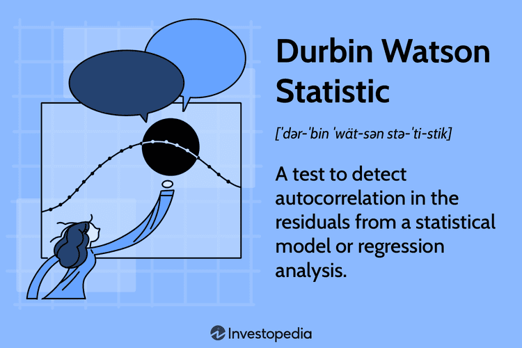

## Table of Contents

## What is the Brown-Durbin-Evans CUSUM test?

The Brown-Durbin-Evans CUSUM test is a statistical method used to check if a set of data is stable over time. It's especially useful for spotting changes or shifts in the data. The test works by looking at the cumulative sum (CUSUM) of the differences between the data points and their expected values. If the data is stable, the CUSUM should stay around zero. But if there's a change in the data, the CUSUM will start to move away from zero, signaling that something has changed.

This test is often used in quality control and econometrics to monitor processes and detect any unusual changes. For example, in a factory, it can help spot if a machine starts producing items that are different from what they should be. The test is named after the researchers who developed it: Brown, Durbin, and Evans. It's a powerful tool because it can pick up subtle changes that other methods might miss, making it valuable for keeping processes under control and ensuring data reliability.

## Why is the Brown-Durbin-Evans CUSUM test used in statistical analysis?

The Brown-Durbin-Evans CUSUM test is used in statistical analysis to check if data stays the same over time or if it changes. It's really helpful because it can spot small changes that other tests might not see. This test looks at the difference between what the data actually is and what it's supposed to be. If these differences add up over time and start to move away from zero, it means something in the data has changed. This can be important for keeping things like factory processes or economic data in check.

In fields like quality control and econometrics, the Brown-Durbin-Evans CUSUM test is a big help. For example, in a factory, it can tell if a machine starts making products that are different from what they should be. This early warning can stop problems before they get too big. In economics, it can show if something like a country's unemployment rate is starting to change in a way that wasn't expected. By using this test, people can make sure their data is reliable and take action if they see something unusual happening.

## How does the Brown-Durbin-Evans CUSUM test differ from other CUSUM tests?

The Brown-Durbin-Evans CUSUM test is different from other CUSUM tests because it looks at how the data changes over time in a special way. While other CUSUM tests might focus on finding big changes quickly, the Brown-Durbin-Evans test is good at spotting even small shifts. It does this by looking at the cumulative sum of the differences between the actual data and what we expect the data to be. If these differences start to move away from zero, it means something in the data has changed.

Another way the Brown-Durbin-Evans CUSUM test stands out is how it handles the data. It uses a method called recursive residuals, which means it keeps updating its calculations as new data comes in. This makes it very good at keeping an eye on things that are supposed to stay the same, like the quality of products in a factory or economic indicators. Other CUSUM tests might not update as smoothly or might be set up to look for different kinds of changes, making the Brown-Durbin-Evans test a unique tool for monitoring stability over time.

## What are the basic steps to perform the Brown-Durbin-Evans CUSUM test?

To perform the Brown-Durbin-Evans CUSUM test, start by collecting your data and figuring out what the expected values should be. These expected values are usually based on a model or past data. Next, calculate the difference between each data point and its expected value. These differences are called residuals. Then, you'll need to calculate something called recursive residuals. This means you keep updating your calculations as you go through the data, starting from the beginning and moving forward.

After you have your recursive residuals, you can start building the CUSUM. This is done by adding up the recursive residuals one by one. If the data is stable and nothing has changed, this sum should stay close to zero. But if there's a change in the data, the CUSUM will start to move away from zero. You can then plot this CUSUM on a graph to see if it stays close to zero or if it starts to drift. If it drifts too far from zero, it's a sign that something in your data has changed.

To decide if the change is significant, you can use something called decision intervals. These are lines on your graph that show how far the CUSUM can move before you say there's a real change. If the CUSUM crosses these lines, it means the change is big enough to matter. This way, the Brown-Durbin-Evans CUSUM test helps you keep an eye on your data and spot any unusual changes early on.

## What types of data are suitable for the Brown-Durbin-Evans CUSUM test?

The Brown-Durbin-Evans CUSUM test works well with data that comes in over time, like measurements or observations taken at regular intervals. This could be things like daily sales numbers, monthly unemployment rates, or hourly temperatures. The test is good at spotting changes in these kinds of data, especially if the changes are small and happen slowly. It's important that the data follows some kind of pattern or model that you can predict, so you can compare what's happening now to what you expect to happen.

You can use the Brown-Durbin-Evans CUSUM test in many different fields. For example, in a factory, you might use it to check if the machines are making products the same way over time. In economics, it can help you see if things like inflation or employment rates are changing unexpectedly. As long as you have data that you can collect regularly and that should stay stable, the Brown-Durbin-Evans CUSUM test can help you keep an eye on it and spot any changes early.

## How do you interpret the results of the Brown-Durbin-Evans CUSUM test?

When you do the Brown-Durbin-Evans CUSUM test, you look at a graph that shows a line called the CUSUM. This line should stay close to zero if everything is normal and nothing has changed in your data. If the line starts to move away from zero, it means something in your data has changed. You can tell if this change is important by looking at decision intervals, which are lines on the graph. If the CUSUM line crosses these decision intervals, it's a sign that the change is big enough to matter.

The test is good at finding small changes that happen slowly over time. If the CUSUM line stays between the decision intervals, it means your data is still stable and you don't need to worry. But if the line goes outside these intervals, it's a warning that something might be wrong. You might need to check your data or the process that's producing it to see what's changed and fix any problems before they get worse.

## What are the common applications of the Brown-Durbin-Evans CUSUM test in different fields?

The Brown-Durbin-Evans CUSUM test is used in many different areas to keep an eye on things that should stay the same over time. In factories, it helps make sure machines keep making products the right way. If a machine starts making items that are different, the test can spot this change early. This way, workers can fix the problem before it gets worse and causes more bad products. The test is really good at catching small changes that might be missed by other methods, so it's a big help in keeping the quality of products high.

In the world of economics, the Brown-Durbin-Evans CUSUM test is used to watch things like unemployment rates or inflation. If these numbers start to change in a way that wasn't expected, the test can show this. Economists can then look into why the change happened and maybe do something to help. The test is also useful in healthcare, where it can keep track of patient data to see if treatments are working the way they should. If the data starts to change, doctors can adjust the treatment to make sure patients get better care.

## What are the limitations of the Brown-Durbin-Evans CUSUM test?

The Brown-Durbin-Evans CUSUM test is great at spotting small changes in data over time, but it does have some limits. One big problem is that it can be tricky to set up and understand. You need to know a lot about [statistics](/wiki/bayesian-statistics) to use it right, and if you don't, you might not set it up correctly. This can lead to wrong results, where you think something has changed when it hasn't, or you miss a real change.

Another issue is that the test can be slow to pick up big changes that happen suddenly. It's designed to find small changes that happen slowly, so if something big happens quickly, the test might not notice it right away. This can be a problem if you need to know about big changes fast. Also, the test works best with data that follows a clear pattern or model. If your data is all over the place and hard to predict, the test might not work well.

## How can the Brown-Durbin-Evans CUSUM test be implemented using statistical software?

To use the Brown-Durbin-Evans CUSUM test with statistical software, you first need to pick a program that can do this kind of test. Programs like R or Python are good choices because they have special tools and packages that can help you. In R, you might use the "strucchange" package, which has functions for the CUSUM test. In Python, you could use libraries like "statsmodels" or write your own code to do the test. Once you have your software set up, you'll need to enter your data into the program. This could be data from a factory, like the size of products, or economic data, like unemployment rates.

After you have your data in the software, you can run the Brown-Durbin-Evans CUSUM test. This means telling the software to calculate the recursive residuals and then build the CUSUM line. The software will do all the math for you and show you a graph of the CUSUM line. If the line stays close to zero, it means your data is stable. But if it moves away from zero and crosses the decision intervals, it's a sign that something has changed. You can then use the results to decide if you need to take action, like fixing a machine in a factory or looking into why economic numbers are changing.

## What are some advanced techniques for enhancing the accuracy of the Brown-Durbin-Evans CUSUM test?

To make the Brown-Durbin-Evans CUSUM test more accurate, you can use something called bootstrapping. This means you take your data and make lots of new sets of data that are similar to it. Then, you run the CUSUM test on all these new sets. By doing this, you can see how often the test finds a change when there isn't one, or misses a change when there is one. This helps you understand if the test is working well with your data, and you can adjust it to be more accurate.

Another way to improve the test is by using different models to predict what your data should be. If you use a better model, the test can spot changes more easily. For example, if you're watching factory data, you might use a model that takes into account things like the time of day or the type of material being used. By choosing a model that fits your data well, you can make the CUSUM test more sensitive to real changes and less likely to be fooled by normal ups and downs.

## How does the Brown-Durbin-Evans CUSUM test handle non-stationary data?

The Brown-Durbin-Evans CUSUM test works best with data that follows a clear pattern or stays the same over time. But if your data is non-stationary, which means it changes in ways that are hard to predict, the test can have a harder time. Non-stationary data might go up and down a lot or change its pattern over time. When this happens, the test might think there's a change when there isn't one, or it might miss real changes because the data is always moving around.

To handle non-stationary data better, you might need to do something called data transformation before using the Brown-Durbin-Evans CUSUM test. This means changing your data in a way that makes it more stable and easier to predict. For example, you could take the difference between each data point and the one before it, which can help remove trends or seasonal patterns. Once your data is more stable, the CUSUM test can work better and be more accurate at spotting real changes.

## What recent research has been conducted on the Brown-Durbin-Evans CUSUM test and its applications?

Recent research on the Brown-Durbin-Evans CUSUM test has focused on improving its accuracy and expanding its applications. One study looked at using the test in healthcare to monitor patient outcomes over time. Researchers found that by tweaking the test to account for different patient groups, it could better spot changes in treatment effectiveness. Another piece of research explored how the test could be used in finance to detect changes in stock market trends. By combining the CUSUM test with [machine learning](/wiki/machine-learning), researchers were able to improve its ability to pick up on subtle shifts in market behavior, which could help investors make better decisions.

In the field of environmental science, a recent study used the Brown-Durbin-Evans CUSUM test to track changes in air quality data. The researchers found that the test was good at spotting gradual changes in pollution levels, which could help in making timely interventions to improve air quality. Additionally, there has been work on using the test in manufacturing to enhance quality control processes. By integrating the test with real-time data analysis, factories could quickly identify and correct issues in production lines, leading to fewer defects and higher product quality. These studies show how versatile and valuable the Brown-Durbin-Evans CUSUM test can be across different fields.

## What is the Understanding of the Brown-Durbin-Evans CUSUM Test?

The Brown-Durbin-Evans CUSUM (Cumulative Sum) test is a statistical method employed in econometrics to analyze the stability of regression models over time. This sequential analysis technique observes the cumulative sum of the residuals, which are the differences between observed and predicted values in a model. By evaluating these sums, the test helps identify any significant shifts in the coefficients of the regression model.

The essence of the CUSUM test lies in its ability to provide a visual and quantitative assessment of model stability. The residuals are systematically accumulated, and plotted against time. If the cumulative sum stays within certain boundaries, the model is considered to be stable. However, crossing these boundaries indicates that there has been a change in the regression coefficients, suggesting a structural alteration in the underlying model.

Mathematically, the CUSUM statistic is calculated using the formula:

$$

CUSUM(t) = \frac{1}{\sigma} \sum_{i=1}^t e_i
$$

where $e_i$ are the residuals, and $\sigma$ is the standard deviation of the residuals. The test involves plotting this statistic over time to check for every deviation from zero, which acts as the null hypothesis indicating model stability.

The Brown-Durbin-Evans CUSUM test is notably efficient in detecting gradual shifts that more traditional static tests might overlook. While conventional methods primarily assess the model based on a fixed point in time, the CUSUM test continually monitors the data, offering a more dynamic approach to model validation.

Initially devised to monitor the stability of economic models, the CUSUM test provides insights that are not only applicable to econometrics but also find valuable application in [algorithmic trading](/wiki/algorithmic-trading). In this context, traders can use the test to ensure that their predictive models and strategies remain consistent with evolving market conditions, thus enhancing their ability to adapt and maintain profitability.

## What are the applications in algorithmic trading?

Algorithmic trading relies heavily on sophisticated models that must adapt efficiently to fluctuating market conditions to sustain profitability. The Brown-Durbin-Evans CUSUM test is a valuable statistical tool that ensures these trading models' robustness by monitoring their stability over time.

In the dynamic environment of financial markets, where structural shifts can happen unexpectedly, it is crucial for traders to have mechanisms in place that alert them to any instability in their trading algorithms. The Brown-Durbin-Evans CUSUM test serves this purpose by providing continuous monitoring of the model's residuals, which are the differences between observed and predicted values. By evaluating the cumulative sum of these residuals, the test can detect gradual shifts that might otherwise go unnoticed with traditional static tests.

Mathematically, the CUSUM test focuses on the cumulative sum of the recursive residuals $W_t$, defined as:

$$
W_t = \sum_{i=1}^{t} e_i,
$$

where $e_i$ are the recursive residuals computed from the regression model up to time $t$. Significant deviations in $W_t$ away from zero indicate potential instability in the model's coefficients. By identifying these deviations early, traders can systematically pinpoint any structural breakdowns in their strategies.

For algorithmic traders, this method allows for proactive adjustments to their models. By integrating the CUSUM test, traders can set threshold levels for $W_t$ that, when exceeded, trigger further investigation or the implementation of corrective measures. This systematic surveillance ensures that the algorithms remain aligned with current market dynamics, directly contributing to sustained profitability. 

By utilizing the Brown-Durbin-Evans CUSUM test, traders can make informed, timely decisions to adapt their strategies, maintaining optimal performance amidst unpredictable market changes.

## What are the implementation steps?

To implement the Brown-Durbin-Evans CUSUM test in algorithmic trading, one must follow a systematic approach. The initial step involves developing a regression model that reflects the trading strategy. This model should be tailored to account for relevant market variables and indicators that influence trading decisions. Once the model is established, the CUSUM test is applied specifically to the residuals of the regression model. 

The calculation of residuals involves determining the difference between observed market values and those predicted by the regression model:

$$
\text{Residual} = Y_{\text{observed}} - Y_{\text{predicted}}
$$

where $Y_{\text{observed}}$ is the actual market price or value of an asset, and $Y_{\text{predicted}}$ is the price or value forecasted by the regression model.

Applying the CUSUM test allows for continuous monitoring of the model's residuals. The test focuses on identifying deviations from expected patterns, which might indicate a change in the underlying relationships captured by the model. This is achieved by calculating the cumulative sum of the residuals:

$$
CUSUM_t = \sum_{i=1}^{t} e_i
$$

where $e_i$ represents the individual residuals at time $i$, and $CUSUM_t$ is the cumulative sum up to time $t$.

Achieving significant deviations in CUSUM values can suggest instability in the model. For example, unexpected shifts in CUSUM outside of predefined control limits may necessitate model reevaluation. These limits are typically based on statistical thresholds, such as standard deviations, to signal potential structural changes.

Upon detecting any significant deviations, analyze the results to identify whether these are due to temporary noise or indicative of a lasting structural change. If a structural change is confirmed, the trading model may require adjustments to incorporate new market behavior, ensuring it remains effective.

Finally, integrate these insights back into the trading system. This integration process might involve updating model parameters, incorporating additional market indicators, or reformulating the trading strategy entirely. By doing so, traders ensure that their algorithmic systems maintain responsiveness to evolving market conditions, preserving overall trading efficacy. 

In practical terms, using Python for this implementation may involve libraries such as `numpy` for numerical operations and custom scripts to automate the monitoring of residuals and the application of the CUSUM test.

## References & Further Reading

[1]: Brown, R. L., Durbin, J., & Evans, J. M. (1975). ["Techniques for Testing the Constancy of Regression Relationships Over Time."](https://www.jstor.org/stable/2984889) Journal of the Royal Statistical Society: Series B (Methodological), 37(2), 149-192.

[2]: Bollerslev, T., Chou, R. Y., & Kroner, K. F. (1992). ["ARCH Modeling in Finance: A Review of the Theory and Empirical Evidence."](https://www.sciencedirect.com/science/article/pii/030440769290064X) Journal of Econometrics, 52(1-2), 5-59.

[3]: ["Econometric Analysis"](https://en.wikipedia.org/wiki/Econometrics) by William H. Greene

[4]: ["Econometric Models and Economic Forecasts"](https://www.semanticscholar.org/paper/Econometric-models-and-economic-forecasts-Pindyck-Rubinfeld/d6173a39c3681d7035d9d8d772d03476417bea7e) by Robert S. Pindyck and Daniel L. Rubinfeld

[5]: ["The Econometric Analysis of Time Series"](https://mitpress.mit.edu/9780262081894/the-econometric-analysis-of-time-series/) by Andrew C. Harvey