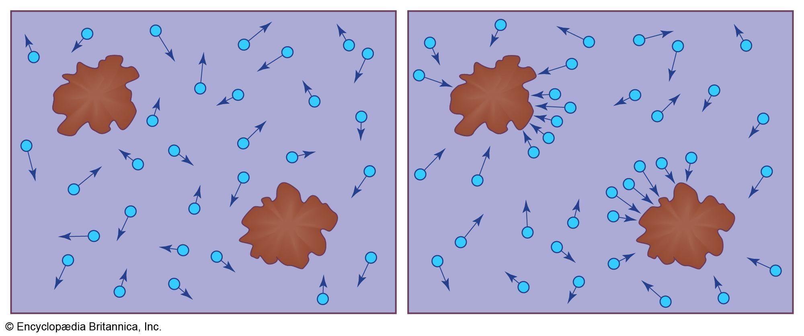

## Table of Contents

## What is Brownian motion?

Brownian motion is the random movement of tiny particles suspended in a fluid, like water or air. It happens because the particles are constantly being bumped by the fast-moving molecules of the fluid around them. This was first observed by a botanist named Robert Brown in 1827 when he saw pollen grains moving randomly in water.

This type of motion is important because it helps us understand how things move at a very small scale. It's used in many fields, like physics and chemistry, to study how particles behave in different conditions. For example, it can show us how quickly a substance will spread out in a liquid or how heat moves through a material.

## Who discovered Brownian motion and when?

Brownian motion was discovered by a scientist named Robert Brown in the year 1827. He was a botanist, which means he studied plants. One day, while looking through a microscope, he saw tiny pollen grains moving around in water in a random way. This surprised him because he thought the grains should stay still.

At first, Robert Brown thought that the movement might be because the pollen grains were alive. But after more experiments with different tiny particles, he realized that the movement happened with all small particles, not just living ones. This led him to conclude that the random movement was caused by the water molecules hitting the particles. This discovery is now called Brownian motion, named after Robert Brown.

## What causes Brownian motion?

Brownian motion happens because tiny particles in a liquid or gas are constantly being bumped by the fast-moving molecules around them. Imagine a tiny dust speck floating in water. The water is made up of lots of tiny water molecules that are moving very quickly. These water molecules keep hitting the dust speck from all different directions. Because the hits are random, the dust speck moves around in a random way too.

This random movement is called Brownian motion. It's not just dust specks that do this; any small particle in a liquid or gas will move this way. The reason it's important is that it shows us how things behave at a very small level. Scientists use Brownian motion to understand things like how quickly a substance will spread out in a liquid or how heat moves through a material.

## How does Brownian motion relate to temperature?

Brownian motion is affected by temperature. When the temperature of a liquid or gas goes up, the molecules inside it move faster. This means they bump into the tiny particles more often and with more energy. As a result, the particles that are doing the Brownian motion move around more quickly and in a more lively way.

This relationship between temperature and Brownian motion is important because it helps scientists understand how things behave at different temperatures. For example, if you heat up a liquid, the particles inside it will move faster, which can make things like mixing or spreading out happen more quickly. So, by studying how temperature changes affect Brownian motion, scientists can learn a lot about how materials work in different conditions.

## What are some common examples of Brownian motion?

One common example of Brownian motion is when you see dust particles floating in a beam of sunlight. If you look closely, you'll notice that the dust particles don't stay still; they move around in a random way. This happens because the air molecules around them are moving fast and keep bumping into the dust particles, making them jiggle and dance.

Another example is when you put a drop of food coloring into a glass of water. At first, the color stays in one spot, but soon it starts to spread out. This spreading happens because the tiny particles of the food coloring are moving around due to Brownian motion. The water molecules are bumping into the color particles, making them move and mix with the water until the whole glass turns color.

## How is Brownian motion observed and measured?

To observe Brownian motion, scientists use microscopes. They look at tiny particles, like pollen grains or dust, that are floating in a liquid, usually water. By watching these particles through the microscope, scientists can see them moving around in a random way. This movement is what we call Brownian motion. It looks like the particles are dancing or jiggling because the water molecules are constantly bumping into them.

To measure Brownian motion, scientists track the movement of these tiny particles over time. They use special equipment that can record the position of a particle at different moments. By analyzing how far and how fast the particle moves, scientists can figure out how strong the Brownian motion is. This helps them understand things like how temperature affects the motion or how quickly substances mix in a liquid.

## What is the mathematical model of Brownian motion?

The mathematical model of Brownian motion is called the Wiener process, named after the mathematician Norbert Wiener. This model describes how a particle moves randomly over time. Imagine you're watching a tiny particle in water through a microscope. The Wiener process says that the position of this particle at any moment is a random variable. The change in the particle's position from one moment to the next is also random, but these changes are independent of each other. This means that knowing where the particle was a second ago doesn't help you predict where it will be a second from now.

In simple terms, the Wiener process can be thought of as a series of tiny, random steps. If you add up all these steps over time, you get the path that the particle takes. This path is very wiggly and unpredictable because each step is random. The mathematical formula for this process involves something called a normal distribution, which helps describe how likely it is for the particle to move a certain distance in a certain time. This model is really useful because it helps scientists predict and understand the behavior of particles in different situations, like how quickly a substance will spread out in a liquid.

## How does Brownian motion affect particles in different mediums?

Brownian motion happens when tiny particles move around randomly in a liquid or gas. The way these particles move depends on the medium they are in. In a liquid like water, the particles move slower because the water molecules are heavier and don't move as fast as gas molecules. This means that the tiny particles get bumped less often and with less force, so their movement is slower and more gentle. On the other hand, in a gas like air, the molecules move very fast and bump into the tiny particles more often and with more energy. This makes the particles move around more quickly and in a more lively way.

The type of medium also affects how far the particles can move. In a thick liquid, like syrup, the particles have a harder time moving because the liquid is more resistant. This means that the Brownian motion in a thick liquid is slower and the particles don't move as far as they would in a thinner liquid like water. In a gas, the particles can move more freely because there's less resistance, so they can cover more distance in the same amount of time. Understanding how Brownian motion works in different mediums helps scientists figure out things like how quickly a substance will spread out or how heat moves through different materials.

## What is the significance of Brownian motion in statistical mechanics?

Brownian motion is really important in statistical mechanics because it helps us understand how tiny particles move and behave. Statistical mechanics is all about studying large groups of particles and figuring out how they act together. When we look at Brownian motion, we see that it's caused by the random movements of the molecules in a liquid or gas. This randomness is a key idea in statistical mechanics, where we use probability to predict how particles will move. By studying Brownian motion, scientists can learn a lot about the behavior of particles at a very small scale, which helps them understand bigger things like how heat moves through materials or how substances mix together.

Another way Brownian motion is important in statistical mechanics is that it shows us how things can reach a state called equilibrium. Equilibrium is when everything balances out and stops changing. When tiny particles move around randomly because of Brownian motion, they eventually spread out evenly in the liquid or gas they're in. This spreading out is a good example of how systems can reach equilibrium over time. By understanding this process, scientists can better predict how different systems will behave and how long it will take for them to reach a balanced state. This is useful in many fields, like chemistry and physics, where understanding how particles move and mix is really important.

## How is Brownian motion used in financial mathematics?

In financial mathematics, Brownian motion is used to model how prices of stocks and other financial assets move over time. Imagine you're watching the price of a stock on a chart. It doesn't move in a straight line; it goes up and down in a random way. This random movement is a lot like Brownian motion. Financial experts use a mathematical model called geometric Brownian motion to predict how these prices might change. This helps them figure out things like how risky an investment might be or what the chances are that a stock price will go up or down.

This model is really useful for something called option pricing. An option is like a bet on whether a stock price will go up or down. By using the idea of Brownian motion, experts can calculate the value of these options. They can figure out how much someone should pay for an option based on how likely it is that the stock price will move in a certain way. This makes the whole process of buying and selling options more predictable and helps investors make smarter choices.

## What are the applications of Brownian motion in biology and chemistry?

In biology, Brownian motion helps scientists understand how tiny things inside cells move around. Cells are like tiny factories, and they have a lot of small parts that need to get from one place to another. Brownian motion helps these parts move around randomly until they bump into where they need to go. This is really important for things like how proteins move inside a cell or how nutrients get spread out. By studying this, scientists can learn more about how cells work and how to fix them when they're not working right.

In chemistry, Brownian motion is used to study how substances mix together. When you drop food coloring into water, it spreads out because of Brownian motion. Scientists use this to understand how quickly different substances will mix in different liquids. This is important for things like making medicines or figuring out how pollution spreads in water. By knowing how Brownian motion works, chemists can predict and control how different substances will behave when they're mixed together.

## What advanced techniques are used to study Brownian motion at the nanoscale?

To study Brownian motion at the nanoscale, scientists use special tools like atomic force microscopes (AFM) and optical tweezers. An atomic force microscope is like a super tiny needle that can feel the bumps and movements of tiny particles. It's so sensitive that it can detect the random jiggling of a single nanoparticle. Optical tweezers use a focused laser beam to hold and move tiny particles. By watching how these particles move around when they're held by the laser, scientists can see Brownian motion up close and measure it very accurately.

These techniques help scientists learn a lot about how tiny things behave. For example, they can see how the size and shape of a nanoparticle affect its movement. They can also study how different liquids or temperatures change the way particles move. By understanding these tiny movements, scientists can make better predictions about how things will behave in the real world. This is important for making new materials, medicines, and even tiny machines that work at the nanoscale.

## What is Geometric Brownian Motion and how can it be understood?

Geometric Brownian Motion (GBM) is a prominent stochastic process used extensively in financial modeling to simulate the dynamics of stock prices. It is defined mathematically by its inherent characteristics: a constant drift and a constant [volatility](/wiki/volatility-trading-strategies). These parameters facilitate the modeling of stock prices in a stochastic framework, attempting to mirror the unpredictable yet patterned nature of market movements.

The mathematical foundation of GBM is encapsulated in its stochastic differential equation (SDE):

$$
dS_t = \mu S_t \, dt + \sigma S_t \, dW_t
$$

where $S_t$ represents the stock price at time $t$, $\mu$ denotes the drift coefficient, $\sigma$ is the volatility, and $W_t$ is a Wiener process or standard Brownian motion. The equation describes how the instantaneous change in stock price $dS_t$ is influenced by both deterministic trends (expressed by $\mu S_t \, dt$) and random shocks (captured by $\sigma S_t \, dW_t$). This dual-component representation allows GBM to capture continuous time and random price fluctuations efficiently.

Despite its effectiveness in modeling price dynamics, GBM operates under several assumptions that introduce certain limitations. One of the primary assumptions is that both drift ($\mu$) and volatility ($\sigma$) remain constant over time. Real-world markets often experience fluctuations in these parameters, leading to scenarios where the GBM model may provide oversimplified or inaccurate predictions. 

Another critical assumption is the presumption of normally distributed logarithmic returns. This implies that price changes at any given time interval come from a normal distribution, leading to log-normal [dispersion](/wiki/dispersion-trading) of price levels. In practice, financial returns often exhibit characteristics like fat tails and skewness, challenging the adequacy of normal distribution assumptions in capturing market behavior accurately.

Careful consideration of these assumptions is necessary, particularly when applying GBM in environments that deviate significantly from its idealized conditions. By understanding and, when necessary, adjusting the model's parameters or integrating additional stochastic elements, practitioners can better align GBM with real-market observations for more robust financial analysis and strategy development.

## How can you implement Geometric Brownian Motion in Python?

To implement Geometric Brownian Motion (GBM) in Python, it is essential to first establish a suitable environment equipped with critical libraries such as NumPy, pandas, and Matplotlib. These libraries provide the necessary tools for numerical computation, data manipulation, and visualization, respectively.

### Setting Up the Environment

Begin by installing the required libraries if they are not already available in your environment:

```bash
pip install numpy pandas matplotlib
```

### Simulating Geometric Brownian Motion

The fundamental idea behind GBM is the modeling of a stock price path as a continuous-time stochastic process. The differential equation describing GBM is:

$$
dS_t = \mu S_t dt + \sigma S_t dW_t
$$

where:
- $S_t$ is the stock price at time $t$,
- $\mu$ is the drift coefficient,
- $\sigma$ is the volatility coefficient,
- $dW_t$ is a Wiener process (or Brownian motion).

The solution to this stochastic differential equation allows us to express the stock price at a future time $T$ as:

$$
S_T = S_0 \exp\left((\mu - \frac{1}{2}\sigma^2) T + \sigma W_T\right)
$$

This equation can be implemented in Python to simulate potential future paths of stock prices:

```python
import numpy as np
import pandas as pd
import matplotlib.pyplot as plt

# Parameters
S0 = 100        # Initial stock price
mu = 0.1        # Drift term
sigma = 0.2     # Volatility term
T = 1.0         # Time in years
dt = 0.01       # Time step
N = int(T/dt)   # Number of steps
num_simulations = 10  # Number of simulation paths

# Time array
t = np.linspace(0, T, N)

# Simulate GBM paths
def simulate_gbm_paths(S0, mu, sigma, T, dt, num_simulations):
    paths = np.zeros((num_simulations, N))
    for i in range(num_simulations):
        Wt = np.random.normal(0, np.sqrt(dt), size=N)
        Wt = np.cumsum(Wt)  # Cumulative sum to simulate Brownian motion
        paths[i] = S0 * np.exp((mu - 0.5 * sigma**2) * t + sigma * Wt)
    return paths

# Generate and plot the paths
simulated_paths = simulate_gbm_paths(S0, mu, sigma, T, dt, num_simulations)
for i in range(num_simulations):
    plt.plot(t, simulated_paths[i], lw=1.5)

plt.title('Simulated GBM Paths')
plt.xlabel('Time')
plt.ylabel('Stock Price')
plt.show()
```

### Verification Techniques

To verify the accuracy of the simulated GBM paths, it is crucial to compare their statistical properties with theoretical expectations. The expected mean and variance for log-transformed returns of stock prices in GBM can be calculated analytically:

- Expected mean: $\mathbb{E}[\log(S_T/S_0)] = (\mu - 0.5\sigma^2)T$
- Variance: $\text{Var}(\log(S_T/S_0)) = \sigma^2 T$

These theoretical values can be compared to the sample mean and variance of the simulated paths. Ensuring that these statistical properties align enhances confidence in the correctness and reliability of the GBM simulation.

## References & Further Reading

[1]: Hull, J. C. (2012). ["Options, Futures, and Other Derivatives"](https://www.semanticscholar.org/paper/Options%2C-Futures%2C-and-Other-Derivatives-Hull/89bdee500c8623864fc9eb7a471546aa713acc44). Pearson Education.

[2]: Shreve, S. E. (2004). ["Stochastic Calculus for Finance I: The Binomial Asset Pricing Model"](https://link.springer.com/book/10.1007/978-0-387-22527-2). Springer.

[3]: Shreve, S. E. (2004). ["Stochastic Calculus for Finance II: Continuous-Time Models"](https://link.springer.com/book/9780387401010). Springer.

[4]: Merton, R. C. (1976). ["Option Pricing when Underlying Stock Returns are Discontinuous."](https://www.sciencedirect.com/science/article/pii/0304405X76900222) Journal of Financial Economics, 3(1-2), 125-144.

[5]: Heston, S. L. (1993). ["A Closed-Form Solution for Options with Stochastic Volatility with Applications to Bond and Currency Options."](https://wwwf.imperial.ac.uk/~ajacquie/IC_Num_Methods/IC_Num_Methods_Docs/Literature/Heston.pdf) The Review of Financial Studies, 6(2), 327-343.

[6]: Jansen, S. (2018). ["Machine Learning for Algorithmic Trading: Predictive Models to Extract Signals from Market and Alternative Data for Systematic Trading Strategies with Python."](https://github.com/stefan-jansen/machine-learning-for-trading) Packt Publishing.

[7]: QuantConnect. (n.d.). ["Algorithmic Trading Platform"](https://www.quantconnect.com/). QuantConnect provides a collaborative environment for sharing algorithms and insights in quantitative finance.

[8]: Coursera. (n.d.). ["Courses on Financial Engineering and Risk Management"](https://www.coursera.org/courses?query=financial%20engineering). Coursera offers online courses covering topics in financial engineering, including Geometric Brownian Motion.