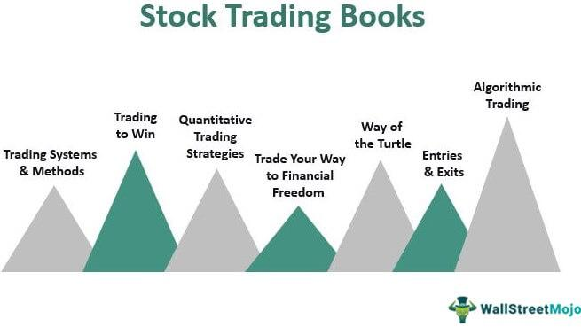

## Table of Contents

## Who is Bruce Kovner?

Bruce Kovner is a successful businessman and investor from the United States. He was born on November 17, 1945, in Brooklyn, New York. Kovner started his career in journalism but soon moved into the world of finance. He is best known for founding Caxton Associates, a hedge fund that manages billions of dollars. His smart investment choices helped him become one of the richest people in the world.

Kovner is also known for his philanthropy. He has donated a lot of money to different causes, especially in the areas of education and the arts. He helped start the Juilliard School's Kovner Fellowship Program, which supports young musicians. He also gives money to universities and other organizations that help people learn and grow. Through his giving, Kovner wants to make the world a better place.

## What is Bruce Kovner's background and education?

Bruce Kovner was born in Brooklyn, New York, on November 17, 1945. He grew up in a middle-class family and showed an early interest in music and learning. Kovner attended Harvard University, where he studied political economy. However, he left Harvard before finishing his degree because he was interested in other things. Later, he went back to school and finished his bachelor's degree at the John F. Kennedy School of Government at Harvard.

After college, Kovner started working as a journalist. He wrote for the New York Times and other newspapers. But he soon realized that he was more interested in business and finance. He decided to learn more about trading and investing. Kovner taught himself a lot about the markets and started making smart investments. This led him to start his own [hedge fund](/wiki/hedge-fund-trading-strategies), Caxton Associates, which became very successful.

## How did Bruce Kovner start his career in trading?

Bruce Kovner started his trading career by teaching himself about the markets. After working as a journalist, he got interested in finance. He read a lot of [books](/wiki/algo-trading-books) and learned how to trade commodities. One day, he heard about a big drop in the price of soybean meal. He thought it was a good chance to make some money. So, he borrowed $3,000 and bought soybean meal futures. It worked out well, and he made a big profit. This success gave him the confidence to keep trading.

From there, Kovner kept learning and getting better at trading. He started trading more types of commodities and then moved into currencies and other markets. He was good at understanding how different things in the economy were connected. This helped him make smart choices and earn more money. Eventually, he used his skills and knowledge to start his own hedge fund, Caxton Associates. It became very successful and made him one of the richest people in the world.

## What are some of the key trading strategies Bruce Kovner is known for?

Bruce Kovner is known for his smart and careful way of trading. He always tries to understand the big picture of the economy. He looks at many things like interest rates, how much countries are making and spending, and what people are thinking about the future. This helps him see where prices might go next. Kovner also uses something called "[trend following](/wiki/trend-following)." This means he watches the market to see which way prices are moving and then he tries to follow that trend. If prices are going up, he buys. If prices are going down, he sells. This helps him make money even when the market is not easy to predict.

Another important part of Kovner's strategy is managing risk. He never puts all his money into one trade. Instead, he spreads it out over many different trades. This way, if one trade does not go well, it does not hurt him too much. He also sets clear rules for when to get out of a trade. If a trade is not working, he will stop it before he loses too much money. This careful way of trading helps him keep his losses small and his wins big.

## Can you describe Bruce Kovner's approach to risk management?

Bruce Kovner's approach to risk management is all about being careful and smart with his money. He knows that trading can be risky, so he never puts all his eggs in one basket. Instead of betting everything on one trade, he spreads his money across many different trades. This way, if one trade goes bad, it won't hurt him too much because he has other trades that might do well.

He also sets clear rules for when to get out of a trade. If a trade is not going the way he thought it would, he will stop it before he loses too much money. This helps him keep his losses small. By being careful and following these rules, Kovner can keep his money safe and make sure he has more wins than losses over time.

## What major successes has Bruce Kovner achieved in his trading career?

Bruce Kovner had a lot of big wins in his trading career. He started with a small amount of money and made smart choices that helped him grow it a lot. One of his first big successes was when he borrowed $3,000 and bought soybean meal futures. The price went up, and he made a good profit. This gave him the confidence to keep trading and learning.

Over time, Kovner became really good at understanding the markets. He started trading more things like currencies and other commodities. His hedge fund, Caxton Associates, became very successful. It managed billions of dollars and made a lot of money for him and his investors. Kovner's smart trading and careful risk management helped him become one of the richest people in the world.

## How has Bruce Kovner influenced the financial industry?

Bruce Kovner has had a big impact on the financial industry through his successful trading and the hedge fund he started, Caxton Associates. He showed that it's possible to make a lot of money by understanding the big picture of the economy and following trends in the market. Many people in the industry look up to him because he was able to turn a small amount of money into billions. His success helped show others that careful trading and smart risk management can lead to big rewards.

Kovner also influenced the industry by sharing his knowledge and experience. He has talked about his strategies and what he learned over the years. This has helped other traders and investors learn from his successes and mistakes. By doing well and teaching others, Kovner has made the financial world a better place for everyone involved.

## What are some of the challenges Bruce Kovner faced and how did he overcome them?

Bruce Kovner faced many challenges when he started trading. One big challenge was that he didn't have a lot of money at first. He only had $3,000 to start with, which is not much in the world of trading. Another challenge was that he didn't finish his degree at Harvard right away. This made it harder for him to get a good job in finance. But Kovner didn't let these challenges stop him. He taught himself a lot about trading by reading books and learning from his own trades. He also worked hard to finish his degree later on, which helped him feel more confident in his skills.

Another challenge Kovner faced was the risk of losing money. Trading can be very risky, and it's easy to lose everything if you're not careful. Kovner knew this, so he made sure to spread his money across many different trades. This way, if one trade went bad, he wouldn't lose everything. He also set clear rules for when to stop a trade if it wasn't working. By being careful and smart with his money, Kovner was able to keep his losses small and his wins big. This helped him overcome the challenge of risk and become very successful in his trading career.

## What is Bruce Kovner's philosophy on investing and trading?

Bruce Kovner believes that successful investing and trading are all about understanding the big picture of the economy. He looks at many things like interest rates, how much countries are making and spending, and what people are thinking about the future. This helps him see where prices might go next. He also uses a strategy called "trend following." This means he watches the market to see which way prices are moving and then he tries to follow that trend. If prices are going up, he buys. If prices are going down, he sells. This helps him make money even when the market is hard to predict.

Another important part of Kovner's philosophy is managing risk. He never puts all his money into one trade. Instead, he spreads it out over many different trades. This way, if one trade does not go well, it does not hurt him too much. He also sets clear rules for when to get out of a trade. If a trade is not working, he will stop it before he loses too much money. This careful way of trading helps him keep his losses small and his wins big. By following these ideas, Kovner has been able to achieve great success in his trading career.

## How does Bruce Kovner's trading style adapt to different market conditions?

Bruce Kovner's trading style is very flexible, which helps him do well no matter what the market is doing. He always tries to understand the big picture of the economy. He looks at things like interest rates, how much countries are making and spending, and what people are thinking about the future. This helps him guess where prices might go next. When the market is going up, Kovner follows the trend and buys. When the market is going down, he follows the trend and sells. This way, he can make money even when the market is hard to predict.

Kovner also changes his trading style based on how risky the market is. If the market is very risky, he might spread his money out over more trades to be safer. If the market is less risky, he might put more money into fewer trades to try to make more money. He always has clear rules for when to stop a trade if it's not working. This helps him keep his losses small and his wins big. By being flexible and careful, Kovner can do well in all kinds of market conditions.

## What role has Bruce Kovner played in philanthropy and other ventures outside of trading?

Bruce Kovner has done a lot to help others through his philanthropy. He gives a lot of money to different causes, especially in education and the arts. One big thing he did was start the Juilliard School's Kovner Fellowship Program. This program helps young musicians who need money to study music. Kovner also gives money to universities and other groups that help people learn and grow. He wants to make the world a better place by helping others.

Besides philanthropy, Kovner has also been involved in other ventures. He started a group called the Kovner Foundation, which helps support education and the arts. He also helped start a company called Caxton-Iseman Capital, which invests in real estate. Kovner uses his skills and money to help different projects and causes. He believes in using his success to make a positive impact on the world.

## What lessons can traders at all levels learn from Bruce Kovner's career?

Traders at all levels can learn a lot from Bruce Kovner's career. One big lesson is the importance of understanding the big picture of the economy. Kovner always looked at things like interest rates and what people were thinking about the future. This helped him guess where prices might go next. Another lesson is the value of following trends. When the market was going up, Kovner bought. When it was going down, he sold. This helped him make money even when the market was hard to predict. 

Another important lesson from Kovner is how to manage risk. He never put all his money into one trade. Instead, he spread it out over many different trades. This way, if one trade went bad, it didn't hurt him too much. He also had clear rules for when to stop a trade if it wasn't working. This helped him keep his losses small and his wins big. By being careful and smart with his money, Kovner showed that you can be successful in trading even if you start with very little.

## How do Risk Management and Position Sizing impact trading strategies?

Bruce Kovner's trading career underscored the crucial importance of risk management and position sizing, principles that have become foundational in [algorithmic trading](/wiki/algorithmic-trading). At the core of Kovner's strategy was the careful assessment of risk to safeguard against excessive losses. This approach is mirrored in algorithmic trading systems, which employ sophisticated mechanisms to manage portfolio risk effectively.

One of the fundamental aspects of Kovner's methodology is position sizing. In traditional trading, this involves determining the optimal quantity of an asset to purchase or sell, based on the trader’s risk appetite, market conditions, and account size. Kovner's approach requires traders to assess their risk tolerance and the [volatility](/wiki/volatility-trading-strategies) of the market to calculate the appropriate trade size. This process can be described through the formula:

$$
\text{Position Size} = \frac{\text{Risk Amount}}{\text{Trade Risk}}
$$

Where:
- $\text{Risk Amount}$ represents the total capital a trader is willing to lose on a trade.
- $\text{Trade Risk}$ indicates the potential loss per unit of the asset.

Algorithmic trading systems automate this decision-making process by employing algorithms that continuously analyze market data to assess risk and adjust position sizes. Such systems enforce position limits, ensuring that the size of any given trade does not exceed predefined risk parameters. This automation allows for the execution of trades with precision and consistency, akin to Kovner's disciplined manual procedures.

Stop-loss orders are another critical tool in both Kovner's strategy and algorithmic trading. These orders automatically sell positions once they reach a specific loss threshold, thereby capping potential losses. In algorithmic trading, stop-loss levels are set based on quantitative models that evaluate historical data to predict optimal [exit](/wiki/exit-strategy) points.

```python
# Example of a simple position sizing and stop-loss strategy in Python

def position_size(account_balance, risk_percentage, per_trade_risk):
    """
    Calculate the position size based on account balance, risk percentage, and per trade risk.
    """
    risk_amount = account_balance * risk_percentage
    return risk_amount / per_trade_risk

def apply_stop_loss(entry_price, stop_loss_distance):
    """
    Calculate stop-loss price based on entry price and stop loss distance.
    """
    return entry_price - stop_loss_distance

# Parameters
account_balance = 100000  # Example account balance in dollars
risk_percentage = 0.02    # Risking 2% of account balance
per_trade_risk = 500      # Risking $500 per trade
entry_price = 100         # Example entry price of a stock
stop_loss_distance = 5    # Stop-loss distance of $5

# Calculate position size and stop-loss
size = position_size(account_balance, risk_percentage, per_trade_risk)
stop_loss_price = apply_stop_loss(entry_price, stop_loss_distance)

print(f"Position Size: {size} units")
print(f"Stop-loss Price: ${stop_loss_price}")
```

In this example, the position is sized relative to the trader's account balance and risk tolerance, aligning with Kovner's principles. Furthermore, the calculation of stop-loss ensures a predefined exit strategy is enforced, demonstrating the connection between Kovner's approach and algorithmic systems. 

Kovner's emphasis on risk management through position sizing and stop-loss mechanisms continues to influence algorithm trading strategies, reinforcing the need for constant risk evaluation and strategic limitation setting. Such principles remain integral to successful trading in an increasingly automated financial landscape.

## References & Further Reading

[1]: Bergstra, J., Bardenet, R., Bengio, Y., & Kégl, B. (2011). ["Algorithms for Hyper-Parameter Optimization."](https://dl.acm.org/doi/10.5555/2986459.2986743) Advances in Neural Information Processing Systems 24.

[2]: ["Advances in Financial Machine Learning"](https://www.amazon.com/Advances-Financial-Machine-Learning-Marcos/dp/1119482089) by Marcos Lopez de Prado

[3]: ["Evidence-Based Technical Analysis: Applying the Scientific Method and Statistical Inference to Trading Signals"](https://www.amazon.com/Evidence-Based-Technical-Analysis-Scientific-Statistical/dp/0470008741) by David Aronson

[4]: ["Machine Learning for Algorithmic Trading"](https://github.com/stefan-jansen/machine-learning-for-trading) by Stefan Jansen

[5]: ["Quantitative Trading: How to Build Your Own Algorithmic Trading Business"](https://books.google.com/books/about/Quantitative_Trading.html?id=j70yEAAAQBAJ) by Ernest P. Chan