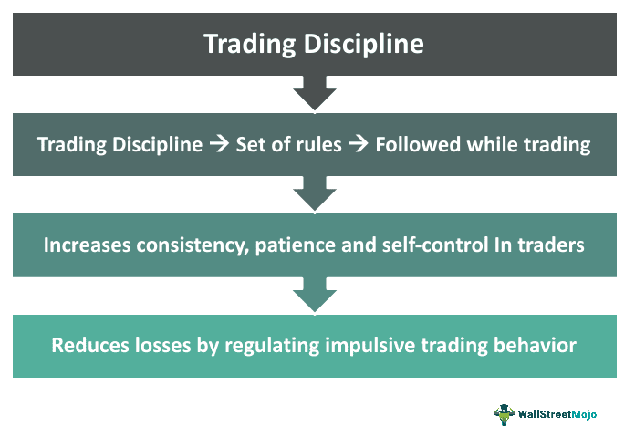

Financial trading has gained significant traction among everyday investors, particularly with the rise of online platforms and the accessibility of trading tools. However, this surge in participation has been accompanied by a concerning increase in scams and unethical practices. A critical area of concern is the operation of bucket shops, which are fraudulent firms known for misleading clients and partaking in unethical trading activities. Bucket shops often present themselves as legitimate brokerage firms but engage in practices that are detrimental to their clients. These firms historically capitalized on the gambling aspect of trading, offering high leverage without proper hedging, thereby amplifying the risk for clients.

In recent times, advancements in technology have introduced new complexities to the trading environment. Automated trading systems and artificial intelligence have transformed traditional trading methodologies, but they also bring forth new vulnerabilities. The prevalence of algorithmic and AI-driven trading scams further exacerbates the situation, with scammers exploiting these tools to promise unrealistically high returns. This has prompted regulatory bodies, such as the Commodity Futures Trading Commission (CFTC), to issue warnings about the potential risks associated with AI-based trading platforms.

Given the growing sophistication of these scams, it is imperative for investors to stay informed and exercise caution in their trading activities. This article aims to shed light on the intricacies of bucket shop scams, highlight the challenges posed by algorithmic trading fraud, and provide practical advice for safeguarding investments. By understanding these risks and implementing effective protective measures, investors can better navigate the volatile landscape of financial trading and help protect their assets.

## Table of Contents

## Understanding Bucket Shops

Bucket shops are brokerage firms known for engaging in unethical practices, often deceiving clients about the execution prices of trades. These firms primarily focus on exploiting clients' lack of understanding and manipulating their transactions to the firm's advantage. A defining characteristic of bucket shops is their misleading representation of trade execution, often convincing clients that trades are executed at market prices when, in reality, the prices are manipulated to favor the firm.

Historically, bucket shops operated by allowing individuals to gamble on stock price movements with high leverage. This approach created an environment akin to betting rather than investing, where clients speculated on price changes without actually owning the stocks. The firms provided a façade of legitimate trading, but in truth, they engaged in practices similar to gambling houses. The high leverage offered by bucket shops meant that even small market fluctuations could result in substantial client losses, while the firms themselves remained largely insulated from these risks.

The term "bucket shop" is believed to have originated from the unethical practice of "bucketing" trades. This involved the firm not executing client orders on an exchange but instead taking the other side of the trade internally or ignoring or discarding unwanted trade tickets. Essentially, they would metaphorically "throw into the bucket" those trades that were not executed as promised. This practice allowed bucket shops to manipulate outcomes and significantly increased profits at the expense of their clients. Over time, such activities have led to bucket shops being synonymous with financial fraud and deceit in the trading industry.

These deceptive operations capitalized on the speculative nature of uninformed investors, often resulting in significant financial harm. Regulatory measures and increased awareness have curtailed such operations in many regions, but the essence of bucket shop practices can still be found in various modern trading scams. Understanding the fraudulent mechanics behind these firms is crucial for investors to recognize and avoid potential scams in financial markets.

## Characteristics of Bucket Shop Scams

Bucket shops are financial entities that have long operated under a veil of deception, taking advantage of clients' lack of knowledge and trust. One of the primary characteristics of bucket shop scams is the inherent conflict of interest that these firms embody. Unlike legitimate brokerage firms, bucket shops often have no intention of executing trades in an actual market. Instead, they simulate trades internally, creating a zero-sum game environment in which the firm profits directly from a client's losses. This conflict means that rather than acting in a client's best interest, the firm's financial success is contingent upon its clients' financial failures.

Another common tactic employed by bucket shops is the manipulation of trade execution prices. Clients are frequently misled regarding the prices at which their trades are executed. The firm may report trade execution at a different price from what was actually enacted—if a genuine trade occurs at all—allowing the firm to pocket the price difference. This price manipulation is often carried out without the client's awareness, further entrenching the firm's ill-gotten gains.

The financial ramifications of falling victim to a bucket shop scam are often severe, resulting in substantial monetary losses for individuals. As clients believe they are participating in real market trading with the potential for favorable returns, the realization of being defrauded can be devastating, both financially and emotionally. The financial losses are compounded by the fact that bucket shop operators frequently leverage high-risk strategies, amplifying the potential for rapid depletion of the client's investment capital.

In summary, bucket shops represent a pernicious threat to unsuspecting investors, exploiting conflicts of interest, misrepresenting trade execution, and causing significant financial harm. These fraudulent practices underscore the importance of due diligence and investor education to mitigate the risks associated with such scams.

## The Emergence of AI and Algo Trading Scams

Automated trading and [artificial intelligence](/wiki/ai-artificial-intelligence) (AI) technologies have fundamentally transformed the landscape of financial investments by incorporating complex algorithms to execute billions of transactions with speed and precision. However, these advancements have also opened up new avenues for malicious actors to exploit unsuspecting investors. A prevalent risk arises from scammers who use the veneer of sophistication associated with AI to lure investors with promises of abnormally high returns, often accompanied by the guarantee of minimal risk. Such claims frequently lack substantiation in the most basic principles of finance, such as the risk-return tradeoff, which dictates that higher returns are generally associated with higher risk.

Scammers typically employ tactics that include falsifying historical trading success rates, exaggerating the capabilities of their trading algorithms, and fabricating credentials or endorsements. These schemes might highlight proprietary algorithms supposedly backed by cutting-edge AI, often creating elaborate yet fictitious narratives to build credibility. The essence of these scams is to engender a sense of urgency and exclusivity, manipulating potential investors into making hasty decisions under the impression of seizing a rare opportunity.

The U.S. Commodity Futures Trading Commission (CFTC) has recognized the threats posed by such fraudulent schemes and has proactively issued warnings to investors. These alerts advise individuals to remain skeptical of online claims touting guaranteed returns and to conduct due diligence in verifying the legitimacy of any AI-driven trading platform. Investors are urged to scrutinize the authenticity of any purportedly ground-breaking technology by looking for documented approvals, credible reviews, and compliance with regulatory standards. Additionally, the CFTC emphasizes the importance of assessing whether a trading platform is registered with the appropriate authorities and encourages the reporting of suspicious entities.

In practice, investors should adopt a healthy skepticism towards AI and algorithm-based trading ventures that assure success without clear evidence or a transparent explanation of their methodologies. Understanding that no algorithm or AI-driven tool can entirely eliminate market risks—because financial markets are influenced by numerous unpredictable external factors—is crucial. The allure of effortless profitability can lead investors into traps set by those who exploit the intricate technological aspects of AI to fabricate authenticity. Thus, being informed and critical of too-good-to-be-true offers remains an essential part of safeguarding investments in the contemporary financial landscape.

## Protecting Yourself From Scams

Before diving into financial markets, it is paramount for investors to engage in comprehensive research. One of the primary steps is to verify the credentials and backgrounds of any trading programs or brokers. Regulatory bodies such as the U.S. Securities and Exchange Commission (SEC) and the Financial Industry Regulatory Authority (FINRA) offer resources where investors can check the registration and disciplinary history of brokers and firms. This ensures that investors deal with accredited entities and avoid unlicensed operators often linked to fraudulent activities.

Investors should remain cautious of schemes that promise guaranteed returns or boast exceptionally high success rates. Such claims are a hallmark of fraudulent schemes, as legitimate investments inherently [carry](/wiki/carry-trading) risks. The notion of consistent, high returns without risk defies basic financial principles and is often too good to be true. Scammers use these enticing promises to lure unsuspecting individuals into their traps. Investors should consistently apply critical thinking and skepticism when confronted with such propositions.

Consulting with a financial advisor or a trusted peer before making major investment decisions is a prudent strategy. Financial advisors, preferably those who are certified, can provide invaluable insights and risk assessments tailored to an individual's financial situation and goals. They can help in evaluating the potential benefits and drawbacks of different investment options, offering a balanced perspective that mitigates the influence of marketing ploys and emotional decisions. Similarly, discussing potential investments with trusted peers can provide a level of accountability and diverse viewpoints, further fortifying one's decision-making process.

Staying informed about common scam tactics and maintaining an analytical approach are critical defenses against financial scams. Adopting a systematic verification approach to any prospective investment protects individuals, ensuring that their financial ventures contribute to growth rather than loss. The combination of due diligence, professional guidance, and an informed mindset forms the cornerstone of a sound investment strategy, safeguarding against deceptive practices.

## Conclusion

In the dynamic landscape of financial trading, investors need to exercise heightened vigilance and caution against prevalent scams such as bucket shops and fraudulent [algorithmic trading](/wiki/algorithmic-trading) schemes. The proliferation of these scams poses significant threats, as unscrupulous actors exploit the complexity of financial markets to deceive unsuspecting investors. To safeguard their financial assets, investors should consistently engage in thorough research and due diligence prior to entering any trading programs or partnerships with new brokers. For instance, verifying a broker's registration status and examining any disciplinary histories can provide valuable insights into their legitimacy.

Moreover, awareness and education stand as pivotal defenses against these scams. Acquiring knowledge about red flags, such as promises of guaranteed returns or abnormally high success rates, can alert potential investors to fraudulent intentions. Engaging with trusted financial advisors or peers before making substantial investment decisions can also serve as a protective measure, offering an additional layer of scrutiny and objective assessment.

As financial trading continues to evolve, staying informed is not merely advantageous but essential. By proactively seeking information and maintaining a critical eye towards potential risks, investors can substantially reduce the likelihood of falling victim to fraudulent activities. Ultimately, empowering oneself through education and strategic vigilance remains the best strategy for navigating and securely participating in the modern trading environment.

## References & Further Reading

[1]: Markham, Jerry W. (2002). ["Bucket Shops and Stock Operations: A History of Stock Market Speculation."](https://law.fiu.edu/wp-content/uploads/sites/2/2019/10/Markham-cv-10-01-19.pdf) Beard Books.

[2]: Lopez de Prado, Marcos. (2018). ["Advances in Financial Machine Learning."](https://www.amazon.com/Advances-Financial-Machine-Learning-Marcos/dp/1119482089) Wiley.

[3]: CFTC Customer Advisory: Understand the Risks of Virtual Currency Trading. ["Commodity Futures Trading Commission (CFTC) advisory on trading risks."](https://www.cftc.gov/sites/default/files/idc/groups/public/@customerprotection/documents/file/customeradvisory_urvct121517.pdf) 

[4]: SEC, FINRA Alert Investors: Don't Trade on Pump-And-Dump Stock E-mail Scams. ["U.S. Securities and Exchange Commission (SEC) and FINRA alert on trading scams."](https://www.investor.gov/introduction-investing/general-resources/news-alerts/alerts-bulletins/investor-alerts/investor-53)

[5]: Aronson, David R. (2006). ["Evidence-Based Technical Analysis: Applying the Scientific Method and Statistical Inference to Trading Signals."](https://onlinelibrary.wiley.com/doi/book/10.1002/9781118268315) Wiley.

[6]: Chan, Ernest P. (2009). ["Quantitative Trading: How to Build Your Own Algorithmic Trading Business."](https://github.com/ftvision/quant_trading_echan_book) Wiley.