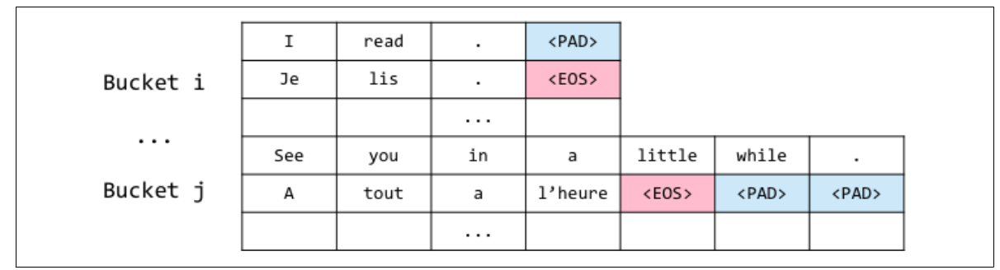

## Table of Contents

## What is bucketing in the context of machine learning?

Bucketing in machine learning is a technique used to group continuous data into discrete categories or bins. This process helps simplify data analysis and can improve the performance of machine learning models by reducing the impact of outliers and noise. For example, if you have data on people's ages ranging from 0 to 100, you might create buckets like 0-18, 19-35, 36-60, and 61-100. This way, instead of treating age as a continuous variable, you treat it as a categorical one, which can sometimes make patterns in the data easier to see and use in models.

When applying bucketing, it's important to choose the right number and size of buckets. Too few buckets might oversimplify the data and miss important patterns, while too many buckets might make the model too complex and overfit to the training data. A common method for deciding on bucket sizes is to use equal-width binning, where each bucket has the same range, or equal-frequency binning, where each bucket contains roughly the same number of data points. The choice depends on the specific needs of the analysis and the nature of the data.

## Why is bucketing used in data preprocessing?

Bucketing is used in data preprocessing to make data easier to work with. When you have a lot of numbers, like ages or prices, it can be hard to see patterns. By putting these numbers into groups, or buckets, you can see the big picture more easily. For example, instead of looking at every single age from 1 to 100, you can group ages into categories like "young," "adult," and "senior." This helps you understand the data better and can make your machine learning models work better too.

Another reason to use bucketing is to handle outliers and noisy data. Sometimes, you have a few numbers that are very different from the rest. These outliers can mess up your analysis. By putting numbers into buckets, you can reduce the impact of these outliers. For example, if most people in your data are between 20 and 60 years old, but you have a few people who are 100 years old, putting everyone over 60 into one bucket can help your model focus on the main trends in the data. This way, your model can be more accurate and reliable.

## How does bucketing help in handling continuous data?

Bucketing helps in handling continuous data by turning a lot of different numbers into smaller groups. Imagine you have a list of ages from 1 to 100. It can be hard to see patterns with so many different ages. But if you put these ages into groups, like 1-18 for "young," 19-60 for "adult," and 61-100 for "senior," it becomes easier to understand the data. These groups, or buckets, make it simpler to see how many people fall into each category and help you find trends more easily.

Another way bucketing helps with continuous data is by dealing with outliers. Outliers are numbers that are very different from most of the other numbers. For example, if most people in your data are between 20 and 60 years old, but you have a few people who are 100 years old, these outliers can make your analysis harder. By putting all ages over 60 into one bucket, you can reduce the impact of these outliers. This makes your data smoother and can help your [machine learning](/wiki/machine-learning) models work better by focusing on the main trends in the data.

## What are the different methods to perform bucketing?

One common method to perform bucketing is equal-width binning. This method divides the range of the data into equal parts. For example, if you have ages from 1 to 100, you might create buckets of 20 years each: 1-20, 21-40, 41-60, 61-80, and 81-100. This is simple to do and works well when the data is spread out evenly. However, if there are a lot of outliers or the data is not evenly distributed, this method might not be the best choice.

Another method is equal-frequency binning, also known as quantile binning. This method tries to put the same number of data points into each bucket. For example, if you have 100 people and want 5 buckets, each bucket would have 20 people. This method is good for handling outliers because it makes sure that each bucket has a similar amount of data, even if the values are very different. It can be more complex to set up, but it often gives better results when the data is not evenly spread out.

A third method is custom binning, where you decide the bucket boundaries based on your knowledge of the data or the problem you are trying to solve. For example, if you are working with ages and know that certain age groups are important for your analysis, you might create buckets like 0-18, 19-35, 36-60, and 61-100. This method gives you a lot of control over how the data is grouped, but it requires a good understanding of the data and the problem at hand.

## Can you explain the process of creating buckets using equal-width binning?

Equal-width binning is a simple way to create buckets for your data. Imagine you have a list of numbers, like ages from 1 to 100. To use equal-width binning, you first decide how many buckets you want. Let's say you want 5 buckets. You then divide the total range of the data by the number of buckets. For ages, the total range is 100 - 1 = 99. So, each bucket will be 99 divided by 5, which is about 19.8. You round this number to make it easier to work with, so each bucket will be 20 years wide. You start with the lowest number in your data, which is 1, and create buckets like this: 1-20, 21-40, 41-60, 61-80, and 81-100.

This method is easy to understand and use, but it can have some problems. If your data has a lot of outliers or is not spread out evenly, some buckets might have a lot more data points than others. For example, if most people in your data are between 20 and 40 years old, the bucket 21-40 might have many more people than the other buckets. This can make it harder to see patterns in your data. Despite this, equal-width binning is a good starting point because it's simple and quick to set up.

## How does equal-frequency binning differ from equal-width binning?

Equal-frequency binning and equal-width binning are two different ways to group numbers into buckets. Equal-frequency binning tries to put the same number of data points into each bucket. For example, if you have 100 people and want 5 buckets, each bucket would have 20 people. This method is good for handling outliers because it makes sure that each bucket has a similar amount of data, even if the values are very different. It can be more complex to set up, but it often gives better results when the data is not evenly spread out.

On the other hand, equal-width binning divides the range of the data into equal parts. If you have ages from 1 to 100 and want 5 buckets, you would divide the total range (100 - 1 = 99) by 5, getting about 19.8. You round this to 20, creating buckets like 1-20, 21-40, 41-60, 61-80, and 81-100. This method is simple and quick to set up, but it can have problems if your data has a lot of outliers or is not spread out evenly. Some buckets might end up with many more data points than others, which can make it harder to see patterns in your data.

## What are the advantages and disadvantages of using bucketing in machine learning models?

Bucketing can make machine learning models easier to understand and use. By grouping continuous data into categories, it simplifies the data and can help you see patterns more clearly. For example, instead of looking at every single age from 1 to 100, you can group ages into categories like "young," "adult," and "senior." This can make your models work better by reducing the impact of outliers and noisy data. Outliers are numbers that are very different from most of the other numbers, and they can mess up your analysis. By putting numbers into buckets, you can focus on the main trends in the data, making your models more accurate and reliable.

However, bucketing also has some downsides. One problem is that it can oversimplify the data, which might make you miss important details. If you put too many different numbers into one bucket, you might lose information that could be useful for your model. Another issue is choosing the right number and size of buckets. If you use too few buckets, you might oversimplify the data and miss important patterns. If you use too many buckets, your model might become too complex and overfit to the training data, meaning it works well on the data it was trained on but not on new data. Deciding on the right number of buckets can be tricky and requires a good understanding of your data and the problem you are trying to solve.

## How can bucketing impact the performance of a machine learning model?

Bucketing can make a machine learning model work better by making the data easier to understand. When you group numbers into categories, like ages into "young," "adult," and "senior," it simplifies the data. This can help the model see patterns more clearly. Also, bucketing can help deal with outliers, which are numbers that are very different from most of the other numbers. By putting these outliers into buckets, the model can focus on the main trends in the data, which can make it more accurate and reliable.

However, bucketing can also cause problems. If you put too many different numbers into one bucket, you might lose important details that the model needs. This can make the model miss important patterns in the data. Also, choosing the right number and size of buckets can be tricky. If you use too few buckets, the model might oversimplify the data and miss important details. If you use too many buckets, the model might become too complex and overfit to the training data. This means it works well on the data it was trained on but not on new data. So, finding the right balance is important for making sure bucketing helps the model's performance.

## In what scenarios would bucketing be particularly beneficial for a dataset?

Bucketing would be particularly beneficial when you have a lot of continuous data that is hard to understand or work with. For example, if you have a dataset with people's ages ranging from 1 to 100, it can be difficult to see patterns or trends with so many different numbers. By grouping these ages into categories like "young," "adult," and "senior," you can make the data easier to understand. This can help you see the big picture more clearly and make your machine learning models work better. Bucketing is also useful when your data has a lot of outliers or noisy data. Outliers are numbers that are very different from most of the other numbers, and they can mess up your analysis. By putting these outliers into buckets, you can focus on the main trends in the data, making your models more accurate and reliable.

Another scenario where bucketing is helpful is when you want to simplify your data analysis. If you're working with a large dataset and need to quickly see how different groups of data behave, bucketing can make this easier. For example, if you're looking at customer spending and want to see how different income levels affect spending, you can group income into categories like "low," "medium," and "high." This can help you quickly understand how income impacts spending without getting lost in the details of every single income amount. However, it's important to choose the right number and size of buckets. If you use too few buckets, you might oversimplify the data and miss important patterns. If you use too many buckets, your analysis might become too complex and hard to understand. Finding the right balance is key to making bucketing beneficial for your dataset.

## How do you determine the optimal number of buckets for a given feature?

Determining the optimal number of buckets for a given feature can be tricky, but it's important for making your data analysis and machine learning models work well. One way to find the right number of buckets is to use a method called the "square root rule." This rule says that the number of buckets should be the square root of the number of data points you have. For example, if you have 100 data points, the square root of 100 is 10, so you would use 10 buckets. This is a simple starting point, but you might need to adjust it based on how your data looks and what you're trying to find out.

Another way to find the best number of buckets is to try different numbers and see which one works best for your analysis or model. You can use a technique called "cross-validation" to test how well different numbers of buckets work. For example, you could split your data into training and testing sets, create buckets with different numbers, train your model on the training data, and then see how well it predicts the testing data. The number of buckets that gives the best predictions is probably the right one for your data. It's important to keep trying different numbers until you find the one that makes your analysis or model work the best.

## What are some advanced techniques for dynamic bucketing in real-time data streams?

Dynamic bucketing in real-time data streams is important when you need to group data as it comes in. One way to do this is by using adaptive binning. This method changes the size and number of buckets based on the new data it sees. For example, if you're looking at the price of a stock, the buckets might get smaller or larger depending on how much the price changes. This helps the model stay accurate even when the data is changing a lot. To do this, you can use algorithms that check the data often and adjust the buckets to fit the new patterns.

Another advanced technique is using machine learning models to predict the best way to bucket the data. For example, you could use a clustering algorithm like k-means to group the data into buckets based on how similar the data points are. The model can learn from the data and change the buckets over time. This is helpful because it can find patterns that might be hard for a person to see. You can also use [reinforcement learning](/wiki/reinforcement-learning), where the model learns to make better buckets by getting feedback on how well it's doing. This way, the model can keep improving its bucketing strategy as more data comes in.

## How can bucketing be integrated with other feature engineering techniques to enhance model accuracy?

Bucketing can be combined with other feature engineering techniques to make machine learning models more accurate. One way to do this is by using bucketing along with normalization or standardization. Normalization makes all the data fit between 0 and 1, while standardization changes the data so it has a mean of 0 and a standard deviation of 1. When you bucket the data first and then normalize or standardize it, you can help the model focus on the main trends in the data. This can make the model work better because it's easier for the model to understand the data when it's in smaller groups and all on the same scale.

Another way to use bucketing with other techniques is by combining it with feature encoding. For example, after you bucket your data, you can use one-hot encoding to turn the buckets into numbers that the model can use. One-hot encoding makes each bucket into a separate column, where a 1 means the data point is in that bucket and a 0 means it's not. This can help the model see the different categories more clearly. You can also use target encoding, where you replace each bucket with the average value of the target variable for that bucket. This can give the model more information about how the buckets relate to what you're trying to predict. By using bucketing with these other techniques, you can make your data easier for the model to understand and improve its accuracy.