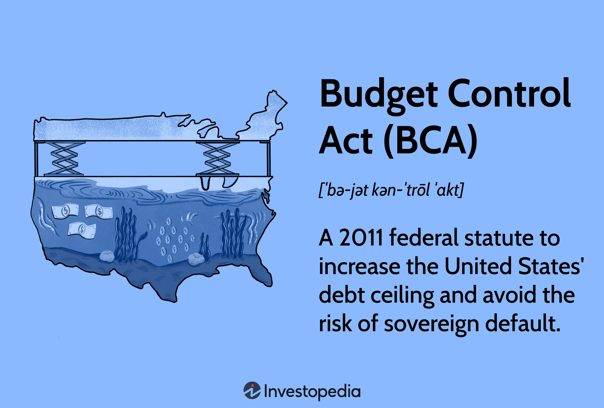

The Budget Control Act (BCA) of 2011 stands as a significant statute in federal budgetary regulation, crafted to address and mitigate the United States' fiscal challenges. This legislation arose primarily in response to the critical 2011 debt ceiling crisis, which necessitated immediate and decisive actions to prevent a sovereign default. The core objectives of the BCA centered on two pivotal tasks: increasing the national debt ceiling and instituting measures for substantial deficit reductions.

At its foundation, the BCA was designed to strategically manage federal expenditures through the introduction of spending caps and a sequestration mechanism. Sequestration serves as an automatic process to enforce spending cuts when budgetary objectives are not achieved. From fiscal year 2012 to fiscal year 2021, the act sought to secure a minimum deficit reduction of $1.2 trillion, thereby imposing a structure of fiscal discipline on federal budgeting processes.



The implications of the BCA extend beyond traditional budgetary practices, influencing sectors such as algorithmic trading. Algorithmic trading strategies, which rely heavily on data and relatively stable market conditions, are directly impacted by government fiscal policies, including those initiated by the BCA. The enactment of spending caps and fiscal constraints can induce market volatility, necessitating adaptive strategies from traders and financial analysts.

The intersection of federal budget policies and algorithmic trading underscores the broader economic and financial strategies influenced by legislation like the BCA. Understanding how such policies reverberate through financial markets and regulatory landscapes is crucial for economists, policymakers, and market practitioners. The BCA exemplifies the interconnectedness of fiscal regulation and financial market dynamics, offering a framework for comprehending the ongoing evolution of economic strategies. This analysis aims to provide a thorough perspective on these intersections, shedding light on the multifaceted impacts of legislative actions on national and global financial systems.

## Table of Contents

## Understanding the Budget Control Act (BCA)

The Budget Control Act (BCA) of 2011 was enacted as a critical legislative response to the escalation of the 2011 debt ceiling crisis. Its primary objectives were to elevate the U.S. debt ceiling and impose stringent federal budget deficit reductions. The act mandated a minimum deficit reduction of $1.2 trillion to be achieved over a period spanning from the fiscal year 2012 to the fiscal year 2021. This legislative mandate aimed to instigate a disciplined fiscal approach and restore confidence in the U.S. economic policy.

A cornerstone of the BCA was the introduction of spending caps on discretionary spending, which were designed to constrain the growth in federal expenditure. By instituting these caps, the act aimed to limit government spending and ensure that budget deficits were curtailed effectively. To enforce these fiscal restrictions, the BCA put into place a mechanism known as sequestration. This automatic process was designed to trigger indiscriminate cuts to both discretionary and certain mandatory programs if the reductions stipulated in the budget were not met. Such an enforcement tool underscored the seriousness of budgetary discipline under the BCA framework.

The implementation of the BCA significantly influenced federal spending patterns and necessitated meticulous budget management to adhere to its provisions. Federal agencies were compelled to evaluate their budgetary allocations critically and prioritize spending to comply with the new fiscal limitations set forth by the act. This often resulted in funding reallocations and, in some cases, program reductions to align with the spending caps.

Overall, the BCA played a transformative role in shaping the United States' approach to fiscal management during its period of enforcement. Its mechanisms for enforcing budgetary discipline were pivotal in addressing the challenges posed by the national debt crisis at that time.

## The 2011 Debt Ceiling Crisis

The 2011 debt ceiling crisis represented a pivotal moment in U.S. fiscal policy history. Faced with the prospect of a sovereign default, Congress enacted the Budget Control Act (BCA) as a mechanism to stabilize the situation. The crisis originated from the necessity to increase the debt ceiling, which is the maximum amount the federal government is authorized to borrow to meet its existing legal obligations. Failure to increase this limit would have resulted in the U.S. defaulting on its debt, an outcome with potentially severe economic repercussions.

To prevent this, the BCA was passed rapidly, allowing for a $2.1 trillion increase in the debt ceiling. This action temporarily alleviated the immediate risk of default. However, raising the debt ceiling alone was insufficient to address long-term fiscal challenges. Consequently, the BCA also instituted spending cuts aimed at deficit reduction. The legislation outlined $1.5 trillion in spending cuts to be implemented over the following decade. Such measures were intended to reassure both domestic and international stakeholders of the U.S.' commitment to fiscal responsibility.

The crisis underscored the complexity of managing national debt, highlighting the intricate balance required between borrowing, spending, and economic growth. Congressional debates during this period brought significant attention to the fiscal policies governing the nation's debt, influencing future budgetary priorities and strategies. Notably, the political context of the crisis revealed the challenges in achieving bipartisan consensus on fiscal matters, further complicating efforts to implement cohesive and sustainable economic policies.

This episode not only acted as a catalyst for the enactment of the BCA but also set the stage for subsequent fiscal discussions, emphasizing the importance of strategic planning in mitigating national debt issues. The decisions made during and after the 2011 crisis have had lasting impacts on U.S. economic policy and continue to inform the legislative approach to debt management and fiscal discipline.

## Implications for Algorithmic Trading

Algorithmic trading, which employs complex algorithms to execute trades at speeds and frequencies impossible for human traders, is profoundly influenced by market conditions and federal budget policies like the Budget Control Act (BCA) of 2011. The BCA, with its mandated spending cuts and fiscal constraints, can lead to increased market [volatility](/wiki/volatility-trading-strategies), directly affecting trading algorithms that rely on predictability and stability in economic conditions.

Market volatility, which is the statistical measure of the [dispersion](/wiki/dispersion-trading) of returns for a given security or market index, is a critical concern for [algorithmic trading](/wiki/algorithmic-trading). The formula for calculating volatility is typically expressed as the standard deviation of returns ($\sigma$) and can be given by:

$$
\sigma = \sqrt{\frac{1}{N-1}\sum_{i=1}^{N}(R_i - \bar{R})^2}
$$

where $R_i$ represents the return at time $i$, $\bar{R}$ is the average return, and $N$ is the number of observations.

Algorithmic trading strategies, particularly those that execute high-frequency trades, depend on stable patterns and statistically reliable market movement data. Uncertainty introduced by spending cuts and budgetary responses to policies like the BCA can disrupt these patterns, leading to inaccuracies in algorithmic predictions and executions. For instance, unexpected fiscal contractions may result in rapid shifts in interest rates or currency valuations, affecting algorithms tuned to historical data trends.

To mitigate the risks posed by such legislative impacts, traders and financial analysts must develop adaptive trading strategies that can respond to dynamic market conditions. This adaptability often involves incorporating [machine learning](/wiki/machine-learning) techniques to enhance algorithmic responsiveness and accuracy. Machine learning models can be trained to recognize new patterns in market data, adjusting the algorithms to accommodate non-linear relationships that emerge due to legislative influence.

Python, due to its extensive libraries such as NumPy, pandas, and scikit-learn, offers tools for such modeling and data analysis. A basic example of using Python to update an algorithmic model based on new market data is as follows:

```python
import numpy as np
from sklearn.linear_model import LinearRegression

# Simulated market data
times = np.array([1, 2, 3, 4, 5])
returns = np.array([0.02, -0.01, 0.03, 0.00, 0.02])

# Train a regression model
model = LinearRegression()
model.fit(times.reshape(-1, 1), returns)

# Predict future return
future_time = np.array([6]).reshape(-1, 1)
predicted_return = model.predict(future_time)

print(f"Predicted market return at time 6: {predicted_return[0]:.4f}")
```

This Python snippet demonstrates a simple linear regression model that could be part of an adaptive strategy. In reality, financial models would be more intricate, possibly using [deep learning](/wiki/deep-learning) frameworks to predict market trends with higher accuracy.

In conclusion, algorithmic trading requires continuous adaptation to legislative changes such as those imposed by the BCA. By implementing advanced data analysis and machine learning strategies, traders can enhance their algorithms to better withstand the uncertainties resulting from fiscal policies. Such advancements ensure that financial institutions remain equipped to navigate the complexities introduced by the interplay between federal budget control and market behavior.

## Conclusion

The Budget Control Act of 2011 has been a pivotal measure in shaping U.S. fiscal policy, primarily through its imposition of spending discipline and efforts to manage debt levels. This legislation introduced mechanisms such as expenditure caps and sequestration to ensure that deficit reduction targets were achieved. These measures have enforced a framework within which federal fiscal operations are conducted, ultimately affecting the broader economy.

The impact of the BCA extends beyond the confines of public finance, influencing sectors that are highly sensitive to economic fluctuations, such as algorithmic trading. Algorithmic trading systems, which rely on stable market conditions and predictable government fiscal actions, need to adapt to the varying degrees of market volatility that such federal budgetary policies can induce. The need for adaptive trading strategies arises as fiscal policies contribute to changes in market dynamics, potentially altering the performance of algorithms that drive trading decisions. 

Grasping the intersections between legislative measures like the BCA and financial market activities is essential for economists, policymakers, and traders as they navigate the complexities inherent in financial systems. The unpredictable interplay between fiscal policies and market conditions underscores the necessity for robust analytical models and strategies that can accommodate such variability.

Looking into the future, the persistent influence of legislation such as the BCA will likely encourage ongoing innovation in both fiscal policy and trading methodologies. As fiscal policies continue to evolve in response to new economic challenges, there will be a demand for advanced algorithmic systems that can interpret and respond to these transformations in real-time. Thus, an understanding of the far-reaching effects of fiscal legislation is crucial for effectively managing future economic landscapes.

## References & Further Reading

[1]: Blinder, A. S. (2013). ["After the Music Stopped: The Financial Crisis, the Response, and the Work Ahead"](https://www.tandfonline.com/doi/full/10.1080/14697688.2014.949836). Penguin Books.

[2]: ["The Budget Control Act of 2011: Legislative and Economic Implications"](https://www.congress.gov/112/plaws/publ25/PLAW-112publ25.pdf), Congressional Research Service.

[3]: Lopez de Prado, M. (2018). ["Advances in Financial Machine Learning"](https://www.amazon.com/Advances-Financial-Machine-Learning-Marcos/dp/1119482089). Wiley.

[4]: ["Impact of the Budget Control Act on U.S. Fiscal Policy"](https://crsreports.congress.gov/product/pdf/R/R44874), The Brookings Institution.

[5]: T. Hastie, R. Tibshirani, J. Friedman. (2009). ["The Elements of Statistical Learning"](https://link.springer.com/book/10.1007/978-0-387-84858-7). Springer Series in Statistics.

[6]: Jansen, S. (2018). ["Machine Learning for Algorithmic Trading"](https://github.com/stefan-jansen/machine-learning-for-trading). Packt Publishing.

[7]: ["Debt Ceiling: History and Recent Increases"](https://crsreports.congress.gov/product/pdf/RL/RL31967), Congressional Research Service.