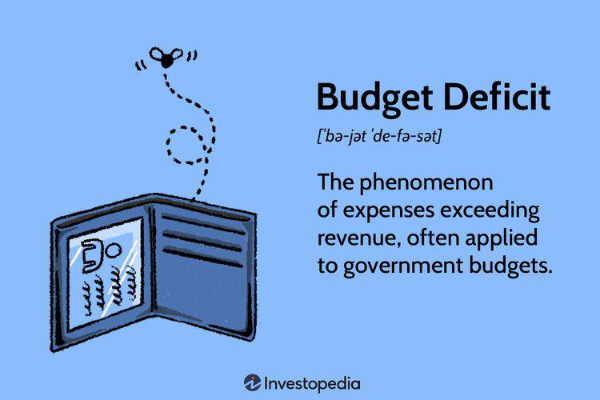

The interconnectedness of economic effects, budget deficits, and algorithmic trading represents a complex and multifaceted relationship crucial to understanding modern economic dynamics. Economic effects pertain to the broad outcomes of policy decisions, market fluctuations, and financial innovations on macroeconomic stability and growth. A budget deficit occurs when a government's expenditures exceed its revenues, influencing national and global economies through increased debt, interest rates, and potential inflationary pressures. Algorithmic trading, a technology-driven method that leverages algorithms to automate financial transactions, impacts market efficiency and liquidity, introducing both opportunities and risks, such as increased volatility.

In today's economic climate, these topics hold growing relevance. The prevalence of significant budget deficits in several economies and the rapid evolution of algorithmic trading underscore the need for effective economic management strategies. Budget deficits, if unchecked, can lead to escalating national debt, making it increasingly challenging for governments to stimulate economic growth or respond to financial crises. Simultaneously, algorithmic trading, while augmenting market operations, necessitates robust regulatory frameworks to mitigate risks associated with market disruptions.



This article aims to explore prevention strategies to manage economic effects, focusing on budget deficits and the impact of algorithmic trading. It seeks to provide insights into understanding the cyclical nature of economic outcomes related to budget imbalances and algorithmic market operations. Readers will gain comprehensive knowledge on how strategic policy interventions, both fiscal and monetary, coupled with regulatory oversight of trading algorithms, can foster economic stability.

This analytical exploration will highlight key concepts and strategies imperative for economists, policymakers, and financial industry leaders. By engaging with the data-driven analysis presented in this article, readers will be better equipped to comprehend the intricate relationships shaping today's economic landscape and devise informed strategies to navigate and stabilize these components effectively.

## Table of Contents

## Understanding Economic Effects and Budget Deficits

Economic effects are critical to understanding the macroeconomic landscape, which encompasses the overall behavior and interlinkages of national and global economies. These effects are outcomes generated by various factors such as fiscal policies, monetary interventions, trade dynamics, inflation rates, and technological advancements. They are often measured through indicators like GDP growth, employment rates, inflation, and trade balances. These economic effects are integral in guiding governments in policy formulation, enabling them to stabilize or stimulate economic growth.

A budget deficit occurs when a country's expenditures exceed its revenues within a given fiscal year. It necessitates borrowing to fill the gap, often leading to an increase in public debt. The implications of budget deficits can be far-reaching, not only impacting the nation's financial stability but also influencing global financial markets. Persistent budget deficits can result in higher interest rates, increased debt burdens, and potentially reduced investment in key sectors due to the crowding-out effect, whereby government borrowing limits the amount of capital available to the private sector.

Historically, budget deficits have been pivotal in shaping economic outcomes. For example, the United States faced significant budget deficits during the 1980s and early 1990s. These deficits were mainly attributed to increased military spending and tax cuts, which resulted in substantial national debt. The consequent economic adjustments included changes in tax policies and fiscal strategies, illustrating the necessity of addressing budget imbalances to maintain economic stability.

The cyclical nature of economic effects and budget deficits is characterized by periods of expansion and contraction. During economic downturns, budget deficits typically increase as government revenues decline and expenditures rise to stimulate the economy or maintain welfare programs. Conversely, economic booms can lead to budget surpluses if revenues from taxes increase while spending remains controlled. This cyclical pattern underscores the interconnected nature of economic effects and budget deficits.

Strategic interventions are required to mitigate the negative outcomes associated with persistent budget deficits. These strategies often include adopting strict fiscal policies aimed at reducing expenditures or increasing revenues through taxation reforms. Monetary policies, such as altering interest rates, can also play a role in stabilizing an economy. Bringing [algorithmic trading](/wiki/algorithmic-trading) into focus, regulatory frameworks can be established to mitigate its potential risks and harness its benefits for economic stability. Such interventions are essential for maintaining balanced budgets and ensuring long-term economic health.

In conclusion, understanding economic effects and budget deficits within the macroeconomic landscape is crucial for creating effective policy responses. Historical examples and the cyclical nature of these phenomena highlight the importance of strategic planning to prevent long-term instability.

## The Role of Algorithmic Trading in Modern Markets

Algorithmic trading, or algo trading, is the use of computer algorithms to automate trading decisions in financial markets. These algorithms execute trades at speeds and frequencies impossible for human traders, systematically deciding on aspects like timing, price, and quantity. The fundamental principle behind algo trading involves leveraging computational power to analyze market data, identify patterns or trends, and execute trades based on predefined strategies. Common algorithmic strategies include statistical [arbitrage](/wiki/arbitrage), [momentum](/wiki/momentum) trading, and [market making](/wiki/market-making).

One significant impact of algo trading is on market efficiency. By processing large volumes of data quickly, algorithms can capitalize on price discrepancies across markets, driving prices toward their true value and enhancing market efficiency. Moreover, algo trading contributes to market [liquidity](/wiki/liquidity-risk-premium) by ensuring continuous, automated participation in the markets. Algorithms often serve as market makers, providing liquidity and tightening bid-ask spreads, which benefits all market participants by reducing transaction costs.

Despite these benefits, algo trading also presents several risks, notably increased market [volatility](/wiki/volatility-trading-strategies). The speed and [volume](/wiki/volume-trading-strategy) of transactions can exacerbate price swings, especially during periods of market stress. High-frequency trading, a subset of algorithmic trading characterized by rapid order submission, is often linked to sudden market disruptions. The 2010 "Flash Crash," for instance, illustrated how algorithmic trading could contribute to extreme volatility. On May 6, 2010, the Dow Jones Industrial Average plunged about 1,000 points within minutes, a situation partly attributed to aggressive algorithmic trading strategies.

In response to these risks, regulatory bodies have implemented various measures to monitor and control algorithmic trading practices. For instance, the U.S. Securities and Exchange Commission (SEC) introduced the "Limit Up-Limit Down" mechanism to prevent rapid price declines within a short time frame. Additionally, many exchanges have instituted circuit breakers to halt trading during severe market movements, thereby allowing time for human traders to reassess and restore order to the markets.

Algorithmic trading can also influence budgetary policies indirectly, particularly if it leads to significant changes in asset prices or market stability. For instance, during the Eurozone crisis, algorithmic trading was scrutinized for exacerbating sovereign debt concerns as automated sell-offs affected government bond markets. This overlap between financial market operations and economic policy emphasizes the interconnected nature of modern financial systems and the need for vigilant regulatory oversight. 

Overall, while algorithmic trading brings advancements in efficiency and liquidity, it also necessitates ongoing regulatory adaptation to mitigate risks and ensure market stability.

## Prevention Strategies for Economic and Budgetary Stability

To address economic instability and enhance budgetary stability, several prevention strategies are employed. These strategies encompass fiscal and monetary policies, regulatory frameworks for managing algorithmic trading, and the innovative integration of [artificial intelligence](/wiki/ai-artificial-intelligence) in financial forecasting.

### Fiscal Policies for Managing Budget Deficits

Fiscal policies are critical tools for reducing or managing budget deficits. Governments can implement austerity measures, which involve reducing public expenditure or increasing taxes to decrease the deficit. However, these measures can suppress economic growth if overused. Alternatively, fiscal stimulus can be employed during economic downturns to spur growth through increased government spending and tax cuts. This approach, however, may initially increase deficits but aims to boost economic activity and, subsequently, tax revenues to balance budgets over time.

### Monetary Policies for Economic Stabilization

Monetary policies, primarily managed by central banks, play a significant role in stabilizing economies. These policies typically involve controlling interest rates and regulating the money supply. For instance, during periods of inflation, central banks may increase interest rates to reduce money supply and curb spending. Conversely, in times of recession, lowering interest rates can stimulate borrowing and investment. Quantitative easing is another strategy whereby central banks purchase government securities to increase the money supply and encourage lending and investment.

### Regulatory Frameworks for Algorithmic Trading

Algorithmic trading requires strict regulatory frameworks to ensure market integrity and prevent systemic risks. Regulatory bodies, such as the U.S. Securities and Exchange Commission (SEC) and the European Securities and Markets Authority (ESMA), have introduced measures like circuit breakers to temporarily halt trading during excessive volatility. Ensuring transparency and implementing risk-control protocols are critical to managing the microsecond trades and automated decision-making associated with algorithmic trading. The MiFID II directive in Europe, for example, mandates market operators to provide detailed data on trade execution, thereby enhancing the oversight of algorithmic trading activities.

### Integration of AI in Financial Forecasting

Artificial intelligence (AI) offers innovative strategies for enhancing financial forecasting. AI algorithms can analyze vast amounts of data to identify patterns and predict economic trends with greater accuracy than traditional methods. Machine learning models can continuously adapt to new data, improving their predictive capabilities over time. Additionally, AI-driven analytics can assist in stress testing economic scenarios, allowing policymakers to assess the potential impacts of fiscal and monetary interventions before implementing them. Python, a popular programming language in AI development, can be utilized for financial modeling. Below is an example of a basic Python code snippet for a simple linear regression model, commonly used in forecasting:

```python
import numpy as np
from sklearn.linear_model import LinearRegression

# Example data (simplified for illustration)
X = np.array([[1], [2], [3], [4], [5]])  # Independent variable (e.g., time)
y = np.array([3, 4, 2, 5, 6])  # Dependent variable (e.g., economic metric)

# Create and fit the model
model = LinearRegression().fit(X, y)

# Predict future values
predicted = model.predict(np.array([[6], [7], [8]]))

print(predicted)  # Output predicted economic metrics
```

In summary, the effective implementation of these strategies requires a nuanced approach that adapts to specific economic conditions. Balancing fiscal policies, exercising prudent monetary controls, stringent regulation of trading practices, and leveraging advanced technologies like AI are pivotal steps toward achieving economic and budgetary stability.

## Challenges in Implementing Prevention Strategies

The implementation of prevention strategies aimed at stabilizing economic conditions and minimizing budget deficits encounters a variety of challenges. One of the primary challenges is altering existing economic policy and fiscal strategies. Economic policies are often deeply entrenched, with numerous stakeholders benefiting from the status quo, which can lead to resistance against significant changes. The innate inertia within bureaucratic structures makes swift modifications in response to economic indicators challenging. This resistance is compounded by differing economic ideologies and priorities, making consensus difficult to achieve.

Technologically, regulating algorithmic trading presents specific hurdles. Algorithmic trading operates at speeds and complexities that often outpace current regulatory frameworks. The ability of algorithms to execute numerous trades in milliseconds makes them difficult to monitor and regulate effectively. Regulators are required to leverage advanced technology to keep pace with the sophistication of trading algorithms. However, technological disparities between financial institutions and regulatory bodies complicate this task. Innovative data analysis tools and [machine learning](/wiki/machine-learning) models could assist regulators in detecting manipulative practices and systemic risks. For instance, anomaly detection algorithms could be used to flag suspicious trading patterns that deviate significantly from normative behaviors.

Political and economic resistance is another significant barrier to modifying budgetary policies. Political agendas and electoral cycles can influence fiscal decision-making, prioritizing short-term gains over long-term economic health. Economic resistance can also emerge from special interest groups and industries that benefit from current fiscal policies. Crafting policies that balance these interests while promoting fiscal responsibility requires adept negotiation and compromise.

Forecasting economic effects accurately is inherently complex due to the dynamic nature of economies and the multitude of factors influencing them. Economic models often operate under assumptions that may not hold in volatile economic conditions, leading to inaccurate predictions. Furthermore, the integration of algorithmic trading into markets adds additional layers of complexity, given its role in driving rapid market changes. Enhancing forecasting accuracy may require a combination of traditional economic models and machine learning techniques, which can dynamically adapt to new data inputs and identify previously unseen patterns.

Overcoming these challenges requires a multifaceted approach. Strengthening collaboration between regulators, policymakers, and financial institutions is crucial to update and enforce effective regulatory frameworks. The integration of AI and machine learning into regulatory practices could improve the detection of risky trading activities and provide more accurate economic forecasts. Engaging with technology experts and fostering public-private partnerships can also yield innovative solutions that align regulatory capabilities with market realities. Additionally, fostering an informed public dialogue about the benefits and drawbacks of fiscal reforms can mitigate resistance and pave the way for effective policy implementation. Ultimately, a data-driven and analytical approach will be essential for crafting adaptive and resilient economic strategies.

## Future Prospects and Recommendations

As global economic dynamics continue to evolve, budget deficits and algorithmic trading remain significant concerns with implications for market stability and economic policy. The future of budget deficits appears linked to several variables, including shifting demographics, changing geopolitical dynamics, and the lingering impact of recent global crises such as the COVID-19 pandemic. Governments are likely to face increasing pressure to manage public debt levels while ensuring adequate funding for social programs and infrastructure development. Effective strategies will include the prudent allocation of financial resources, prioritizing essential sectors, and adopting innovative fiscal policies.

Algorithmic trading is expected to play a progressively influential role in modern financial markets, enhancing market efficiency but also introducing complexities that demand rigorous oversight. The proliferation of machine learning models will likely see an increase in the sophistication of trading algorithms, potentially leading to faster and more volatile trading environments. Thus, regulatory frameworks must adapt, incorporating technologies such as blockchain to ensure transparency and trust in market transactions. 

Policy recommendations for governments and financial institutions focus on creating balanced regulations that can harness the benefits of algorithmic trading while mitigating its risks. This includes implementing circuit breakers to prevent cascading failures and designing algorithms to reduce systemic risks. Additionally, fostering international cooperation is essential for harmonizing regulatory standards and fostering a cohesive response to market disruptions and financial crises. This can be achieved through multinational agreements and partnerships, allowing for shared knowledge and resources in addressing economic challenges.

Furthermore, continuous research and innovation in economic strategies are paramount. Academic institutions and think tanks should be encouraged to pursue advanced research in economic modeling and forecasting, integrating AI and big data analytics. Financial institutions should collaborate with tech companies to develop cutting-edge technologies that enhance decision-making processes.

In conclusion, policymakers and financial leaders are urged to adopt a forward-thinking approach, considering both immediate fiscal needs and long-term economic sustainability. By embracing technology and fostering collaborative efforts across borders, it is possible to create resilient economic systems capable of withstanding future uncertainties. The commitment to data-driven decision-making will serve as a cornerstone for sustainable economic growth and market stability.

## Conclusion

This article presented a comprehensive understanding of the intricate relationship between economic effects, budget deficits, and algorithmic trading. Throughout our exploration, it became clear that economic stability requires proactive strategies and vigilant monitoring. The adoption of well-calibrated fiscal and monetary policies can mitigate the adverse impacts of budget deficits, fostering conditions conducive to sustainable growth. Simultaneously, the role of algorithmic trading in modern markets demands a balanced regulatory framework to prevent excessive volatility while preserving market efficiency and liquidity.

The intertwining of budget deficits and algorithmic trading underscores a critical dynamic in today's economic context. Budget deficits affect national economies profoundly, influencing interest rates, inflation, and investment strategies, while algorithmic trading can exacerbate or alleviate these effects through rapid, data-driven transactions. Recognizing this interconnectedness allows policymakers and financial leaders to design integrated strategies addressing both fiscal challenges and technological advancements in trading.

Staying informed about these issues is crucial, as they impact global economic health. Economies are increasingly influenced by complex algorithms and digital transactions, requiring continuous adaptation to maintain stability. Awareness of economic strategies, regulation changes, and technological developments empowers stakeholders to make informed decisions that bolster economic resilience.

Data-driven decision-making is indispensable in economic planning. Harnessing data analytics and artificial intelligence can enhance understanding, prediction, and response to economic shifts. By leveraging computational tools and methodologies, governments and institutions can develop informed policies, anticipate market disruptions, and support economic wellbeing.

In closing, the evolving landscape of global economics advocates for informed decision-making reinforced by data and strategic foresight. Through collaborative efforts and continued research, it is possible to navigate the complexities of economic effects, manage budget deficits effectively, and optimize the benefits of algorithmic trading, securing a stable and prosperous economic future.

## References & Further Reading

[1]: Stein, H. (2021). ["Fiscal Policy and Budget Deficits in the United States: Theories and Evidence."](https://www.sciencedirect.com/science/article/pii/S2666683924001159) Journal of Economic Policy Reform.

[2]: Lopez de Prado, M. (2018). ["Advances in Financial Machine Learning."](https://www.amazon.com/Advances-Financial-Machine-Learning-Marcos/dp/1119482089) Wiley.

[3]: Yilmaz, F., & Choudhry, T. (2020). ["Machine Learning for Financial Market Prediction: Enhancing Algorithmic Trading Efficiency."](https://www.researchgate.net/publication/378287610_Machine_learning_in_financial_markets_A_critical_review_of_algorithmic_trading_and_risk_management) Journal of Financial and Quantitative Analysis.

[4]: Brewer, R., & Buxton, S. (2019). ["Budget Deficits and Fiscal Policy: A Comprehensive Guide."](https://psycnet.apa.org/record/2019-32177-034) Springer.

[5]: Hull, J. (2017). ["Options, Futures, and Other Derivatives."](https://www.pearson.com/en-us/subject-catalog/p/options-futures-and-other-derivatives/P200000005938/9780136939917) Pearson.

[6]: Hendershott, T. (2011). ["Algorithmic Trading and the Market for Liquidity."](https://www.jstor.org/stable/43303831) Journal of Financial and Quantitative Analysis.