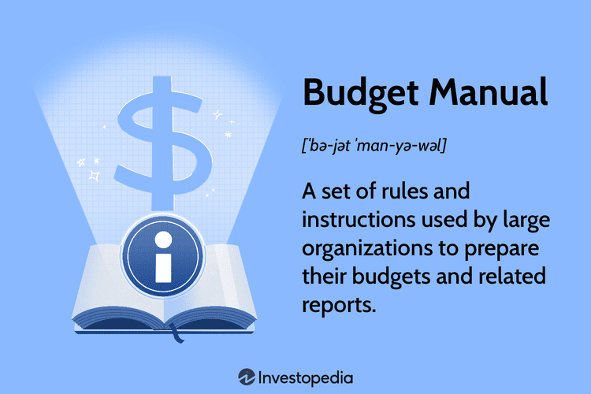

In today's fast-paced financial world, maintaining a robust foundation in budgeting and financial planning is integral for both individuals and businesses. As financial landscapes evolve, understanding and integrating various methodologies can enhance your financial strategies. This article examines the pivotal areas of traditional budgeting, financial planning, and the innovative domain of algorithmic trading.

Traditional budgeting forms the backbone of financial planning by providing a structured approach to manage resources efficiently. We will look into what constitutes a budget manual, detailing its critical role in guiding organizations through the budgeting process. A budget manual not only standardizes procedures but also enhances consistency and accuracy in financial activities, ensuring that organizations remain aligned with their strategic objectives.

On the other hand, algorithmic trading introduces a modern perspective to financial planning and investment management. By employing algorithms, investors and financial institutions can automate trading decisions, capitalizing on speed and precision to process vast datasets. This strategic advantage can lead to more informed investment strategies, adapting swiftly to market conditions. Understanding this intersection allows for a more dynamic approach to achieving financial goals, merging the foundational principles of financial planning with the innovative practices of algorithmic trading.

By exploring practical insights and real-world examples, this article aims to enhance your financial acumen, equipping you with the knowledge to navigate and succeed in the ever-evolving financial landscape.

## Table of Contents

## What is a Budget Manual?

A budget manual is a comprehensive document that functions as a critical tool for effective budgeting within an organization. It systematically outlines the procedures, guidelines, and roles necessary to manage and control the budgeting process efficiently. This document serves as a roadmap, enabling organizations to standardize their budgeting processes and ensure consistency across various departments and levels of the organization.

At its core, a budget manual provides detailed instructions for all stages of the budgeting process, including preparation, implementation, monitoring, and control. By having a structured approach, organizations can align their financial activities with strategic objectives and maintain financial discipline.

The key components of a budget manual typically include:

1. **Budgeting Policies**: These are the foundational rules that govern how budgets should be created, maintained, and evaluated. Policies might cover aspects such as allowable expenses, funding sources, and contingency allocations.

2. **Roles and Responsibilities**: A budget manual clearly defines who is responsible for what within the budgeting process. This clarity helps minimize misunderstandings and errors while fostering a sense of accountability. Common roles include budget coordinators, financial analysts, and department managers.

3. **Reporting Requirements**: To ensure transparency and facilitate communication, a budget manual details the type and frequency of reports that must be generated throughout the budgeting cycle. This can include monthly financial statements, variance reports, and forecast updates.

4. **Procedures**: Detailed step-by-step guides on how to perform budgeting tasks are crucial to the manual. These procedures help ensure that everyone follows the same process, leading to consistent and reliable outputs.

In summary, a well-designed budget manual not only enhances the efficiency and accuracy of an organization's budgeting activities but also supports strategic financial planning by aligning resources with organizational goals. This proactive tool is essential for anticipating financial challenges and seizing opportunities for growth.

## Importance of Budget Manuals in Financial Planning

Budget manuals are crucial in financial planning as they provide a structured framework that ensures financial activities are aligned with the strategic objectives of an organization. By establishing a clear set of procedures and guidelines, budget manuals help maintain consistency in financial reporting and operations. They serve as a standard reference for all individuals involved in the budgeting process, promoting uniformity and reducing the likelihood of discrepancies or errors.

In financial reporting, consistency and accuracy are paramount. A budget manual outlines the specific roles and responsibilities of each participant in the budgeting process, thereby enhancing coordination. By clearly defining these roles, these manuals help prevent confusion and errors during budget preparation. This clarity is especially important in large organizations where multiple departments and teams must collaborate effectively to achieve overarching financial goals.

Moreover, budget manuals contribute to transparency by providing detailed instructions and frameworks that everyone in the organization can comprehend and follow. This transparency is critical for building trust and ensuring all stakeholders are engaged and informed. By delineating the process, a budget manual enables easier tracking of financial activities and enhances accountability within the organization.

A well-crafted budget manual also aids in proactive decision-making. It does this by anticipating potential financial challenges and opportunities, allowing financial planners to take preemptive actions. For example, by detailing the expected cash flow, resource allocation, and potential financial risks, a budget manual equips decision-makers with the information needed to make informed choices. This proactive approach can improve an organization’s financial resilience and ability to adapt to changing economic conditions.

In conclusion, budget manuals are indispensable in financial planning. They not only standardize and streamline budgeting processes but also enhance the overall financial health of an organization by fostering consistency, accuracy, and strategic foresight.

## Algorithmic Trading and Its Role in Financial Planning

Algorithmic trading employs sophisticated algorithms to automate investment decisions and portfolio management. This innovative approach harnesses the power of technology to execute trades at unprecedented speeds, offering distinct advantages over traditional trading methods. These include enhanced speed, precision, and the ability to handle vast volumes of data quickly, leading to more informed and effective investment strategies.

The implementation of [algorithmic trading](/wiki/algorithmic-trading) allows investors to process and analyze large datasets efficiently. Algorithms can scan various market conditions and indicators, such as price changes, [volume](/wiki/volume-trading-strategy), time, and other metrics, to make autonomous decisions about whether to buy or sell securities. For example, a [momentum](/wiki/momentum) trading algorithm might execute trades based on the continuous upward or downward price movement of a stock. This capability not only reduces human error but also optimizes the timing of transactions to potentially increase profit margins.

For those involved in financial planning, understanding and incorporating algorithmic trading can significantly enhance investment management. One of the basic principles is the identification and [backtesting](/wiki/backtesting) of trading strategies to predict their future performance and assess risk levels. This knowledge is crucial for developing robust and adaptive financial strategies that can withstand market volatilities.

Moreover, integrating financial planning with algorithmic trading fosters a more dynamic approach to meeting financial goals. By automating the execution of investment strategies, financial planners and investors can focus on strategy development and broader economic assessments, thereby achieving objectives more systematically. This integration encourages a proactive posture toward risk management and opportunity identification within financial markets.

In summary, algorithmic trading stands as a vital component of modern financial planning, providing tools that enhance the speed and precision of investment activities while enabling investors and planners to navigate increasingly complex market environments with confidence.

## Developing an Effective Budget Manual: A Step-by-Step Guide

Developing an effective budget manual involves a systematic approach that ensures the document is comprehensive, practical, and tailored to the specific needs of an organization. The process begins with a thorough assessment of current financial practices to identify areas that require improvement. This initial step is crucial as it lays the foundation for the entire budgeting framework.

The first task in developing a budget manual is to draft the core content, which includes establishing budget policies, outlining procedures, and defining key roles and responsibilities. This core content serves as the backbone of the manual, providing clear instructions on how budgeting activities should be conducted within the organization. Budget policies typically cover the fundamental principles guiding the budgeting process, while procedures lay out the specific steps required to prepare, implement, and monitor budgets effectively. Additionally, clearly defining the roles of individuals involved in the budgeting process promotes accountability and ensures that each team member understands their specific tasks and responsibilities.

Engaging stakeholders through workshops is an essential component of developing a budget manual. These collaborative sessions serve as opportunities to gather valuable insights and ensure that all relevant parties are aligned with the proposed budgeting framework. Involving stakeholders not only enriches the content of the manual with diverse perspectives but also fosters a sense of ownership and commitment among those who will be responsible for implementing the budget.

After drafting the manual and incorporating stakeholder input, the next step is to finalize and review the document. This phase involves seeking feedback from financial experts to verify that the manual is both accurate and practical. Expert reviewers can provide critical assessments to ensure that the budget guidelines are robust and capable of supporting the organization’s financial objectives. This iterative review process helps to refine the manual further, making it an effective tool for financial planning and control.

Throughout the development of a budget manual, it is important to maintain a focus on the specific needs and strategic goals of the organization. By following this step-by-step guide, organizations can create a budget manual that not only standardizes their budgeting processes but also enhances their overall financial planning and execution capabilities.

## Case Study: XYZ Corporation's Budget Manual Implementation

XYZ Corporation's journey towards streamlining its budgeting process illustrates the transformative power of a well-implemented budget manual. By adopting a structured approach to budgeting, the corporation significantly improved its financial control, resource allocation, and overall performance.

The implementation of a budget manual at XYZ Corporation began with the identification of inconsistencies in budgeting procedures across various departments. This lack of standardization often led to discrepancies in financial reports and hindered effective decision-making. To address these challenges, XYZ Corp developed a comprehensive budget manual that outlined clear procedures, roles, and responsibilities.

The manual standardized budgeting procedures across multiple departments, ensuring that each unit adhered to the organization's financial policies. This standardization promoted transparency and consistency in financial reporting, which is crucial for maintaining control over financial activities. With clearly defined guidelines, department heads had a better understanding of their roles in the budgeting process, reducing errors and enhancing coordination.

Moreover, the budget manual emphasized clear communication and accountability. By delineating the responsibilities of each team member involved in the budgeting process, XYZ Corp fostered an environment of accountability. This approach not only improved collaboration but also enabled the company to anticipate and respond to financial challenges more effectively.

XYZ Corporation's budget manual also played a pivotal role in improving resource allocation. With a structured framework in place, the company was able to identify and eliminate inefficiencies in resource distribution. This led to more strategic allocation of financial resources, optimizing expenditure and maximizing returns on investments.

The positive impact of the budget manual on XYZ Corp's financial performance was evident in its enhanced decision-making capabilities. By providing a clear roadmap for budgeting activities, the manual enabled the company to forecast financial outcomes more accurately, paving the way for proactive financial planning.

In summary, XYZ Corporation's successful implementation of a budget manual serves as a valuable example for other businesses aiming to enhance their financial planning processes. By adopting a comprehensive and structured approach to budgeting, organizations can improve financial control, foster accountability, and achieve better resource allocation, which ultimately leads to improved financial performance.

## Conclusion

Bringing together budget manuals and algorithmic trading offers a comprehensive approach to elevate financial planning capabilities. Budget manuals are essential for establishing a robust framework that ensures consistency and accuracy in financial operations. These manuals serve as detailed guides, setting clear policies and procedures that provide organizations with the discipline needed to align financial activities with strategic objectives. Their role in promoting transparency, improving coordination, and enabling precise financial reporting is indispensable for maintaining organizational integrity and achieving fiscal goals.

On the other hand, algorithmic trading introduces a cutting-edge approach to investment management, utilizing automated processes driven by sophisticated algorithms. This technology enhances the efficiency and precision of executing trading strategies by quickly analyzing large datasets and executing trades at optimal conditions. The ability to harness such technology allows investors to respond to market changes in real-time, ensuring more strategic decision-making and resource allocation.

By integrating budget manuals with algorithmic trading, individuals and businesses can achieve a balanced financial strategy that leverages structured processes and advanced technology. This combination fosters an environment where precise budgeting aligns seamlessly with dynamic investment management. Consequently, embracing these tools is likely to result in stronger financial stability, better resource management, and an enhanced ability to navigate the complexities of an ever-evolving financial landscape. The synergy of traditional budgeting frameworks with innovative trading technologies positions organizations to capitalize on opportunities and mitigate financial risks more effectively.

## References & Further Reading

[1]: Bergstra, J., Bardenet, R., Bengio, Y., & Kégl, B. (2011). ["Algorithms for Hyper-Parameter Optimization."](https://dl.acm.org/doi/10.5555/2986459.2986743) Advances in Neural Information Processing Systems 24.

[2]: ["Advances in Financial Machine Learning"](https://www.amazon.com/Advances-Financial-Machine-Learning-Marcos/dp/1119482089) by Marcos Lopez de Prado

[3]: ["Evidence-Based Technical Analysis: Applying the Scientific Method and Statistical Inference to Trading Signals"](https://www.amazon.com/Evidence-Based-Technical-Analysis-Scientific-Statistical/dp/0470008741) by David Aronson

[4]: ["Machine Learning for Algorithmic Trading"](https://github.com/stefan-jansen/machine-learning-for-trading) by Stefan Jansen

[5]: ["Quantitative Trading: How to Build Your Own Algorithmic Trading Business"](https://github.com/LucindaYa/quant-resources/blob/master/Quantitative%20Trading%20How%20to%20Build%20Your%20Own%20Algorithmic%20Trading%20Business.pdf) by Ernest P. Chan