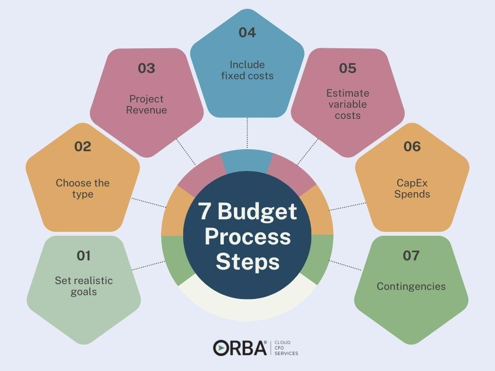

In the ever-evolving world of business finance, staying ahead of the curve is imperative for success. Corporate budgeting and financial planning are fundamental aspects that guide companies towards achieving their financial goals. These processes involve carefully managing a company's monetary resources, predicting revenues, allocating funds, and setting clear financial objectives. They form a roadmap that helps organizations remain financially stable and resilient during economic fluctuations and uncertainty.

In recent years, algorithmic trading, or algo trading, has emerged as a crucial tool in the financial industry, revolutionizing the way businesses approach investments. By using automated, pre-programmed trading instructions, algo trading allows for executing trades under optimal conditions with unmatched speed and accuracy. This innovation has transformed the landscape of financial trading by enabling the processing of large volumes of data and making informed investment decisions based on sophisticated algorithms.



This article explores the interconnected nature of business finance, corporate budgeting, financial planning, and algorithmic trading. Understanding these components allows businesses to refine their financial strategies and optimize operations, ensuring long-term sustainability and growth. As technology continues to advance, mastering these financial disciplines becomes increasingly essential for companies aiming to remain competitive in today's dynamic market.

## Table of Contents

## Understanding Business Finance

Business finance encompasses a broad range of activities and responsibilities that are essential for the successful management of an organization’s monetary resources. It covers areas such as budgeting, lending, investing, forecasting, and saving. These components are critical for the effective deployment of capital, risk mitigation, and profit maximization.

Budgeting is a foundational aspect of business finance, enabling companies to plan their expenditures and set financial goals. By predicting revenues and allocating funds appropriately, a company can ensure it operates within its means and invests in growth opportunities. The use of financial forecasting models assists in anticipating future financial conditions and planning accordingly. For example, financial forecasting might employ time series analysis to predict sales, where historical data is analyzed to project future trends. In Python, libraries like `pandas` and `statsmodels` can be utilized for such analyses to improve accuracy and preparedness.

On the other hand, lending and investing involve allocating funds to projects or investments that promise returns. A significant component of investing is evaluating the expected return versus risk; businesses often use valuation models such as the Net Present Value (NPV) and Internal Rate of Return (IRR). These models help in decision-making by quantifying the financial benefits of projects. The NPV formula, for instance, is expressed as:

$$

NPV = \sum_{t=0}^{n} \frac{C_t}{(1 + r)^t} 
$$

where $C_t$ is the net cash inflow during the period $t$, $r$ is the discount rate, and $n$ is the total number of periods.

Risk management is another critical aspect of business finance. Effective strategies require identifying possible risks and implementing measures to manage them, such as diversifying investments or using hedging techniques to protect against unforeseen market shifts.

Maintaining sound financial practices directly influences a company's longevity and success. Companies that strategically manage their financial resources not only enhance their resilience to market fluctuations but also improve their ability to fund innovation and expansion. As businesses evolve, ongoing adaptation and adherence to robust financial principles are key to thriving in competitive markets. By consistently applying these practices, companies can sustain growth and achieve long-term objectives.

## The Role of Corporate Budgeting

Corporate budgeting is a pivotal component of business finance that involves the crafting of a detailed plan for the allocation of a company's financial resources. This process is essential as it allows organizations to predict revenues, allocate funds efficiently, and set robust financial goals. By doing so, companies can ensure financial stability and effectively navigate economic fluctuations.

To create an effective corporate budget, businesses employ a variety of tools and techniques. A comprehensive understanding of projected revenues is central to the budgeting process. Revenue forecasting models, such as time series analysis or regression models, are frequently used to estimate future income based on historical data. These models can be implemented using programming languages like Python. For example, a basic revenue forecasting model using Python might look like this:

```python
import numpy as np
import pandas as pd
from sklearn.linear_model import LinearRegression

# Assume df is a pandas DataFrame containing columns 'Year' and 'Revenue'
X = df[['Year']]
y = df['Revenue']

# Create a linear regression model
model = LinearRegression()
model.fit(X, y)

# Predict future revenue for a given year
future_year = np.array([[2024]])
predicted_revenue = model.predict(future_year)

print(f"Predicted Revenue for 2024: {predicted_revenue}")
```

Once revenue predictions are made, the next step in corporate budgeting involves the strategic allocation of funds. This includes setting aside resources for operating expenses, capital investments, and potential debt repayments. The goal is to allocate resources in a manner that maximizes profitability while reducing financial risks.

Furthermore, setting financial goals is a critical aspect of budget planning. These goals guide decision-making and resource allocation throughout the fiscal year. Financial goals typically include target profit margins, return on investment (ROI), and cash flow projections.

In addition to predictive models, various budgeting techniques are utilized to enhance the budgeting process. Zero-based budgeting, for instance, starts from a "zero base," meaning that every expense must be justified for each new period. This technique can lead to more effective cost management as it prompts a detailed examination of each expense.

Activity-based budgeting (ABB) is another technique that investigates into the costs associated with specific business activities, offering insights into where efficiencies can be found. Through ABB, companies can allocate resources based on the activities that generate the most value.

Proper budgeting ensures a company maintains financial health and stability, even amidst economic uncertainties. By leveraging analytical tools and strategic planning methods, businesses can create robust financial plans that support their overall strategic objectives. Furthermore, effective budgeting not only stabilizes financial health but also enhances decision-making capabilities, allowing companies to remain agile and resilient in responding to market changes.

In conclusion, corporate budgeting is not just a financial exercise, but a strategic initiative that fortifies a company's capacity to endure economic challenges and capitalize on growth opportunities.

## Financial Planning: A Strategic Approach

Financial planning is a dynamic and essential process that involves evaluating a company's current financial position and devising strategies to achieve future objectives. This process is crucial for ensuring a firm's long-term sustainability and growth. By assessing risks, creating financial projections, and setting clear priorities, businesses can effectively allocate resources and make well-informed decisions.

A core element of financial planning is risk assessment, which involves identifying and evaluating potential financial risks that could impact the company’s ability to achieve its goals. This encompasses a range of factors such as market [volatility](/wiki/volatility-trading-strategies), credit risks, and operational uncertainties. Tools like sensitivity analysis and scenario planning are often used to anticipate different outcomes and prepare contingency plans. Sensitivity analysis examines how different values of an independent variable affect a particular dependent variable under a given set of assumptions. Scenario planning, on the other hand, involves envisioning a set of plausible future scenarios to understand potential impacts on financial goals.

Creating accurate financial projections is another key element of successful financial planning. Projections typically include income statements, balance sheets, and cash flow forecasts. These projections help businesses understand potential future revenue streams, costs, and capital requirements. By regularly updating these projections, companies can adapt to changing market conditions and internal developments rapidly.

For translating strategic goals into actionable plans, setting financial priorities is imperative. Businesses must determine which projects or investments align best with their strategic objectives and expected returns. This often involves prioritizing initiatives that offer the highest potential for growth or the most strategic benefit. 

Financial planning also incorporates the use of quantitative tools and models to enhance decision-making and resource allocation. For instance, companies may use linear programming to optimize resource distribution across various projects, or employ the Net Present Value (NPV) and Internal Rate of Return (IRR) methods to evaluate investment opportunities. These models assist in interpreting financial data and enable managers to make decisions that align with the company’s long-term strategic goals.

In conclusion, comprehensive financial planning is vital for businesses aiming to achieve sustainability and growth. By systematically assessing risks, constructing financial projections, and establishing priorities, firms can navigate financial challenges and seize opportunities, ensuring they are well-positioned for future success.

## Emergence of Algorithmic Trading

Algorithmic trading, commonly referred to as algo trading, involves the use of computer algorithms to automatically execute a large [volume](/wiki/volume-trading-strategy) of trades with minimal human intervention. These pre-programmed instructions are designed to [carry](/wiki/carry-trading) out orders at optimal market conditions based on variables such as timing, price, and volume. As a result, algo trading has significantly transformed financial markets by increasing both the speed and accuracy of trade execution while enabling the processing of vast amounts of market data.

### History and Development

The origins of [algorithmic trading](/wiki/algorithmic-trading) can be traced back to the 1970s with the advent of electronic exchanges which enabled the automation of trading processes. Over the following decades, with improvements in computational technology and access to high-frequency market data, algo trading has evolved dramatically. The 1990s saw the rise of quantitative analysis and statistical [arbitrage](/wiki/arbitrage) strategies, laying the foundation for more sophisticated trading algorithms.

The turn of the century witnessed a surge in the popularity of high-frequency trading ([HFT](/wiki/high-frequency-trading-strategies)), a subset of algorithmic trading. HFT algorithms can execute trades at microsecond intervals, thus capitalizing on minute price discrepancies that are imperceptible to human traders. The proliferation of HFT has contributed to increased market [liquidity](/wiki/liquidity-risk-premium) and reduced bid-ask spreads, although it has also raised concerns about market volatility and fairness.

### Impact on Financial Markets

The integration of algorithmic systems in trading has transformed market dynamics. Efficiency in executing large orders has improved significantly, reducing the market impact and allowing for smoother price adjustments. The ability to back-test historical data and analyze real-time market conditions empowers traders to formulate data-driven strategies aimed at enhancing profitability and minimizing risks.

Furthermore, algorithms enable market participants to exploit arbitrage opportunities across global markets instantaneously, fostering greater market interconnectedness. However, the rapidity and complexity inherent in algo trading have occasionally led to unintended consequences, such as the infamous "Flash Crash" of 2010, which highlighted the risks of algorithm-induced market disturbances.

### Benefits for Businesses

For businesses engaged in trading activities, algorithmic trading offers several benefits:

1. **Efficiency:** Automating the trading process reduces the time and effort required to execute trades, allowing firms to focus on developing broader trading strategies and risk management practices.

2. **Cost Reduction:** By minimizing the market impact and transaction costs associated with manual trading, businesses can achieve better net execution prices, enhancing overall profit margins.

3. **Risk Management:** Algorithms can swiftly react to market changes, enabling firms to manage exposure effectively and mitigate potential losses.

4. **Market Access:** Algorithms allow firms to participate in markets across various asset classes and geographical locations, offering diversification opportunities and expanded business reach.

### Common Strategies in Algorithmic Trading

A variety of strategies are employed within algo trading, each tailored to exploit specific market conditions and objectives:

- **Market Making:** Algorithms continuously quote buy and sell prices to capture the bid-ask spread.

- **Trend Following:** Algorithms identify and follow existing market trends based on technical indicators and historical data patterns.

- **Statistical Arbitrage:** Algorithms identify and exploit pricing inefficiencies between correlated assets.

- **Mean Reversion:** Algorithms assume that asset prices will revert to their historical average, allowing for trades based on identified deviations.

Overall, algorithmic trading represents a paradigm shift in how financial markets operate. It has introduced efficiencies and complexities that continue to reshape trading landscapes, driving innovation and necessitating adaptive regulatory frameworks. As technology progresses, the implications of algorithmic trading will further evolve, impacting both market participants and structures.

## Integrating Financial Planning with Algo Trading

The integration of financial planning with algorithmic trading can offer substantial benefits for businesses by enhancing decision-making processes and optimizing resource allocation. Algorithmic trading employs data-driven techniques to execute trades at optimal conditions, thereby allowing businesses to craft strategies that align closely with market dynamics. By leveraging these capabilities, companies can significantly refine their financial planning efforts.

Algorithmic trading provides predictive insights through the analysis of large datasets, enabling more accurate forecasting and risk assessment. This is critical in financial planning, where understanding market trends and emerging risks can inform better strategic decisions. For example, by incorporating [machine learning](/wiki/machine-learning) models, businesses can predict market movements with greater precision, thus allowing for more informed asset allocation. A simple algorithm employing linear regression might look like this:

```python
import numpy as np
from sklearn.linear_model import LinearRegression

# Sample data: market indicators and relevant stock prices
market_data = np.array([[1.2, 2.4], [2.3, 0.5], [1.3, 2.1]])
stock_prices = np.array([3.0, 2.1, 3.2])

# Linear regression model
model = LinearRegression().fit(market_data, stock_prices)

# Predict future stock prices based on new market conditions
new_market_data = np.array([[1.5, 2.2]])
predicted_prices = model.predict(new_market_data)
```

The integration of algo trading into financial planning also allows for improved financial performance through automated systems that can execute trades at high speed and with minimal human intervention. This automation reduces transaction costs and minimizes the effects of market volatility, both of which are crucial for maintaining operational efficiency.

Nevertheless, merging these two domains poses challenges. One critical issue is the reliance on accurate data inputs; poor-quality data can lead to flawed predictions and suboptimal resource allocation. Additionally, the rapid nature of algorithmic trading requires robust risk management frameworks to handle potential losses swiftly.

To successfully integrate financial planning with algorithmic trading, businesses should employ best practices such as continuous monitoring and adjustment of trading algorithms, ensuring data quality, and maintaining transparent governance structures. Risk management should include strategies to handle unexpected market changes, such as setting automated stop-loss limits or implementing a dynamic hedging strategy.

By embracing these practices, companies can effectively merge the analytical capabilities of algorithmic trading with strategic financial planning, enhancing their ability to achieve long-term fiscal goals and maintain a competitive edge.

## Future Trends in Business Finance

The landscape of business finance is evolving rapidly, driven by technological advancements and dynamic market conditions. Emerging trends are poised to redefine corporate budgeting, financial planning, and algorithmic trading, making it crucial for businesses to adapt and innovate.

One of the prominent trends is the increasing adoption of [artificial intelligence](/wiki/ai-artificial-intelligence) (AI) in financial strategies. AI technologies enable companies to analyze vast and complex datasets with greater accuracy and speed. Machine learning algorithms can identify patterns and predict future market trends, allowing businesses to optimize their budgeting and investment decisions. For instance, AI-driven models can enhance risk assessment processes by processing historical data and providing probabilistic forecasts, thus enabling companies to allocate their resources more efficiently.

Decentralized finance (DeFi) represents another transformative trend. Built on blockchain technology, DeFi creates opportunities for businesses to engage in financial transactions without traditional intermediaries such as banks. This not only reduces costs but also opens access to a global market. Smart contracts, a core component of DeFi, automate transactions and ensure transparency and security. For financial planning, the implications are significant—companies can leverage DeFi platforms for efficient capital management and seamless cross-border transactions.

Integration of advanced analytics and big data is set to further revolutionize business finance. The ability to harness large volumes of data allows companies to gain deep insights into market behavior and consumer preferences. Predictive analytics, enabled by sophisticated computational models, can improve asset management and enhance financial strategies. By modeling financial scenarios, businesses can develop robust plans that account for potential market fluctuations.

The rise of quantum computing also holds significant potential for financial markets, particularly in algorithmic trading. Quantum computers can process information at unprecedented speeds, solving complex optimization problems that are currently impractical. This capability may lead to breakthroughs in trading algorithms, offering new levels of precision and speed that could redefine market strategies.

The shift towards sustainable finance is increasingly influencing business finance practices. Environmental, Social, and Governance ([ESG](/wiki/esg-investing)) criteria are being integrated into corporate financial decisions. Companies are developing frameworks that align financial objectives with sustainability goals to meet regulatory requirements and consumer expectations. Sustainable finance promotes long-term growth and stability, as it considers the broader impact of financial decisions on society and the environment.

Finally, cybersecurity remains a paramount concern in the future of business finance. As financial operations become more digitized, the risk of cyber threats increases. Companies must invest in robust cybersecurity frameworks to protect sensitive financial data and maintain trust with stakeholders. Metrics-driven approaches to cybersecurity can enhance threat detection and response strategies, ensuring the resilience of financial systems.

In conclusion, businesses must stay informed and strategically agile to capitalize on emerging trends in business finance. By embracing AI, DeFi, advanced analytics, quantum computing, sustainable finance, and robust cybersecurity practices, companies can enhance their competitiveness and secure a prosperous future.

## Conclusion

Business finance, encompassing corporate budgeting, financial planning, and algorithmic trading, plays a pivotal role in enabling companies to achieve and sustain financial success. Effectively managing these interrelated components is crucial for navigating the complexities of the modern financial environment. As technology continues to evolve, innovative methods and tools emerge, offering numerous opportunities to refine financial operations and enhance strategic decision-making.

Understanding the synergy between corporate budgeting and financial planning is fundamental, as it allows businesses to allocate resources judiciously, respond to market dynamics wisely, and set attainable financial goals. This requires a thorough grasp of revenue forecasting, cost management, and risk assessment. Algorithmic trading complements these efforts by leveraging data-driven insights to execute trades with precision, efficiency, and minimal human intervention. This approach not only optimizes investment strategies but also fortifies a business’s financial framework against volatility.

Technological advancements, particularly in artificial intelligence and machine learning, are set to further transform business finance. These technologies offer enhanced predictive analytics and automation capabilities, paving the way for more accurate and agile financial strategies. For instance, AI algorithms can scrutinize large datasets to identify market trends and potential investment opportunities, thereby enhancing decision-making processes.

To maintain a competitive edge, businesses must remain proactive in adapting to these changes and adopting new technologies. This involves continuous learning, investment in cutting-edge software solutions, and fostering a culture of innovation. By embracing these advancements and leveraging them effectively, companies can not only secure operational efficiencies but also drive sustainable growth and profitability. As the financial landscape continues to shift, staying informed and strategically agile will be key to securing a prosperous future.

## References & Further Reading

[1]: Bergstra, J., Bardenet, R., Bengio, Y., & Kégl, B. (2011). ["Algorithms for Hyper-Parameter Optimization."](https://papers.nips.cc/paper/4443-algorithms-for-hyper-parameter-optimization) Advances in Neural Information Processing Systems 24.

[2]: ["Advances in Financial Machine Learning"](https://www.amazon.com/Advances-Financial-Machine-Learning-Marcos/dp/1119482089) by Marcos Lopez de Prado

[3]: ["Evidence-Based Technical Analysis: Applying the Scientific Method and Statistical Inference to Trading Signals"](https://www.amazon.com/Evidence-Based-Technical-Analysis-Scientific-Statistical/dp/0470008741) by David Aronson

[4]: ["Machine Learning for Algorithmic Trading"](https://github.com/stefan-jansen/machine-learning-for-trading) by Stefan Jansen

[5]: ["Quantitative Trading: How to Build Your Own Algorithmic Trading Business"](https://www.amazon.com/Quantitative-Trading-Build-Algorithmic-Business/dp/1119800064) by Ernest P. Chan