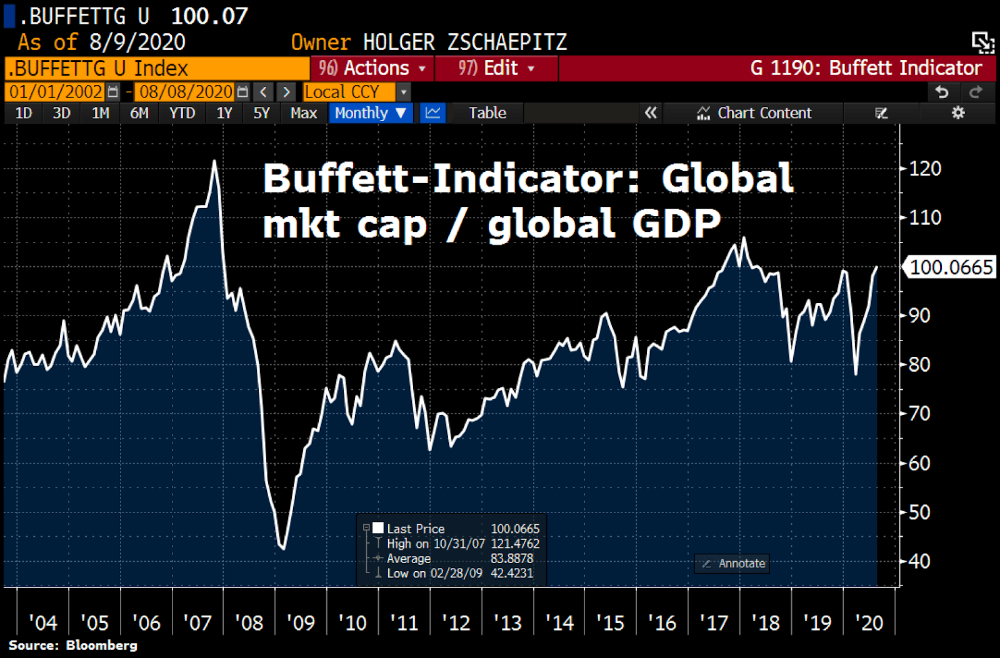

## Table of Contents

## What is the Buffett indicator?

The Buffett Indicator is a way to measure if the stock market is priced too high or too low. It was named after Warren Buffett, a famous investor. The indicator compares the total value of all stocks in the market to the total size of the economy, which is called the Gross Domestic Product (GDP). If the total value of the stocks is much bigger than the GDP, it might mean that stocks are overpriced. If it's smaller, stocks might be a good deal.

Warren Buffett thinks this indicator is a simple but good way to see if the market is overvalued or undervalued. He has said that when the indicator is very high, it could be a sign that a big drop in stock prices might happen soon. But it's not perfect and should be used with other information to make decisions about investing.

## Who is Warren Buffett and why is this indicator named after him?

Warren Buffett is a very successful businessman and investor. He was born in 1930 and started investing at a young age. He runs a big company called Berkshire Hathaway, which owns lots of other businesses and investments. People call him the "Oracle of Omaha" because he's really good at picking investments and he lives in Omaha, Nebraska. He's also known for being very wise and giving a lot of his money to charity.

The Buffett Indicator is named after him because he talked about it a lot. He said it's a good way to see if the stock market is too expensive or a good deal. The indicator compares the total value of all stocks to the size of the whole economy. Since Warren Buffett is famous for understanding the market well, people started calling this measure the Buffett Indicator to honor his idea.

## How is the Buffett indicator calculated?

The Buffett Indicator is calculated by dividing the total market value of all stocks by the Gross Domestic Product (GDP) of a country. The total market value of stocks, often called the market capitalization, is the price of all the shares of all the companies added together. GDP is the total value of all the goods and services produced in a country over a year. So, the Buffett Indicator is just a ratio that shows how big the stock market is compared to the whole economy.

To get the numbers for this calculation, you can use data from financial websites or government reports. For the total market value of stocks, you might look at a stock market index like the Wilshire 5000 for the U.S., which tries to include almost all stocks. For GDP, you can find numbers from places like the U.S. Bureau of Economic Analysis. Once you have these two numbers, you divide the total market value by the GDP, and that gives you the Buffett Indicator.

## What does the Buffett indicator measure?

The Buffett Indicator measures if the stock market is too expensive or a good deal by comparing the total value of all stocks to the size of the whole economy. It does this by dividing the total market value of all stocks by the Gross Domestic Product (GDP). GDP is just the total value of everything a country makes and sells in a year. If the total value of the stocks is much bigger than the GDP, it might mean that stocks are too pricey. If it's smaller, stocks might be a good buy.

Warren Buffett, a very famous investor, talked about this idea a lot. He said it's a simple way to see if the market is overvalued or undervalued. That's why people call it the Buffett Indicator. It's not perfect and should be used with other information, but it can give a good hint about the overall health of the stock market.

## What is considered a normal range for the Buffett indicator?

The normal range for the Buffett Indicator is usually between 70% and 100%. This means that if you take the total value of all the stocks in the market and divide it by the total value of everything a country makes and sells in a year (the GDP), the number should be somewhere between 0.70 and 1.00. When the indicator is in this range, it suggests that the stock market is priced fairly compared to the size of the economy.

If the Buffett Indicator goes above 100%, it might mean that stocks are too expensive and could be a sign that a big drop in stock prices might happen soon. On the other hand, if it's below 70%, it could mean that stocks are a good deal and might be a good time to buy. But remember, this is just one way to look at the market, and it's always a good idea to use other information too when making choices about investing.

## How can the Buffett indicator be used to assess market valuation?

The Buffett Indicator helps people see if the stock market is too expensive or a good deal by comparing the total value of all stocks to the total value of everything a country makes and sells in a year, which is called the GDP. If the Buffett Indicator is between 70% and 100%, it means the stock market is probably priced fairly compared to the size of the economy. This is the normal range where things are balanced.

If the Buffett Indicator goes above 100%, it might mean that stocks are too expensive. This could be a warning sign that a big drop in stock prices might happen soon. On the other hand, if the indicator is below 70%, it could mean that stocks are a good deal and might be a good time to buy them. But remember, the Buffett Indicator is just one tool, and it's smart to look at other things too when deciding about investing.

## What are the limitations of the Buffett indicator?

The Buffett Indicator has some problems that people should know about. It looks at the whole stock market compared to the whole economy, but it doesn't tell you about specific companies or industries. So, even if the indicator says the market is too expensive, some companies might still be a good deal. Also, the indicator uses numbers like the total value of stocks and the GDP, but these numbers can be hard to get right and might not be up to date.

Another issue is that the Buffett Indicator doesn't work the same in every country. Different countries have different ways of doing business and their economies can be very different. What might be a normal number for one country might not be normal for another. So, it's not always easy to use the Buffett Indicator to compare markets around the world. It's a good idea to use it with other tools and information to get a better picture of the market.

## How does the Buffett indicator compare to other market valuation metrics?

The Buffett Indicator is one way to see if the stock market is too expensive or a good deal, but there are other ways too. One common way is the Price-to-Earnings (P/E) ratio, which looks at the price of a stock compared to how much money the company makes. The P/E ratio can be used for individual stocks or the whole market. Another way is the Cyclically Adjusted Price-to-Earnings (CAPE) ratio, which uses average earnings over ten years to smooth out ups and downs. The Buffett Indicator is different because it compares the whole stock market to the whole economy, not just to company earnings.

Each of these methods has its own strengths and weaknesses. The Buffett Indicator gives a big picture of the market compared to the economy, but it doesn't tell you about specific companies or industries. The P/E ratio can give you a quick look at how expensive a stock is, but it can be affected by short-term changes in earnings. The CAPE ratio tries to fix this by looking at earnings over a longer time, but it still might not catch quick changes in the market. Because of these differences, it's a good idea to use more than one method when trying to figure out if the market is overvalued or undervalued.

## Can the Buffett indicator predict market crashes or bubbles?

The Buffett Indicator can give a hint about when the stock market might be too expensive or a good deal, but it can't predict market crashes or bubbles perfectly. If the indicator goes above 100%, it might mean that stocks are too pricey and a big drop in prices could happen soon. But it doesn't say when exactly this will happen or how bad it will be. It's like a warning light on your car dashboard; it tells you something might be wrong, but you need to look at other signs too.

Because the Buffett Indicator looks at the whole stock market compared to the whole economy, it's a broad measure and doesn't tell you about specific companies or industries. Other things like changes in interest rates, big news events, or even people's feelings about the market can also cause crashes or bubbles. So, while the Buffett Indicator can be a useful tool, it's best to use it with other information to get a fuller picture of what might happen in the market.

## How has the Buffett indicator performed historically?

The Buffett Indicator has been used to look at how the stock market has done over time. When it was high, like above 100%, it often meant the market was too expensive and a big drop in stock prices could happen soon. For example, before the big market drops in 2000 and 2008, the indicator was very high. This showed that stocks were priced much higher than the size of the economy, which can be a sign of trouble.

But the Buffett Indicator isn't perfect. Sometimes it was high, and a crash didn't happen right away. Other times, the market went up even when the indicator was high. For example, in the late 1990s, the indicator was high for a while before the market crashed in 2000. This shows that while the Buffett Indicator can give a warning, it doesn't tell you exactly when a crash will happen or how bad it will be. It's best to use it with other tools to get a better idea of what might happen in the market.

## What are some criticisms of the Buffett indicator?

Some people say the Buffett Indicator isn't perfect because it looks at the whole stock market compared to the whole economy, but it doesn't tell you about specific companies or industries. So, even if the indicator says the market is too expensive, some companies might still be a good deal. Also, the numbers used for the indicator, like the total value of stocks and the GDP, can be hard to get right and might not be up to date. This can make the indicator less useful if the numbers aren't accurate.

Another problem is that the Buffett Indicator doesn't work the same in every country. Different countries have different ways of doing business and their economies can be very different. What might be a normal number for one country might not be normal for another. So, it's not always easy to use the Buffett Indicator to compare markets around the world. People should use it with other tools and information to get a better picture of the market.

## How can investors incorporate the Buffett indicator into their investment strategy?

Investors can use the Buffett Indicator to get a big picture of whether the stock market is too expensive or a good deal. By comparing the total value of all stocks to the size of the whole economy, the indicator can help investors see if the market is overvalued or undervalued. If the indicator is above 100%, it might mean that stocks are too pricey and could be a sign that a big drop in stock prices might happen soon. On the other hand, if it's below 70%, it could mean that stocks are a good deal and might be a good time to buy. Investors can use this information to decide if they should be careful or if it's a good time to invest more.

However, the Buffett Indicator should not be the only tool investors use. It's important to look at other things too, like the Price-to-Earnings (P/E) ratio or the Cyclically Adjusted Price-to-Earnings (CAPE) ratio, which look at company earnings. Also, investors should pay attention to changes in interest rates, big news events, or how people feel about the market. By using the Buffett Indicator along with these other tools, investors can make smarter choices about when to buy or sell stocks. This way, they can get a fuller picture of what might happen in the market and plan their investments better.

## What is the Understanding of the Buffett Indicator?

The Buffett Indicator is a metric developed to evaluate the overall valuation of a stock market by comparing the total market capitalization of a country’s stock market to its Gross Domestic Product (GDP). It is expressed mathematically as:

$$
\text{Buffett Indicator} = \frac{\text{Total Market Capitalization}}{\text{GDP}}
$$

This ratio provides a snapshot of how the stock market is valued relative to the size of the economy. A high ratio suggests that the market may be overvalued, while a low ratio indicates potential undervaluation. Historically, the Buffett Indicator has been considered a reliable predictor of long-term market trends, highlighting possible future corrections or expansions.

Warren Buffett, one of the most successful investors, popularized this indicator by describing it as the best single measure to determine whether stock valuations are at reasonable levels at a given time. It acts on the foundational principle that stock market valuation should align with economic growth. If market capitalization significantly outpaces GDP growth, it might indicate that stocks are overpriced, whereas slower market growth relative to GDP could suggest that the market is undervalued.

The importance of the Buffett Indicator lies in its ability to signal when the equity market's growth is unsustainable or when an economy might need adjustments to align with real market valuations. While no single metric can predict market movements with absolute certainty, the Buffett Indicator offers a broad measure of market valuation, serving as an essential tool for investors looking to gauge the market climate over the long term.

## References & Further Reading

[1]: ["The Buffett Indicator: Analyzing Market Valuation"](https://currentmarketvaluation.com/models/buffett-indicator.php) - Forbes article discussing the Buffett Indicator.

[2]: ["Warren Buffett and the Interpretation of Financial Statements: The Search for the Company with a Durable Competitive Advantage"](https://www.amazon.com/Warren-Buffett-Interpretation-Financial-Statements/dp/1849833192) by Mary Buffett and David Clark - A book providing insights into Buffett's investment techniques.

[3]: ["Algorithmic Trading: Winning Strategies and Their Rationale"](https://www.amazon.com/Algorithmic-Trading-Winning-Strategies-Rationale/dp/1118460146) by Ernest P. Chan - A book on developing trading strategies using algorithms.

[4]: ["Global Finance: Buffett Indicator"](https://thebuffettindicator.com/) - Global Finance magazine article on the Buffett Indicator and its implications.

[5]: ["Investing: The Last Liberal Art"](https://www.amazon.com/Investing-Liberal-Columbia-Business-Publishing/dp/0231160100) by Robert G. Hagstrom - A book exploring the multidisciplinary approach to investing, including concepts like the Buffett Indicator.