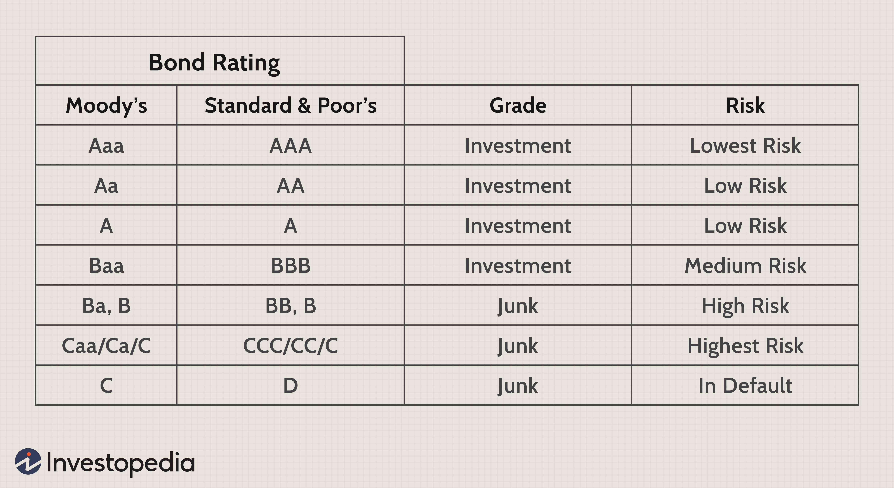

Bonds are pivotal financial instruments in investment, facilitating the mobilization of capital for various entities, from governments to corporations. Of particular interest is the Build America Bonds (BABs) program, a novel type of municipal bond structure. These bonds, introduced through the American Recovery and Reinvestment Act of 2009, played a crucial role during a period marked by economic uncertainty. Designed primarily to spur economic activity post the 2008 financial crisis, BABs distinguished themselves by offering federal tax incentives, either as credits or subsidies, thereby reducing borrowing costs for local governments and helping finance critical infrastructure projects.

The significance of BABs lies not only in their immediate economic impact but also in their departure from the traditional tax-exempt municipal bonds, offering a taxable alternative that still appealed to a wide array of investors due to the federal subsidies involved. This shift in fiscal strategy highlights the importance of understanding the different structures and restrictions that come with various bonds, enabling investors to navigate complex markets effectively.

This exploration of bond restrictions and types extends to the impact of technological advancement in trading strategies. The advent of algorithmic trading, for instance, has revolutionized bond markets by enhancing transaction efficiency and precision. Analyzing these dynamics provides valuable insights into modern investment practices and the interplay between new financial instruments and evolving trading methodologies. Through this article, we aim to unpack the historical context, operational nuances, and modern-day relevance of Build America Bonds within today's trading environment, equipping investors with the knowledge to make informed decisions in a rapidly evolving financial landscape.

## Table of Contents

## Understanding Build America Bonds (BABs)

Build America Bonds (BABs) emerged as a key component of the American Recovery and Reinvestment Act of 2009, acting as an innovative response to the economic challenges following the 2008 financial crisis. These bonds were structured as taxable municipal securities with the primary goal of stimulating economic activity and supporting local infrastructure projects. By introducing BABs, the U.S. government aimed to broaden the appeal of municipal bonds beyond the traditional investor base.

The design of BABs incorporated federal tax credits or subsidies, which differentiated them from traditional municipal bonds. Instead of offering interest income that is exempt from federal taxes, BABs provided either a direct subsidy to the bond issuers or tax credits to the bondholders. This approach was intended to make these bonds more attractive to a wider range of investors, including those in higher tax brackets who typically shy away from traditional tax-exempt municipal bonds due to lower yields.

Launched in the aftermath of the economic downturn, the BAB program proved crucial as it addressed the liquidity concerns of municipal issuers. During this period, many investors were hesitant to invest in municipal bonds due to uncertainties regarding municipal credit quality. BABs offered a solution by helping state and local governments access capital at more favorable rates, thus enabling them to continue essential infrastructure developments without excessive financial strain.

Although the Build America Bonds program officially ended in 2010, its legacy persists. The insights derived from its execution are invaluable for current financial analyses, particularly in understanding how government-backed financial instruments can aid in economic recovery and infrastructure development. Consequently, BABs continue to serve as a point of reference when examining the effectiveness of government interventions in stabilizing and stimulating the economy.

## Types of Build America Bonds

Build America Bonds (BABs) were offered in two distinct types: tax credit BABs and direct payment BABs. These structures were developed under the American Recovery and Reinvestment Act of 2009 to provide state and local governments with lower borrowing costs, ultimately encouraging infrastructure investment.

**Tax Credit Build America Bonds**: This category provided bondholders with a federal tax credit equivalent to 35% of the interest paid on the bonds. For example, if an investor received $1,000 in interest from a BAB, they would obtain a $350 tax credit. This credit could be applied to offset federal income tax, and if it exceeded the bondholder’s tax liability, it could potentially be carried forward to subsequent years. This mechanism aimed to increase the attractiveness of these securities by boosting the effective yield to the investors.

**Direct Payment Build America Bonds**: These bonds functioned differently, offering a direct subsidy to the bond issuer rather than the bondholder. In this arrangement, the federal government reimbursed the issuer for a portion of the interest costs—again, typically 35%. This subsidy effectively reduced the issuer's net interest expense, enabling them to issue bonds at more competitive rates that were more attractive to investors. The formula for calculating the issuer's net interest cost can be articulated as follows:

$$
\text{Net Interest Cost} = \text{Total Interest Payment} - \text{Federal Subsidy}
$$

where the Federal Subsidy is 35% of the Total Interest Payment.

In both instances, the overarching goal was to supply capital swiftly and efficiently, assisting municipalities in overcoming the economic hurdles posed by the financial crisis. These provisions also aimed to broaden the appeal of municipal bonds to a wider investment audience, including those who might not typically benefit from the traditional tax-exempt structure of municipal bonds.

## Restrictions on Build America Bonds

Build America Bonds (BABs) came with specific issuance restrictions to ensure they were utilized effectively for their intended purpose: stimulating economic growth through infrastructure development. Only new issue capital expenditure bonds were eligible under the BABs program, which means bonds used for refinancing existing debt were not permitted. This limitation was designed to direct funds explicitly towards new projects rather than relieving previous financial obligations.

Moreover, the eligibility to issue BABs was restricted, excluding private party issuers and 501(c)(3) nonprofit organizations. This exclusion was based on the goal to concentrate the benefits of the program on government-related entities, which were considered pivotal in carrying out large-scale infrastructure projects. The focus was primarily on local and state government projects, ensuring that the federal subsidies or tax credits provided would directly contribute to new capital improvements.

Another critical limitation was the timeframe within which these bonds could be issued. The program had a predefined expiration, with all BABs needing to be issued before January 1, 2011. This deadline added urgency for governmental bodies to plan and execute infrastructure initiatives under the program's umbrella.

Understanding these restrictions is crucial when evaluating the potential for similar future programs. By analyzing the successes and limitations tied to the BABs, policymakers and investors can gain insights into how structured financial interventions might be optimized for effective economic stimulus.

## Comparison: Build America Bonds vs. Traditional Municipal Bonds

The primary differentiator between Build America Bonds (BABs) and traditional municipal bonds lies in their tax treatment. Traditional municipal bonds are generally exempt from federal taxes and may also be exempt from state taxes, which provides a significant advantage for investors seeking tax-free income. This tax exemption makes municipal bonds particularly attractive to individuals in higher income tax brackets, as it enhances the effective yield of the bonds.

In contrast, the interest income from BABs is subject to federal taxation, which changes the calculation for potential investors. Despite this taxation, the design of BABs included federal subsidies to make them competitive with tax-exempt bonds. For example, direct payment BABs provided a subsidy directly to the bond issuer, covering a significant portion of the interest payments. This subsidy mechanism enabled municipalities to offer bonds with interest rates competitive with traditional municipal bonds, even though BABs lacked the tax-exempt status. 

From a practical perspective, investors considering BABs had to assess the impact of federal taxation on their overall return compared to the federal subsidy provided. This requires analyzing the net benefit, which can be expressed as:

$$
\text{Net Benefit} = \text{Interest Income} - \text{Federal Tax} + \text{Subsidy}
$$

By evaluating this equation, investors could determine whether the taxable status of BABs, counterbalanced by the subsidy, offered a favorable investment opportunity. Additionally, during the economic climate following the 2008 financial crisis, the guaranteed federal backing of BABs added an extra layer of security, potentially enhancing their appeal to cautious investors.

Ultimately, when weighing BABs against traditional municipal bonds, investors needed to consider the interplay between tax implications and subsidy benefits. Careful analysis would ensure informed decisions, tailored to individual tax circumstances and investment strategies.

## Algorithmic Trading and Its Role in Bond Markets

Algorithmic trading has markedly revolutionized bond markets, facilitating more efficient transaction processes. Leveraging advanced computational power, traders are capable of managing complex portfolios and executing substantial orders with enhanced speed and precision. This technological prowess allows for parsing through vast sets of market data to extract trends and uncover lucrative opportunities.

Automated trading systems employ a variety of algorithmic strategies, including statistical [arbitrage](/wiki/arbitrage) and [machine learning](/wiki/machine-learning) techniques, to analyze bond market trends. Such strategies offer insights into price movements and other market indicators, enabling traders to make informed decisions quickly. By harnessing these techniques, market participants can adapt to emerging patterns, optimizing their transactions for maximal gains.

The integration of [algorithmic trading](/wiki/algorithmic-trading) significantly influences [liquidity](/wiki/liquidity-risk-premium) and price discovery in bond markets. Advanced algorithms often enhance market liquidity by ensuring that buy and sell orders are processed swiftly, thereby facilitating smoother market operations. Furthermore, these algorithms contribute to more accurate price discovery by aligning trading activities with intrinsic bond values through complex analysis and modeling.

An intriguing area of exploration is the relationship between algorithmic trading and various types of bonds, including Build America Bonds (BABs). Investors interested in high-frequency trading environments must consider how BABs and similar instrument structures interact with algorithmic mechanisms. These considerations are paramount, as the algorithms' ability to swiftly analyze and react to bond-specific characteristics can dictate the success of trading strategies.

Overall, algorithmic trading not only enhances efficiency and accuracy in bond markets but also reshapes how investment opportunities are perceived and acted upon. As technology continues to evolve, its role in transforming financial markets, particularly bond markets, becomes increasingly pronounced. Staying informed and adept in these modern trading strategies is crucial for investors aiming to capitalize in today's high-tech financial landscape.

## Conclusion

While the Build America Bonds (BABs) program is no longer active, its influence remains significant in ongoing discourse about economic stimulus measures and the structures of bond markets. The innovative characteristics of BABs, such as taxable interest with federal subsidies, have set a precedent for designing future bond programs aimed at invigorating economic growth and supporting infrastructure development. 

Understanding the nuances of BABs, including their types, restrictions, and tax implications, is crucial for investors wishing to engage with similar programs that may arise. The knowledge of how these bonds operated provides insights into evaluating potential economic benefits and risks associated with future public finance strategies.

Furthermore, algorithmic trading has dramatically transformed bond markets, influencing how bonds, including those similar to BABs, are perceived and traded. The ability to process vast data sets and execute trades with speed and precision offers investors unique opportunities to exploit market inefficiencies and optimize portfolio management. Investors who grasp the intricacies of algorithmic trading can make more informed decisions, taking advantage of advanced technologies that offer competitive edges in trading environments.

Staying informed and adaptable in this evolving financial landscape is essential for navigating complexities efficiently. Investors equipped with a deep understanding of past programs like BABs, alongside algorithmic trading capabilities, are better prepared to tackle future challenges and seize opportunities within the bond market. Embracing a forward-thinking approach ensures readiness to capitalize on similar initiatives that aim to balance economic stimulus with the nuanced realities of contemporary financial markets.

## References & Further Reading

[1]: ["Build America Bonds: The First One Hundred Days"](https://www.irs.gov/pub/irs-tege/arra_baba_final_shw_qa.pdf) by the Brookings Institution

[2]: ["Municipal Bonds: Build America Bonds"](https://www.investopedia.com/terms/b/build-america-bonds-babs.asp) by the Financial Industry Regulatory Authority (FINRA)

[3]: ["Algorithmic Trading and DMA"](https://www.amazon.com/Algorithmic-Trading-DMA-introduction-strategies/dp/0956399207) by Barry Johnson

[4]: ["American Recovery and Reinvestment Act of 2009"](https://www.congress.gov/bill/111th-congress/house-bill/1/text) from Congress.gov

[5]: ["The Impact of Algorithmic Trading on Bonds"](https://www.axios.com/2021/09/03/bond-market-trading-algorithms) by the Bank for International Settlements

[6]: ["Build America Bonds"], U.S. Department of the Treasury, [PDF Document](https://home.treasury.gov/services/treasury-financial-assistance/build-america-buy-america-waivers) 

[7]: ["Guide to Municipal Bonds: Build America Bonds"](https://www.investopedia.com/terms/b/build-america-bonds-babs.asp) by Investopedia