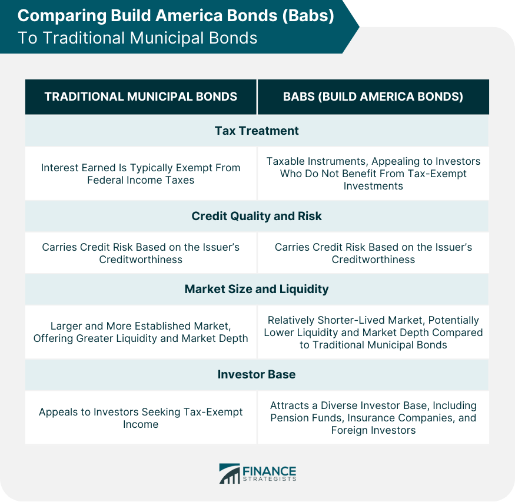

## Table of Contents

## What are Build America Bonds (BABs)?

Build America Bonds, often called BABs, are a type of bond that the U.S. government created to help states and local governments pay for big projects like schools and roads. These bonds were introduced in 2009 as part of the American Recovery and Reinvestment Act. Instead of being tax-free like traditional municipal bonds, BABs offer investors taxable interest. However, to make them attractive, the federal government gives a subsidy to the issuers, which helps lower the cost of borrowing.

There are two types of BABs: direct payment BABs and tax credit BABs. With direct payment BABs, the federal government sends money directly to the issuer to help cover the interest costs. This type of BAB is more common. On the other hand, tax credit BABs give the bondholder a tax credit, which reduces the amount of federal income tax they owe. Both types of BABs were designed to encourage more investment in public infrastructure by making it cheaper for governments to borrow money.

## How do Build America Bonds differ from traditional municipal bonds?

Build America Bonds, or BABs, are different from traditional municipal bonds in a few important ways. Traditional municipal bonds are usually tax-free, which means that the interest you earn from them isn't taxed by the federal government. This makes them very attractive to people in high tax brackets. On the other hand, BABs are taxable, meaning you have to pay federal taxes on the interest you earn from them. To make up for this, the federal government gives a subsidy to the issuer of the BABs, which helps lower the cost of borrowing for the state or local government.

Another key difference is how the federal government helps with the costs. With traditional municipal bonds, there's no direct help from the federal government. But with BABs, there are two types: direct payment BABs and tax credit BABs. For direct payment BABs, the federal government sends money directly to the issuer to help cover the interest costs. For tax credit BABs, the bondholder gets a tax credit that reduces the amount of federal income tax they owe. These differences make BABs a unique tool for funding public projects like schools and roads.

## What are the two types of Build America Bonds?

There are two types of Build America Bonds: direct payment BABs and tax credit BABs. Direct payment BABs work by having the federal government send money directly to the state or local government that issued the bond. This money helps cover the interest costs that the government has to pay to the people who bought the bonds. It makes it cheaper for the government to borrow money.

Tax credit BABs work differently. Instead of the government getting money, the people who buy these bonds get a tax credit. This tax credit reduces the amount of federal income tax that the bondholder has to pay. Both types of BABs were created to help states and local governments pay for big projects like schools and roads by making it easier and cheaper for them to borrow money.

## What are the tax implications for investors in Build America Bonds?

When you invest in Build America Bonds, or BABs, you have to pay federal taxes on the interest you earn. This is different from traditional municipal bonds, where the interest is usually tax-free. So, if you're in a high tax bracket, you might end up paying more in taxes with BABs than you would with regular municipal bonds.

However, there's a type of BAB called a tax credit BAB that can help lower your federal income tax. With these bonds, instead of getting interest payments, you get a tax credit. This credit reduces the amount of federal income tax you owe. So, while you still have to pay taxes on the interest from regular BABs, the tax credit BABs can help you save money on your taxes.

## How are Build America Bonds funded by the federal government?

Build America Bonds, or BABs, are funded by the federal government in two main ways. One way is through direct payment BABs. When a state or local government issues these bonds, the federal government sends them money to help cover the interest they have to pay to the people who bought the bonds. This makes it cheaper for the government to borrow money because they get help paying the interest.

The other way is through tax credit BABs. With these bonds, the people who buy them get a tax credit from the federal government. This credit reduces the amount of federal income tax they have to pay. So, instead of the government getting money to help pay the interest, the bondholders get help with their taxes. Both ways help make it easier for states and local governments to pay for big projects like schools and roads.

## What are the eligibility criteria for issuing Build America Bonds?

To issue Build America Bonds, or BABs, a state or local government must follow certain rules set by the federal government. They can only issue BABs for new projects, not to pay off old debts. The projects must be for things like building schools, roads, or other public works that help the community. The government also has to make sure that the money from the bonds is used for these projects and not for something else.

There are also some limits on how much money can be borrowed with BABs. The federal government set a total limit on how many BABs could be issued, and each state or local government has to stay within that limit. They also have to follow rules about how the bonds are sold and how the interest rates are set. These rules help make sure that BABs are used in a fair and responsible way to help build important things for the community.

## What restrictions apply to the use of proceeds from Build America Bonds?

The money from Build America Bonds, or BABs, can only be used for new projects, not to pay off old debts. These projects have to be for things that help the community, like building schools, roads, or other public works. The government has to make sure that the money from the bonds is used for these projects and not for something else.

There are also limits on how much money can be borrowed with BABs. The federal government set a total limit on how many BABs could be issued, and each state or local government has to stay within that limit. They also have to follow rules about how the bonds are sold and how the interest rates are set. These rules help make sure that BABs are used in a fair and responsible way to help build important things for the community.

## How do Build America Bonds compare to taxable municipal bonds in terms of yield and risk?

Build America Bonds, or BABs, and taxable municipal bonds both offer interest that is taxable by the federal government. This is different from traditional municipal bonds, which are usually tax-free. When it comes to yield, BABs can sometimes offer a higher yield than regular taxable municipal bonds. This is because the federal government gives a subsidy to the issuer of BABs, which helps lower the cost of borrowing for them. As a result, they can offer a higher [interest rate](/wiki/interest-rate-trading-strategies) to investors. However, the exact yield depends on many things, like the bond's rating and the market conditions at the time.

In terms of risk, BABs and taxable municipal bonds are pretty similar. Both types of bonds depend on the financial health of the state or local government that issued them. If the government has money problems, it might be harder for them to pay back the bond. But BABs have an extra layer of security because of the federal subsidy. This means that even if the issuer runs into trouble, the federal government's help might make it easier for them to keep paying the interest on the bonds. So, while both types of bonds [carry](/wiki/carry-trading) some risk, BABs might be seen as a bit safer because of the federal support.

## What impact did Build America Bonds have on the municipal bond market?

Build America Bonds, or BABs, had a big impact on the municipal bond market when they were introduced in 2009. They made it easier and cheaper for states and local governments to borrow money for big projects like schools and roads. This was because the federal government gave a subsidy to the issuers, which helped lower the cost of borrowing. As a result, more bonds were issued, and the market saw an increase in the total amount of money being borrowed. BABs also attracted a different group of investors because they were taxable, unlike traditional municipal bonds which are usually tax-free.

The introduction of BABs also brought more attention to the municipal bond market. Investors who usually didn't buy municipal bonds because they were looking for taxable investments found BABs interesting. This helped bring more money into the market and made it more diverse. However, BABs were only issued for a short time, and after the program ended, the market went back to mostly issuing traditional municipal bonds. Still, the time when BABs were available showed that there was a way to make the municipal bond market more flexible and attractive to a wider range of investors.

## How did the Build America Bond program affect state and local government financing?

The Build America Bond program made it easier for state and local governments to borrow money for big projects like schools and roads. Before BABs, governments often used traditional municipal bonds, which are usually tax-free. But with BABs, the federal government gave a subsidy to the issuers, which helped lower the cost of borrowing. This meant that governments could borrow more money at a lower cost, so they could do more projects to help their communities.

When BABs were available, more bonds were issued, and the total amount of money borrowed by state and local governments went up. This was good because it meant more projects could be done. But the program only lasted for a short time, and after it ended, governments went back to using mostly traditional municipal bonds. Even though BABs were only around for a little while, they showed that there are other ways to help governments borrow money and do important projects for their communities.

## What were the key factors leading to the termination of the Build America Bond program?

The Build America Bond program ended mainly because it was only meant to be a temporary help for states and local governments during the 2009 economic crisis. The program was part of the American Recovery and Reinvestment Act, which was designed to boost the economy. When the economy started to get better, the need for the program went down. Also, the cost of the federal subsidies for BABs was very high, and the government didn't want to keep paying for it.

Another reason for ending the program was that it changed the way the municipal bond market worked. BABs brought in new investors who were looking for taxable bonds, but this also made the market more complicated. Some people worried that BABs might take money away from traditional tax-free municipal bonds. So, when the program ended in 2010, the market went back to mostly using traditional municipal bonds, which was simpler and more familiar to everyone.

## How can investors assess the performance of Build America Bonds compared to other bond types over time?

Investors can assess the performance of Build America Bonds compared to other bond types by looking at the yields and the total returns over time. Yields show how much interest the bonds pay, and total returns include both the interest and any changes in the bond's price. BABs often had higher yields than traditional tax-free municipal bonds because they were taxable, and the federal government's subsidy to the issuers helped keep the interest rates high. To compare BABs to other taxable bonds, like corporate bonds, investors would look at the yield difference and see if BABs offered a better return for the same level of risk. They might also use tools like bond indexes, which track the performance of different types of bonds, to see how BABs did compared to the market.

Another way to assess BABs' performance is by looking at their risk and how well they held up during different economic conditions. Since BABs were backed by state and local governments, their risk was tied to the financial health of those governments. The federal subsidy made BABs a bit safer than regular municipal bonds because it helped the issuers pay the interest. Investors would look at credit ratings and historical data to see how BABs performed during times of economic stress compared to other bonds. By comparing the returns and risks over time, investors could decide if BABs were a good choice for their portfolios.

## What are the types of Build America Bonds?

Build America Bonds (BABs) were offered in two distinct types: tax credit BABs and direct payment BABs. These structures were developed under the American Recovery and Reinvestment Act of 2009 to provide state and local governments with lower borrowing costs, ultimately encouraging infrastructure investment.

**Tax Credit Build America Bonds**: This category provided bondholders with a federal tax credit equivalent to 35% of the interest paid on the bonds. For example, if an investor received $1,000 in interest from a BAB, they would obtain a $350 tax credit. This credit could be applied to offset federal income tax, and if it exceeded the bondholder’s tax liability, it could potentially be carried forward to subsequent years. This mechanism aimed to increase the attractiveness of these securities by boosting the effective yield to the investors.

**Direct Payment Build America Bonds**: These bonds functioned differently, offering a direct subsidy to the bond issuer rather than the bondholder. In this arrangement, the federal government reimbursed the issuer for a portion of the interest costs—again, typically 35%. This subsidy effectively reduced the issuer's net interest expense, enabling them to issue bonds at more competitive rates that were more attractive to investors. The formula for calculating the issuer's net interest cost can be articulated as follows:

$$
\text{Net Interest Cost} = \text{Total Interest Payment} - \text{Federal Subsidy}
$$

where the Federal Subsidy is 35% of the Total Interest Payment.

In both instances, the overarching goal was to supply capital swiftly and efficiently, assisting municipalities in overcoming the economic hurdles posed by the financial crisis. These provisions also aimed to broaden the appeal of municipal bonds to a wider investment audience, including those who might not typically benefit from the traditional tax-exempt structure of municipal bonds.

## What are the differences between Build America Bonds and Traditional Municipal Bonds?

The primary differentiator between Build America Bonds (BABs) and traditional municipal bonds lies in their tax treatment. Traditional municipal bonds are generally exempt from federal taxes and may also be exempt from state taxes, which provides a significant advantage for investors seeking tax-free income. This tax exemption makes municipal bonds particularly attractive to individuals in higher income tax brackets, as it enhances the effective yield of the bonds.

In contrast, the interest income from BABs is subject to federal taxation, which changes the calculation for potential investors. Despite this taxation, the design of BABs included federal subsidies to make them competitive with tax-exempt bonds. For example, direct payment BABs provided a subsidy directly to the bond issuer, covering a significant portion of the interest payments. This subsidy mechanism enabled municipalities to offer bonds with interest rates competitive with traditional municipal bonds, even though BABs lacked the tax-exempt status. 

From a practical perspective, investors considering BABs had to assess the impact of federal taxation on their overall return compared to the federal subsidy provided. This requires analyzing the net benefit, which can be expressed as:

$$
\text{Net Benefit} = \text{Interest Income} - \text{Federal Tax} + \text{Subsidy}
$$

By evaluating this equation, investors could determine whether the taxable status of BABs, counterbalanced by the subsidy, offered a favorable investment opportunity. Additionally, during the economic climate following the 2008 financial crisis, the guaranteed federal backing of BABs added an extra layer of security, potentially enhancing their appeal to cautious investors.

Ultimately, when weighing BABs against traditional municipal bonds, investors needed to consider the interplay between tax implications and subsidy benefits. Careful analysis would ensure informed decisions, tailored to individual tax circumstances and investment strategies.

## References & Further Reading

[1]: ["Build America Bonds: The First One Hundred Days"](https://www.irs.gov/pub/irs-tege/arra_baba_final_shw_qa.pdf) by the Brookings Institution

[2]: ["Municipal Bonds: Build America Bonds"](https://www.investopedia.com/terms/b/build-america-bonds-babs.asp) by the Financial Industry Regulatory Authority (FINRA)

[3]: ["Algorithmic Trading and DMA"](https://www.amazon.com/Algorithmic-Trading-DMA-introduction-strategies/dp/0956399207) by Barry Johnson

[4]: ["American Recovery and Reinvestment Act of 2009"](https://www.congress.gov/bill/111th-congress/house-bill/1/text) from Congress.gov

[5]: ["The Impact of Algorithmic Trading on Bonds"](https://www.axios.com/2021/09/03/bond-market-trading-algorithms) by the Bank for International Settlements

[6]: ["Build America Bonds"], U.S. Department of the Treasury, [PDF Document](https://home.treasury.gov/services/treasury-financial-assistance/build-america-buy-america-waivers) 

[7]: ["Guide to Municipal Bonds: Build America Bonds"](https://www.investopedia.com/terms/b/build-america-bonds-babs.asp) by Investopedia