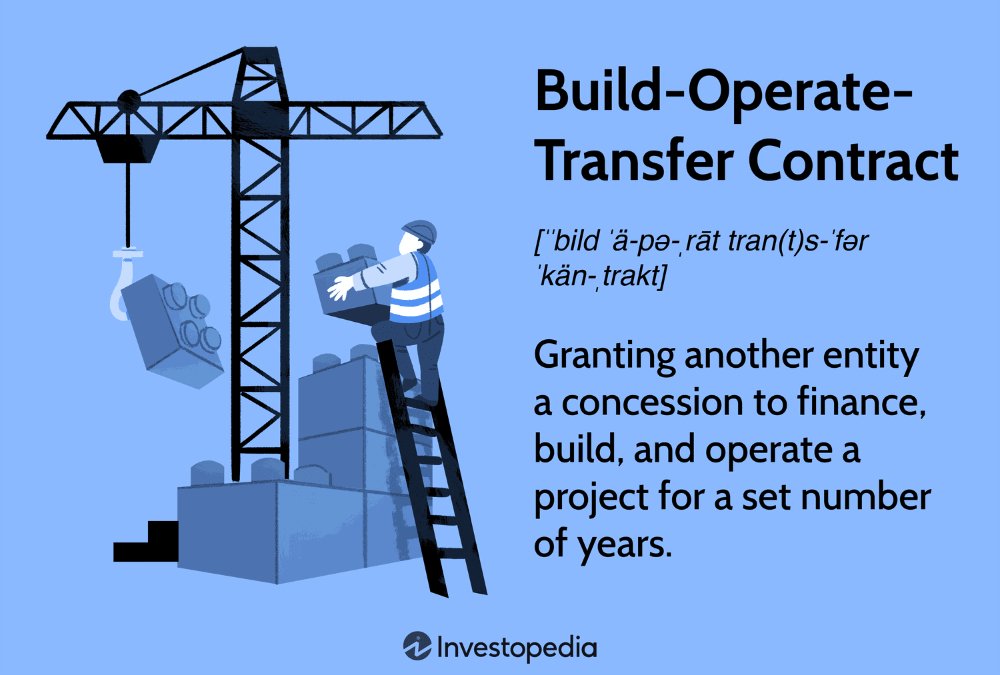

## Table of Contents

## What is a Build-Operate-Transfer (BOT) contract?

A Build-Operate-Transfer (BOT) contract is a type of agreement where a company or government hires another company to build something, like a road or a power plant. The company that builds it also runs it for a certain time. After that time, they give it back to the company or government that hired them. This way, the builder gets to make money from running the project before handing it over.

BOT contracts are used because they can help get big projects done without the government or company having to pay all the money at once. Instead, the builder uses their own money to build it and then earns it back by running the project. This can be good for both sides, but it needs careful planning to make sure everything goes smoothly and everyone is happy with the deal.

## What are the key components of a BOT contract?

A BOT contract has a few main parts that are important. First, there's the building part where one company agrees to build something like a bridge or a power plant. They use their own money to do this, which means they take a risk. The second part is operating, where after building it, they get to run it for a set time. During this time, they can make money back from running the project, like by charging tolls or selling electricity.

The third part is transferring, where after the set time is up, they hand over the project to the government or the company that first hired them. This is important because it means the project eventually belongs to the original owner. All these parts need to be clearly written in the contract, including how long the operating time will be, how the money will be handled, and what happens if something goes wrong. This helps make sure everyone knows what to expect and can plan accordingly.

## Who are the typical parties involved in a BOT contract?

In a BOT contract, there are usually two main parties involved. One party is the government or a public authority. They want a big project like a highway or a water treatment plant to be built, but they might not have enough money to do it themselves right away. So, they hire a private company to take care of building and running the project for a while.

The other party is the private company, often called the concessionaire. This company agrees to use its own money to build the project. After building it, they get to operate it and make money from it for a set number of years. Once that time is up, they have to give the project back to the government or public authority. Both parties need to work closely together and agree on all the details to make sure the project goes well.

## What are the main phases of a BOT project?

A BOT project has three main phases: building, operating, and transferring. In the building phase, a private company uses its own money to construct a project like a road or a power plant. This can take several years and involves a lot of planning and work. The company takes on the risk because if the project costs more than expected, they have to cover the extra costs.

Once the project is built, it moves into the operating phase. During this time, the private company runs the project and earns money from it. For example, they might charge tolls on a highway or sell electricity from a power plant. This phase can last for many years, and it's how the company gets back the money they spent on building the project. It's important for them to manage the project well to make sure it's profitable.

The last phase is transferring. After the agreed time for operating is over, the private company gives the project back to the government or public authority that originally hired them. This means the government now owns and can run the project. The transfer needs to be smooth so that the project keeps working well for everyone who uses it.

## What are the common risks associated with BOT contracts?

BOT contracts come with several risks that both the government and the private company need to think about. One big risk is that the project might cost more to build than expected. If this happens, the private company has to pay the extra money, which can hurt their profits. Another risk is that the project might not make as much money during the operating phase as planned. This can happen if fewer people use the road or if the power plant doesn't produce as much electricity as expected. Both of these situations can make it hard for the company to earn back their investment.

There are also risks related to the transfer phase. For example, the project might not be in good shape when it's time to hand it back to the government. This can lead to disagreements and extra costs to fix things. Another risk is changes in laws or regulations that can affect the project. If new rules make it harder or more expensive to operate the project, the company might lose money. Both parties need to plan carefully and include ways to handle these risks in the contract to make sure the project goes smoothly.

## How can financial risks be mitigated in BOT projects?

Financial risks in BOT projects can be managed by carefully planning and using different strategies. One way is to have a clear and detailed contract that spells out what happens if costs go up or if the project doesn't make as much money as expected. This can include setting up a fund to cover unexpected costs or agreeing on ways to share the financial risks between the government and the private company. Another way is to get insurance that can help cover some of the risks, like if the project gets damaged or if there are delays.

Another important strategy is to do a lot of research and planning before starting the project. This means looking at how much it might cost to build and run the project, and how much money it might make. By understanding these things well, the company can make better plans and be ready for problems that might come up. It's also helpful to have good relationships with banks and other investors who can provide money if needed. This can make it easier to handle financial problems that come up during the project.

## What legal frameworks support BOT contracts?

BOT contracts are supported by different legal frameworks around the world. These frameworks are important because they set rules that help both the government and the private company know what they can and can't do. In many countries, there are special laws that talk about how BOT projects should work. These laws often say things like how long the private company can run the project, what they need to do to build it, and how they should hand it back to the government. Some countries also have rules about how the government and the company can share the risks and rewards of the project.

In addition to country-specific laws, there are also international guidelines that can help with BOT contracts. Organizations like the World Bank and the United Nations have created standards that many countries follow. These guidelines help make sure that BOT projects are done fairly and in a way that benefits everyone involved. They cover things like how to handle disagreements, how to make sure the project is good for the environment, and how to protect the rights of the people who will use the project. By following these legal frameworks, BOT projects can be more successful and less risky for everyone.

## How do political and regulatory risks impact BOT projects?

Political and regulatory risks can have a big impact on BOT projects. If there's a change in government or political leadership, new leaders might not like the project or might want to change the rules. This can make it hard for the private company to keep running the project the way they planned. For example, a new government might decide to lower the tolls on a road, which means the company makes less money. Or they might pass new laws that make it more expensive or difficult to operate the project, like stricter environmental rules.

Regulatory risks are also important. These are risks that come from changes in the rules and regulations that the project has to follow. If a government changes the rules about how a power plant can operate, the private company might have to spend more money to meet the new standards. This can cut into their profits and make it harder to earn back their investment. Both political and regulatory risks need to be carefully managed in the BOT contract, often by including ways to deal with changes and sharing the risks between the government and the private company.

## What are some successful examples of BOT projects around the world?

One successful BOT project is the M6 Toll Road in the United Kingdom. The government wanted to reduce traffic on the M6 highway, so they hired a private company called Midland Expressway Ltd. to build and operate a new toll road. The company used its own money to build the road and started charging tolls to drivers who used it. After many years of running the road and making money from the tolls, the company will eventually hand it back to the government. This project helped ease traffic and showed how BOT contracts can work well.

Another example is the Laem Chabang Port in Thailand. The Thai government needed a new port to handle more trade, so they worked with a private company called Hopewell (Thailand) Co., Ltd. to build and operate it. The company built the port and ran it for several years, making money from the fees they charged to ships. After the agreed time, they transferred the port back to the government. This project helped Thailand's economy grow and showed how BOT projects can be good for both the government and the private company.

A third successful BOT project is the National Highway 4 in Vietnam. The Vietnamese government wanted to improve transportation in the country, so they partnered with a private company called Vietnam Expressway Corporation (VEC). VEC built a section of the highway and operated it, charging tolls to drivers. After a certain period, they handed the highway back to the government. This project not only improved travel in Vietnam but also demonstrated how BOT projects can help develop infrastructure in a country.

## How does the transfer phase work in a BOT contract?

The transfer phase in a BOT contract is when the private company gives the project back to the government or the public authority that hired them. This happens after the company has finished building the project and has been running it for the agreed number of years. The exact time for the transfer is set in the contract, and it's important that both sides stick to this timeline. When the time comes, the company needs to make sure the project is in good shape before handing it over. This means they might have to fix any problems or do maintenance work to make sure everything is working well.

During the transfer, the government takes over the project and starts running it themselves. They might need to train their own people to operate the project or hire new staff. It's important that the transfer goes smoothly so the project keeps working well for everyone who uses it. Both the government and the private company need to work together to make sure all the details are taken care of. This can include things like making sure all the paperwork is done and that any money that needs to be paid is sorted out. A good transfer phase helps make sure the project is successful in the long run.

## What are the advanced strategies for managing operational risks in BOT contracts?

Managing operational risks in BOT contracts involves careful planning and using smart strategies. One key strategy is to have a strong management team that knows how to run the project well. This team should be ready for problems like equipment breaking down or not enough people using the project. They can do this by having backup plans and keeping the project in good shape. Another strategy is to use technology to help. For example, they can use computer systems to keep track of how the project is doing and fix problems quickly. This can help the project run smoothly and make more money.

Another important strategy is to work closely with the government and other partners. This means talking often and sharing information so everyone knows what's going on. If there's a problem, like a new law that makes running the project harder, they can work together to find a solution. It's also helpful to have a good contract that says what to do if things go wrong. This can include ways to share the risks and costs, so the private company doesn't lose too much money if something bad happens. By using these strategies, the company can keep the project running well and make sure it's a success.

## How can technological advancements influence the framework and risks of BOT contracts?

Technological advancements can change how BOT contracts work and the risks they face. New technology can make building projects faster and cheaper. For example, using drones to survey land or 3D printing to make parts can save time and money. This can make BOT projects more attractive to private companies because they can earn back their investment quicker. But technology also brings new risks. If a project relies on new tech, there's a chance it might not work as expected. This can lead to delays or higher costs, which can hurt the company's profits.

Technology can also help manage risks better. With smart systems and data analysis, companies can keep a close eye on how the project is doing. They can spot problems early and fix them before they get worse. This can make the project run more smoothly and reduce the chance of losing money. But using new technology means the company needs to train their staff and keep up with changes. If they don't, they might not use the technology well, which can cause more problems. So, while technology can help, it needs to be used carefully to really make BOT projects better.

## How do BOT Contracts intersect with Algo Trading?

Both Build-Operate-Transfer (BOT) contracts and algorithmic trading capitalize on the advances in technology and data analytics. The convergence of these fields offers the potential to transform the management and execution of infrastructure projects. Through the integration of algorithmic trading techniques, BOT projects can experience enhanced efficiency and financial viability.

### Application of Algorithmic Trading Principles

Algorithmic trading relies heavily on data analysis to make rapid and informed trading decisions. These principles can be harnessed to forecast the financial viability of BOT projects. By utilizing sophisticated algorithms, stakeholders can predict revenue streams and assess financial risks more accurately. For instance, models used in algorithmic trading to predict stock prices, such as autoregressive integrated moving average (ARIMA) or [machine learning](/wiki/machine-learning) models, could be adapted to forecast toll revenue or energy output in infrastructure projects. The formula for ARIMA, used for time-series analysis, looks like this:

$$
Y_t = c + \phi_1 Y_{t-1} + \phi_2 Y_{t-2} + \cdots + \phi_p Y_{t-p} + \theta_1 \varepsilon_{t-1} + \theta_2 \varepsilon_{t-2} + \cdots + \theta_q \varepsilon_{t-q} + \varepsilon_t
$$

Where:
- $Y_t$ is the value at time $t$,
- $\phi$ are the parameters for the autoregressive part,
- $\theta$ are the parameters for the moving average part,
- $\varepsilon$ are random errors.

### Optimizing Financial Management

Algorithmic approaches can optimize the financial management of BOT projects by automating transactions and managing cash flows. For instance, similar to how algorithms in high-frequency trading optimize trades to minimize losses and slippage, BOT projects could use financial algorithms to automate the determination of optimal funding structures or to rebalance portfolios of project investments based on real-time data.

### Enhancing Prediction Accuracy

One significant advantage provided by algorithmic strategies is the enhancement of prediction accuracy. By applying data analytics and machine learning, BOT projects can achieve more precise forecasts for traffic or usage patterns. This is critical in projects like highways or public transport systems, where usage predictions directly influence revenue models and risk management. Algorithms that weigh historical data against various economic indicators could significantly reduce the uncertainty associated with demand forecasts, thereby lowering financial risk.

### Opportunities for Public-Private Partnerships

The cross-pollination of procedures from finance and infrastructure fosters innovation and efficiency in public-private partnerships. By leveraging the technological frameworks supporting algorithmic trading, BOT contracts can incorporate real-time data analytics into their planning and operational phases. This integration facilitates better resource allocation, more accurate financial assessments, and steady operational improvements. Consequently, the convergence of BOT contracts and algorithmic trading not only fortifies the structural efficiency of such projects but also enhances their financial attractiveness to investors.

## References & Further Reading

[1]: Grimsey, D., & Lewis, M.K. (2002). ["Evaluating the Risks of Public Private Partnerships for Infrastructure Projects."](https://www.sciencedirect.com/science/article/pii/S0263786300000405) International Journal of Project Management.

[2]: Ameyaw, E. E., & Chan, A.P.C. (2015). ["Risk Ranking and Analysis in PPP Water Supply Infrastructure Projects: An International Survey of Industry Experts."](https://www.emerald.com/insight/content/doi/10.1108/f-12-2013-0091/full/html) Facilities.

[3]: Narang, R. (2014). ["Inside the Black Box: A Simple Guide to Quantitative and High Frequency Trading"](https://onlinelibrary.wiley.com/doi/book/10.1002/9781118662717). Wiley Finance.

[4]: Zhang, F., & Posner, R.A. (2017). ["The Role of Public-Private Partnerships in China’s Power Sector Reform."](https://onlinelibrary.wiley.com/doi/full/10.1111/puar.13046) The China Quarterly.

[5]: Gomber, P., Arndt, B., Lutat, M., & Uhle, T. (2011). ["High-Frequency Trading."](https://papers.ssrn.com/sol3/papers.cfm?abstract_id=1858626) Business & Information Systems Engineering.