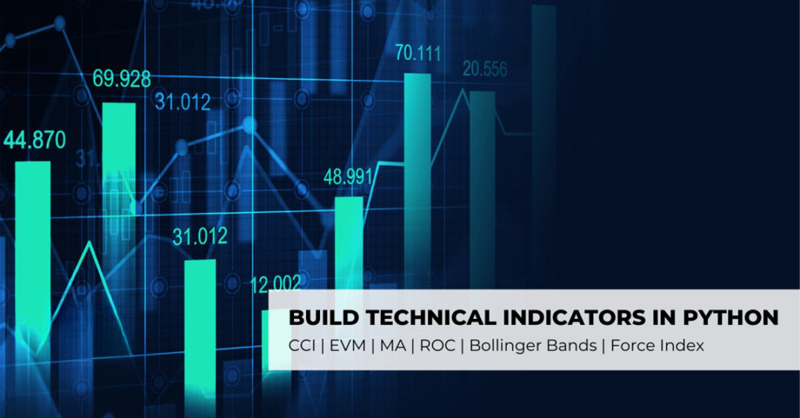

In today's fast-paced financial markets, the ability to anticipate future price movements is a crucial skill for traders. Technical analysis provides a framework for understanding these movements based on historical price and volume data. It is grounded in the belief that historical trading activity and price changes are valid indicators of future movements. Technical analysis involves the study of price charts and the use of various technical indicators to identify patterns and trends, striving to forecast future price trends.

Algorithmic trading, leveraging advanced computational techniques, has become a staple in modern financial markets. With the integration of technical analysis, algorithmic trading platforms can analyze market data comprehensively, enabling traders to execute orders with enhanced speed and accuracy. Python, known for its simplicity and robust libraries, has become an indispensable tool for traders wishing to implement technical analysis strategies within this framework.



Python's extensive libraries such as Pandas, NumPy, and TA-Lib offer powerful capabilities for data manipulation, statistical analysis, and technical indicator computation. Pandas provides structures that facilitate the manipulation and analysis of time-series data, while NumPy enhances computational capabilities with support for large arrays and matrices. TA-Lib simplifies the implementation of various technical indicators, making it easier for traders to automate strategy development and testing.

Python's efficacy is not confined to basic analysis. It supports the construction and deployment of complex trading algorithms through advanced techniques such as machine learning. Python libraries like Scikit-learn and TensorFlow provide tools for developing sophisticated predictive models, offering traders the potential to achieve a competitive edge in algorithmic trading.

This article explores a comprehensive array of technical indicators implemented in Python, discussing their applications in trading strategies. Practical examples and code snippets demonstrate how these indicators are calculated and integrated into algorithmic trading systems. The objective is to provide traders and programmers with the insights and tools needed to effectively utilize Python for technical analysis, enhancing their trading operations' speed, precision, and profitability.

## Table of Contents

## Understanding Technical Analysis

Technical analysis is a method employed by traders to assess and predict future price movements in financial markets. This technique focuses on analyzing historical price patterns and trading volumes to identify potential trends and investment opportunities. The foundational belief underpinning technical analysis is that all market information, such as investor sentiment, economic factors, and company performance, is reflected in the asset's price.

Key elements of technical analysis include:

1. **Price Charts**: These are visual representations of an asset's price over time. The most common types include line charts, bar charts, and candlestick charts. These charts provide a clear view of how an asset's price has moved historically, allowing traders to identify patterns and potential areas of support and resistance.

2. **Technical Indicators**: These are mathematical calculations based on historical price and volume data intended to provide insights into potential future price movements. Popular indicators include Moving Averages, Relative Strength Index (RSI), and Bollinger Bands. Each indicator provides different insights, such as the strength of a trend, potential reversal points, or market volatility.

3. **Patterns Formed by Price Movements**: Traders often look for specific formations in price charts, known as patterns, to predict future price directions. Common patterns include head and shoulders, triangles, and double tops/bottoms. Recognizing these patterns can help traders anticipate breakouts or breakdowns.

Unlike [fundamental analysis](/wiki/fundamental-analysis), which examines a company's financial health, such as earnings, revenue, and growth potential, technical analysis is primarily concerned with price action. This makes it applicable across various asset classes, including stocks, indices, commodities, and Forex. By focusing on price and [volume](/wiki/volume-trading-strategy) data, technical analysis offers a versatile approach that can be utilized in multiple markets regardless of the underlying asset's nature.

In summary, technical analysis serves as a critical tool for traders aiming to forecast market trends and make informed trading decisions based on the historical performance of asset prices. Its reliance on charts, indicators, and price patterns provides a comprehensive framework for navigating the complexities of financial markets.

## The Role of Python in Technical Analysis

Python's simplicity and extensive library ecosystem make it an ideal choice for implementing technical analysis strategies. It offers a robust framework for traders seeking to analyze and interpret market data, thanks to its high-level, dynamic nature and the availability of numerous specialized libraries.

1. **Data Manipulation and Analysis:** Pandas, one of Python's most powerful libraries, provides data structures and functions needed for seamless data manipulation and analysis. It excels at handling time-series data, which is fundamental in technical analysis, by offering capabilities such as slicing, dicing, and pivoting datasets. Traders can leverage Pandas to clean and prepare data, perform descriptive statistics, and apply complex transformations easily.

2. **Numerical Computation:** NumPy, another core library, offers support for large, multi-dimensional arrays and matrices, along with mathematical functions to operate on these arrays. This is essential for calculating technical indicators, which often involve complex mathematical computations. For instance, NumPy can efficiently calculate simple and exponential moving averages, which are vital components of many technical strategies.

3. **Visualization:** Matplotlib is widely used for creating static, animated, and interactive visualizations in Python. It supports the visual representation of data, which is integral for technical analysis as traders rely heavily on charts to interpret market trends. With Matplotlib, users can customize plots, add indicators and overlays, and create detailed, interactive price and volume charts.

4. **Technical Analysis Libraries:** TA-Lib (Technical Analysis Library) is specifically designed for calculating common technical indicators like Moving Averages, Bollinger Bands, and the Relative Strength Index (RSI). TA-Lib seamlessly integrates with Python, allowing traders to implement these indicators effortlessly, either as standalone tools or components of more complex trading strategies. Its integration into Python scripts enables the automation of repetitive tasks associated with technical analysis.

5. **Handling Large Datasets:** Python's architecture allows it to handle large datasets effectively, which is crucial in situations where traders deal with high-frequency data. Python's memory management and processing capabilities ensure that operations on large volumes of data remain performant and efficient.

6. **Complex Calculations and Real-time Trading:** In algorithmic trading, where milliseconds can define success, Python's capacity for executing complex calculations quickly plays a pivotal role. Real-time trading demands that systems can access and process information without delays, and Python scripts are capable of achieving this level of performance.

In summary, Python's ecosystem, constituted by libraries like Pandas, NumPy, Matplotlib, and TA-Lib, provides a comprehensive suite of tools for technical analysis. These libraries enable the efficient handling of data manipulation, numerical computation, and visualization, thus supporting both the development and [backtesting](/wiki/backtesting) of robust trading strategies.

## Implementing Basic Technical Indicators in Python

Technical indicators serve as vital tools for traders, aiding in predicting future price movements through the analysis of historical data. Among the most commonly used indicators are Moving Averages, Bollinger Bands, and the Relative Strength Index (RSI). By employing Python, traders can automate the calculation of these indicators, which streamlines strategy development and testing processes.

### Moving Averages

A Moving Average (MA) smoothens price data by creating a constantly updated average price. The most utilized types include the Simple Moving Average (SMA) and the Exponential Moving Average (EMA). The formula for SMA over a period $n$ is:

$$
\text{SMA} = \frac{\sum_{i=1}^{n} P_i}{n}
$$

where $P_i$ is the closing price at day $i$.

In Python, the SMA can be computed using the Pandas library:

```python
import pandas as pd

def calculate_sma(data, window):
    return data.rolling(window=window).mean()
```

The EMA gives more weight to recent prices, which makes it more responsive to new information. It's calculated using:

$$
\text{EMA}_t = \alpha \cdot P_t + (1-\alpha) \cdot \text{EMA}_{t-1}
$$

where $\alpha = \frac{2}{n+1}$, and $P_t$ is the price at time $t$.

EMA calculation in Python can be performed as follows:

```python
def calculate_ema(data, span):
    return data.ewm(span=span, adjust=False).mean()
```

### Bollinger Bands

Bollinger Bands consist of a middle band (SMA) and two outer bands. The outer bands are standard deviations away from the middle band. It’s defined as:

- Middle Band = $\text{SMA}$
- Upper Band = $\text{SMA} + k \cdot \sigma$
- Lower Band = $\text{SMA} - k \cdot \sigma$

where $\sigma$ is the standard deviation of the price over the same period, and $k$ is a factor generally set to 2.

Python implementation:

```python
def calculate_bollinger_bands(data, window, num_std_dev):
    sma = data.rolling(window=window).mean()
    std_dev = data.rolling(window=window).std()
    upper_band = sma + (std_dev * num_std_dev)
    lower_band = sma - (std_dev * num_std_dev)
    return sma, upper_band, lower_band
```

### Relative Strength Index (RSI)

RSI is a [momentum](/wiki/momentum) oscillator that measures the speed and change of price movements on a scale of 0 to 100. It is typically used to identify overbought or oversold conditions. RSI is calculated using:

1. Calculate the average gain and average loss over a specified period $n$.
2. Calculate the relative strength (RS): $\text{RS} = \frac{\text{average gain}}{\text{average loss}}$.
3. RSI is then: 

$$
\text{RSI} = 100 - \frac{100}{1 + \text{RS}}
$$

Here's how to compute RSI in Python:

```python
def calculate_rsi(data, window):
    delta = data.diff(1)
    gain = (delta.where(delta > 0, 0)).rolling(window=window).mean()
    loss = (-delta.where(delta < 0, 0)).rolling(window=window).mean()
    rs = gain / loss
    rsi = 100 - (100 / (1 + rs))
    return rsi
```

By using Python to automate these calculations, traders can rapidly iterate over strategy development and testing, enabling more timely responses to market changes. These implementations are not only fundamental to understanding market conditions but also serve as the building blocks for more complex trading algorithms.

## Advanced Technical Analysis Techniques

Advanced techniques in technical analysis leverage the capabilities of [machine learning](/wiki/machine-learning) and [deep learning](/wiki/deep-learning) to enhance [algorithmic trading](/wiki/algorithmic-trading) strategies. These methods allow for the development of sophisticated models that can identify complex patterns and make more accurate predictions. Python, with its robust libraries like Scikit-learn and TensorFlow, serves as an excellent tool for implementing these techniques.

Pattern recognition is a critical aspect of advanced technical analysis, enabling traders to identify and exploit recurring price movements. Using Python, traders can develop automated systems capable of recognizing specific patterns within financial datasets. The Scikit-learn library provides an assortment of tools for classification, regression, and clustering, essential for pattern recognition tasks. By employing techniques such as K-means clustering or support vector machines (SVMs), traders can categorize data points, detect unusual trading volumes, or identify [breakout](/wiki/breakout-trading) patterns.

Predictive modeling, another cornerstone of advanced analysis, involves forecasting future price movements based on historical data. Python's machine learning capabilities, particularly in Scikit-learn, allow for the creation of models that can learn from past trends and predict future market behaviors. These models can be trained using historical prices, volume data, and technical indicators as input features. For instance, a decision tree or random forest algorithm might be used to predict whether the price of a stock will rise or fall based on its last hundred closing prices.

Deep learning, a subset of machine learning, leverages neural networks with multiple layers to process large volumes of data and uncover intricate patterns. TensorFlow, a popular Python library, provides comprehensive tools for building and training deep learning models. Traders can use TensorFlow to develop complex neural networks that can process time series data, identifying latent patterns that simple statistical models may not capture. Recurrent Neural Networks (RNNs) and Long Short-Term Memory (LSTM) networks are particularly well-suited for time series analysis in trading, as they are designed to learn from sequences of data and can capture temporal dependencies.

The application of these advanced techniques requires not just an understanding of machine learning principles but also expertise in data preparation and feature engineering. Properly preprocessing financial data, selecting relevant features, and scaling inputs appropriately are vital steps in ensuring model accuracy and robustness. Additionally, hyperparameter tuning and model evaluation are critical phases in the machine learning workflow to optimize model performance.

In summary, advanced technical analysis techniques using Python enable algorithmic traders to create sophisticated models that enhance decision-making. By harnessing the power of libraries such as Scikit-learn and TensorFlow, traders can implement pattern recognition strategies and predictive models that improve the speed and accuracy of trading decisions. Continuing advancements in machine learning and deep learning methodologies promise even greater potential for innovative trading strategies in the future.

## Backtesting and Strategy Optimization

Backtesting plays a fundamental role in the development and validation of trading strategies by providing a systematic approach to simulate how a strategy would have performed under historical market conditions. This process enables traders to gauge the viability and effectiveness of their strategies before deploying them in live markets, minimizing the risk of significant losses.

Python has emerged as a preferred tool for backtesting due to its robust library ecosystem. Libraries such as Backtrader and Zipline are widely utilized for this purpose, offering comprehensive frameworks to implement and evaluate trading strategies.

### Backtrader and Zipline

**Backtrader** is a popular open-source framework known for its versatility and ease of use. It allows users to test a wide array of strategies, from simple moving averages to complex multi-asset strategies. Its intuitive API facilitates the development, testing, and analysis of trading strategies.

A basic setup in Backtrader to backtest a strategy might look like this:

```python
import backtrader as bt

class MyStrategy(bt.Strategy):
    def __init__(self):
        self.sma = bt.indicators.SimpleMovingAverage(self.data, period=15)

    def next(self):
        if self.data.close[0] > self.sma[0]:
            self.buy(size=1)
        elif self.data.close[0] < self.sma[0]:
            self.sell(size=1)

cerebro = bt.Cerebro()
cerebro.addstrategy(MyStrategy)
data = bt.feeds.YahooFinanceData(dataname='AAPL', fromdate=datetime(2020, 1, 1), todate=datetime(2020, 12, 31))
cerebro.adddata(data)
cerebro.run()
cerebro.plot()
```

**Zipline**, another powerful library, offers strong support for backtesting with a focus on compatibility with the Quantopian platform (prior to its shutdown). It integrates seamlessly with Pandas for data handling and offers great utility for large dataset processing.

### Strategy Optimization

Optimization techniques are crucial for refining trading algorithms. These techniques involve adjusting and tuning various parameters to enhance strategy performance. The goal is to identify a set of parameters that maximize returns while minimizing risks.

A common approach to optimization is using Grid Search or more sophisticated techniques like Genetic Algorithms. In Python, libraries such as SciPy provide optimization functions that can be applied to trading strategies. For example, using `scipy.optimize` to optimize a strategy might involve:

```python
from scipy.optimize import minimize

def strategy_params(params):
    short_window, long_window = params
    # Assume a function that calculates the strategy's return
    return -calculate_strategy_return(short_window, long_window)

initial_guess = [20, 50]
bounds = [(5, 100), (20, 200)]

result = minimize(strategy_params, initial_guess, bounds=bounds)
optimal_params = result.x
```

This example optimizes the short and long window periods for a simple moving average crossover strategy to maximize returns. By iteratively testing various parameter combinations, traders can find the most effective set for their strategies.

In conclusion, the effective backtesting and optimization of trading strategies are indispensable for algorithmic traders. Python's libraries like Backtrader and Zipline provide powerful frameworks for such analyses, while optimization techniques ensure strategies are fine-tuned for optimal performance.

## Case Studies and Real-world Applications

Real-world examples provide insights into the practical application of technical analysis using Python across various trading environments. These examples illustrate how Python can tackle real-market challenges and enhance trading strategies.

One noteworthy case study involves the development of a momentum-based trading algorithm using Python to identify entry and [exit](/wiki/exit-strategy) points in the stock market. This algorithm utilized the Relative Strength Index (RSI) as a primary indicator. By leveraging Python libraries such as Pandas and TA-Lib, the algorithm dynamically calculated RSI values over custom time frames, enabling traders to spot overbought or oversold conditions effectively.

```python
import pandas as pd
import talib

# Load historical price data
data = pd.read_csv('stock_data.csv')
prices = data['Close'].values

# Calculate the RSI
rsi = talib.RSI(prices, timeperiod=14)

# Generate trading signals based on RSI levels
data['Signal'] = 0
data.loc[rsi < 30, 'Signal'] = 1  # Buy signal
data.loc[rsi > 70, 'Signal'] = -1  # Sell signal
```

In another instance, a [quantitative trading](/wiki/quantitative-trading) firm implemented Python to create a statistical [arbitrage](/wiki/arbitrage) strategy. By using Python's NumPy and SciPy libraries, the firm could efficiently compute complex mathematical models such as mean reversion strategies and co-integration tests to exploit price discrepancies between correlated financial instruments.

A significant challenge in algorithmic trading is managing large volumes of data while maintaining computational efficiency. Python's real-time data handling capabilities allowed for seamless integration with API services to fetch live market data. Furthermore, with libraries like Cython, the firms were able to convert code into C for greater execution speed, overcoming performance bottlenecks in high-frequency trading environments.

Python also facilitated the integration of machine learning techniques in technical analysis. By using Scikit-learn, a machine learning model was trained to recognize candlestick patterns within Forex markets, enhancing the prediction accuracy of upward or downward trends. This allowed traders to adapt dynamically to changing market conditions based on probabilistic forecasts.

A challenge often encountered is the need for continuous strategy optimization. Python's ecosystem supports the use of Backtrader for backtesting and Zipline for strategy optimization, allowing traders to validate their algorithms against historical data. This process ensures that strategies are not only theoretically sound but also profitable when adapted to current market conditions.

```python
from backtrader import Cerebro, Strategy

class MyTradingStrategy(Strategy):
    def __init__(self):
        # Initialize indicators, signals, and other variables
        pass

    def next(self):
        # Define strategy logic for each time step
        pass

cerebro = Cerebro()
# Add data feed and strategy to Cerebro
cerebro.addstrategy(MyTradingStrategy)
cerebro.run()
```

In conclusion, Python's versatility and extensive ecosystem support the practical deployment of technical analysis in real-world trading scenarios. The ability to handle diverse tasks, from data pre-processing to executing sophisticated trading strategies, makes Python an invaluable tool for modern algorithmic traders.

## Conclusion

Python's integration with technical analysis significantly enhances the efficiency and precision of algorithmic trading strategies. By leveraging Python's extensive library ecosystem, traders can automate the analysis of historical price data, streamline the calculation of complex technical indicators, and engage in sophisticated strategy development with minimal overhead. This not only accelerates decision-making processes but also improves the accuracy of predictions about future market movements.

For both traders and developers, mastering Python and its application in technical analysis offers a substantial advantage in dynamic markets. Python's ability to handle large datasets, perform rapid calculations, and seamlessly integrate various data sources creates an environment where strategy testing and execution become swift and reliable. Moreover, Python's versatility supports the deployment of advanced techniques, such as machine learning and deep learning, to further enhance the actionable insight derived from market data.

Continued experimentation and learning are critical for thriving in the field of algorithmic trading and technical analysis using Python. As markets evolve, the challenges associated with predicting price movements increase, necessitating ongoing adaptation and refinement of strategies. By embracing Python's capabilities, traders and developers position themselves to not only meet these challenges but to capitalize on emerging opportunities through innovative and informed trading methodologies.

In conclusion, Python serves as a pivotal tool that bridges the gap between technical analysis and algorithmic trading, providing users with the resources necessary to achieve superior trading performance. As the financial landscape continues to advance, those proficient in Python-driven technical analysis will likely maintain a competitive edge, fostering greater success and resilience amidst market fluctuations.

## References & Further Reading

[1]: Bergstra, J., Bardenet, R., Bengio, Y., & Kégl, B. (2011). ["Algorithms for Hyper-Parameter Optimization."](https://dl.acm.org/doi/10.5555/2986459.2986743) Advances in Neural Information Processing Systems 24.

[2]: ["Advances in Financial Machine Learning"](https://www.amazon.com/Advances-Financial-Machine-Learning-Marcos/dp/1119482089) by Marcos Lopez de Prado

[3]: ["Evidence-Based Technical Analysis: Applying the Scientific Method and Statistical Inference to Trading Signals"](https://www.amazon.com/Evidence-Based-Technical-Analysis-Scientific-Statistical/dp/0470008741) by David Aronson

[4]: ["Machine Learning for Algorithmic Trading"](https://github.com/stefan-jansen/machine-learning-for-trading) by Stefan Jansen

[5]: ["Quantitative Trading: How to Build Your Own Algorithmic Trading Business"](https://books.google.com/books/about/Quantitative_Trading.html?id=j70yEAAAQBAJ) by Ernest P. Chan