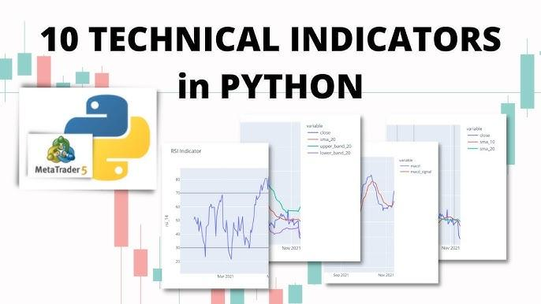

## Table of Contents

## What are technical indicators and why are they used in trading?

Technical indicators are tools that traders use to help them make decisions about buying and selling stocks, currencies, or other financial assets. They are based on mathematical calculations using data like price and volume. These indicators can show patterns or trends that might not be obvious just by looking at a price chart. Traders use them to try to predict future price movements and to find the best times to enter or exit a trade.

There are many different types of technical indicators, but they all serve the same basic purpose: to give traders more information to help them make better decisions. Some common examples include moving averages, which smooth out price data to show trends over time, and the Relative Strength Index (RSI), which measures how fast prices are changing to see if an asset is overbought or oversold. By using these tools, traders hope to increase their chances of making profitable trades and managing their risks more effectively.

## How can I set up a Python environment to start building technical indicators?

To set up a Python environment for building technical indicators, you'll first need to install Python on your computer. You can download it from the official Python website and follow the installation instructions. Once Python is installed, it's a good idea to use a virtual environment to keep your project organized and avoid conflicts with other Python projects. You can create a virtual environment by opening a command prompt or terminal, navigating to your project directory, and running the command `python -m venv myenv`. After creating the virtual environment, activate it by running `myenv\Scripts\activate` on Windows or `source myenv/bin/activate` on macOS or Linux.

Next, you'll need to install the necessary libraries to work with financial data and create technical indicators. The most common library for this is `pandas`, which helps you manipulate and analyze data. You can install it by running `pip install pandas` in your activated virtual environment. Another useful library is `numpy` for numerical computations, which you can install with `pip install numpy`. For more advanced technical analysis, you might want to use `ta-lib`, a popular library for technical indicators, which you can install with `pip install TA-Lib`. With these libraries installed, you'll be ready to start writing Python code to build and analyze technical indicators.

## What are some common libraries in Python used for financial data analysis?

Some common libraries in Python for financial data analysis are pandas, numpy, and matplotlib. Pandas is great for working with data. It lets you easily read, clean, and analyze financial data from different sources like CSV files or databases. Numpy is useful for doing math and calculations on your data. It helps you perform operations quickly and efficiently, which is important when you're dealing with large amounts of financial data.

Another important library is matplotlib, which helps you create graphs and charts to visualize your data. Visualizing data can make it easier to spot trends and patterns, which is very helpful in financial analysis. If you want to do more advanced technical analysis, you might also use a library like TA-Lib. This library has many built-in functions for calculating common technical indicators, making it easier to analyze market trends and make trading decisions.

## Can you explain how to calculate a Simple Moving Average (SMA) in Python?

To calculate a Simple Moving Average (SMA) in Python, you first need to import the pandas library. Pandas makes it easy to work with data, including financial data. Once you have pandas imported, you can read your data into a pandas DataFrame. Let's say your data is in a CSV file with a column called 'Close' that has the closing prices of a stock. You can read this data into a DataFrame using the `pandas.read_csv()` function. After your data is in a DataFrame, you can use the `rolling()` function to calculate the SMA. For example, if you want a 10-day SMA, you would use `df['Close'].rolling(window=10).mean()`. This calculates the average of the last 10 days' closing prices and moves this window one day at a time through your data.

The `rolling()` function creates a rolling window of the specified size, in this case, 10 days. The `mean()` function then calculates the average of the values within this window. As you move the window through your data, you get a new average for each position of the window. The result is a new series of numbers that represent the SMA for each point in time. You can then add this SMA series to your DataFrame as a new column, making it easy to compare the SMA to the actual closing prices. This way, you can see how the stock's price is trending over time.

## How do you implement an Exponential Moving Average (EMA) in Python?

To implement an Exponential Moving Average (EMA) in Python, you'll need to use the pandas library, which helps you work with data. Start by importing pandas and loading your financial data into a DataFrame. Let's say your data has a column called 'Close' with the stock's closing prices. You can calculate the EMA using the `ewm()` function from pandas. For example, if you want a 10-day EMA, you would use `df['Close'].ewm(span=10, adjust=False).mean()`. The `span` parameter sets the number of periods for the EMA, and `adjust=False` makes sure the calculation is done in a way that's similar to how it's typically done in trading software.

The `ewm()` function calculates the EMA by giving more weight to recent prices. It uses a formula where the most recent price has the biggest impact on the average, and older prices have less impact. This makes the EMA more responsive to recent changes in the stock's price compared to a Simple Moving Average. After calculating the EMA, you can add it to your DataFrame as a new column. This makes it easy to compare the EMA to the actual closing prices and see how the stock's trend is developing over time.

## What is the Relative Strength Index (RSI) and how can it be coded in Python?

The Relative Strength Index (RSI) is a tool that traders use to see if a stock is being bought or sold too much. It gives a number between 0 and 100. If the RSI is above 70, it means the stock might be overbought, which could mean the price might go down soon. If the RSI is below 30, it means the stock might be oversold, which could mean the price might go up soon. Traders use this information to decide when to buy or sell a stock.

To code the RSI in Python, you first need to import the pandas library. After loading your stock data into a DataFrame, you can calculate the RSI. Start by finding the difference between today's closing price and yesterday's closing price. Then, separate these differences into gains and losses. Calculate the average gain and average loss over a period, usually 14 days. The RSI is then calculated using the formula: RSI = 100 - (100 / (1 + (Average Gain / Average Loss))). You can add this RSI to your DataFrame as a new column to see how it changes over time and use it in your trading decisions.

## How can I create a custom technical indicator in Python?

Creating a custom technical indicator in Python involves using libraries like pandas to work with your data. Start by importing pandas and loading your stock data into a DataFrame. Think about what you want your custom indicator to do. For example, maybe you want it to show when a stock's price is moving a lot or when it's staying the same. Once you know what you want, you can write a function that calculates this indicator using the data in your DataFrame.

Let's say you want to create an indicator that shows the difference between the highest and lowest price over the last 10 days. You can use pandas to find the highest and lowest prices in a rolling window of 10 days. Then, you can subtract the lowest price from the highest price to get your indicator. After calculating it, you can add this new indicator to your DataFrame as a new column. This way, you can see how your custom indicator changes over time and use it to help make trading decisions.

## What are the best practices for backtesting technical indicators in Python?

When you want to test your technical indicators in Python, it's important to use real data from the past. This is called [backtesting](/wiki/backtesting). Start by getting historical stock data and putting it into a pandas DataFrame. Then, write a function that uses your indicator to make trading decisions, like when to buy or sell. Run this function over your historical data to see how well your indicator would have worked in the past. Make sure to keep track of things like how much money you would have made or lost, and how often your indicator was right or wrong.

It's also a good idea to test your indicator on different time periods and different stocks. This helps you see if your indicator works well in different situations. Don't forget to think about things like trading costs and taxes, because they can affect how much money you make. Finally, always remember that past results don't guarantee future success. Backtesting is just a tool to help you understand how your indicator might work, but the real market can be unpredictable.

## How can I optimize the performance of technical indicators in Python?

To make your technical indicators work faster in Python, you can use some tricks. One way is to use libraries like NumPy and pandas, which are really good at handling lots of numbers quickly. Instead of writing loops to go through your data, you can use special functions in these libraries that do the same thing but much faster. For example, if you're calculating a moving average, use pandas' `rolling()` function instead of writing your own loop. This can save a lot of time, especially if you're working with a lot of data.

Another way to speed things up is to think about how you're using your computer's memory. Try to keep your data in a way that's easy for the computer to access. If you're doing the same calculations over and over, think about saving the results so you don't have to do them again. Also, if you're backtesting your indicators, you can split your data into smaller parts and process them one at a time. This can help your computer handle the work better and make everything run smoother.

## What advanced statistical techniques can be applied to enhance technical indicators in Python?

To make technical indicators better, you can use something called [machine learning](/wiki/machine-learning). This is a way to teach a computer to find patterns in your stock data that you might not see yourself. For example, you can use a method called regression to predict future stock prices based on past data. Another cool technique is called clustering, which groups similar data points together. This can help you see different types of market behavior and adjust your trading strategy accordingly. By using these advanced methods, you can make your indicators smarter and more accurate.

Another useful technique is called time series analysis. This helps you understand how stock prices change over time. You can use something called ARIMA models to predict future prices based on past trends and patterns. Also, something called Fourier analysis can help you see if there are any repeating patterns in your data, like daily or weekly cycles. By combining these advanced statistical techniques with your technical indicators, you can get a better understanding of the market and make more informed trading decisions.

## How do you integrate machine learning models with technical indicators in Python?

To integrate machine learning models with technical indicators in Python, you first need to prepare your data. Start by using libraries like pandas to load your stock data into a DataFrame. Then, calculate your technical indicators, like moving averages or the Relative Strength Index, and add them as new columns to your DataFrame. These indicators will be the features that your machine learning model will use to make predictions. Next, you'll need to split your data into a training set and a test set. The training set is used to teach the model, while the test set helps you check how well the model works on new data.

Once your data is ready, you can use a machine learning library like scikit-learn to create and train your model. For example, you might use a model like a Random Forest or a Support Vector Machine to predict if a stock's price will go up or down. You'll feed your technical indicators into the model as input features, and the model will learn to make predictions based on these features. After training the model, you can use it to make predictions on your test set and see how well it performs. By combining machine learning with technical indicators, you can create a more powerful tool for making trading decisions.

## What are the latest trends and innovations in building technical indicators using Python?

The latest trends in building technical indicators using Python focus a lot on using machine learning and [artificial intelligence](/wiki/ai-artificial-intelligence) to make them smarter. People are using techniques like [deep learning](/wiki/deep-learning) to find hidden patterns in stock data that traditional indicators might miss. For example, neural networks can learn from lots of past data to predict future price movements more accurately. Another trend is using natural language processing to analyze news and social media to see how they affect stock prices. By combining these advanced methods with traditional indicators, traders can get a better understanding of the market and make more informed decisions.

Another innovation is the use of cloud computing to handle big data more efficiently. With more data available than ever before, Python users are turning to cloud services like AWS or Google Cloud to process and analyze large datasets quickly. This helps them build and test new indicators faster. Also, there's a growing interest in real-time data analysis, where indicators are updated instantly as new data comes in. This allows traders to react to market changes more quickly. Overall, the combination of advanced technology and traditional technical analysis is making Python an even more powerful tool for traders.

## How can you implement basic technical indicators in Python?

Technical indicators serve as vital tools for traders, aiding in predicting future price movements through the analysis of historical data. Among the most commonly used indicators are Moving Averages, Bollinger Bands, and the Relative Strength Index (RSI). By employing Python, traders can automate the calculation of these indicators, which streamlines strategy development and testing processes.

### Moving Averages

A Moving Average (MA) smoothens price data by creating a constantly updated average price. The most utilized types include the Simple Moving Average (SMA) and the Exponential Moving Average (EMA). The formula for SMA over a period $n$ is:

$$
\text{SMA} = \frac{\sum_{i=1}^{n} P_i}{n}
$$

where $P_i$ is the closing price at day $i$.

In Python, the SMA can be computed using the Pandas library:

```python
import pandas as pd

def calculate_sma(data, window):
    return data.rolling(window=window).mean()
```

The EMA gives more weight to recent prices, which makes it more responsive to new information. It's calculated using:

$$
\text{EMA}_t = \alpha \cdot P_t + (1-\alpha) \cdot \text{EMA}_{t-1}
$$

where $\alpha = \frac{2}{n+1}$, and $P_t$ is the price at time $t$.

EMA calculation in Python can be performed as follows:

```python
def calculate_ema(data, span):
    return data.ewm(span=span, adjust=False).mean()
```

### Bollinger Bands

Bollinger Bands consist of a middle band (SMA) and two outer bands. The outer bands are standard deviations away from the middle band. It’s defined as:

- Middle Band = $\text{SMA}$
- Upper Band = $\text{SMA} + k \cdot \sigma$
- Lower Band = $\text{SMA} - k \cdot \sigma$

where $\sigma$ is the standard deviation of the price over the same period, and $k$ is a factor generally set to 2.

Python implementation:

```python
def calculate_bollinger_bands(data, window, num_std_dev):
    sma = data.rolling(window=window).mean()
    std_dev = data.rolling(window=window).std()
    upper_band = sma + (std_dev * num_std_dev)
    lower_band = sma - (std_dev * num_std_dev)
    return sma, upper_band, lower_band
```

### Relative Strength Index (RSI)

RSI is a [momentum](/wiki/momentum) oscillator that measures the speed and change of price movements on a scale of 0 to 100. It is typically used to identify overbought or oversold conditions. RSI is calculated using:

1. Calculate the average gain and average loss over a specified period $n$.
2. Calculate the relative strength (RS): $\text{RS} = \frac{\text{average gain}}{\text{average loss}}$.
3. RSI is then: 

$$
\text{RSI} = 100 - \frac{100}{1 + \text{RS}}
$$

Here's how to compute RSI in Python:

```python
def calculate_rsi(data, window):
    delta = data.diff(1)
    gain = (delta.where(delta > 0, 0)).rolling(window=window).mean()
    loss = (-delta.where(delta < 0, 0)).rolling(window=window).mean()
    rs = gain / loss
    rsi = 100 - (100 / (1 + rs))
    return rsi
```

By using Python to automate these calculations, traders can rapidly iterate over strategy development and testing, enabling more timely responses to market changes. These implementations are not only fundamental to understanding market conditions but also serve as the building blocks for more complex trading algorithms.

## References & Further Reading

[1]: Bergstra, J., Bardenet, R., Bengio, Y., & Kégl, B. (2011). ["Algorithms for Hyper-Parameter Optimization."](https://dl.acm.org/doi/10.5555/2986459.2986743) Advances in Neural Information Processing Systems 24.

[2]: ["Advances in Financial Machine Learning"](https://www.amazon.com/Advances-Financial-Machine-Learning-Marcos/dp/1119482089) by Marcos Lopez de Prado

[3]: ["Evidence-Based Technical Analysis: Applying the Scientific Method and Statistical Inference to Trading Signals"](https://www.amazon.com/Evidence-Based-Technical-Analysis-Scientific-Statistical/dp/0470008741) by David Aronson

[4]: ["Machine Learning for Algorithmic Trading"](https://github.com/stefan-jansen/machine-learning-for-trading) by Stefan Jansen

[5]: ["Quantitative Trading: How to Build Your Own Algorithmic Trading Business"](https://books.google.com/books/about/Quantitative_Trading.html?id=j70yEAAAQBAJ) by Ernest P. Chan