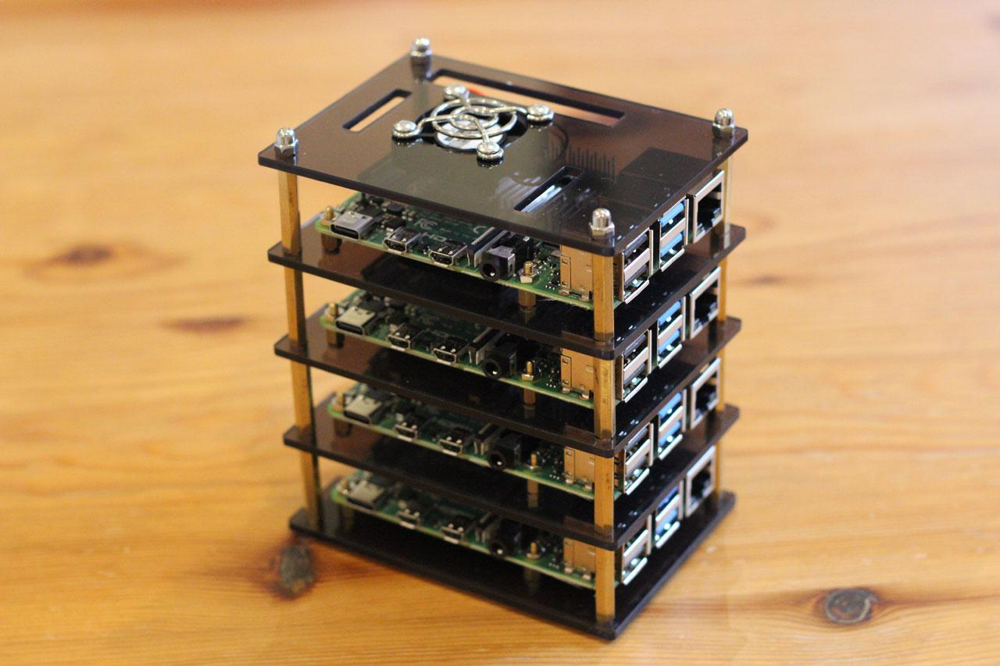

## Table of Contents

## What is a Raspberry Pi and why is it suitable for building a cluster?

A Raspberry Pi is a small, affordable computer that you can use for many different projects. It's about the size of a credit card and can do a lot of things that bigger computers can do, like running programs, connecting to the internet, and working with other devices. People often use Raspberry Pis for learning about computers, building robots, or creating home automation systems.

Raspberry Pis are great for building a cluster because they are cheap, small, and use very little power. A cluster is a group of computers that work together to solve big problems faster than one computer could alone. Since Raspberry Pis are inexpensive, you can buy many of them without spending a lot of money. They are also small, so you can fit a lot of them in a small space. Plus, they don't use much electricity, which means your cluster won't cost a lot to run. This makes Raspberry Pis a good choice for anyone wanting to build a cluster for learning or small projects.

## What is QSTrader and why would someone use it on a Raspberry Pi cluster?

QSTrader is a software tool that helps people trade stocks and other financial products using computer programs. It's designed for something called algorithmic trading, which means the computer makes trading decisions based on math and rules you set up. QSTrader can handle a lot of data and calculations quickly, which is important for trading because markets can change fast.

Someone might use QSTrader on a Raspberry Pi cluster because it's a good way to practice and learn about [algorithmic trading](/wiki/algorithmic-trading) without spending a lot of money. A Raspberry Pi cluster can run QSTrader and process the data needed for trading, but it's much cheaper than using big, expensive computers. This makes it perfect for students or hobbyists who want to try out trading strategies without a big investment.

## What is SLURM and how does it help in managing a cluster?

SLURM, which stands for Simple Linux Utility for Resource Management, is a software tool that helps manage a cluster of computers. It's like a boss that decides which jobs or tasks should run on which computers in the cluster. When you have a lot of computers working together, you need something to organize them so they don't get confused or waste time. SLURM does this by keeping track of what each computer is doing and making sure the right tasks get done at the right time.

Using SLURM on a cluster makes everything run more smoothly. For example, if you have a big project that needs a lot of computing power, SLURM can split it up and send different parts to different computers. This way, the project gets done faster because all the computers are working together. SLURM also helps by making sure that no single computer gets too busy while others are sitting idle. This balance helps the whole cluster work efficiently and get more done.

## How many Raspberry Pi units are typically needed to create an effective cluster for QSTrader?

To create an effective cluster for QSTrader using Raspberry Pi units, you usually need at least four to eight Raspberry Pis. This number allows the cluster to handle the data processing and calculations needed for algorithmic trading. With four Raspberry Pis, you can start running QSTrader and see how it performs, but adding more units up to eight can make the cluster faster and more reliable.

The exact number of Raspberry Pis you need can depend on how complex your trading strategies are and how much data you're working with. If you're just starting out or have simpler strategies, a smaller cluster might be enough. But if you want to handle more data or run more complicated algorithms, you might need to go up to eight or even more Raspberry Pis to keep everything running smoothly.

## What are the basic hardware requirements for each Raspberry Pi in the cluster?

Each Raspberry Pi in the cluster needs a few basic things to work well. You'll need the Raspberry Pi board itself, which is like the brain of the computer. You also need a microSD card to store the operating system and your programs. This is like the memory of the computer where it keeps all its important information. A power supply is crucial too, to make sure the Raspberry Pi has the energy it needs to run. Lastly, you'll need some way to connect to the Raspberry Pi, usually through an Ethernet cable for networking or a USB cable if you want to use a keyboard and monitor.

For running QSTrader and other programs smoothly, it's a good idea to have at least 1GB of RAM on each Raspberry Pi. This helps the computer handle more tasks at the same time. If you can, using a Raspberry Pi model with more RAM, like the Raspberry Pi 4 with 4GB or 8GB, can make your cluster even better. Also, make sure you have a good cooling system, like a fan or a heatsink, because the Raspberry Pis can get hot when they're working hard in a cluster.

## How do you set up the operating system on multiple Raspberry Pi units for clustering?

To set up the operating system on multiple Raspberry Pi units for clustering, you first need to get a microSD card for each Raspberry Pi. You'll use a computer to put the operating system onto these cards. A good choice for clustering is a Linux-based operating system like Raspbian or Ubuntu. You can download the operating system image from the internet and use software like Etcher or the Raspberry Pi Imager to copy it onto each microSD card. Make sure you do this for all the cards you need for your cluster.

Once you have the operating system on the microSD cards, put each card into a Raspberry Pi and connect them all to power and a network. When the Raspberry Pis start up, they will boot into the operating system you installed. You can then log into each Raspberry Pi over the network using SSH (Secure Shell) to set them up for clustering. You'll need to install and configure software like SLURM to manage your cluster. This way, all the Raspberry Pis can work together to run your programs, like QSTrader, more efficiently.

## What are the steps to install and configure SLURM on a Raspberry Pi cluster?

To install and configure SLURM on a Raspberry Pi cluster, you first need to make sure all your Raspberry Pis are running and connected to the same network. On each Raspberry Pi, you'll need to install the SLURM package. You can do this by opening a terminal and typing commands to update your package list and then install SLURM. For example, you might use commands like 'sudo apt update' and 'sudo apt install slurm-wlm' to get SLURM on each Raspberry Pi. After installing SLURM, you need to set up a configuration file that tells SLURM how to manage your cluster. This file, usually called 'slurm.conf', needs to be the same on all your Raspberry Pis.

Once you have SLURM installed on all the Raspberry Pis, you need to configure it so that the Raspberry Pis can work together. You do this by editing the 'slurm.conf' file to list all the Raspberry Pis in your cluster and set up how they should share the work. You'll also need to start the SLURM services on each Raspberry Pi. You can do this by running commands like 'sudo systemctl start slurmd' on each node, and 'sudo systemctl start slurmctld' on the Raspberry Pi you want to use as the controller for the cluster. After starting the services, you can check if everything is working by running a test job through SLURM to make sure all the Raspberry Pis are communicating and working together properly.

## How do you install and configure QSTrader on a SLURM-managed Raspberry Pi cluster?

To install and configure QSTrader on a SLURM-managed Raspberry Pi cluster, you first need to make sure that SLURM is up and running on all your Raspberry Pis. Once SLURM is set up, you can install QSTrader on the Raspberry Pi that you want to use as the main node for running the trading software. You can do this by downloading the QSTrader package from its website and following the installation instructions, which usually involve running some commands in the terminal to set up the software. After installing QSTrader, you need to make sure it can talk to SLURM. This means you need to set up QSTrader to use SLURM for managing the cluster's resources.

Once QSTrader is installed, you need to configure it to work with your cluster. This involves setting up a configuration file for QSTrader that tells it how to use the Raspberry Pis in your cluster. You'll need to tell QSTrader where to find the other Raspberry Pis and how to send jobs to them using SLURM. You can do this by editing the QSTrader configuration file to include details about your cluster setup. After configuring QSTrader, you can test it by running a simple trading job through SLURM to make sure everything is working correctly. If everything is set up right, QSTrader will use the power of your Raspberry Pi cluster to handle your trading tasks efficiently.

## What are common networking configurations and considerations for a Raspberry Pi cluster?

When setting up a Raspberry Pi cluster, one common way to connect the Raspberry Pis is using an Ethernet switch. You plug each Raspberry Pi into the switch with an Ethernet cable. This setup makes it easy for all the Raspberry Pis to talk to each other and share information quickly. It's like having a group of friends all connected in a circle, where they can pass messages around easily. Another way is to use Wi-Fi, but Ethernet is usually faster and more reliable for a cluster.

You also need to think about the network settings on each Raspberry Pi. You should give each Raspberry Pi a special address, called an IP address, so they can find each other on the network. It's like giving each friend a unique name so you can call them easily. You can set these addresses automatically using a tool called DHCP, or you can set them by hand if you want more control. Making sure all the Raspberry Pis can talk to each other smoothly is important for the cluster to work well.

Another thing to consider is security. You want to make sure that only the right people can access your Raspberry Pi cluster. You can do this by setting up passwords and using secure ways to connect, like SSH keys. Keeping your network safe helps protect your cluster and the important work it's doing, like running QSTrader.

## How can performance be optimized in a Raspberry Pi cluster running QSTrader?

To make your Raspberry Pi cluster run QSTrader faster, you need to think about a few things. One big thing is making sure your network is set up right. Using Ethernet cables instead of Wi-Fi can help because they are faster and more reliable. This way, the Raspberry Pis can share information quickly without getting slowed down. Also, you can try to balance the work evenly across all the Raspberry Pis. This means making sure no single Raspberry Pi is doing too much while others are sitting idle. You can use SLURM to help with this, as it can decide which Raspberry Pi should do which job to keep everything running smoothly.

Another way to boost performance is by using the right software settings. For example, you can change how QSTrader uses the cluster by tweaking its configuration file. This might mean telling QSTrader to use more memory or to split up big jobs into smaller pieces that can be handled by different Raspberry Pis at the same time. Keeping your Raspberry Pis cool is also important. If they get too hot, they might slow down or even stop working. You can use fans or heatsinks to keep them cool. Finally, always make sure your software, like QSTrader and SLURM, is up to date. Updates can fix problems and make everything run better.

## What are some advanced SLURM configurations that can enhance the management of a Raspberry Pi cluster?

To make your Raspberry Pi cluster work better with SLURM, you can use something called partitions. Think of partitions like different teams in your cluster. You can set up different partitions for different kinds of jobs. For example, you might have one partition for quick, small jobs and another for big, slow jobs that need a lot of time. This helps SLURM decide where to send each job so everything runs smoothly. You can also set up rules for each partition, like how long a job can run or how much memory it can use. This way, you can make sure the right jobs go to the right places and don't mess up other jobs.

Another cool thing you can do is use job arrays. Job arrays let you run the same job many times but with different settings. This is really helpful if you want to try out different trading strategies in QSTrader. You can set up a job array to test each strategy on different Raspberry Pis at the same time. This saves a lot of time because you don't have to wait for one job to finish before starting the next one. You can also use something called backfill scheduling. This means SLURM can find small gaps in the schedule to run short jobs. It's like fitting a small puzzle piece into a space where it just fits perfectly. This makes sure your cluster is always busy and working on something useful.

## How do you troubleshoot common issues in a Raspberry Pi cluster running QSTrader with SLURM?

When your Raspberry Pi cluster running QSTrader with SLURM isn't working right, one common problem might be that the Raspberry Pis can't talk to each other over the network. If this happens, check all your Ethernet cables and make sure they are plugged in correctly. Also, make sure each Raspberry Pi has the right IP address. If you're using Wi-Fi, try switching to Ethernet because it's usually more reliable. Another thing to check is if SLURM is running on all the Raspberry Pis. You can do this by using the command 'sudo systemctl status slurmd' on each node to see if the SLURM service is active. If it's not, you can start it with 'sudo systemctl start slurmd'.

Another issue could be that QSTrader is not using the cluster properly. This might happen if the QSTrader configuration file is not set up correctly to work with SLURM. Make sure the configuration file tells QSTrader how to use the cluster and how to send jobs to SLURM. You can also check the SLURM logs to see if there are any errors. You can find these logs in the '/var/log/slurm' directory. If you see any error messages, they can give you clues about what's going wrong. Sometimes, updating SLURM or QSTrader to the latest version can fix problems, so it's a good idea to keep your software up to date.

## References & Further Reading

[1]: ["The Algorithmic Trading Guide"](https://www.amazon.com/Algorithmic-Trading-Guide-Technology-overdrive-ebook/dp/B0BZN7YCJG) by Adam Hayes, CFA, from Investopedia.

[2]: ["Advances in Financial Machine Learning"](https://www.amazon.com/Advances-Financial-Machine-Learning-Marcos/dp/1119482089) by Marcos Lopez de Prado

[3]: ["Evidence-Based Technical Analysis: Applying the Scientific Method and Statistical Inference to Trading Signals"](https://www.amazon.com/Evidence-Based-Technical-Analysis-Scientific-Statistical/dp/0470008741) by David Aronson

[4]: ["Machine Learning for Algorithmic Trading"](https://github.com/stefan-jansen/machine-learning-for-trading) by Stefan Jansen

[5]: Raspberry Pi Foundation. ["Raspberry Pi Documentation"](https://www.raspberrypi.com/documentation/)

[6]: ["Quantitative Trading: How to Build Your Own Algorithmic Trading Business"](https://books.google.com/books/about/Quantitative_Trading.html?id=j70yEAAAQBAJ) by Ernest P. Chan

[7]: Raspberry Pi Trading Ltd. ["Raspberry Pi 4 Model B"](https://datasheets.raspberrypi.com/rpi4/raspberry-pi-4-datasheet.pdf) 

[8]: Mitchell, T. (1997). ["Machine Learning"](https://www.cs.cmu.edu/~tom/mlbook.html) McGraw-Hill Science/Engineering/Math.