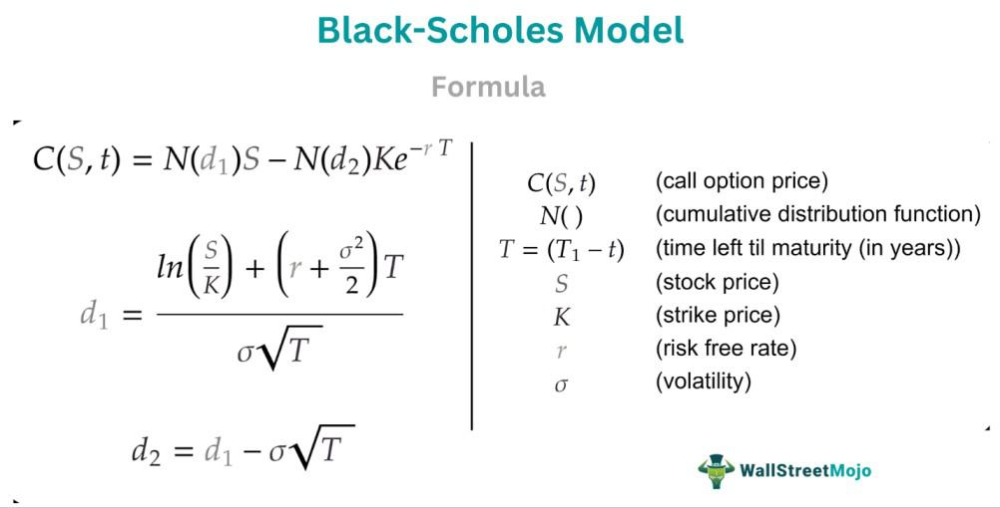

The Black-Scholes model is a cornerstone in financial modeling, particularly known for its pivotal role in determining the pricing of options and derivatives. Developed by Fischer Black, Myron Scholes, and Robert Merton in the early 1970s, the model fundamentally transformed the field of financial economics by providing a systematic method to estimate the value of options, which are complex financial instruments used for hedging and speculation. The standard form of the Black-Scholes equation can be expressed as:

$$
C = S_0 N(d_1) - X e^{-rT} N(d_2)
$$



Where:
- $C$ is the call option price,
- $S_0$ is the current stock price,
- $X$ is the strike price,
- $r$ is the risk-free interest rate,
- $T$ is the time to expiration,
- $N$ is the cumulative distribution function of the standard normal distribution,
- $d_1$ and $d_2$ are intermediate calculations based on the aforementioned parameters and volatility.

The significance of the Black-Scholes model lies not only in its widespread application but also in its theoretical insights into market behavior under the assumptions of constant volatility and log-normal distribution of stock prices. It simplified complex valuations, allowing market participants to make informed decisions with greater precision than previously possible. This predictive capability facilitates risk management, enabling traders to mitigate potential losses or optimize gains.

In algorithmic trading, the Black-Scholes model serves as a foundational tool that informs automated decision-making processes. Algorithms utilize its outputs to conduct instantaneous trades based on market conditions, thereby enhancing efficiency and speed in the execution of trading strategies. These algorithms often incorporate real-time data inputs to continuously refine their estimations, a testament to the model's adaptability and robustness.

Throughout this article, we will examine the theoretical underpinnings of the Black-Scholes model, its integral components, real-world applications, and alternatives within the context of [algorithmic trading](/wiki/algorithmic-trading) and modern financial markets. By exploring these themes, the article aims to shed light on the model's profound influence and enduring relevance in the continually evolving landscape of financial modeling.

## Table of Contents

## Understanding Black-Scholes Valuation Models

The Black-Scholes model is a pioneering mathematical model for pricing European-style options and has played a transformative role in the field of financial derivatives. Developed by economists Fischer Black, Myron Scholes, and Robert Merton in the early 1970s, the model provides a theoretical framework for estimating the fair price of options contracts. The model was first published in their seminal paper, "The Pricing of Options and Corporate Liabilities," in 1973.

At its core, the Black-Scholes model is predicated on the notion of hedging risk through the continuous adjustment of portfolio holdings, achieving a risk-free position. This idea is mathematically formalized using partial differential equations, particularly the Black-Scholes Partial Differential Equation (PDE). The model assumes that financial markets are efficient, meaning that asset prices follow a stochastic process known as geometric Brownian motion, characterized by constant [volatility](/wiki/volatility-trading-strategies) and no [arbitrage](/wiki/arbitrage) opportunities. In mathematical terms, the price $S(t)$ of the underlying asset can be described by the stochastic differential equation:

$$

dS(t) = \mu S(t) dt + \sigma S(t) dW(t) 
$$

where $\mu$ is the drift coefficient representing the expected return rate, $\sigma$ is the volatility of the asset, and $dW(t)$ is a Wiener process or Brownian motion.

The Black-Scholes formula for the price of a European call option $C$ is expressed as:

$$

C = S_0 N(d_1) - X e^{-rT} N(d_2) 
$$

where:
- $S_0$ is the current price of the stock.
- $X$ is the strike price of the option.
- $r$ is the risk-free interest rate.
- $T$ is the time to expiration of the option.
- $N(\cdot)$ is the cumulative distribution function of the standard normal distribution.
- $d_1$ and $d_2$ are calculated as:

$$
d_1 = \frac{\ln(S_0/X) + (r + \sigma^2/2)T}{\sigma\sqrt{T}}
$$

$$
d_2 = d_1 - \sigma\sqrt{T}
$$

This model is critical for options pricing because it provides a closed-form solution, making it computationally efficient and widely implementable in financial markets. The significance of the Black-Scholes model extends beyond the pricing of options; it laid the groundwork for much of modern financial theory, including risk management strategies and the development of more complex derivatives pricing models. By providing a formal approach to quantifying the risks and returns of options, the Black-Scholes model facilitated the growth of the options market and improved the tools available to practitioners for managing financial risk.

The introduction of the Black-Scholes model revolutionized financial modeling by introducing a framework that could effectively capture the dynamics of asset price movements, leading to more informed and strategic decision-making in trading environments.

## The Components of the Black-Scholes Model

The Black-Scholes model, a cornerstone in financial mathematics, provides a comprehensive method for valuing options and derivatives. Understanding its components is essential for accurately implementing the model.

### Key Variables of the Black-Scholes Formula

1. **Stock Price (S)**: This represents the current price of the underlying asset. The model assumes continuous trading, meaning the stock price can change at any moment.

2. **Strike Price (K)**: This is the price at which the option holder can buy (in the case of a call option) or sell (in the case of a put option) the underlying asset.

3. **Time to Expiration (T)**: Expressed in years, this is the duration until the option contract expires. It influences the option’s time value, with longer durations generally increasing the premium.

4. **Risk-Free Rate (r)**: This is the theoretical return on an investment with no risk of financial loss, often represented by government bond yields. It reflects the opportunity cost of holding an option rather than investing in risk-free securities.

5. **Volatility (σ)**: This denotes the standard deviation of the stock’s returns, representing the magnitude of the asset's price movements. Higher volatility increases the option’s value due to the greater chance of profitable price movements.

The Black-Scholes formula can be expressed mathematically as follows for a European call option:

$$
C = S_0 N(d_1) - K e^{-rT} N(d_2)
$$

Where:
- $d_1 = \frac{\ln(S_0 / K) + (r + \sigma^2 / 2)T}{\sigma \sqrt{T}}$
- $d_2 = d_1 - \sigma \sqrt{T}$

Here, $N(d)$ represents the cumulative distribution function of the standard normal distribution.

### Assumptions Underlying the Black-Scholes Model

The Black-Scholes model is built upon several critical assumptions, which serve to simplify the complex world of financial markets:

- **Efficient Markets**: The model assumes that markets are efficient, meaning that all available information is already reflected in asset prices, and there are no arbitrage opportunities.
- **Log-Normal Distribution**: The assumption that asset prices follow a log-normal distribution, allowing for continuous price changes without negative values.
- **Constant Volatility and Interest Rate**: It presumes constant volatility and a constant risk-free interest rate over the option's life.
- **European Options**: The model specifically applies to European-style options, which can only be exercised at expiration.
- **No Dividends**: It initially considers non-dividend paying stocks, although adjustments can be made for dividend-paying stocks.

### Limitations and Applicability

While the Black-Scholes model is a valuable tool, it has limitations:

- **Market Realism**: Real-world markets often deviate from the model’s assumptions, particularly regarding constant volatility and interest rates. These parameters are often unpredictable and subject to change.

- **American Options**: Black-Scholes is not directly applicable to American options that can be exercised before expiry, which require more complex models like binomial trees for pricing.

- **Volatility Smile**: The model assumes a constant volatility, but in practice, implied volatility varies with strike prices and maturities, forming a volatility "smile".

- **Transaction Costs and Taxes**: The model does not account for transaction costs, taxes, or liquidity issues, which can affect trading and pricing.

Understanding these components, assumptions, and limitations allows traders and financial analysts to effectively apply the Black-Scholes model, adapting it or integrating it with other methodologies to cater to specific market conditions and instrument types.

## Integration with Algorithmic Trading

The Black-Scholes model plays a significant role in algorithmic trading strategies by providing a mathematical framework for options pricing. In algorithmic trading, this model assists traders in making swift, data-driven decisions and managing risks inherent in financial markets.

Primarily, the Black-Scholes model aids in determining the theoretical value of options. The formula incorporates variables like the stock price ($S$), strike price ($K$), time to expiration ($T$), risk-free [interest rate](/wiki/interest-rate-trading-strategies) ($r$), and volatility ($\sigma$). These inputs are pivotal in algorithms that automatically execute trades based on predefined conditions. The Black-Scholes formula, defined as:

$$
C(S, T) = S N(d_1) - Ke^{-rT} N(d_2)
$$

where:

$$
d_1 = \frac{\ln(S/K) + (r + \sigma^2 / 2) T}{\sigma \sqrt{T}}
$$

$$
d_2 = d_1 - \sigma \sqrt{T}
$$

Here, $N(\cdot)$ represents the cumulative distribution function of the standard normal distribution. This mathematical foundation supports algorithmic systems in identifying mispriced options, which traders can exploit for profit opportunities.

Algorithmic trading strategies leverage the Black-Scholes model to inform decisions, helping traders dynamically rebalance portfolios to maintain a desired risk level, or delta-neutral positions. By assessing the model's outputs, algorithms can initiate buys or sells to hedge risks against market movements or volatility changes.

The integration of Black-Scholes into automated trading environments yields substantial benefits, including expedited decision-making processes and a reduction in human errors. However, challenges persist, primarily tied to the model's assumptions—such as constant volatility and continuous trading—which may not hold true in real markets. These assumptions can lead to discrepancies between the theoretical model and actual market conditions, occasionally resulting in the model's predictions failing to align with the true price of options.

Moreover, high-frequency trading systems using the Black-Scholes model must manage computational limitations and latency. Implementing the model efficiently in code is crucial. Here is a basic Python implementation:

```python
from math import log, sqrt, exp
from scipy.stats import norm

def black_scholes_call(S, K, T, r, sigma):
    d1 = (log(S / K) + (r + sigma ** 2 / 2) * T) / (sigma * sqrt(T))
    d2 = d1 - sigma * sqrt(T)
    call_price = S * norm.cdf(d1) - K * exp(-r * T) * norm.cdf(d2)
    return call_price

# Example usage
S = 100  # Current stock price
K = 100  # Strike price
T = 1    # Time to expiration in years
r = 0.05 # Risk-free interest rate
sigma = 0.2  # Volatility

print(black_scholes_call(S, K, T, r, sigma))
```

While adaptable and robust, traders must exercise careful judgment when using the Black-Scholes model within algorithmic systems. Adjustments or alternative strategies should be considered when market conditions diverge significantly from model assumptions, ensuring that trading decisions remain aligned with actual market dynamics.

## Alternative Valuation Models

In the field of financial modeling and options pricing, the Black-Scholes model stands as a seminal framework. However, several alternative models, such as the Binomial model and Monte Carlo simulations, offer varied approaches to valuation, each with its advantages and limitations.

The Binomial model provides a discrete-time framework for options pricing, contrasting with the continuous-time assumption of Black-Scholes. It uses a lattice-based method for calculating the potential future outcomes of stock prices over multiple periods. This involves constructing a binomial tree where each node represents a possible price at a given point in time. The advantages of the Binomial model include its flexibility in handling a variety of conditions, including American-style options (which can be exercised before expiration) and dividend-paying stocks. This flexibility allows for greater adaptability in modeling complex financial instruments. However, one major limitation is its computational intensity, as the model requires extensive calculations involving numerous time steps, resulting in slower processing times compared to the analytical solution provided by Black-Scholes.

Monte Carlo simulations offer another alternative, employing stochastic techniques to simulate the behavior of assets and their associated options. By generating a large number of random price paths based on assumed statistical properties, Monte Carlo methods can estimate the option's price through averaging the outcomes. This technique is particularly advantageous for valuing complex derivatives with multiple sources of uncertainty or path-dependent features. The primary limitation of Monte Carlo simulations is their demand for significant computational resources, especially when high precision is desired. Additionally, while flexible, the accuracy of Monte Carlo methods heavily depends on the quality of input assumptions regarding volatility and other market parameters.

These alternative models are preferable to Black-Scholes in certain situations. For instance, when path-dependency or early exercise characteristics are crucial, the Binomial model may be more suitable. Similarly, in scenarios involving complex payoffs or financial instruments with significant market dependencies, Monte Carlo simulations provide greater versatility. Conversely, Black-Scholes is often less effective in markets exhibiting volatility skews or irregularities, as it assumes constant volatility and a normal distribution of returns. In such instances, these alternative methods can better capture the nuances of real-world market dynamics, offering more robust risk assessments for traders and financial institutions.

## Real-world Applications and Case Studies

The Black-Scholes model, since its development, has been an indispensable tool for financial institutions and traders in the pricing of options. Its formula helps determine the theoretical price of European call and put options, providing guidance for trading strategies and risk management. One of the model's significant applications is in the trading desks of investment banks and hedge funds, where it is used to value and hedge option portfolios swiftly.

### Examples of Application

1. **Financial Institutions**: Major banks apply the Black-Scholes model to value their derivatives books accurately. By inputting real-time market data, such as current stock prices, volatility estimates, and interest rates, traders and risk managers are able to calculate the fair value of options and implement hedging strategies to protect their portfolios against market movements.

2. **Traders**: Individual traders and proprietary trading firms also employ the Black-Scholes model as part of their quantitative frameworks. By using this model, they can identify mispriced options relative to the market, executing trades to capture arbitrage opportunities. 

### Case Studies

1. **Successful Application**: In the early 1980s, Salomon Brothers, an investment bank, reportedly utilized the Black-Scholes model along with proprietary trading strategies to capitalize on the new options markets. The ability to price options quickly and efficiently gave them a competitive edge, leading to significant profits.

2. **Limitations in Practice**: The 1987 stock market crash, also known as "Black Monday," highlighted limitations of the Black-Scholes model, primarily its assumption of constant volatility and the normal distribution of stock returns. The crash caused an unprecedented increase in implied volatility, referred to as "volatility skew," challenging the assumptions of the model. Traders and firms relying solely on Black-Scholes suffered significant losses due to their unhedged option positions being mispriced.

### Volatility Skew and Market Movements

The concept of volatility skew, where implied volatilities vary with different strike prices and expiration dates, presents a challenge for implementing the Black-Scholes model. Prior to events like Black Monday, the market assumed a level of relative symmetry in volatility, but post-crisis, the implied volatility smile became a recognized occurrence. This deviation affects the model's assumption of constant volatility. As a result, traders have had to adjust their pricing and hedging strategies, often incorporating implied volatility surfaces into their models to better manage risk.

In practice, traders might use variations such as the Black-Scholes-Merton model, or incorporate stochastic volatility models to account for these skews and adjust their strategies accordingly. Additionally, advancements in computational power allow for more dynamic models that integrate real-time data, thereby improving the robustness of options pricing despite inherent market unpredictability.

Python code implementing a basic Black-Scholes option pricing can be found below:

```python
from scipy.stats import norm
import numpy as np

def black_scholes(S, K, T, r, sigma, option_type="call"):
    d1 = (np.log(S / K) + (r + 0.5 * sigma**2) * T) / (sigma * np.sqrt(T))
    d2 = d1 - sigma * np.sqrt(T)
    if option_type == "call":
        price = S * norm.cdf(d1) - K * np.exp(-r * T) * norm.cdf(d2)
    elif option_type == "put":
        price = K * np.exp(-r * T) * norm.cdf(-d2) - S * norm.cdf(-d1)
    return price

# Example usage:
S = 100  # current stock price
K = 100  # strike price
T = 1    # time to expiration in years
r = 0.05 # risk-free interest rate
sigma = 0.2 # volatility

call_price = black_scholes(S, K, T, r, sigma, "call")
put_price = black_scholes(S, K, T, r, sigma, "put")

print(f"Call Price: {call_price}, Put Price: {put_price}")
```

In conclusion, while the Black-Scholes model remains a cornerstone of financial modeling for options pricing, understanding its assumptions and the impact of market anomalies like volatility skew is crucial for its effective application. As markets evolve, so too must the models and strategies built upon them.

## Conclusion

The Black-Scholes model has fundamentally changed the landscape of modern financial markets since its introduction. By providing a systematic method for valuing options, the model offered traders and financial analysts a way to quantify risk and make informed decisions. Its impact is apparent as the framework continues to be a cornerstone for the pricing of options and other derivatives, with applicability across various financial institutions globally. The Black-Scholes equation, expressed as:

$$
C(S,t) = S_0N(d_1) - Xe^{-rt}N(d_2)
$$

where $N$ is the cumulative distribution function of the standard normal distribution, $S_0$ is the current stock price, $X$ is the strike price, $r$ is the risk-free interest rate, and $t$ is the time to expiration, remains pivotal in evaluating European call options.

The future of financial modeling with Black-Scholes, especially within algorithmic trading, holds promising possibilities. With advancements in technology, trading algorithms can incorporate more complex data and adapt real-time insights to refine their strategies. This evolution necessitates enhancements in modeling accuracy, particularly in addressing the model's limitations, such as its assumptions of constant volatility and interest rates. Modern approaches might integrate [machine learning](/wiki/machine-learning) techniques to predict volatility or employ high-frequency data to adjust model parameters dynamically.

Furthermore, the integration of alternative models, like the Binomial and Monte Carlo methods, alongside Black-Scholes, suggests an emerging hybrid modeling landscape. These alternatives offer flexibility in scenarios where the traditional Black-Scholes assumptions may not hold, such as in cases with discrete time trading or varying market conditions.

Ultimately, the ongoing relevance of the Black-Scholes model and its variants depends on their adaptability to an evolving market environment characterized by rapid technological advancements. As financial markets continue to grow increasingly complex, the model will likely undergo continued refinement and integration with cutting-edge technologies, ensuring its pertinence in both traditional and emerging financial markets.

## References & Further Reading

[1]: Black, F., & Scholes, M. (1973). ["The Pricing of Options and Corporate Liabilities."](https://www.cs.princeton.edu/courses/archive/fall09/cos323/papers/black_scholes73.pdf) Journal of Political Economy, 81(3), 637-654.

[2]: Merton, R.C. (1973). ["Theory of Rational Option Pricing."](https://www.jstor.org/stable/3003143) The Bell Journal of Economics and Management Science, 4(1), 141-183.

[3]: Hull, J.C. (2021). ["Options, Futures, and Other Derivatives."](https://www.pearson.com/en-us/subject-catalog/p/options-futures-and-other-derivatives/P200000005938/9780136939917) Pearson Education Limited.

[4]: Jäckel, P. (2002). ["Monte Carlo Methods in Finance."](https://www.amazon.com/Monte-Carlo-Methods-Finance-Jaeckel/dp/047149741X) Wiley.

[5]: Cox, J.C., Ross, S.A., & Rubinstein, M. (1979). ["Option Pricing: A Simplified Approach."](https://www.sciencedirect.com/science/article/pii/0304405X79900151) Journal of Financial Economics, 7(3), 229-263.

[6]: Wilmott, P. (2006). ["Paul Wilmott Introduces Quantitative Finance."](https://www.amazon.com/Paul-Wilmott-Introduces-Quantitative-Finance/dp/0470319585) Wiley.