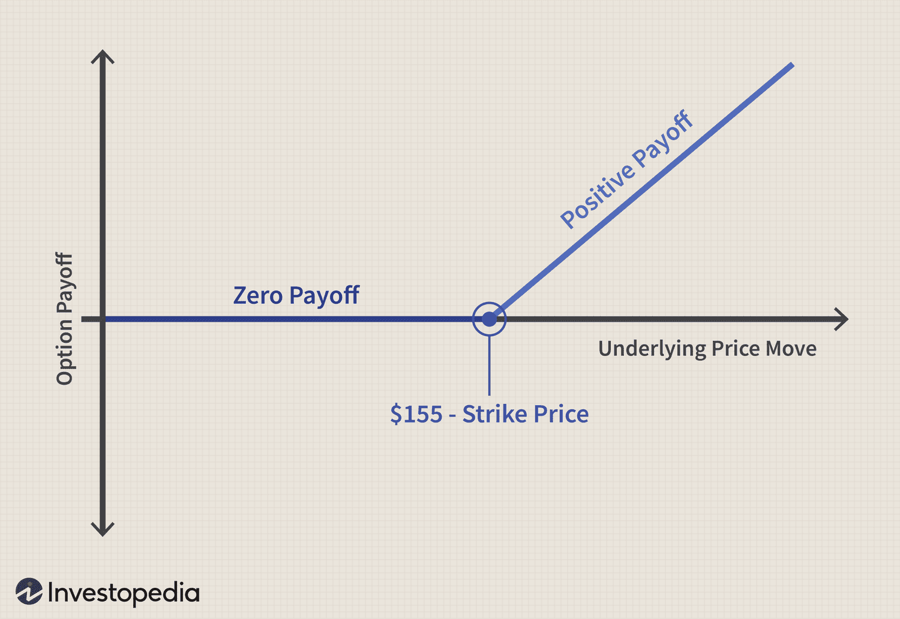

## Table of Contents

## What is the Black-Scholes model and why is it important for building valuation models?

The Black-Scholes model is a mathematical formula used to calculate the theoretical price of options, which are financial contracts that give the buyer the right, but not the obligation, to buy or sell an asset at a specific price on or before a certain date. The model was developed by economists Fischer Black and Myron Scholes in 1973 and has since become a cornerstone in financial economics. It considers factors like the current price of the stock, the option's strike price, time until expiration, risk-free interest rate, and the stock's volatility to estimate the option's fair value.

The Black-Scholes model is important for building valuation models because it provides a standardized way to price options, which are crucial in many investment strategies and risk management practices. By using this model, financial analysts and traders can make more informed decisions about buying, selling, or hedging options. The model's widespread acceptance and use have also led to the development of more advanced models and techniques, improving the overall accuracy and efficiency of financial markets. Understanding the Black-Scholes model is essential for anyone involved in options trading or financial modeling, as it forms the basis for more complex valuation approaches.

## How does the Black-Scholes formula work, and what are its key components?

The Black-Scholes formula works by calculating the fair price of a call or put option. It does this by taking into account several key pieces of information about the underlying stock and the option itself. The formula uses a mathematical approach to balance the probabilities of different outcomes, considering how the stock price might move over time. The result is a single number that represents what the option should be worth, based on the model's assumptions.

The key components of the Black-Scholes formula are the current price of the stock, the option's strike price, the time left until the option expires, the risk-free interest rate, and the volatility of the stock's price. The current stock price and the strike price help determine how much the option is worth if it were exercised right now. The time left until expiration is important because the longer the time, the more chance the stock has to move in a favorable direction. The risk-free interest rate accounts for the time value of money, and volatility measures how much the stock price is expected to fluctuate, which affects the likelihood of the option ending up in-the-money. By combining these factors, the Black-Scholes model provides a theoretical price for the option.

## What are the assumptions underlying the Black-Scholes model?

The Black-Scholes model makes several assumptions to simplify the complex world of stock prices and options. One key assumption is that stock prices follow a random walk, meaning they move in a way that's unpredictable but can be described by a normal distribution. This means the model assumes the stock's returns are normally distributed and that the volatility of the stock stays the same over time. Another assumption is that the market is efficient, so all available information is already reflected in the stock price. This means there are no sudden jumps or big surprises in the stock price, just smooth, continuous movements.

The model also assumes that there are no transaction costs or taxes when buying or selling stocks or options. This makes the math easier but isn't always true in the real world. Another assumption is that the risk-free interest rate is constant and known, which helps in calculating the time value of money. Finally, the model assumes that the option can only be exercised at expiration, not before, which is known as a European-style option. These assumptions help make the Black-Scholes model a powerful tool for pricing options, but they also mean it's not perfect for every situation.

## How can the Black-Scholes model be applied to value options?

The Black-Scholes model helps figure out what an option should be worth by using a special math formula. It looks at things like the current price of the stock, how much you can buy or sell the stock for with the option (called the strike price), how long until the option runs out, the interest rate you can get without risk, and how much the stock's price jumps around (called volatility). By putting all these pieces together, the model gives you a number that says what the option should cost. This number helps people decide if an option is a good deal or not.

In real life, people use the Black-Scholes model to make smart choices about buying and selling options. For example, if the model says an option should cost $5 but you can buy it for $4, it might be a good buy. On the other hand, if the model says it should be worth $3 but it's selling for $4, you might want to think twice. Traders and investors use the model to help them make these decisions, but they also know that the model isn't perfect because it makes some guesses about how the world works that aren't always true. Still, it's a really helpful tool that lots of people in finance use every day.

## What are the limitations of the Black-Scholes model in practical valuation scenarios?

The Black-Scholes model is a great tool, but it has some limitations when we use it in the real world. One big problem is that it assumes the stock price moves in a smooth, predictable way, like a random walk. But in real life, stock prices can jump suddenly because of news or events, and the model doesn't handle these jumps well. Also, the model thinks the stock's volatility stays the same over time, but in reality, volatility can change a lot, making the model's predictions less accurate.

Another limitation is that the Black-Scholes model assumes you can buy and sell stocks and options without any costs like taxes or fees. In the real world, these costs can make a big difference in what an option is actually worth. The model also assumes you can borrow money at a risk-free rate that stays the same, which isn't always true. Plus, the model only works for European-style options, which you can only use at the end of their life, not American-style options that you can use anytime before they expire. All these things mean that while the Black-Scholes model is a helpful starting point, it needs to be used carefully and sometimes adjusted to fit real-world situations.

## How can one adjust the Black-Scholes model for dividends?

When a company pays dividends, it can affect the price of its stock and, therefore, the value of options on that stock. The Black-Scholes model, in its basic form, doesn't take dividends into account. But we can adjust it to consider dividends by subtracting the present value of expected dividends from the stock price before we use the model. This makes the model more accurate because dividends lower the stock price when they're paid out, which can change how much an option is worth.

To do this, you need to know when the dividends will be paid and how much they will be. You then calculate the present value of these dividends using the risk-free interest rate. Once you have that, you subtract it from the current stock price and use this adjusted price in the Black-Scholes formula. This way, the model can better predict the option's value, making it more useful for investors and traders who are dealing with stocks that pay dividends.

## What are the differences between the Black-Scholes model and other option pricing models like the Binomial model?

The Black-Scholes model and the Binomial model are both used to figure out how much an option should cost, but they do it in different ways. The Black-Scholes model uses a big math formula that looks at things like the current stock price, the price you can buy or sell the stock for with the option, how long the option lasts, the interest rate without risk, and how much the stock price jumps around. It assumes the stock price moves smoothly and that you can buy and sell without any costs. This makes it quick and easy to use, but it's not always perfect for real-life situations because it doesn't handle sudden changes in stock prices or costs like taxes and fees.

On the other hand, the Binomial model breaks down the time until the option expires into smaller pieces and looks at what might happen at each step. It makes a kind of tree where at each step, the stock price can go up or down, and you can see how the option's value changes along the way. This model is more flexible because it can handle things like dividends and sudden price jumps better than the Black-Scholes model. However, it can be more complicated to use and takes more time to calculate, especially if you want to look at a lot of steps or a long time period. Both models are useful, but they're good for different situations depending on what you need.

## How can the Black-Scholes model be implemented in a programming language like Python?

To use the Black-Scholes model in Python, you need to write a function that takes in all the pieces of information the model needs, like the current stock price, the option's strike price, how long until the option expires, the risk-free interest rate, and the stock's volatility. You can use a special math library called `math` or `numpy` to help with the calculations. The function will use the Black-Scholes formula to figure out the option's price. For example, you might start by importing the `math` library, then define your function with all the necessary inputs, and finally, use the formula to calculate the option's value.

Here's a simple example: You would write `import math` at the top of your code. Then, you might define a function called `black_scholes` that takes in parameters like `S` for the stock price, `K` for the strike price, `T` for the time to expiration, `r` for the risk-free rate, and `sigma` for volatility. Inside the function, you'd use the Black-Scholes formula, which involves calculating things like the standard normal cumulative distribution function, often called `norm.cdf` in programming. After putting all the pieces together, your function will return the calculated option price. This way, you can easily plug in different values and see what the model says the option should be worth.

## What advanced techniques can be used to enhance the Black-Scholes model, such as volatility smiles and surfaces?

One way to make the Black-Scholes model better is by using something called a volatility smile. The basic Black-Scholes model says that the stock's volatility stays the same no matter what the option's strike price is. But in real life, we see that options with different strike prices can have different volatilities. This pattern looks like a smile on a graph, so we call it a volatility smile. By adding this idea to the Black-Scholes model, we can make it more accurate because it takes into account how the market really works. Traders use this to get a better idea of an option's price, especially when the market is expecting big moves in the stock price.

Another advanced technique is using a volatility surface. A volatility surface is like a 3D version of the volatility smile. It looks at how volatility changes not just with the strike price, but also with how long until the option expires. This gives us a more complete picture of how the market sees risk and uncertainty. By using a volatility surface, the Black-Scholes model can be adjusted to fit different options with different times until they expire and different strike prices. This makes the model even more useful for traders and investors who need to understand and predict option prices in a more detailed way.

## How does one calibrate the Black-Scholes model to market data?

To make the Black-Scholes model work better with real-world prices, you need to adjust it to match what's happening in the market. This process is called calibration. You start by looking at the prices of options that are actually trading in the market. Then, you change the inputs of the Black-Scholes model, like the stock's volatility, until the model's prices match the market prices as closely as possible. This usually involves trying different values for volatility until you find the one that makes the model's option prices line up with the real ones.

Once you have the right volatility, you can use the calibrated model to price other options or to make predictions about how option prices might change. This is important because the stock's volatility can change over time, and what worked yesterday might not work today. By regularly updating the model with new market data, you can keep your option pricing more accurate. This helps traders and investors make better decisions about buying and selling options.

## What are the implications of using the Black-Scholes model in high-frequency trading environments?

In high-frequency trading, where trades happen very quickly, using the Black-Scholes model can be tricky. The model works best when things move slowly and smoothly, but in high-frequency trading, prices can jump around a lot in a short time. This means the model might not be as accurate because it can't keep up with these fast changes. Also, high-frequency traders often use other, more complex models that can handle quick price movements better. So, while the Black-Scholes model can give a good starting point, it might need a lot of adjustments to be useful in this fast-paced world.

Even though the Black-Scholes model might not be perfect for high-frequency trading, it can still be helpful. Traders can use it as a benchmark to compare with other models or to quickly get a rough idea of an option's value. But because high-frequency trading relies on being very fast and accurate, traders often need to combine the Black-Scholes model with other tools and data to make the best decisions. This way, they can take advantage of the model's strengths while also dealing with the fast and unpredictable nature of high-frequency trading.

## How can the Black-Scholes model be extended to value exotic options and other complex financial instruments?

The Black-Scholes model can be tweaked and expanded to help value more complicated financial products, like exotic options. Exotic options are different from regular options because they have special features, like being able to be used at several different times or having a payoff that depends on more than just the final price of the stock. To use the Black-Scholes model for these, you need to change it to fit these special rules. For example, if an exotic option can be used at several times, you might need to use something called a lattice model or a Monte Carlo simulation to figure out its value, building on the ideas from Black-Scholes.

Another way to extend the Black-Scholes model is by using it as a starting point for valuing other complex financial instruments, like options on futures or options with barriers. For options on futures, you can adjust the Black-Scholes formula to account for the cost of holding the futures contract. For barrier options, which only pay out if the stock price hits a certain level, you can use the Black-Scholes model along with additional math to figure out the chances of hitting that barrier. By making these adjustments, the Black-Scholes model becomes a useful tool for understanding and pricing a wider range of financial products, even if it was originally designed for simpler options.

## What is the Understanding of Black-Scholes Valuation Models?

The Black-Scholes model is a pioneering mathematical model for pricing European-style options and has played a transformative role in the field of financial derivatives. Developed by economists Fischer Black, Myron Scholes, and Robert Merton in the early 1970s, the model provides a theoretical framework for estimating the fair price of options contracts. The model was first published in their seminal paper, "The Pricing of Options and Corporate Liabilities," in 1973.

At its core, the Black-Scholes model is predicated on the notion of hedging risk through the continuous adjustment of portfolio holdings, achieving a risk-free position. This idea is mathematically formalized using partial differential equations, particularly the Black-Scholes Partial Differential Equation (PDE). The model assumes that financial markets are efficient, meaning that asset prices follow a stochastic process known as geometric Brownian motion, characterized by constant [volatility](/wiki/volatility-trading-strategies) and no [arbitrage](/wiki/arbitrage) opportunities. In mathematical terms, the price $S(t)$ of the underlying asset can be described by the stochastic differential equation:

$$

dS(t) = \mu S(t) dt + \sigma S(t) dW(t) 
$$

where $\mu$ is the drift coefficient representing the expected return rate, $\sigma$ is the volatility of the asset, and $dW(t)$ is a Wiener process or Brownian motion.

The Black-Scholes formula for the price of a European call option $C$ is expressed as:

$$

C = S_0 N(d_1) - X e^{-rT} N(d_2) 
$$

where:
- $S_0$ is the current price of the stock.
- $X$ is the strike price of the option.
- $r$ is the risk-free interest rate.
- $T$ is the time to expiration of the option.
- $N(\cdot)$ is the cumulative distribution function of the standard normal distribution.
- $d_1$ and $d_2$ are calculated as:

$$
d_1 = \frac{\ln(S_0/X) + (r + \sigma^2/2)T}{\sigma\sqrt{T}}
$$

$$
d_2 = d_1 - \sigma\sqrt{T}
$$

This model is critical for options pricing because it provides a closed-form solution, making it computationally efficient and widely implementable in financial markets. The significance of the Black-Scholes model extends beyond the pricing of options; it laid the groundwork for much of modern financial theory, including risk management strategies and the development of more complex derivatives pricing models. By providing a formal approach to quantifying the risks and returns of options, the Black-Scholes model facilitated the growth of the options market and improved the tools available to practitioners for managing financial risk.

The introduction of the Black-Scholes model revolutionized financial modeling by introducing a framework that could effectively capture the dynamics of asset price movements, leading to more informed and strategic decision-making in trading environments.

## What are the components of the Black-Scholes Model?

The Black-Scholes model, a cornerstone in financial mathematics, provides a comprehensive method for valuing options and derivatives. Understanding its components is essential for accurately implementing the model.

### Key Variables of the Black-Scholes Formula

1. **Stock Price (S)**: This represents the current price of the underlying asset. The model assumes continuous trading, meaning the stock price can change at any moment.

2. **Strike Price (K)**: This is the price at which the option holder can buy (in the case of a call option) or sell (in the case of a put option) the underlying asset.

3. **Time to Expiration (T)**: Expressed in years, this is the duration until the option contract expires. It influences the option’s time value, with longer durations generally increasing the premium.

4. **Risk-Free Rate (r)**: This is the theoretical return on an investment with no risk of financial loss, often represented by government bond yields. It reflects the opportunity cost of holding an option rather than investing in risk-free securities.

5. **Volatility (σ)**: This denotes the standard deviation of the stock’s returns, representing the magnitude of the asset's price movements. Higher volatility increases the option’s value due to the greater chance of profitable price movements.

The Black-Scholes formula can be expressed mathematically as follows for a European call option:

$$
C = S_0 N(d_1) - K e^{-rT} N(d_2)
$$

Where:
- $d_1 = \frac{\ln(S_0 / K) + (r + \sigma^2 / 2)T}{\sigma \sqrt{T}}$
- $d_2 = d_1 - \sigma \sqrt{T}$

Here, $N(d)$ represents the cumulative distribution function of the standard normal distribution.

### Assumptions Underlying the Black-Scholes Model

The Black-Scholes model is built upon several critical assumptions, which serve to simplify the complex world of financial markets:

- **Efficient Markets**: The model assumes that markets are efficient, meaning that all available information is already reflected in asset prices, and there are no arbitrage opportunities.
- **Log-Normal Distribution**: The assumption that asset prices follow a log-normal distribution, allowing for continuous price changes without negative values.
- **Constant Volatility and Interest Rate**: It presumes constant volatility and a constant risk-free interest rate over the option's life.
- **European Options**: The model specifically applies to European-style options, which can only be exercised at expiration.
- **No Dividends**: It initially considers non-dividend paying stocks, although adjustments can be made for dividend-paying stocks.

### Limitations and Applicability

While the Black-Scholes model is a valuable tool, it has limitations:

- **Market Realism**: Real-world markets often deviate from the model’s assumptions, particularly regarding constant volatility and interest rates. These parameters are often unpredictable and subject to change.

- **American Options**: Black-Scholes is not directly applicable to American options that can be exercised before expiry, which require more complex models like binomial trees for pricing.

- **Volatility Smile**: The model assumes a constant volatility, but in practice, implied volatility varies with strike prices and maturities, forming a volatility "smile".

- **Transaction Costs and Taxes**: The model does not account for transaction costs, taxes, or liquidity issues, which can affect trading and pricing.

Understanding these components, assumptions, and limitations allows traders and financial analysts to effectively apply the Black-Scholes model, adapting it or integrating it with other methodologies to cater to specific market conditions and instrument types.

## How can one achieve integration with algorithmic trading?

The Black-Scholes model plays a significant role in algorithmic trading strategies by providing a mathematical framework for options pricing. In algorithmic trading, this model assists traders in making swift, data-driven decisions and managing risks inherent in financial markets.

Primarily, the Black-Scholes model aids in determining the theoretical value of options. The formula incorporates variables like the stock price ($S$), strike price ($K$), time to expiration ($T$), risk-free [interest rate](/wiki/interest-rate-trading-strategies) ($r$), and volatility ($\sigma$). These inputs are pivotal in algorithms that automatically execute trades based on predefined conditions. The Black-Scholes formula, defined as:

$$
C(S, T) = S N(d_1) - Ke^{-rT} N(d_2)
$$

where:

$$
d_1 = \frac{\ln(S/K) + (r + \sigma^2 / 2) T}{\sigma \sqrt{T}}
$$

$$
d_2 = d_1 - \sigma \sqrt{T}
$$

Here, $N(\cdot)$ represents the cumulative distribution function of the standard normal distribution. This mathematical foundation supports algorithmic systems in identifying mispriced options, which traders can exploit for profit opportunities.

Algorithmic trading strategies leverage the Black-Scholes model to inform decisions, helping traders dynamically rebalance portfolios to maintain a desired risk level, or delta-neutral positions. By assessing the model's outputs, algorithms can initiate buys or sells to hedge risks against market movements or volatility changes.

The integration of Black-Scholes into automated trading environments yields substantial benefits, including expedited decision-making processes and a reduction in human errors. However, challenges persist, primarily tied to the model's assumptions—such as constant volatility and continuous trading—which may not hold true in real markets. These assumptions can lead to discrepancies between the theoretical model and actual market conditions, occasionally resulting in the model's predictions failing to align with the true price of options.

Moreover, high-frequency trading systems using the Black-Scholes model must manage computational limitations and latency. Implementing the model efficiently in code is crucial. Here is a basic Python implementation:

```python
from math import log, sqrt, exp
from scipy.stats import norm

def black_scholes_call(S, K, T, r, sigma):
    d1 = (log(S / K) + (r + sigma ** 2 / 2) * T) / (sigma * sqrt(T))
    d2 = d1 - sigma * sqrt(T)
    call_price = S * norm.cdf(d1) - K * exp(-r * T) * norm.cdf(d2)
    return call_price

# Example usage
S = 100  # Current stock price
K = 100  # Strike price
T = 1    # Time to expiration in years
r = 0.05 # Risk-free interest rate
sigma = 0.2  # Volatility

print(black_scholes_call(S, K, T, r, sigma))
```

While adaptable and robust, traders must exercise careful judgment when using the Black-Scholes model within algorithmic systems. Adjustments or alternative strategies should be considered when market conditions diverge significantly from model assumptions, ensuring that trading decisions remain aligned with actual market dynamics.

## What is the conclusion?

The Black-Scholes model has fundamentally changed the landscape of modern financial markets since its introduction. By providing a systematic method for valuing options, the model offered traders and financial analysts a way to quantify risk and make informed decisions. Its impact is apparent as the framework continues to be a cornerstone for the pricing of options and other derivatives, with applicability across various financial institutions globally. The Black-Scholes equation, expressed as:

$$
C(S,t) = S_0N(d_1) - Xe^{-rt}N(d_2)
$$

where $N$ is the cumulative distribution function of the standard normal distribution, $S_0$ is the current stock price, $X$ is the strike price, $r$ is the risk-free interest rate, and $t$ is the time to expiration, remains pivotal in evaluating European call options.

The future of financial modeling with Black-Scholes, especially within algorithmic trading, holds promising possibilities. With advancements in technology, trading algorithms can incorporate more complex data and adapt real-time insights to refine their strategies. This evolution necessitates enhancements in modeling accuracy, particularly in addressing the model's limitations, such as its assumptions of constant volatility and interest rates. Modern approaches might integrate [machine learning](/wiki/machine-learning) techniques to predict volatility or employ high-frequency data to adjust model parameters dynamically.

Furthermore, the integration of alternative models, like the Binomial and Monte Carlo methods, alongside Black-Scholes, suggests an emerging hybrid modeling landscape. These alternatives offer flexibility in scenarios where the traditional Black-Scholes assumptions may not hold, such as in cases with discrete time trading or varying market conditions.

Ultimately, the ongoing relevance of the Black-Scholes model and its variants depends on their adaptability to an evolving market environment characterized by rapid technological advancements. As financial markets continue to grow increasingly complex, the model will likely undergo continued refinement and integration with cutting-edge technologies, ensuring its pertinence in both traditional and emerging financial markets.

## References & Further Reading

[1]: Black, F., & Scholes, M. (1973). ["The Pricing of Options and Corporate Liabilities."](https://www.cs.princeton.edu/courses/archive/fall09/cos323/papers/black_scholes73.pdf) Journal of Political Economy, 81(3), 637-654.

[2]: Merton, R.C. (1973). ["Theory of Rational Option Pricing."](https://www.jstor.org/stable/3003143) The Bell Journal of Economics and Management Science, 4(1), 141-183.

[3]: Hull, J.C. (2021). ["Options, Futures, and Other Derivatives."](https://www.pearson.com/en-us/subject-catalog/p/options-futures-and-other-derivatives/P200000005938/9780136939917) Pearson Education Limited.

[4]: Jäckel, P. (2002). ["Monte Carlo Methods in Finance."](https://www.amazon.com/Monte-Carlo-Methods-Finance-Jaeckel/dp/047149741X) Wiley.

[5]: Cox, J.C., Ross, S.A., & Rubinstein, M. (1979). ["Option Pricing: A Simplified Approach."](https://www.sciencedirect.com/science/article/pii/0304405X79900151) Journal of Financial Economics, 7(3), 229-263.

[6]: Wilmott, P. (2006). ["Paul Wilmott Introduces Quantitative Finance."](https://www.amazon.com/Paul-Wilmott-Introduces-Quantitative-Finance/dp/0470319585) Wiley.