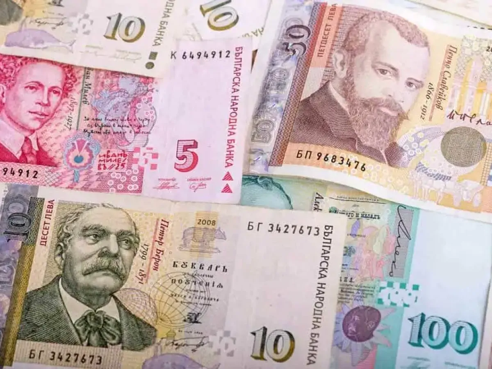

## Table of Contents

## What is the Bulgarian Lev?

The Bulgarian Lev is the official currency of Bulgaria, a country in Southeast Europe. It is abbreviated as BGN and symbolized as лв. The word "Lev" means "lion" in Bulgarian, and the currency has been in use since 1881. The Lev is divided into 100 stotinki, similar to how a dollar is divided into cents.

The Bulgarian Lev is managed by the Bulgarian National Bank, which works to keep the currency stable. Since 1997, the Lev has been pegged to the Euro, which means its value is tied to the Euro's value. This helps keep the Lev's value steady and makes it easier for Bulgaria to trade with other countries that use the Euro. People in Bulgaria use coins and banknotes for everyday transactions, just like in other countries.

## How is the Bulgarian Lev abbreviated?

The Bulgarian Lev is abbreviated as BGN. It is also symbolized as лв. This is the short way to write the name of Bulgaria's money.

People use these abbreviations when they talk about money in Bulgaria. It helps to quickly show that they are talking about the Bulgarian Lev and not another country's money.

## What are the different denominations of the Bulgarian Lev?

The Bulgarian Lev comes in different sizes of money. You can find coins that are worth 1, 2, 5, 10, 20, and 50 stotinki. There are also coins worth 1 Lev. These smaller amounts are good for buying little things like candy or a bus ticket.

For bigger amounts, there are paper money called banknotes. They come in 2, 5, 10, 20, 50, and 100 Levs. These are used for buying more expensive things like clothes or paying for a meal at a restaurant. Each type of money has a different picture and color to help people tell them apart easily.

## How does the Bulgarian Lev function as a currency?

The Bulgarian Lev is the money used in Bulgaria. It helps people buy things they need, like food and clothes. When someone wants to buy something, they give the seller Levs. The seller then gives them the item they want. The Lev is divided into smaller parts called stotinki, which is good for buying small things. There are coins for the smaller amounts and paper money for the bigger amounts.

The Bulgarian National Bank looks after the Lev to make sure it stays stable. Since 1997, the Lev has been tied to the Euro, which means its value stays the same compared to the Euro. This helps Bulgaria trade with other countries that use the Euro. People in Bulgaria use the Lev every day to buy things they need and want, just like people in other countries use their own money.

## What is the history of the Bulgarian Lev?

The Bulgarian Lev started being used in 1881. Before that, Bulgaria used different kinds of money. The Lev was made to help Bulgaria have its own money. The word "Lev" means "lion" in Bulgarian. At first, the Lev was divided into 100 stotinki. Over the years, the Lev changed a lot. Sometimes, it was worth more, and sometimes less. During World War II, Bulgaria used a different kind of Lev called the "Lev of the Bulgarian Kingdom." After the war, the Lev changed again.

In the 1950s, the Lev was changed to the "Lev of the People's Republic of Bulgaria." This new Lev was worth a lot less than the old one. In 1962, the Lev was changed again, and it became the "Lev of the People's Republic of Bulgaria" again, but this time it was worth even less. In 1997, the Lev went through a big change. It was tied to the German Mark, and later to the Euro. This helped the Lev stay stable and made it easier for Bulgaria to trade with other countries. Today, the Lev is still used in Bulgaria, and it helps people buy things they need every day.

## How is the Bulgarian Lev's value determined?

The Bulgarian Lev's value is set by the Bulgarian National Bank. They make sure the Lev stays stable by pegging it to the Euro. This means the Lev's value is tied to the Euro's value. Since 1997, for every 1.95583 Levs, you get 1 Euro. This helps keep the Lev's value steady and makes it easier for Bulgaria to trade with other countries that use the Euro.

The Bulgarian National Bank keeps a close watch on the economy to make sure the Lev stays stable. They do this by controlling how much money is in circulation and by setting interest rates. If the economy is doing well, they might add more money to help it grow. If there's too much money and prices are going up too fast, they might take some money out of circulation. This careful management helps keep the Lev's value strong and reliable for everyday use.

## What are the exchange rates of the Bulgarian Lev with major currencies?

The Bulgarian Lev is tied to the Euro, so its exchange rate with the Euro is always the same. For every 1 Euro, you get 1.95583 Levs. This makes it easy to know how much Levs you will get when you change Euros. The exchange rate with the US Dollar changes a bit every day, but it's usually around 1 Lev for about 0.55 US Dollars. This means if you have 1 Lev, you can get about 55 cents in US Dollars.

The exchange rate with the British Pound also changes daily, but it's usually around 1 Lev for about 0.43 British Pounds. So, if you have 1 Lev, you can get about 43 pence in British Pounds. These rates can go up or down a little bit every day, but the Lev stays pretty stable because it's tied to the Euro. This makes it easier for people in Bulgaria to know how much their money is worth when they travel or buy things from other countries.

## How does the Bulgarian Lev impact trade and the Bulgarian economy?

The Bulgarian Lev helps Bulgaria trade with other countries. Because the Lev is tied to the Euro, it stays stable. This makes it easier for Bulgarian businesses to buy and sell things with countries that use the Euro. When the Lev is stable, people and businesses know how much their money is worth. This helps them plan better and makes trade smoother. Bulgaria can trade more easily with Europe because of this, which is good for the economy.

The Lev also affects how people in Bulgaria spend their money. When the Lev is stable, people feel more confident about buying things. They know the price of things won't change too much, so they can save and spend more easily. This helps the economy grow because when people spend money, businesses do better. A strong and stable Lev helps keep prices from going up too fast, which is good for everyone in Bulgaria.

## What are the security features on Bulgarian Lev banknotes?

Bulgarian Lev banknotes have special features to stop people from making fake money. They use things like special ink that changes color when you tilt the note. There are also hidden pictures that you can only see with a special light. The notes have tiny writing that is hard to copy, and they feel different because of the special paper they use. All these things help keep the money safe.

The banknotes also have a clear window that you can see through. This window has a picture in it that is hard to copy. There are also special lines and patterns in the paper that you can feel with your fingers. These features make it easier for people to check if the money is real. By having these security things, the Bulgarian National Bank helps keep the money safe for everyone to use.

## How has the Bulgarian Lev been affected by inflation over time?

The Bulgarian Lev has seen a lot of changes because of inflation over the years. Inflation means that prices go up and the value of money goes down. In the past, especially during the 1990s, Bulgaria had very high inflation. This made the Lev worth a lot less than before. People needed more Levs to buy the same things they used to buy with less money. The government and the Bulgarian National Bank had to change the Lev several times to try to control this high inflation.

Since 1997, the Bulgarian National Bank has done a better job at keeping inflation under control. They tied the Lev to the Euro, which helped keep its value more stable. This means that the Lev does not lose value as quickly as it used to. Today, inflation in Bulgaria is much lower than it was in the 1990s. This helps people because they can plan better with their money, and it makes the economy stronger. Even though prices still go up a little bit each year, the Lev stays more stable, which is good for everyone in Bulgaria.

## What are the monetary policies that govern the Bulgarian Lev?

The Bulgarian Lev is managed by the Bulgarian National Bank, which uses different rules to keep the money stable. One big rule is that the Lev is tied to the Euro. This means that for every 1 Euro, you always get 1.95583 Levs. By keeping this link, the Bulgarian National Bank makes sure the Lev's value doesn't change too much. They also control how much money is in the country. If there's too much money, prices can go up too fast, so they might take some money out of circulation to keep things balanced.

Another important rule is about setting interest rates. The Bulgarian National Bank can change these rates to help the economy. If they want people to borrow and spend more money, they might lower the interest rates. This can help businesses grow and create jobs. But if prices are going up too fast, they might raise the interest rates to slow things down. By using these rules carefully, the Bulgarian National Bank helps keep the Lev stable and the economy strong.

## How does the Bulgarian Lev integrate with digital and online transactions?

The Bulgarian Lev works well with digital and online transactions. People in Bulgaria can use their Levs to buy things online just like they do in stores. They can pay with their bank cards, use online banking, or even use apps on their phones. Many shops and services in Bulgaria accept payments in Levs through these digital methods. This makes it easy for people to shop from home or pay bills without going to a bank.

The Bulgarian National Bank helps make sure that these digital transactions are safe and work well. They work with banks and other companies to keep the system secure. This means that when people use their Levs online, they can trust that their money is safe. As more people use the internet for shopping and paying bills, the Lev stays an important part of these digital transactions, helping to keep Bulgaria's economy running smoothly.

## References & Further Reading

[1]: Bergstra, J., Bardenet, R., Bengio, Y., & Kégl, B. (2011). ["Algorithms for Hyper-Parameter Optimization."](https://papers.nips.cc/paper/4443-algorithms-for-hyper-parameter-optimization) Advances in Neural Information Processing Systems 24.

[2]: ["Advances in Financial Machine Learning"](https://www.amazon.com/Advances-Financial-Machine-Learning-Marcos/dp/1119482089) by Marcos Lopez de Prado

[3]: ["Evidence-Based Technical Analysis: Applying the Scientific Method and Statistical Inference to Trading Signals"](https://www.amazon.com/Evidence-Based-Technical-Analysis-Scientific-Statistical/dp/0470008741) by David Aronson

[4]: ["Machine Learning for Algorithmic Trading"](https://github.com/stefan-jansen/machine-learning-for-trading) by Stefan Jansen

[5]: ["Quantitative Trading: How to Build Your Own Algorithmic Trading Business"](https://www.amazon.com/Quantitative-Trading-Build-Algorithmic-Business/dp/1119800064) by Ernest P. Chan