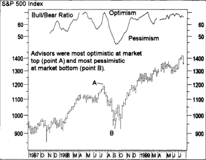

Understanding market sentiment has become increasingly vital in today's dynamic financial environment, where rapid changes can significantly impact investment outcomes. As investors navigate the complexities of global markets, tools that provide insight into the collective mood of market participants are essential. This article examines the Bull Bear Ratio—a key market sentiment indicator that assesses whether traders and investors are optimistic (bullish) or pessimistic (bearish) about market conditions.

The Bull Bear Ratio's significance lies in its ability to synthesize the sentiment of investment advisors, offering a clear window into prevailing market trends. By understanding these trends, investors can make more informed decisions, tailoring their strategies to align with the anticipated direction of the market. This understanding becomes particularly powerful when combined with algorithmic trading, which can rapidly adapt to sentiment changes as part of its data-driven decision-making process.



For traders and investors, leveraging the Bull Bear Ratio alongside algorithmic strategies provides a comprehensive approach to market analysis. It allows for a nuanced engagement with the market, where decisions are guided by a blend of sentiment insights and algorithmic precision. This comprehensive guide intends to equip investors with the requisite knowledge to effectively interpret market signals and optimize their strategies in both bullish and bearish markets.

## Table of Contents

## Understanding Market Sentiment and Bull Bear Ratio

Market sentiment refers to the prevailing attitude of investors towards a specific financial market or asset. It is a reflection of the collective psychology and emotions of market participants, often influencing market trends and price movements. Understanding market sentiment is crucial for investors, as it can provide insights into potential future market behavior and guide investment decisions.

The Bull Bear Ratio is a widely recognized market sentiment indicator, designed to evaluate whether market sentiment is predominantly bullish (optimistic) or bearish (pessimistic). This ratio is calculated by comparing the number of investment advisors or analysts who are bullish with those who are bearish, typically as part of weekly surveys conducted among financial market professionals.

The formula for the Bull Bear Ratio is:

$$
\text{Bull Bear Ratio} = \frac{\text{Number of Bullish Advisors}}{\text{Number of Bearish Advisors}}
$$

A Bull Bear Ratio greater than one suggests bullish sentiment, indicating that more advisors expect stock prices to rise. Conversely, a ratio less than one implies bearish sentiment, where the consensus expects prices to fall. A ratio equal to one suggests a balanced sentiment among advisors, with no clear consensus in either direction.

The data for calculating the Bull Bear Ratio is generally gathered through regular polls or surveys of financial advisors, providing a snapshot of collective market expectations. These surveys aim to capture the prevailing mood in the market by assessing the opinions and forecasts of seasoned investment professionals.

Understanding the nuances of the Bull Bear Ratio can be invaluable for investors. When the ratio signals extreme bullishness or bearishness, it may serve as a warning of potential market shifts. For example, excessively high bullish sentiment may suggest an overheated market poised for a correction, while extreme bearish sentiment might indicate an opportunity to buy undervalued assets.

Investors can use the Bull Bear Ratio to anticipate market movements by identifying potential inflection points, allowing them to adjust their portfolios accordingly. However, it is important to complement the Bull Bear Ratio with other analytical tools and market indicators to ensure a comprehensive understanding of market dynamics.

In conclusion, the Bull Bear Ratio is a powerful tool in assessing market sentiment, offering investors a glimpse into the collective mindset of market participants and assisting in forecasting market trends.

## Investment Analysis and the Role of Bull Bear Ratio

Investment analysis is an essential component of creating sound financial strategies. By assessing securities, evaluating market trends, and understanding market psychology, investors and traders can make informed decisions that align with their financial goals. The Bull Bear Ratio is an influential tool in this context, offering valuable insights into market sentiment and psychology—a critical aspect of investment analysis.

The Bull Bear Ratio, derived from polling investment advisors about their market outlook, provides a snapshot of overall sentiment. When this ratio is greater than one, it suggests bullish sentiment dominates, whereas a value less than one indicates bearish sentiment. This simple yet effective indicator allows investors to comprehend shifts in the collective expectations of seasoned professionals. By integrating the Bull Bear Ratio into investment analysis, investors gain an additional layer of understanding that may refine the predictive accuracy of future market movements.

However, it is imperative for investors to exercise caution when interpreting extreme Bull Bear Ratio readings. Such extremes can often act as contrarian signals, suggesting potential market reversals. For instance, excessively bullish sentiment might indicate an overbought market condition, which could precede a downturn. Conversely, extremely bearish sentiment might signify an oversold condition, suggesting the possibility of a market rally. Recognizing these contrarian cues can help investors avoid pitfalls linked to market euphoria or panic.

To enhance decision-making in investment analysis, the Bull Bear Ratio should be used in conjunction with other technical and fundamental indicators. Technical analysis tools, such as moving averages, relative strength index (RSI), and support/resistance levels, provide quantitative data that complements sentiment analysis. Meanwhile, [fundamental analysis](/wiki/fundamental-analysis), which involves assessing a company’s financial health, industry position, and economic indicators, offers a broader context that can validate or challenge sentiment-driven hypotheses.

In conclusion, the Bull Bear Ratio serves as a valuable addition to investment analysis by offering insights into market sentiment. When combined with other analytical tools, it can improve the accuracy of investment predictions and strategic decisions. Nevertheless, a balanced approach that accounts for multiple forms of analysis is crucial to harnessing the full potential of the Bull Bear Ratio while mitigating associated risks.

## Algorithmic Trading and Sentiment Indicators

Algorithmic trading employs sophisticated computer programs to automate and execute trades based on predefined criteria. These criteria can encompass a wide range of inputs, including technical analysis, historical data, and increasingly, market sentiment indicators like the Bull Bear Ratio. By incorporating sentiment analysis, algorithms can achieve a comprehensive understanding of the market's emotional state, which can be critical in optimizing trading performance.

The Bull Bear Ratio serves as a valuable sentiment indicator, offering insights into the collective mood of financial advisors regarding market movements. When integrated into [algorithmic trading](/wiki/algorithmic-trading) strategies, this ratio can provide additional context to the algorithm, enhancing its ability to anticipate market trends. For instance, an algorithm might adjust its trading signals based on whether the Bull Bear Ratio indicates a bullish or bearish sentiment, thus aligning its strategy with current market conditions.

One of the primary advantages of using sentiment indicators like the Bull Bear Ratio in algorithmic trading is the speed at which these algorithms can process shifts in market mood. Unlike manual trading strategies, which rely on traders' ability to interpret sentiment data, algorithms can automatically and swiftly accommodate new sentiment information, potentially leading to more timely and effective trading decisions.

To integrate sentiment analysis into algorithmic trading, traders can use programming languages such as Python to develop algorithms that [factor](/wiki/factor-investing) in the Bull Bear Ratio. Here's a simplified example of how sentiment data might be incorporated into a trading algorithm:

```python
def trading_strategy(bull_bear_ratio, price_data):
    # Define threshold for bullish sentiment
    bullish_threshold = 1.0

    # Check if current ratio indicates bullish sentiment
    if bull_bear_ratio > bullish_threshold:
        # Algorithm decides to buy
        return "Buy"
    else:
        # Algorithm decides to sell
        return "Sell"

# Example usage
current_bull_bear_ratio = 1.2  # Example Bull Bear Ratio
price_data = [100, 102, 101, 103, 104]  # Hypothetical price data
decision = trading_strategy(current_bull_bear_ratio, price_data)
print("Trading decision:", decision)  # Output: Trading decision: Buy
```

Despite the benefits, over-reliance on sentiment indicators poses risks. Sentiment data, including the Bull Bear Ratio, can exhibit lag due to the timing of data collection and publication, potentially leading to delayed responses to market conditions. Moreover, sentiment indicators reflect the opinions of a specific group of market participants and may not fully represent broader market dynamics. Consequently, while sentiment integration can enhance an algorithm's adaptability and performance, a balanced approach that combines various analytical tools is advisable to mitigate the inherent limitations of sentiment-based models.

## Pros and Cons of Using Bull Bear Ratio in Trading

The Bull Bear Ratio presents distinct advantages as well as limitations that traders should consider when utilizing it as part of their strategy. 

**Pros:**  
One of the main benefits of the Bull Bear Ratio is its ease of understanding. This simplicity allows traders to quickly gauge market sentiment, as it directly quantifies whether a bullish (>1) or bearish (<1) outlook prevails. The frequency of updates, typically weekly, means that traders receive timely insights which can be instrumental in short-term decision-making. Furthermore, because the ratio reflects the forecasts and sentiment of professional investment advisors, it adds a layer of reliability to its indicators when compared to sentiment measures that may include less informed opinions.

**Cons:**  
However, the Bull Bear Ratio has notable limitations. The data is retrospective, reflecting sentiment based on past experiences and thus may not accurately portray real-time market conditions. This lag means the ratio might miss sudden market shifts or emerging trends, which are critical for day traders or high-frequency algorithms. Moreover, the survey-based nature of the data collection means it does not encompass the sentiment of all market participants, potentially skewing the representation of market mood. Lastly, the sample from which data is drawn can introduce biases, as it may not be representative of the broader market landscape, thereby affecting the efficacy of the ratio when used in isolation from other analysis tools. 

These considerations highlight the need for a balanced approach that integrates both the Bull Bear Ratio and additional analytical methods for a more comprehensive understanding of market dynamics.

## Conclusion

The Bull Bear Ratio is a significant tool in assessing market sentiment, offering a straightforward method for understanding the overall mood of investors. By gauging whether the sentiment is predominantly bullish or bearish, it enables investors and traders to gain insights into market dynamics and anticipate potential future movements. This awareness is crucial for making informed investment decisions and developing robust strategies.

Integrating the Bull Bear Ratio with algorithmic trading enhances the ability of trading strategies to adapt to market conditions swiftly. Algorithms that incorporate this sentiment indicator can respond more precisely to shifts in investor mood, potentially leading to more effective trading outcomes. This fusion underscores the importance of leveraging market sentiment in conjunction with advanced trading technologies.

However, the Bull Bear Ratio is not without its limitations. As a singular indicator, it may not capture all nuances of market movements or the sentiments of all market participants. Thus, a comprehensive understanding of these limitations is vital to avoid over-reliance on the ratio alone. Investors must recognize that extreme sentiment readings can often serve as contrarian signals, suggesting possible market reversals.

To achieve successful investing, it is advisable to adopt a well-rounded approach that combines multiple forms of analysis. By integrating the Bull Bear Ratio with other technical and fundamental tools, investors can craft a more balanced and resilient strategy. This holistic approach not only mitigates risks associated with any single indicator but also enhances the ability to navigate complex market landscapes effectively.

## References & Further Reading

[1]: Zweig, M. (1986). "Martin Zweig's Winning on Wall Street." Grand Central Publishing.

[2]: Lo, A. W. (2004). ["The Adaptive Markets Hypothesis: Market Efficiency from an Evolutionary Perspective."](https://papers.ssrn.com/sol3/papers.cfm?abstract_id=602222) The Journal of Economic Perspectives, 17(4), 15-44.

[3]: Graham, B., & Zweig, J. (2003). ["The Intelligent Investor: The Definitive Book on Value Investing."](https://www.amazon.com/Intelligent-Investor-3rd-Ed/dp/0063356724) Harper Business.

[4]: Fabozzi, F. J., & Markowitz, H. M. (Ed.). (2011). ["The Theory and Practice of Investment Management."](https://onlinelibrary.wiley.com/doi/book/10.1002/9781118267028) Wiley.

[5]: Shiller, R. J. (2000). ["Irrational Exuberance."](https://press.princeton.edu/books/paperback/9780691173122/irrational-exuberance) Princeton University Press.