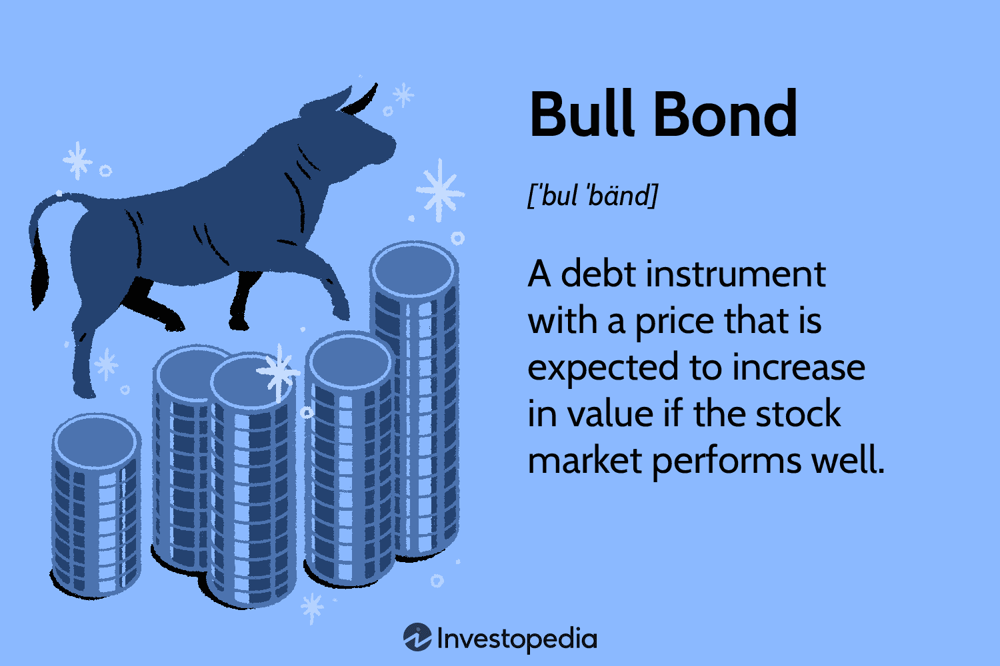

## Table of Contents

## What is a bull bond?

A bull bond is a type of bond that does well when interest rates are going down. It's called a "bull" bond because it benefits from a "bull market," which is a time when prices are going up and people are feeling good about the economy. When interest rates fall, the value of the bond goes up. This is because the bond's fixed interest payments become more attractive compared to new bonds that are being issued with lower interest rates.

Bull bonds are often structured as callable bonds. This means the issuer can choose to pay back the bond early if they want to. They might do this if interest rates drop a lot because they can then borrow money again at a lower rate. For investors, this means they might get their money back sooner than expected, but they also get to enjoy higher returns when interest rates are falling. So, if you think interest rates will go down, buying a bull bond could be a good choice.

## How does a bull bond differ from other types of bonds?

A bull bond is different from other bonds because it does well when interest rates are going down. Most bonds pay a fixed amount of interest, but the value of a bull bond goes up when interest rates drop. This is because the bond's fixed interest payments become more valuable compared to new bonds that are issued with lower rates. Bull bonds are often callable, which means the issuer can pay back the bond early if they want to. They might do this if interest rates fall a lot, so they can borrow money again at a lower rate.

Other types of bonds might not react the same way to falling interest rates. For example, a bear bond does well when interest rates are going up. It's the opposite of a bull bond. A regular bond, like a government or corporate bond, might not be callable and its value might not change as much with [interest rate](/wiki/interest-rate-trading-strategies) movements. So, if you think interest rates will go down, a bull bond could be a good choice, but if you think they'll go up, you might want to look at other types of bonds.

## What is the mechanism behind a bull bond's structure?

A bull bond is set up in a special way that makes it do well when interest rates go down. It usually has a feature called "callability," which means the people who issued the bond can choose to pay it back early. They might do this if interest rates drop a lot because they can then borrow money again at a lower rate. This early repayment option is good for the issuer but can be a bit tricky for the investor because they might get their money back sooner than they planned.

The value of a bull bond goes up when interest rates fall because its fixed interest payments become more attractive compared to new bonds that are being issued with lower rates. For example, if you have a bull bond that pays 5% interest and new bonds are only paying 3%, your bull bond looks really good to other investors. They might be willing to pay more to buy your bond, which makes its value go up. So, if you think interest rates will go down, buying a bull bond could be a smart move.

## Who are the typical investors in bull bonds?

Typical investors in bull bonds are people who think interest rates will go down. They might be looking for a way to make more money if their prediction about interest rates is right. These investors could be big institutions like banks or insurance companies, or they could be individual investors who understand how bonds work and want to take advantage of falling interest rates.

These investors are okay with the risk that the bond might be paid back early. They know that if interest rates drop a lot, the people who issued the bond might choose to pay it back sooner than planned. But they also see the chance to make more money if the bond's value goes up because of the lower interest rates. So, they're willing to take that risk for the potential reward.

## What are the potential benefits of investing in bull bonds?

Investing in bull bonds can be a good choice if you think interest rates will go down. When interest rates drop, the value of a bull bond goes up. This is because the bond's fixed interest payments become more attractive compared to new bonds that are issued with lower rates. So, if you buy a bull bond and interest rates fall, you could sell the bond for more money than you paid for it, making a profit.

Another benefit of bull bonds is that they can give you higher returns in a falling interest rate environment. If you hold onto the bond until it matures, you'll still get the fixed interest payments, which are now more valuable. Plus, if the bond is callable and the issuer decides to pay it back early, you'll get your money back sooner and can reinvest it in other opportunities. So, bull bonds can be a smart move if you're good at predicting interest rate changes and are okay with the possibility of the bond being paid back early.

## What are the risks associated with bull bonds?

One risk of investing in bull bonds is that they might be called back early. This means the people who issued the bond can decide to pay you back before the bond is supposed to mature. If interest rates drop a lot, they might do this so they can borrow money again at a lower rate. This can be bad for you because you might have to find a new place to put your money, and the new bonds might not pay as much interest.

Another risk is that if interest rates go up instead of down, the value of your bull bond could go down. Bull bonds do well when interest rates fall, but if rates rise, the fixed interest payments from your bond won't look as good compared to new bonds that are being issued with higher rates. This means you might lose money if you need to sell your bond before it matures.

So, while bull bonds can be a good choice if you think interest rates will go down, they come with the risk of being called back early and losing value if interest rates go up. It's important to think about these risks before you decide to invest in bull bonds.

## How do bull bonds perform in different market conditions?

Bull bonds do well when interest rates are going down. This is because the fixed interest payments from the bond become more attractive compared to new bonds that are being issued with lower rates. If you buy a bull bond and interest rates fall, you can sell it for more money than you paid for it, making a profit. Also, if you hold onto the bond until it matures, you'll get the same fixed interest payments, which are now more valuable. So, in a market where interest rates are dropping, bull bonds can be a good investment.

However, bull bonds can be risky if interest rates go up instead of down. When interest rates rise, the value of your bull bond can go down because the fixed interest payments won't look as good compared to new bonds that are being issued with higher rates. If you need to sell your bond before it matures, you might lose money. Also, bull bonds can be called back early by the issuer, especially if interest rates drop a lot. This means you might get your money back sooner than you planned, and you'll need to find another place to invest it, which might not pay as much interest. So, bull bonds can be a bit tricky in different market conditions.

## What role do interest rates play in the performance of bull bonds?

Interest rates are super important for how well bull bonds do. When interest rates go down, bull bonds do really well. This is because the bond keeps paying the same amount of interest, but that amount looks better compared to new bonds that are being made with lower interest rates. So, if you have a bull bond and interest rates fall, you can sell it for more money than you paid for it, making a profit. Also, if you keep the bond until it's time to get your money back, you still get the same interest payments, which are now worth more.

But, if interest rates go up, bull bonds can be a problem. When interest rates rise, the fixed interest payments from your bull bond won't look as good as the new bonds that are being made with higher rates. This means if you need to sell your bull bond before it's time to get your money back, you might lose money. Plus, bull bonds can be called back early by the people who made them, especially if interest rates drop a lot. This means you might get your money back sooner than you planned, and you'll need to find another place to put it, which might not pay as much interest.

## Can you explain the pricing and valuation of bull bonds?

The pricing and valuation of bull bonds are closely tied to interest rates. When interest rates go down, the value of a bull bond goes up. This happens because the bond's fixed interest payments become more attractive compared to new bonds that are being issued with lower rates. For example, if you have a bull bond that pays 5% interest and new bonds are only paying 3%, your bull bond looks really good to other investors. They might be willing to pay more to buy your bond, which makes its price go up. So, if you think interest rates will go down, buying a bull bond could be a smart move.

On the other hand, if interest rates go up, the value of a bull bond can go down. This is because the fixed interest payments from your bull bond won't look as good compared to new bonds that are being issued with higher rates. If you need to sell your bull bond before it matures, you might have to do it for less money than you paid for it, which means you could lose money. Also, bull bonds can be called back early by the issuer, especially if interest rates drop a lot. This means you might get your money back sooner than you planned, and you'll need to find another place to put it, which might not pay as much interest.

## How do bull bonds fit into a diversified investment portfolio?

Bull bonds can be a good choice for a diversified investment portfolio if you think interest rates will go down. They do well when rates fall because their fixed interest payments become more valuable compared to new bonds with lower rates. This means you could make a profit if you sell your bull bond after interest rates drop. They can add some variety to your investments because they react differently to interest rate changes than other types of bonds or stocks.

But, it's important to remember that bull bonds also come with risks. If interest rates go up instead of down, the value of your bull bond could drop. Also, the people who issued the bond might decide to pay it back early if rates fall a lot, which means you'll get your money back sooner than you planned. So, while bull bonds can help balance out your portfolio, you need to be ready for these risks and think about how they fit with your overall investment goals.

## What are the tax implications of investing in bull bonds?

When you invest in bull bonds, you need to think about taxes. The interest you get from the bond is usually taxed as regular income. This means you'll pay taxes on it at the same rate as your other income, like your salary. If you sell your bull bond for more money than you paid for it, you might have to pay capital gains tax on the profit. The tax rate for this can be different depending on how long you held the bond before selling it. If you held it for a year or less, it's a short-term capital gain, which is taxed like regular income. If you held it for more than a year, it's a long-term capital gain, which usually has a lower tax rate.

If the bull bond is called back early, you might get your money back sooner than you planned. This could change your tax situation because you'll have to figure out the taxes on the interest you've received so far and any capital gains if you decide to reinvest the money. It's a good idea to talk to a tax advisor to understand how investing in bull bonds will affect your taxes. They can help you plan better and make sure you're not surprised by any tax bills.

## What advanced strategies can be used with bull bonds for expert investors?

Expert investors can use bull bonds in advanced ways to make more money or protect their investments. One strategy is to use bull bonds as part of a bigger plan to bet on falling interest rates. They might buy bull bonds and also use other investments that do well when rates go down, like certain types of stocks or other bonds. This can help them make even more money if their guess about interest rates is right. They might also use something called "interest rate swaps" to trade their fixed interest payments for payments that change with interest rates, which can help them make more money if rates drop.

Another strategy is to use bull bonds to balance out other investments that might lose value if interest rates go down. For example, if an investor has a lot of investments that do badly when rates fall, they can buy bull bonds to make up for those losses. This is called hedging, and it can help protect their overall investment portfolio. Expert investors might also look at the timing of when to buy and sell bull bonds. They might buy them when they think interest rates are about to drop and sell them when they think rates have hit their lowest point, trying to make the most profit from the bond's changing value.

## References & Further Reading

[1]: Bergstra, J., Bardenet, R., Bengio, Y., & Kégl, B. (2011). ["Algorithms for Hyper-Parameter Optimization."](https://dl.acm.org/doi/10.5555/2986459.2986743) Advances in Neural Information Processing Systems 24.

[2]: ["Advances in Financial Machine Learning"](https://www.amazon.com/Advances-Financial-Machine-Learning-Marcos/dp/1119482089) by Marcos Lopez de Prado

[3]: ["Evidence-Based Technical Analysis: Applying the Scientific Method and Statistical Inference to Trading Signals"](https://www.amazon.com/Evidence-Based-Technical-Analysis-Scientific-Statistical/dp/0470008741) by David Aronson

[4]: ["Machine Learning for Algorithmic Trading"](https://github.com/stefan-jansen/machine-learning-for-trading) by Stefan Jansen

[5]: ["Quantitative Trading: How to Build Your Own Algorithmic Trading Business"](https://github.com/LucindaYa/quant-resources/blob/master/Quantitative%20Trading%20How%20to%20Build%20Your%20Own%20Algorithmic%20Trading%20Business.pdf) by Ernest P. Chan