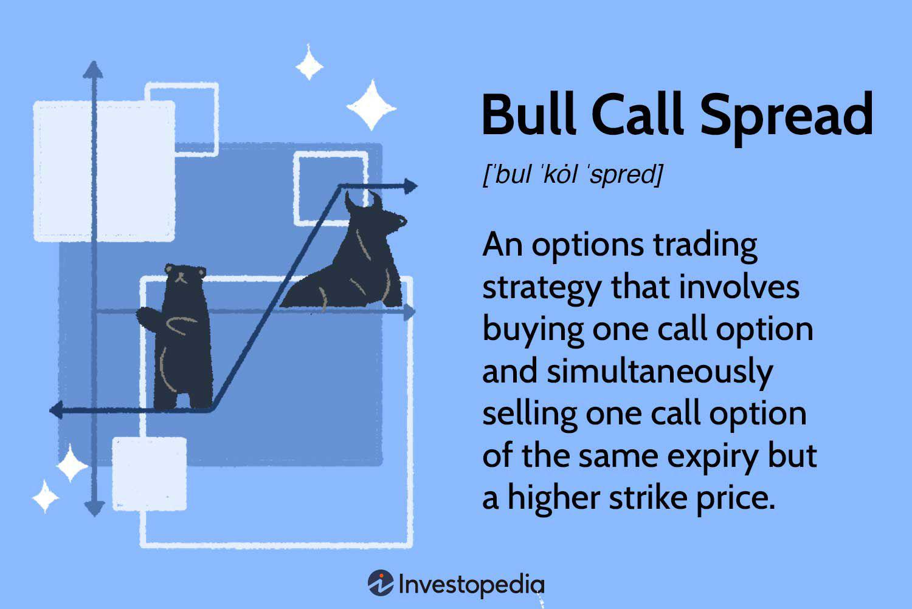

Options trading has gained prominence as a key component of contemporary financial markets, appealing to both individual investors and institutional participants. Among various trading strategies, the bull call spread stands out as a popular choice for traders anticipating an upward trend in market prices while seeking to mitigate risk. This strategy enables traders to capitalize on a moderate rise in the asset's value, offering a balanced approach that limits potential losses due to its defined risk and reward structure.

Bull call spreads involve purchasing call options at a lower strike price and simultaneously selling call options at a higher strike price with the same expiration date. This positions the trader to benefit from the difference in premiums, while any potential for loss is minimized to the amount invested initially. The strategic choice offers high returns relative to simply buying a call option, making it an appealing tactic for those looking to optimize their trading portfolio in bullish market conditions.



Moreover, advancements in technology have introduced algorithmic trading, which significantly enhances the execution process for options strategies like the bull call spread. By leveraging algorithms, traders can automate and streamline their activities, swiftly responding to market fluctuations and identifying optimal entry and exit points to maximize profits. Algorithms facilitate the replication of successful strategies on a larger scale and can be fine-tuned to accommodate specific market scenarios.

Understanding the intricacies of bull call spreads empowers traders to refine their approach, ensuring risk is effectively managed while maximizing potential returns. This introductory exploration provides a foundation for comprehending the full utility of bull call spreads in options trading, paving the way for informed decision-making in the ever-evolving financial landscape.

## Table of Contents

## Understanding Bull Call Spread

A bull call spread is a strategic approach in options trading designed to capitalize on a predicted moderate increase in the price of an underlying asset. This strategy involves the simultaneous purchase of call options at a lower strike price and the sale of an equal number of call options at a higher strike price, both set to mature on the same expiration date. 

The aim of this tactic is to achieve a balance between potential profit and risk management. The initial cost of establishing a bull call spread is reduced compared to purchasing a standalone call option, due to the premium collected from selling the higher strike call. Consequently, the net cost (or debit) of the spread is less than the premium paid for the purchased call option. This lower upfront cost allows traders to engage in bullish speculation with a mitigated financial outlay.

Mathematically, the bull call spread can be expressed as follows:

- **Maximum Profit**: $\text{Difference in Strike Prices} - \text{Net Premium Paid}$

- **Maximum Loss**: This is capped at the net premium paid, as the strategy's structure ensures limited risk exposure.

The bull call spread is best suited for scenarios where the trader forecasts a moderate upwards movement in the underlying asset's price rather than a steep or drastic increase. By limiting potential losses through a predefined spread, the trader reduces risk while still maintaining the opportunity to benefit from an upward price trend. While the profit potential is capped due to the call option sold at the higher strike price, the overall strategy provides a less volatile and more predictable outcome when compared to outright call purchasing. 

Utilizing the bull call spread effectively requires a keen understanding of market conditions, sufficient knowledge of the asset's price dynamics, and strategic timing to optimize the likelihood of realizing returns while keeping risks in check.

## How to Construct a Bull Call Spread

To construct a bull call spread, traders must first identify an underlying asset projected to experience a moderate price increase. This strategy involves a precise combination of options trading maneuvers:

Firstly, purchase a call option on the chosen asset at a specific strike price. This call option represents the right, but not the obligation, to buy the asset at the defined strike price before the option expires. The selection of this strike price is critical; it should be set below the anticipated future price of the asset to benefit from the expected upward movement.

Simultaneously, sell another call option on the same asset with a higher strike price and the same expiration date. Selling this call option helps offset the cost of purchasing the first call option, thereby reducing the overall premium paid for executing the strategy. The anticipation here is that the asset price will not rise beyond the higher strike price by the expiration date, thereby rendering the sold call option unexercised and allowing the trader to retain the premium received.

Monitoring market conditions is paramount to maximizing potential profits from a bull call spread. Key factors include tracking the price movement of the underlying asset, changes in implied [volatility](/wiki/volatility-trading-strategies), and time decay, all of which can influence the values of the options. Traders must remain vigilant and adjust positions if necessary to capture gains or mitigate losses.

The bull call spread profit potential is defined by the formula:

$$
\text{Maximum Profit} = (\text{Strike Price of Sold Call} - \text{Strike Price of Purchased Call}) - \text{Net Premium Paid}
$$

This figure illustrates the potential gains if the underlying asset price exceeds the strike price of the sold call at expiration.

Efficient monitoring of these factors might be enhanced using [algorithmic trading](/wiki/algorithmic-trading) tools. Python, with its vast array of financial libraries, can automate monitoring tasks through custom scripts. Below is a basic Python outline that could be used as a starting point for managing a bull call spread:

```python
# Import necessary libraries
import numpy as np

# Define market parameters
underlying_asset_price = 100  # example current price
strike_price_long_call = 95
strike_price_short_call = 105
net_premium_paid = 3

# Calculate maximum profit
max_profit = (strike_price_short_call - strike_price_long_call) - net_premium_paid

# Output result
print(f"Maximum Profit for Bull Call Spread: {max_profit}")
```

Inherent in these steps is the continual assessment of market data, making on-the-fly adjustments when necessary, and closing the trade when desired outcomes are achieved or when the market conditions indicate potential losses.

## Goals and Profit Calculations

The bull call spread strategy is designed to capitalize on a moderate increase in the price of an underlying asset, offering a balance between risk and reward. The primary objective of this options trading strategy is to secure a profit when the asset's price rises, but only to a certain extent.

To calculate the maximum profit potential of a bull call spread, one must identify the difference between the strike prices of the call options involved and account for the net premium paid to establish the position. Specifically, the maximum profit is given by the formula:

$$
\text{Maximum Profit} = (\text{Strike Price of Sold Call} - \text{Strike Price of Bought Call}) - \text{Net Premium Paid}
$$

The breakeven point is crucial for effectively managing and closing positions. It represents the underlying asset's price at which the trader neither gains nor loses money. This is calculated by adding the net premium paid to the strike price of the purchased call option:

$$
\text{Breakeven Point} = \text{Strike Price of Bought Call} + \text{Net Premium Paid}
$$

Evaluating these metrics allows traders to understand how the strategy can yield profits while limiting potential losses, thereby aiding in effective risk management. By maintaining awareness of these calculations, traders can make informed decisions on when to [exit](/wiki/exit-strategy) their positions to maximize returns.

## Integrating Algo Trading in Bull Call Spreads

Algorithmic trading, often referred to as algo trading, enhances the implementation of bull call spreads by automating the monitoring and execution processes. This integration is facilitated by algorithms that are capable of swiftly processing large amounts of market data to discern optimal entry and exit points.

### Automation and Data Processing

Algo trading uses predefined rules and mathematical models to execute trades with speed and precision that exceed human capabilities. When applied to bull call spreads, which involve simultaneous buying and selling of call options, the automation ensures timely and precise execution. Algorithms analyze multiple variables, including price changes, historical trends, and market volatility, to determine the most opportune moments to enter or exit a trade.

### Identifying Optimal Entry and Exit Points

The ability of algorithms to process vast datasets allows for the continuous evaluation of market conditions. For a bull call spread, the ideal entry point occurs when the underlying asset's price is expected to rise. Algorithms assess indicators like moving averages, [momentum](/wiki/momentum) indicators, and economic news to predict such price movements. Additionally, algo trading facilitates the dynamic adjustment of trades in response to real-time market shifts. This adaptability helps in locking in potential profits or mitigating losses when the market behaves unpredictably.

#### Example of an Algorithmic Approach

In Python, a simplistic model could be implemented to execute a bull call spread based on moving average crossovers:

```python
import numpy as np
import pandas as pd

def calculate_moving_average(prices, window):
    return prices.rolling(window=window).mean()

def decide_trade_action(prices, short_window, long_window):
    short_mavg = calculate_moving_average(prices, short_window)
    long_mavg = calculate_moving_average(prices, long_window)

    buy_signals = (short_mavg > long_mavg) & (short_mavg.shift() <= long_mavg.shift())
    sell_signals = (short_mavg < long_mavg) & (short_mavg.shift() >= long_mavg.shift())

    return buy_signals, sell_signals

# Example stock price data
sample_data = pd.Series([100, 102, 103, 108, 105, 110, 115, 112])

buy, sell = decide_trade_action(sample_data, short_window=3, long_window=5)
print("Buy signals:\n", buy)
print("Sell signals:\n", sell)
```

### Replicating Successful Strategies

Algorithms not only identify the best opportunities but also ensure that these strategies are consistently replicated. This consistency is critical in volatile markets, where manual trading might lead to emotional decision-making and inconsistencies. Algo trading eliminates such human biases, enhancing the strategy's effectiveness.

Customization of algo strategies for specific market conditions allows traders to tailor their approaches according to market sentiments, sector-specific trends, or macroeconomic factors. This customization is vital for adapting to changes, such as [interest rate](/wiki/interest-rate-trading-strategies) fluctuations or geopolitical events, which might impact the underlying asset's performance.

By integrating algo trading into bull call spreads, traders can significantly enhance their strategy's effectiveness, achieving a balance between risk management and profit maximization. This mechanized precision and adaptability are key advantages in today’s fast-paced trading environments.

## Managing Risks with Bull Call Spreads

Managing risks effectively is crucial for traders employing bull call spreads, especially in the context of market volatility. This section outlines the strategies to manage such risks, focusing on the impact of volatility, the importance of setting stop-loss levels, and the consideration of dividends and transaction costs.

Market volatility significantly influences the outcomes of a bull call spread strategy. Volatility can affect the pricing of options, changing the potential profitability of the spread. When volatility increases, the premiums of options typically rise, potentially increasing the cost of implementing a bull call spread. Conversely, if volatility decreases, the potential profit margins might be reduced, as the price movement of the underlying asset could be insufficient to realize significant gains from the spread.

Setting stop-loss levels and exit criteria is essential for protecting against adverse market movements. A stop-loss order can automatically trigger the sale of the position when the asset price reaches a predetermined level, mitigating potential losses. Traders should carefully determine these levels based on their risk tolerance and market analysis. Creating exit strategies in advance allows traders to respond swiftly to market changes without emotional bias, preserving gains and limiting losses.

Considering dividends and transaction costs is vital when managing trades with bull call spreads. Dividend payments can impact the underlying asset's price, thereby affecting the spread's profitability. For options, particularly those on dividend-paying stocks, the expectation of a dividend payout can lead to early assignment risk, making it important for traders to be aware of ex-dividend dates and their implications for option pricing.

Moreover, transaction costs, including brokerage fees and bid-ask spreads, should be factored into the overall cost of the strategy. These costs can erode the profitability of the bull call spread, especially if the expected price movement of the underlying asset is moderate. Traders should aim to minimize these costs by selecting efficient trading platforms and timing their trades to coincide with periods of higher [liquidity](/wiki/liquidity-risk-premium).

In summary, managing the risks associated with bull call spreads involves understanding the repercussions of market volatility, setting strategic stop-loss levels, and taking into account dividends and transaction costs. Proper risk management enhances the likelihood of achieving the desired financial outcomes from bull call spreads and aligns the strategy with the trader's overall financial goals.

## Case Study and Real-World Examples

A bull call spread is a strategic options trading method that offers limited risk and potential for profits in bullish markets. This section will illustrate hypothetical scenarios using bull call spreads, demonstrating potential gains and risks, while evaluating various market conditions.

### Example 1: Hypothetical Bull Call Spread Trade

Assume a stock is currently trading at $50. A trader anticipates a moderate rise in the stock price over the next month. To capitalize on this outlook, the trader constructs a bull call spread with the following:

- **Buy a Call Option:** Strike price of $48, costing $3 per contract.
- **Sell a Call Option:** Strike price of $52, costing $1 per contract.

**Net Premium Paid:**  
$$
\text{Net Premium} = (\text{Cost of bought call}) - (\text{Premium received from sold call}) \]  
$$
\text{Net Premium} = \$3 - \$1 = \$2
$$

**Maximum Profit Calculation:**  
The maximum profit occurs when the stock price at expiration is equal to or above the higher strike price ($52). It is calculated as the difference between strike prices minus the net premium paid.  
$$
\text{Maximum Profit} = (\text{Higher strike price} - \text{Lower strike price}) - \text{Net Premium} \]  
$$
\text{Maximum Profit} = (\$52 - \$48) - \$2 = \$2 \text{ per share}
$$

**Breakeven Point:**  
The breakeven point is where the total profit or loss is zero.  
$$
\text{Breakeven Price} = \text{Lower strike price} + \text{Net Premium} \]  
$$
\text{Breakeven Price} = \$48 + \$2 = \$50
$$

### Example 2: Impact of Market Conditions

Consider the same bull call spread strategy on a different stock initially trading at $100. The trader buys a call at $98 for $4 and sells a call at $104 for $2. The net premium paid is $2.

If the market conditions vary, the outcomes would differ:

1. **Bullish Market Scenario:**  
   Stock price at expiration reaches $108.
   - Maximum profit calculated as:  
     \[ (\$104 - \$98) - \$2 = \$4 \text{ per share}
$$
   - Achieved because the stock price exceeds the higher strike price.

2. **Moderate Bullish Scenario:**  
   Stock price at expiration is $102.
   - Profit is less than maximum, calculated as:  
     \[ \text{Profit} = (\$102 - \$98) - \$2 = \$2 \text{ per share}
$$

3. **Sideways to Bearish Market Scenario:**  
   Stock price drops to $97.
   - Loss equals net premium, which amounts to $2 per share as the options expire worthless. The purchased call loses its value, while the sold call expires out-of-the-money.

### Market Conditions Analysis

The bull call spread is particularly advantageous in moderately bullish markets. It helps cap potential losses if the underlying asset's price does not rise as anticipated. However, investors must consider market volatility, time decay (Theta), and implied volatility (Vega) when determining strategy effectiveness. In conditions of sharp bullish trends or high volatility, an outright call purchase might yield higher returns, albeit with greater risk exposure.

In conclusion, the bull call spread is a versatile strategy with capped risks and profits. Understanding each component of the trade and being aware of market trends is crucial for maximizing outcomes.

## Conclusion

Bull call spreads provide a balanced and structured approach to options trading by effectively minimizing costs while managing risk exposure. This strategy allows traders to capitalize on a moderate rise in the underlying asset's price without being subjected to unlimited potential losses inherent in simple call buying. 

The integration of algorithmic trading enhances the strategic execution of bull call spreads, improving both precision and efficiency. By automating the monitoring and execution processes, algorithms can quickly adapt to market changes, optimize entry and exit points, and replicate successful strategies with consistency. As a result, traders can achieve a higher degree of control and potentially enhance profitability through systematic trade execution that aligns with predefined criteria and algorithms tailored to specific market conditions.

Continuously learning and refining strategies remain critical for sustained success in options trading. Market dynamics and trading technologies evolve, necessitating traders to stay informed and adaptable to new tools and techniques. By doing so, traders can better navigate the complexities of options markets, refine their strategies in response to market feedback, and maintain a competitive edge. This commitment to ongoing education and strategy refinement will help traders leverage the benefits of bull call spreads and algorithmic trading in the ever-evolving financial landscape.

## References & Further Reading

[1]: Natenberg, S. (1994). ["Option Volatility and Pricing: Advanced Trading Strategies and Techniques."](https://www.amazon.com/Option-Volatility-Pricing-Strategies-Techniques/dp/0071818774) McGraw-Hill Education.

[2]: Hull, J. C. (2018). ["Options, Futures, and Other Derivatives."](https://www.semanticscholar.org/paper/Options%2C-Futures%2C-and-Other-Derivatives-Hull/89bdee500c8623864fc9eb7a471546aa713acc44) Pearson.

[3]: Cboe Options Exchange. ["Understanding Vertical Spread Strategies."](https://www.cboe.com/education/) Cboe.

[4]: Chan, E. (2009). ["Quantitative Trading: How to Build Your Own Algorithmic Trading Business."](https://github.com/ftvision/quant_trading_echan_book) Wiley.

[5]: Lopez de Prado, M. (2018). ["Advances in Financial Machine Learning."](https://www.amazon.com/Advances-Financial-Machine-Learning-Marcos/dp/1119482089) Wiley.