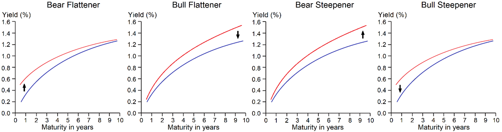

## Table of Contents

## What is a bull flattener in financial terms?

A bull flattener is a term used in the bond market to describe a specific change in the yield curve. The yield curve shows the relationship between the interest rates (or yields) of bonds with different maturity dates. When a bull flattener happens, the yields on long-term bonds go down faster than the yields on short-term bonds. This makes the difference between the long-term and short-term yields smaller, which is why the curve "flattens."

This situation is called a "bull" flattener because it often happens when investors are optimistic about the economy. They expect interest rates to stay low or even drop in the future. As a result, they buy more long-term bonds, pushing their prices up and their yields down. This can be a sign that people think the economy will do well, but it can also make it harder for banks to make money because the difference between what they pay for short-term money and what they earn on long-term loans gets smaller.

## How does a bull flattener affect the yield curve?

A bull flattener affects the yield curve by making it less steep. The yield curve is a line that shows how much interest you get from bonds that last for different amounts of time. When a bull flattener happens, the interest rates on long-term bonds go down more than the interest rates on short-term bonds. This makes the difference between the two smaller, so the line on the graph gets flatter.

This change in the yield curve happens because people think the economy will do well. They start buying more long-term bonds because they expect interest rates to stay low or even go down. When more people buy these bonds, their prices go up and their interest rates go down. This is why the long end of the yield curve drops more than the short end, making the curve flatten out.

## Can you provide a simple example of a bull flattener?

Imagine the yield curve is like a hill. At the start, the hill is steep with short-term bonds at the bottom giving 2% interest and long-term bonds at the top giving 5% interest. Now, let's say people start to think the economy will do really well soon. They rush to buy long-term bonds because they believe interest rates will stay low or drop even more.

As more people buy these long-term bonds, their prices go up and their interest rates drop. Let's say the long-term bonds now give only 4% interest. The short-term bonds stay at 2% because people aren't as excited about them. So, the hill gets less steep because the difference between the top (long-term bonds) and the bottom (short-term bonds) is now smaller. This is what we call a bull flattener.

## What are the economic conditions that typically lead to a bull flattener?

A bull flattener usually happens when people feel good about the economy. They think things will get better and that the central bank, like the Federal Reserve, won't raise interest rates much or might even lower them. When people expect rates to stay low or go down, they want to buy long-term bonds. These bonds promise to pay back money over many years, and if rates stay low, they become more valuable. So, people rush to buy them, pushing their prices up and their yields down.

This rush to buy long-term bonds makes their yields drop faster than the yields on short-term bonds. Short-term bonds are less affected because they are tied more closely to what the central bank is doing right now. As a result, the difference between the yields on long-term and short-term bonds gets smaller, making the yield curve flatter. This is why it's called a bull flattener – it shows that people are optimistic about the future of the economy.

## What are the benefits of a bull flattener for investors?

A bull flattener can be good for investors who own long-term bonds. When the yield on these bonds goes down because more people want to buy them, the price of the bonds goes up. This means that if an investor decides to sell their long-term bonds during a bull flattener, they can make a profit because the bonds are now worth more than when they bought them. It's like buying a toy for $10 and then selling it for $15 because everyone suddenly wants that toy.

For investors who are looking to buy bonds, a bull flattener can also be helpful. If they believe that interest rates will keep going down, they might want to buy long-term bonds now to lock in the current yields. This way, if rates do drop even more, they will still get the higher interest payments from the bonds they bought before the drop. It's like buying a ticket to a concert before the price goes up because you know it will sell out.

## How can a bull flattener impact bond prices and interest rates?

A bull flattener makes the price of long-term bonds go up. This happens because more people want to buy these bonds when they think the economy will do well and interest rates will stay low or go down. When lots of people try to buy the same thing, like long-term bonds, the price of those bonds goes up. So, if you already own these bonds, you can sell them for more money than you paid for them, which is good for you.

At the same time, a bull flattener makes the interest rates on long-term bonds go down. Interest rates and bond prices work like a seesaw: when one goes up, the other goes down. So, when the price of long-term bonds goes up because more people want them, the interest rates they offer go down. This means new buyers of these bonds will get less interest than they would have before the bull flattener happened.

## What are the potential drawbacks or risks associated with a bull flattener?

A bull flattener can be tricky for banks. Banks borrow money at short-term rates and lend it out at long-term rates. When a bull flattener happens, the difference between these rates gets smaller. This means banks make less money from the difference between what they pay for money and what they earn from lending it out. If this difference gets too small, it can hurt the bank's profits and make it harder for them to do business.

Another risk is that if investors are wrong about the economy getting better, they could lose money. If they buy long-term bonds expecting interest rates to stay low or go down, but instead rates go up, the value of their bonds will drop. This is because when new bonds are issued with higher interest rates, the old bonds with lower rates become less attractive. Investors might have to sell their bonds at a loss if they need money and the bond prices have gone down.

## How do central bank policies influence the occurrence of a bull flattener?

Central bank policies can have a big impact on whether a bull flattener happens. When the central bank, like the Federal Reserve, decides to keep interest rates low or even lower them, people start to think that borrowing money will stay cheap for a long time. This makes them want to buy long-term bonds because they believe the interest rates on these bonds will stay low or go down even more. As more people buy these long-term bonds, their prices go up and their yields go down faster than the yields on short-term bonds, which leads to a bull flattener.

On the other hand, if the central bank starts hinting that they might raise interest rates soon, it can stop a bull flattener from happening. People might not rush to buy long-term bonds if they think rates will go up, because that would make the bonds they buy now less valuable later. So, the central bank's decisions and the signals they send about future interest rates can really influence whether the yield curve flattens in a bullish way or not.

## What strategies can investors use to take advantage of a bull flattener?

Investors can take advantage of a bull flattener by buying long-term bonds before the flattening starts. When people think the economy will do well and interest rates will stay low, they rush to buy these bonds. This makes the price of long-term bonds go up and their yields go down. If an investor buys these bonds early, they can sell them later for a profit because the price will be higher. It's like buying a popular toy before it becomes a hot item and then selling it when everyone wants it.

Another strategy is to use bond funds or ETFs that focus on long-term bonds. These funds let investors easily buy a bunch of long-term bonds at once. When a bull flattener happens, the value of these funds goes up because the long-term bonds inside them become more valuable. Investors can also keep an eye on what the central bank is doing. If the central bank says they will keep interest rates low, it might be a good time to buy long-term bonds and get ready for a bull flattener.

## How does a bull flattener differ from a bear flattener?

A bull flattener and a bear flattener are two different ways the yield curve can flatten. A bull flattener happens when people think the economy will do well and interest rates will stay low or go down. They buy more long-term bonds, making their prices go up and their yields go down faster than short-term bonds. This makes the difference between long-term and short-term yields smaller, so the yield curve gets flatter.

On the other hand, a bear flattener happens when people think the economy might not do so well and the central bank might raise short-term interest rates to slow things down. When this happens, the yields on short-term bonds go up faster than the yields on long-term bonds. This also makes the difference between the two smaller, but it's because short-term rates are rising, not because long-term rates are falling. So, a bull flattener is about optimism and falling long-term rates, while a bear flattener is about worry and rising short-term rates.

## What historical examples illustrate the effects of a bull flattener?

One historical example of a bull flattener happened in the United States in the early 2000s. After the dot-com bubble burst and the economy slowed down, the Federal Reserve decided to keep interest rates very low to help the economy recover. People thought that these low rates would last for a long time, so they started buying long-term bonds. This made the prices of these bonds go up and their yields go down faster than the yields on short-term bonds. As a result, the yield curve flattened in a bullish way, showing that people were optimistic about the future even though the economy was struggling at the time.

Another example can be seen in the years following the 2008 financial crisis. The Federal Reserve again kept interest rates low to help the economy recover. Investors expected that rates would stay low for a long time, so they bought a lot of long-term bonds. This caused the prices of long-term bonds to rise and their yields to fall more than the yields on short-term bonds. The yield curve flattened in a bull flattener, reflecting the hope that the economy would improve over time despite the immediate challenges.

## How can advanced investors use derivatives to hedge against the risks of a bull flattener?

Advanced investors can use derivatives like interest rate swaps to hedge against the risks of a bull flattener. An interest rate swap is a deal where two parties agree to exchange interest payments. One party might pay a fixed rate, while the other pays a floating rate that changes with market conditions. If an investor thinks a bull flattener is coming, they can use an interest rate swap to lock in the current long-term rates. This way, if long-term rates drop, they still get the higher fixed rate they agreed on, which helps protect them from losing money on their bonds.

Another tool advanced investors might use is options on bonds or bond futures. For example, they could buy put options on long-term bonds. A put option gives the investor the right to sell a bond at a set price, even if the market price drops. If a bull flattener happens and long-term bond prices go up, the investor might not use the put option, but if prices fall because of unexpected changes in interest rates, the put option can help them sell at a better price than the market offers. This can help them limit their losses if the bull flattener doesn't go as expected.

## What is the Bull Flattener Explained?

A bull flattener is a phenomenon in fixed income markets where long-term interest rates decline at a faster pace than short-term rates. The result is a flattening of the yield curve, which measures the spread between short-term and long-term interest rates. This can be represented mathematically by a decrease in the slope of the yield curve, defined as:

$$
\text{Slope} = \frac{Y_{\text{long-term}} - Y_{\text{short-term}}}{T_{\text{long-term}} - T_{\text{short-term}}}
$$

where $Y_{\text{long-term}}$ and $Y_{\text{short-term}}$ are the yields of long-term and short-term bonds, respectively, and $T_{\text{long-term}}$ and $T_{\text{short-term}}$ are their maturities.

A flattening yield curve under a bull scenario often signals investor optimism. When investors foresee lower inflation and robust economic growth, they may expect central banks to maintain lower rates in the near term. Hence, they invest in longer-term securities, driving down their yields more than short-term yields. Such market behavior suggests confidence in economic conditions, as lower long-term rates can imply an expectation that future [interest rate](/wiki/interest-rate-trading-strategies) hikes or inflationary pressures will be limited.

The bull flattener is generally perceived as a positive economic indicator, reflecting investors' belief in stable growth without significant inflation risk. It stands in contrast to scenarios where flattening could be due to economic pessimism, such as when both short-term and long-term rates fall because of economic downturn concerns. Understanding these dynamics is crucial for investors and policymakers in interpreting market expectations and assessing the economic outlook.

## What is a Real-World Example of a Bull Flattener?

A bull flattener event can be exemplified by examining historical changes in U.S. Treasury yields. Consider a period where the long-term yields decrease more significantly than the short-term yields, leading to a flattening of the yield curve.

For instance, suppose the yield on the 10-year U.S. Treasury note decreases from 2.5% to 2.0%, representing a decline of 50 basis points. Concurrently, the 2-year U.S. Treasury yield might decline from 1.5% to 1.3%, a smaller reduction of 20 basis points. This scenario results in the spread between the long-term and short-term yields narrowing, indicating a flattening curve:

$$
\text{Spread} = (2.5\% - 1.5\%) - (2.0\% - 1.3\%) = 1.0\% - 0.7\% = 0.3\%
$$

Initially, the spread was 1.0%, and after the yield shifts, it reduced to 0.3%, highlighting the flattening effect.

This bull flattener scenario typically reflects market optimism regarding future economic growth and low inflation expectations. Investors anticipate improved economic conditions, leading to a significant drop in longer-term yields as they are willing to accept lower yields for greater economic stability and growth potential. It is important to underline that this compression of yields is markedly different from a bear steepener, where long-term yields increase due to inflation fears.

Such yield dynamics can be crucial when forming investment strategies, as they influence expectations around interest rate policies and economic health. Analyzing shifts in basis points provides crucial insights into market sentiments and the economic outlook. This nuanced understanding aids investors in optimizing their bond portfolios and capitalizing on market trends, such as those showcased during a bull flattener.

## References & Further Reading

[1]: Chan, E. P. (2013). ["Algorithmic Trading: Winning Strategies and Their Rationale."](https://github.com/ftvision/quant_trading_echan_book) Wiley.

[2]: Jansen, S. (2018). ["Machine Learning for Algorithmic Trading: Predictive models to extract signals from market and alternative data for systematic trading strategies with Python."](https://www.amazon.com/Machine-Learning-Algorithmic-Trading-alternative/dp/1839217715) Packt Publishing.

[3]: CFA Institute. ["Fixed Income Analysis."](https://www.amazon.com/Fixed-Income-Analysis-Institute-Investment/dp/1118999495) CFA Institute Research Foundation.

[4]: Aronson, D. R. (2006). ["Evidence-Based Technical Analysis: Applying the Scientific Method and Statistical Inference to Trading Signals."](https://www.amazon.com/Evidence-Based-Technical-Analysis-Scientific-Statistical/dp/0470008741) Wiley.

[5]: Lopez de Prado, M. (2018). ["Advances in Financial Machine Learning."](https://www.amazon.com/Advances-Financial-Machine-Learning-Marcos/dp/1119482089) Wiley.