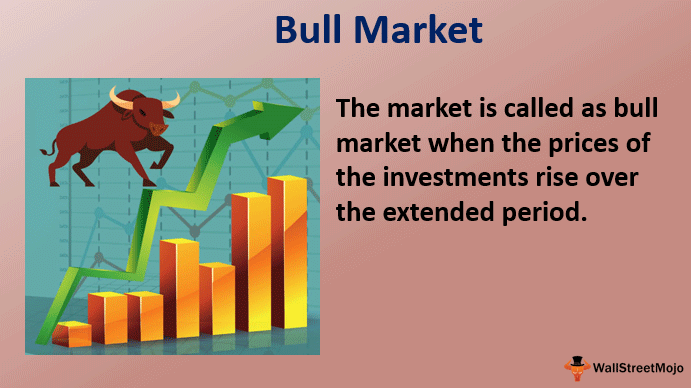

In today's dynamic financial landscape, understanding bull market trends and the role of algorithmic trading is essential for investors and traders. A bull market is typified by rising prices of securities, driven primarily by economic optimism and heightened investor confidence. These periods, where the stock market experiences prolonged price increases, are often fueled by various factors, including favorable economic indicators like increased Gross Domestic Product (GDP) and reduced unemployment rates. Investors, buoyed by these positive signals, demonstrate increased willingness to invest, further driving up prices.

Algorithmic trading, on the other hand, has revolutionized the operations of modern stock exchanges by improving efficiency and liquidity. Utilizing computer algorithms to automate and optimize trading decisions, algorithmic trading processes vast amounts of data at high speed, offering advantages such as reduced transaction costs, enhanced market liquidity, and improved price transparency. This approach is characterized by strategies including high-frequency trading and market making, which execute trades at speeds and frequencies that are impossible for human traders.



This article explores the conditions that define bull markets and the trends emerging within them, alongside the significant impact of algorithmic trading. By examining these elements, investors can refine their strategies in response to evolving market conditions and leverage technological advancements to enhance their investment outcomes. Understanding the interplay between these market forces is crucial for navigating the complex landscape of modern financial markets.

## Table of Contents

## Understanding Bull Markets

A bull market represents a financial environment characterized by sustained increases in the prices of securities. This upward trend is often fueled by economic optimism, where investors exhibit confidence in the continued growth and profitability of the market. Several indicators help signal the onset and sustenance of bull market conditions. Among the most prominent are gross domestic product (GDP) growth and declining unemployment rates.

Economic indicators such as GDP serve as vital tools for assessing the health and trajectory of an economy. When GDP increases, it often indicates improved economic activity, bolstering investor confidence and propelling market prices upward. Concurrently, lower unemployment rates suggest a thriving labor market, which contributes positively to consumer spending and overall economic performance, further reinforcing bullish trends.

Historically, bull markets have been influenced significantly by broader macroeconomic cycles and events. Following major conflicts, such as the end of World War II, economies often transitioned into bull markets driven by reconstruction efforts and innovation. Similarly, the dot-com boom in the late 1990s exemplified a period where rapid technological advancement and speculative investment fostered a substantial rise in stock prices.

In contemporary markets, technological progress and fiscal policies continue to play pivotal roles in shaping bull market dynamics. Advances in technology, particularly in areas such as information technology and digital communication, have opened new avenues for growth and investment, often driving sectors to new highs. Additionally, accommodative fiscal policies, including tax incentives and government spending, can stimulate economic activity, thereby enhancing market performance.

These factors collectively underscore the complex interplay of economic indicators, historical context, and policy decisions in forming and sustaining bull markets. Understanding these elements aids investors in identifying opportunities and crafting strategies that align with prevailing market conditions.

## Stock Market Trends in a Bull Market

In bull markets, stock market trends are often characterized by sector rotations, growth in asset classes, and the influence of macroeconomic factors. Sector rotation is a pivotal process during these periods, as it involves the strategic reallocation of investment capital between different economic sectors. This shift typically aligns with the cyclical phases of the economy, allowing investors to capitalize on sectors poised for growth. For instance, during an economic expansion, investor focus might shift towards consumer discretionary and industrial sectors, while in a contraction, sectors like consumer staples and utilities may become more attractive due to their relative stability.

Asset class performance within a bull market is often closely linked to economic indicators, such as Gross Domestic Product (GDP) growth. Rising GDP generally fosters investor confidence, prompting an increase in demand for equities, real estate, and other investment vehicles. The positive correlation between asset class performance and GDP growth can be attributed to the overall economic expansion, which tends to augment corporate earnings and subsequently drive up stock prices. As a result, sectors and asset classes that are sensitive to economic growth may exhibit stronger performance during bull markets.

Technological innovation, particularly in areas such as [artificial intelligence](/wiki/ai-artificial-intelligence) (AI), renewable energy, and biotechnology, also plays a significant role in shaping market trends during bull markets. AI and [machine learning](/wiki/machine-learning) advancements offer enhanced data analysis capabilities, enabling more informed investment decisions and potentially identifying emerging market trends. In the renewable energy sector, the shift towards sustainable energy sources is driving significant investment, supported by both consumer demand and governmental policies. Biotechnology, bolstered by breakthroughs in medical research and drug development, continues to attract investor interest due to its potential for high returns and societal impact.

The convergence of these factors emphasizes the dynamic nature of bull markets, underscoring the importance of adapting investment strategies to align with sector rotations, asset class performance, and technological advancements. By understanding and anticipating these trends, investors can position themselves to maximize returns during periods of economic optimism and growth.

## The Impact of Algorithmic Trading

Algorithmic trading significantly enhances market [liquidity](/wiki/liquidity-risk-premium) by enabling a continuous flow of buy and sell orders, thereby maintaining a balance between supply and demand. This increased liquidity reduces the bid-ask spread, which in turn lowers transaction costs for investors. Statistical [arbitrage](/wiki/arbitrage) exploits price inefficiencies between related financial instruments, using complex statistical models to generate profits. By employing algorithms, traders can execute multiple trades simultaneously, capitalizing on minor price discrepancies.

High-frequency trading ([HFT](/wiki/high-frequency-trading-strategies)) is another prominent strategy characterized by the execution of numerous orders at extremely rapid speeds, often within milliseconds. HFT requires advanced technological infrastructure and low-latency networks to achieve near-instantaneous market access. This strategy not only improves price transparency by reflecting the most current market prices but also contributes to overall market efficiency.

Market making algorithms simultaneously place buy and sell orders, profiting from the spread between the two prices. This activity supports market liquidity, ensuring that investors can readily buy or sell securities at prevailing market prices.

While [algorithmic trading](/wiki/algorithmic-trading) offers precise execution and efficient market functioning, it also presents challenges. The rapid pace of trading can exacerbate market [volatility](/wiki/volatility-trading-strategies), particularly in stressed market conditions. For example, the infamous "Flash Crash" of May 6, 2010, saw the Dow Jones Industrial Average plunge nearly 1,000 points within minutes, primarily due to algorithmic trading activities.

To mitigate such risks, regulatory bodies and financial institutions continue to develop and implement measures that monitor and control algorithmic trading practices. Effective risk management strategies, including designated risk controls and circuit breakers, are vital in curbing potential market disruptions. 

Understanding the impact of algorithmic trading is crucial for financial professionals seeking to navigate modern stock exchanges effectively. With its potential to enhance and destabilize markets, algorithmic trading remains a pivotal [factor](/wiki/factor-investing) in the evolving landscape of global finance.

## Market Analysis Through Algorithmic Trading

Algorithmic trading systems leverage sophisticated algorithms and historical data analysis to predict and analyze market dynamics. These systems employ a variety of software tools and programming languages, with Python being particularly prevalent due to its extensive library support and ease of use.

The core of algorithmic trading systems is built around algorithms that process vast amounts of historical market data to identify patterns and predict future price movements. Machine learning techniques, such as supervised learning models, are often utilized to enhance these predictions. For example, regression models can be used to forecast prices by identifying the relationship between different market variables.

A typical example of a simple algorithmic trading strategy in Python might involve utilizing a moving average crossover strategy, where buy and sell signals are generated based on the crossing of short-term and long-term moving averages. The following is a basic Python snippet implementing such a strategy:

```python
import pandas as pd

# Getting historical stock data
data = pd.read_csv('stock_data.csv')  # Assuming 'stock_data.csv' contains past price data
data['Short_MAVG'] = data['Close'].rolling(window=40).mean()
data['Long_MAVG'] = data['Close'].rolling(window=100).mean()

# Trading signals based on moving average crossover
data['Signal'] = 0
data['Signal'][40:] = numpy.where(data['Short_MAVG'][40:] > data['Long_MAVG'][40:], 1, 0)
data['Position'] = data['Signal'].diff()
```

The benefits of using algorithmic trading systems are manifold. They offer increased trading efficiency and accuracy by executing trades at optimal times based on the algorithm's analysis, thereby removing the emotional and human error elements from trading decisions. These systems can also process and analyze significant volumes of data faster than human traders, allowing for quick adaptation to changing market conditions.

However, challenges are inherent in algorithmic trading, especially regarding market volatility. Rapid price fluctuations can lead to significant losses if the trading algorithms are not well-calibrated to handle such conditions. The unpredictable nature of the market requires robust risk management frameworks to be embedded within the trading systems.

Diversification and risk management tools play a crucial role in mitigating the risks associated with algorithmic trading. By diversifying portfolios across various asset classes and geographical markets, investors can reduce the impact of market-specific downturns on their overall investment. Additionally, leveraging hedging strategies and setting stop-loss orders are practical measures to protect against excessive losses.

In summary, algorithmic trading systems, when equipped with the right technological infrastructure and risk management strategies, can significantly enhance market analysis and prediction capabilities, providing traders with a competitive edge in the financial markets.

## Future Trends in Bull Markets and Algo Trading

AI and machine learning (ML) are revolutionizing the landscape of investment strategies, particularly within bull markets. These technologies enable high-speed data processing and analysis, facilitating more efficient identification of investment opportunities. Machine learning algorithms are increasingly capable of processing vast datasets to uncover trends and make predictive analyses, critical in a bull market characterized by rapid and often unpredictable growth.

Sentiment analysis is another area where AI and ML are transforming trading strategies. By analyzing data from social media, news articles, and other public sources, sentiment analysis algorithms assess the market's psychological state, offering valuable insights into market dynamics. For instance, a positive shift in investor sentiment may signal a forthcoming bull market rally, while negative sentiment could indicate potential corrections.

Reinforcement learning, a subset of machine learning, is pushing the predictive capabilities of trading systems even further. This approach involves training algorithms to make sequence-based decisions by rewarding them for beneficial outcomes, similar to how traders learn from market interactions. Reinforcement learning systems continuously update their strategies based on recent market data, improving predictive accuracy and adaptability in fluid market environments.

However, the integration of AI and ML in trading strategies is not without challenges. Regulatory considerations are critical as these technologies evolve. The financial industry must navigate the complex landscape of legal and ethical guidelines to ensure these innovations promote fair market practices. Regulatory bodies worldwide are striving to develop frameworks that address the unique challenges posed by AI and ML in trading, including bias prevention, transparency, and safeguarding against market manipulation.

Ethical challenges also accompany technological advancements. Ensuring that AI-driven trading systems operate transparently and do not exacerbate financial inequalities is crucial. This involves developing algorithms that are clear and interpretable, enabling human oversight and accountability in decision-making processes.

Algorithmic trading itself, driven by AI and ML, requires careful management to maintain market fairness and transparency. The use of algorithms in trading can lead to increased market volatility, as seen in cases like the 2010 Flash Crash. To mitigate such risks, traders and financial institutions must implement robust risk management strategies and ensure their systems comply with ethical standards.

In conclusion, the future of bull markets and algorithmic trading will increasingly be shaped by AI and ML advancements. While these innovations offer significant benefits in terms of speed and predictive power, navigating the accompanying regulatory and ethical challenges will be essential to harness their full potential responsibly.

## Conclusion

Understanding the interplay between bull markets, stock trends, and algorithmic trading is crucial for successful investments. Bull markets, characterized by their economic optimism and technological advances, provide significant opportunities for investors. The increase in securities prices during these periods is often propelled by favorable macroeconomic indicators such as GDP growth, declining unemployment, and enhancements in technological infrastructures. For investors, these conditions offer potential for substantial returns.

Algorithmic trading has transformed market dynamics by enhancing liquidity and operational efficiency. By employing advanced algorithms and rapid data processing, traders can partake in a more transparent and efficient market environment. The precision offered by algorithmic trading systems allows for the execution of complex trading strategies such as [statistical arbitrage](/wiki/statistical-arbitrage) and high-frequency trading, which further stabilize market operations and contribute to price discovery.

In a landscape that is continually influenced by technological progression, market participants must maintain agility and pursue ongoing education. As new financial technologies emerge and reshape traditional approaches to investments, staying informed becomes vital. Emphasis on continuous learning and adaptability in strategy formulation can enable investors and traders to effectively navigate the complexities of modern financial markets. Such preparedness ensures resilience against potential volatility and maximizes the opportunities provided by bull markets and technological advancements in trading practices.

In conclusion, the successful navigation of bull market conditions, combined with the strategic application of algorithmic trading, can significantly bolster investment outcomes. By remaining adaptive and informed, investors can harness the opportunities these elements provide in the continually evolving financial markets.

## References & Further Reading

Harris, L. "Trading and Exchanges: Market Microstructure for Practitioners" offers a comprehensive analysis of the mechanics underlying stock exchanges and their critical role in the financial markets. This work dives deep into market structures, the behavior of trading systems, and the economics of exchange. It is particularly valuable for those wanting to understand the microstructure of trading and how it influences both individual trades and overall market performance.

Lopez de Prado, M. "Advances in Financial Machine Learning" explores the cutting-edge intersection of machine learning and finance. The book is structured to provide practical insights into how financial machine learning models can be constructed, evaluated, and used in live environments. It covers a wide range of topics, including supervised learning, data preparation, and the implementation of advanced techniques such as feature engineering and hyperparameter optimization.

Aronson, D. R. "Evidence-Based Technical Analysis: Applying the Scientific Method and Statistical Inference to Trading Signals" presents a methodical approach to validating trading systems. Aronson emphasizes the importance of utilizing statistical inference and rigorous testing to ensure the reliability of trading signals. This resource is essential for traders who aim to apply scientific methodology to their technical analysis practices.

Chan, E. P. "Quantitative Trading: How to Build Your Own Algorithmic Trading Business" provides a step-by-step guide to setting up an algorithmic trading business. Chan covers a variety of important principles, including strategy development, risk management, and technology infrastructure, while also providing practical advice and examples. This book is particularly useful for entrepreneurs and traders looking to transition to algorithmic trading by setting up their own operations.

These references contribute foundational and advanced knowledge for understanding and utilizing concepts related to bull markets, stock market analysis, and algorithmic trading. Each offers a unique perspective on aspects of trading and market dynamics, making them invaluable resources for both new and seasoned financial practitioners.