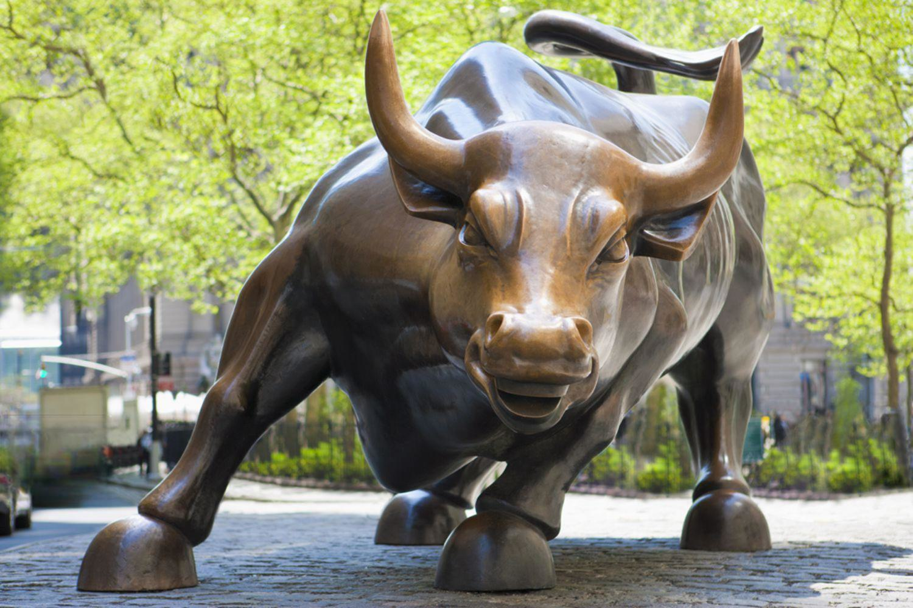

## Table of Contents

## What is a bull market?

A bull market is a time when the stock market is doing well. During a bull market, the prices of stocks go up, and people feel confident about investing. It's called a bull market because a bull charges forward and upward with its horns, which is like how stock prices move during this time.

Bull markets can last for a long time, sometimes several years. They often happen when the economy is strong and people are making more money. During these times, companies make more profits, and investors are happy to buy stocks because they believe the prices will keep going up.

## How is a bull market different from a bear market?

A bull market and a bear market are opposite things in the stock market. A bull market is when the stock prices are going up, and people feel good about investing. It's like the market is charging ahead, full of energy and optimism. People buy stocks because they think the prices will keep going up, and companies are doing well, making more money.

On the other hand, a bear market is when the stock prices are going down, and people feel worried about investing. It's like the market is slowing down and getting tired. In a bear market, people might sell their stocks because they think the prices will keep falling. Companies might not be doing as well, and the economy might be struggling.

So, a bull market is all about growth and feeling good, while a bear market is about decline and feeling worried. These two types of markets show how the stock market can change over time, affecting how people invest and feel about their money.

## What are the key characteristics of a bull market?

A bull market is when the stock market is doing really well. The main thing about a bull market is that stock prices keep going up. This makes people feel good about investing because they think the prices will keep rising. When this happens, more people want to buy stocks, which pushes the prices even higher. It's like a happy cycle where everyone feels confident and excited about the market.

Another important part of a bull market is that the economy is usually doing well too. Companies are making more money, and people have jobs and are spending more. This good economic news makes investors feel even better about putting their money into stocks. When the economy is strong, it helps keep the bull market going strong.

Overall, a bull market is all about growth and optimism. Stock prices go up, people feel good about investing, and the economy is strong. It's a time when everyone feels like the future is bright and they want to be a part of it.

## What economic indicators signal the start of a bull market?

The start of a bull market is often signaled by several economic indicators. One important sign is a rise in the stock market itself. When stock prices start going up consistently over a period of time, usually around 20%, it suggests that a bull market might be beginning. Another indicator is strong economic growth. When the economy is doing well, with more jobs and higher spending, it creates a positive environment for businesses and investors, which can lead to a bull market.

Another key indicator is low unemployment rates. When more people have jobs, they have more money to spend, which helps companies make more profits. This can make investors feel confident about buying stocks, pushing the market upward. Additionally, rising consumer confidence is a good sign. When people feel good about their financial future, they are more likely to spend and invest, which can help start a bull market.

Finally, low interest rates can also signal the beginning of a bull market. When borrowing money is cheaper, businesses can invest in growth and expansion, and consumers can spend more freely. This can boost the economy and the stock market. All these indicators together create an environment where a bull market is more likely to start and grow.

## How long do bull markets typically last?

Bull markets can last for different amounts of time, but they often go on for several years. A famous example is the bull market that started in 2009 after the financial crisis and lasted until 2020. That's more than 10 years! On average, bull markets since World War II have lasted about 5 years, but it can vary a lot.

The length of a bull market depends on many things, like how well the economy is doing and what investors are feeling. If the economy keeps growing and people stay confident, the bull market can keep going strong. But if something big happens, like a financial crisis or a big drop in the economy, the bull market might end sooner. So, while bull markets can be long and exciting, they don't last forever.

## What are some historical examples of bull markets?

One famous bull market was from 1982 to 2000. It's called the "Great Bull Market" because the stock market did really well for a long time. It started when the economy was getting better after some tough years. People felt good about investing, and the stock market kept going up and up. This bull market lasted almost 18 years, which is super long! It ended when the dot-com bubble burst, which made stock prices fall.

Another big bull market happened from 2009 to 2020. It started after the financial crisis in 2008, when the economy was really struggling. But then things started to get better, and the stock market began to rise. This bull market lasted more than 10 years, which is really impressive. It ended when the COVID-19 pandemic hit the world, causing a lot of uncertainty and making stock prices drop.

These bull markets show how the stock market can have really good times that last for years. They happen when the economy is doing well, and people feel confident about investing. But they always end eventually, often because of big events that shake up the economy and the stock market.

## How do bull markets affect individual investors?

Bull markets are great for individual investors because their investments can grow a lot. When stock prices go up, the value of the stocks they own also goes up. This means if they bought stocks at the start of a bull market, they could sell them later for more money. It makes people feel good about investing because they see their money growing. They might even decide to invest more money in the stock market, hoping to make even more.

But bull markets can also make people too excited. When everyone is happy and the stock market is doing well, some investors might start taking bigger risks. They might buy stocks that are too expensive or invest in things they don't really understand, just because they think the prices will keep going up. This can be dangerous because if the bull market ends suddenly, they could lose a lot of money. So, while bull markets are good for growing wealth, it's important for investors to stay smart and not get carried away by the excitement.

## What strategies can investors use during a bull market?

During a bull market, one good strategy for investors is to stay invested in the stock market. Since stock prices are going up, keeping your money in stocks can help you make more money. It's also a good idea to keep buying stocks, even if they seem a bit expensive. This is called "buying the dip," which means buying more stocks when their prices drop a little bit, but are still going up overall. This can help you buy stocks at a better price and make more money when the bull market keeps going.

Another strategy is to spread your money around. This means not putting all your money into just one or two stocks, but instead investing in a bunch of different ones. This is called diversification, and it can help you make money from different parts of the market. It's also smart to think about long-term goals. Even though the bull market is exciting, remember that it won't last forever. So, keep saving and investing for the future, not just for the short-term gains.

Lastly, it's important not to get too excited and take big risks. Bull markets can make people feel like they can't lose, but that's not true. Stay calm and stick to your investment plan. Don't start buying stocks you don't understand just because everyone else is doing it. Keep learning about the market and making smart choices. This way, you can enjoy the bull market and still be ready for when it ends.

## How can one identify the peak of a bull market?

Identifying the peak of a bull market can be tricky, but there are some signs to look out for. One big sign is when stock prices start to go up really fast, much faster than they have been. This can mean that people are getting too excited and might be buying stocks at prices that are too high. Another sign is when a lot of people start talking about how easy it is to make money in the stock market. When everyone is feeling too confident and thinking the market can only go up, it might be close to the peak.

Another way to spot the peak is by watching economic indicators. If the economy starts to show signs of slowing down, like fewer jobs or less spending, it could mean the bull market is about to end. Also, if interest rates start going up, it can make borrowing money more expensive, which can slow down the economy and the stock market. So, by keeping an eye on how fast stock prices are rising, how people are feeling about the market, and what's happening in the economy, you might be able to guess when a bull market is reaching its peak.

## What are the risks associated with investing in a bull market?

Investing in a bull market can be exciting because stock prices are going up and it feels like you can't lose money. But there are risks too. One big risk is that stock prices can get too high. When everyone is buying and the prices keep going up, stocks can become overvalued. This means you might be paying too much for them, and if the market drops, you could lose a lot of money.

Another risk is that people can get too excited and start taking big risks. When the market is doing well, some investors might buy stocks they don't really understand or invest all their money in just one stock. This can be dangerous because if that stock goes down, they could lose everything. It's important to stay calm and not let the excitement of a bull market make you do something risky.

Lastly, bull markets don't last forever. They can end suddenly because of big events like a financial crisis or a big drop in the economy. If you're not ready for the bull market to end, you might panic and sell your stocks at a bad time, losing money. So, while bull markets are good for growing your money, it's important to be careful and think about the risks too.

## How do bull markets influence different sectors of the economy?

Bull markets can make different parts of the economy grow in different ways. When the stock market is doing well, companies often feel more confident about spending money on new projects or expanding their business. This can be really good for sectors like technology, where companies are always trying to come up with new ideas and products. It can also help sectors like construction and manufacturing because more businesses want to build new factories or offices. When these sectors do well, they create more jobs, which means more people have money to spend, helping the economy grow even more.

But not all sectors benefit the same way from a bull market. Some sectors, like utilities or consumer staples (things like food and household products), might not see as big of a boost. These sectors are more stable and don't change as much with the stock market. But even these sectors can feel the effects of a bull market because when people have more money, they might spend more on these everyday items. Overall, a bull market can make many parts of the economy stronger, but how much each sector grows can be different.

## What role do government policies play in sustaining or ending a bull market?

Government policies can have a big impact on bull markets. When the government makes rules that help the economy grow, like cutting taxes or keeping interest rates low, it can make people feel good about investing. Lower taxes mean people and businesses have more money to spend and invest, which can keep the bull market going strong. Low interest rates make it cheaper to borrow money, so companies can expand and people can buy homes or cars more easily. These policies can help keep the good times rolling in a bull market.

But government policies can also end a bull market if they make the economy slow down. For example, if the government raises taxes or increases interest rates to control inflation, it can make people and businesses more careful with their money. Higher taxes mean less money to spend and invest, which can slow down the economy. Higher interest rates make borrowing more expensive, so companies might not want to expand as much, and people might not buy as many big things. These changes can make the bull market end, as the economy and stock market start to struggle.

## References & Further Reading

Harris, L. "Trading and Exchanges: Market Microstructure for Practitioners" offers a comprehensive analysis of the mechanics underlying stock exchanges and their critical role in the financial markets. This work dives deep into market structures, the behavior of trading systems, and the economics of exchange. It is particularly valuable for those wanting to understand the microstructure of trading and how it influences both individual trades and overall market performance.

Lopez de Prado, M. "Advances in Financial Machine Learning" explores the cutting-edge intersection of [machine learning](/wiki/machine-learning) and finance. The book is structured to provide practical insights into how financial machine learning models can be constructed, evaluated, and used in live environments. It covers a wide range of topics, including supervised learning, data preparation, and the implementation of advanced techniques such as feature engineering and hyperparameter optimization.

Aronson, D. R. "Evidence-Based Technical Analysis: Applying the Scientific Method and Statistical Inference to Trading Signals" presents a methodical approach to validating trading systems. Aronson emphasizes the importance of utilizing statistical inference and rigorous testing to ensure the reliability of trading signals. This resource is essential for traders who aim to apply scientific methodology to their technical analysis practices.

Chan, E. P. "Quantitative Trading: How to Build Your Own Algorithmic Trading Business" provides a step-by-step guide to setting up an [algorithmic trading](/wiki/algorithmic-trading) business. Chan covers a variety of important principles, including strategy development, risk management, and technology infrastructure, while also providing practical advice and examples. This book is particularly useful for entrepreneurs and traders looking to transition to algorithmic trading by setting up their own operations.

These references contribute foundational and advanced knowledge for understanding and utilizing concepts related to bull markets, stock market analysis, and algorithmic trading. Each offers a unique perspective on aspects of trading and market dynamics, making them invaluable resources for both new and seasoned financial practitioners.

