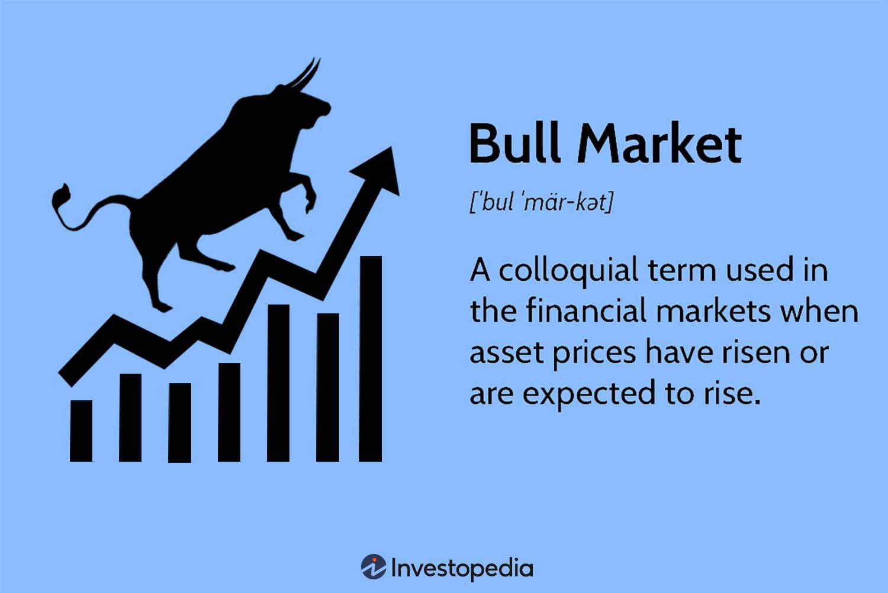

In the world of finance, understanding the dynamics of bull markets is crucial for investors looking to maximize their returns. Bull markets represent periods where the prices of securities are on the rise, reflecting strong economic indicators, increased investor confidence, and favorable corporate performance. Recognizing the onset of a bull market and navigating it effectively are essential skills for anyone invested in the stock market.

This article explores the benefits for stock market investors during a bull market, highlighting how these periods offer enhanced opportunities for capital appreciation. Bull markets are typically marked by a positive feedback loop, where rising prices encourage further market participation, driving prices higher in a self-reinforcing cycle. For investors, this translates into potential capital gains, increased dividends, and operational profit from holding securities.



Algorithmic trading, or algo trading, has emerged as a significant driving force in maximizing these opportunities. By using sophisticated computer programs to execute trades at high speed and efficiency, algo trading enables investors to capture even minute market movements, which can cumulatively lead to substantial returns. Algorithms can process large quantities of data in real-time, allowing traders to identify and capitalize on emerging trends swiftly. This technological advancement not only increases the speed of trade execution but also enhances the accuracy and efficacy of investment strategies in bull markets.

We'll explore how bull markets operate, examine the strategies investors can employ to navigate them successfully, and delve into the vital role algorithmic trading plays in optimizing investments. Through understanding these elements, investors can better position themselves to take advantage of the wealth-building opportunities presented during bullish periods.

## Table of Contents

## What is a Bull Market?

A bull market describes a financial environment where asset prices are experiencing an upward trajectory or are projected to rise. Although the term is frequently linked to the stock market, it possesses broader applicability extending to bonds, real estate, currencies, and commodities. The defining feature of a bull market is a persistent rise in asset prices. This trend is often propelled by a combination of investor optimism and positive economic growth indicators. 

In a bull market, the general sentiment among investors is optimistic, reflecting a belief that favorable market conditions will persist. This optimism often translates into increased buying activity, thereby pushing asset prices further up. Economic factors such as increasing GDP, low unemployment, and rising corporate profits contribute to creating a conducive environment for a bull market. As asset prices climb, they tend to attract more investors, each eager to capitalize on potential gains. 

Within this context, supply and demand dynamics take center stage. As buying [momentum](/wiki/momentum) grows, it reduces the available supply of securities, further elevating prices. Economic stability and growth indicators reinforce the market's upward movement. Companies typically perform well during these times, with higher earnings leading to increased investor interest. Thus, understanding the conditions that foster bull markets is important for investors aiming to make informed decisions and maximize returns.

## Understanding Bull Markets

Bull markets are characterized by rising asset prices and are typically influenced by the performance of the broader economy. A strong economy, evidenced by increasing Gross Domestic Product (GDP), plays a central role in driving bull markets. When GDP grows, it often indicates a thriving economy with businesses expanding and consumer spending increasing, thereby fueling corporate earnings and, consequently, stock prices.

Unemployment rates are another critical [factor](/wiki/factor-investing). As unemployment decreases, more individuals have disposable income to spend and invest, contributing to economic growth and investor confidence. Higher employment levels can lead to increased consumer spending, which propels corporate revenues and profits, resulting in higher stock prices.

Investor confidence is paramount in sustaining a bull market. Optimistic investors are more likely to buy stocks, anticipating future price increases, which creates upward momentum in the market. This positive sentiment is often reflected in higher trading volumes, as more participants engage in buying and holding securities, reducing the selling pressure usually seen in uncertain or declining markets. When investors are confident about future economic conditions and earnings potential, they are more willing to hold onto stocks, waiting for further appreciation.

Typically, during bull markets, there is less inclination to sell, as the prevailing optimism about future gains encourages investors to maintain their positions. This reduced selling pressure can lead to prolonged periods of price increases, as the demand for stocks outstrips supply. The dynamic interplay between these economic indicators and investor behavior shapes the landscape of a bull market, highlighting the importance of macroeconomic trends and market sentiment in influencing financial markets.

## How Investors Benefit from Bull Markets

Investors benefit from bull markets primarily through capital gains, as rising asset prices increase the value of their investments. During these periods, the positive economic conditions and investor optimism create an environment conducive for investing in [growth stocks](/wiki/growth-stocks). Growth stocks are typically characterized by higher price-to-earnings ratios and a focus on capital appreciation rather than dividend income. These stocks or sectors often outperform others during bull markets, as they benefit from the increased economic activity and consumer spending.

The heightened trading activity in bull markets also enhances [liquidity](/wiki/liquidity-risk-premium) across financial markets. High liquidity is crucial as it facilitates the ease of buying and selling securities without significantly affecting their prices. This scenario is favorable for investors executing trades, as they can more easily enter or [exit](/wiki/exit-strategy) positions at desired prices, minimizing the transaction costs and reducing slippage.

Furthermore, with abundant liquidity and rising asset prices, investors may also find opportunities in initial public offerings (IPOs) and secondary offerings, which become more frequent as companies leverage favorable market conditions to raise capital. The boom in such offerings during bull markets presents additional avenues for investors to gain exposure to promising ventures and capitalize on their growth potential.

The positive feedback loop created by escalating asset prices and increased investor participation fuels further market optimism. Investing strategies that capitalize on these conditions, such as buy and hold or growth investing, become particularly effective. By strategically investing during bull markets, investors aim to maximize returns, leveraging the compounded growth potential inherent in these periods of economic expansion.

## The Role of Algorithmic Trading in Bull Markets

Algorithmic trading, commonly known as algo trading, involves using computer algorithms to execute trades at high speeds and efficiencies. These algorithms are based on predetermined criteria such as timing, price, and [volume](/wiki/volume-trading-strategy). In bull markets, characterized by rising asset prices and increasing investor confidence, algo trading becomes a powerful tool for exploiting price trends and market inefficiencies.

One of the primary advantages of algo trading in bull markets is its ability to quickly identify and act upon price trends or discrepancies. Algorithms can scan vast datasets in real-time and make split-second decisions that would be impossible for human traders. This speed and efficiency enable traders to capitalize on fleeting opportunities, maximizing returns in a rapidly appreciating market.

Moreover, algo trading allows investors to automate complex trading strategies. By leveraging historical data and predictive analytics, algorithms can model various scenarios and adjust trading strategies accordingly. This adaptability is crucial in bull markets, where conditions can change rapidly and new opportunities may arise due to shifts in market sentiment or economic indicators.

With access to real-time data, algo trading enhances decision-making processes. It can continuously monitor market conditions and execute trades under optimal conditions without the need for constant human oversight. For instance, a trader might use an algorithm to automatically rebalance their portfolio based on predetermined thresholds, ensuring alignment with investment goals while maintaining exposure to promising growth sectors.

Furthermore, advanced algorithms integrate [machine learning](/wiki/machine-learning) and [artificial intelligence](/wiki/ai-artificial-intelligence) to improve predictive capabilities. These technologies can analyze patterns that are not immediately discernible to human traders, offering an edge in anticipating market movements. As the technologies evolve, their integration within algorithmic frameworks is expected to become even more sophisticated, enhancing the ability to navigate bull markets efficiently.

Overall, the role of [algorithmic trading](/wiki/algorithmic-trading) in bull markets is significant. It not only improves the speed and accuracy of trading operations but also enhances strategic flexibility, enabling investors to maximize their returns during periods of rising asset prices.

## Strategies for Maximizing Gains in Bull Markets

Buy and hold strategies are a cornerstone for investors aiming to profit from long-term price increases in bull markets. This approach involves purchasing securities and holding them over an extended period, capitalizing on the generally upward trajectory of asset prices. During bull markets, the upward trend is sustained by investor optimism and economic growth, making it a conducive environment for buy and hold strategies.

An enhanced variation of this approach is the increased buy and hold strategy. Investors not only hold their initial investment but also periodically add to their position, especially as the asset's price continues to climb. This can amplify potential returns, as investors effectively increase their stake in a performing asset. For instance, an investor can adopt a systematic approach, such as dollar-cost averaging, to regularly purchase additional shares regardless of minor market fluctuations, thereby leveraging the compounding effect.

Retracement strategies offer another way to maximize gains in bull markets by focusing on buying dips, which are brief price declines during an overall upward trend. These strategies are based on the premise that, within a bull market, temporary pullbacks can present opportune moments to acquire additional shares at a relatively lower price before the market resumes its upward trajectory. Technical analysis tools, such as Fibonacci retracement levels, are often used to identify potential entry points during these market dips.

Algorithmic trading can enhance these strategies by swiftly analyzing market data to spot buying opportunities in real-time and execute trades with precision. By employing algorithms, investors can efficiently identify optimal entry points based on complex criteria, adjust their positions with minimal delay, and maintain discipline in adhering to their strategies amid market [volatility](/wiki/volatility-trading-strategies). This systematic approach minimizes emotional decision-making and optimizes the timing of purchases during bull markets, ultimately contributing to maximizing gains.

## Examples of Historic Bull Markets

The Roaring Twenties, a period in the 1920s, stands as an iconic example of a historic bull market. Characterized by rapid economic expansion and technological innovation, this era witnessed a dramatic surge in asset prices. The widespread adoption of automobiles, telephones, and electricity contributed significantly to economic growth. However, this prosperity was abruptly curtailed by the Wall Street Crash of 1929, signaling the onset of the Great Depression.

The 1990s were marked by another notable bull market, often referred to as the dot-com bubble. This period was driven by unprecedented advancements in internet technology, leading to substantial growth in tech stocks. Companies associated with the burgeoning internet sector saw their valuations soar, attracting significant investment capital. Despite this initial success, the market eventually shifted towards a sharp downturn in the early 2000s, as many tech companies failed to demonstrate sustainable business models and profitability.

Another remarkable bull market began in the wake of the 2008 financial crisis. The post-2009 recovery, known as the longest bull market in history, was characterized by an extended period of economic growth and asset appreciation. This recovery was supported by monetary policies such as quantitative easing, which helped stabilize financial systems and restore investor confidence. The bull market continued until the market turbulence induced by the COVID-19 pandemic in 2020, demonstrating resilience in the face of global economic challenges.

These historic bull markets underscore the cyclical nature of financial markets and highlight the impact of innovation, technological progress, and macroeconomic conditions on market trajectories. Understanding the patterns and factors that contribute to such market conditions can offer valuable insights for current and future investment strategies.

## Bull vs. Bear Markets: Key Differences

Bull markets are typified by rising asset prices and a general sense of investor optimism. These favorable conditions often result from strong economic indicators such as increasing GDP, decreasing unemployment rates, and robust corporate earnings. During bull markets, investors are more inclined to take risks, expecting that asset prices will continue to increase, ultimately leading to capital appreciation.

Conversely, bear markets feature falling asset prices and widespread investor pessimism. Economic indicators during bear markets might include declining GDP, increasing unemployment, and poor corporate performance. These conditions tend to lead investors to avoid risks, often shifting their focus towards capital preservation and more conservative investment vehicles like bonds or dividend-paying stocks.

Investment strategies in these markets naturally differ. In bull markets, strategies often revolve around growth and expansion. Investors might increase positions in growth stocks, emerging industries, or sectors showing high performance. The focus is on maximizing capital gains by exploiting the upward trend in asset prices. For example, growth-oriented strategies such as buying on margin can amplify returns while maintaining a long-term investment horizon can capture the full benefit of rising market trends.

In contrast, bear market strategies prioritize protecting existing capital. Investors might opt for defensive stocks—those with stable earnings and dividends—or alternatively, employ hedging strategies using options or other derivatives to mitigate potential losses. Practically, bear markets may drive a shift towards fixed-income securities, which can offer more stable returns and lower volatility compared to equities.

Understanding the cyclical nature of these markets is vital for effective investment timing and resource allocation. By discerning the phases of these cycles, investors can adjust their portfolios: increasing exposure to equities during bull markets and minimizing it when entering bear markets. This cyclical awareness not only aids in maximizing returns during favorable periods but also in preserving capital when conditions regress.

For a quantitative perspective, consider a simple moving average (SMA) strategy, commonly used to identify market trends:
```python
def simple_moving_average(prices, window):
    sma = []
    for i in range(len(prices) - window + 1):
        average = sum(prices[i:i+window]) / window
        sma.append(average)
    return sma

prices = [100, 105, 102, 110, 115, 108, 120, 125, 130]  # Example price data
window = 3
sma = simple_moving_average(prices, window)
print(sma)
```
This code calculates a simple moving average that investors might use to detect the trend phase of a market, aiding strategic adjustments between bull and bear conditions.

## The Future of Algorithmic Trading in Bull Markets

Algorithmic trading, shorthand as algo trading, continues to evolve with advances in technology. It's anticipated to play a crucial role in the efficient navigation of bull markets. As the complexity of global financial markets compounds, the integration of Artificial Intelligence (AI) and data analytics is becoming increasingly vital. This evolution enhances predictive capabilities, yielding intricate insights that can optimize investment strategies.

AI is now being used to parse vast datasets, identifying patterns and price movements that might be invisible to human traders. Machine learning algorithms can process past market data to predict future trends, enabling investors to anticipate asset performance with greater accuracy. For example, neural networks and [deep learning](/wiki/deep-learning) models are often deployed to refine prediction models, learning iteratively from previous trades to adjust and improve their output over time.

The persistent pace of innovation within algorithmic frameworks promises further enhancements in stock market participation. Developers and financial institutions are focusing on creating more sophisticated algorithms capable of performing a diverse range of functions—from executing simple trades at optimized prices to managing complex portfolios across multiple markets. This innovative momentum is supported by an increase in Computational Power and the proliferation of more accessible machine learning libraries, encouraging wider adoption of AI-driven techniques in trading.

Moreover, algorithms can adapt to real-time market changes swiftly, adjusting their strategies based on current data inputs. This adaptability is particularly advantageous during bull markets, where rapid price escalations and volatilities can confound traditional trading strategies. Investors who leverage these automated systems can capitalize on short-lived opportunities, minimizing human error and emotional decision-making that can impair investment outcomes.

Given the continuous advancements in AI and computational technologies, adopting such tools early offers investors a competitive edge. Investors equipped with these technologies can achieve greater precision in trade execution, ensuring optimal entry and exit points within bullish environments. This precision not only maximizes potential returns but also provides a buffer against potential downturns.

In conclusion, algorithmic trading is set to become deeply embedded in the dynamics of bull markets. With ongoing innovation and the integration of sophisticated AI and data analytics, investors can expect more refined, efficient, and accurate trading mechanisms, ultimately optimizing their market participation and financial returns.

## Conclusion

Bull markets offer substantial opportunities for investors to accumulate wealth through rising asset prices and well-timed investment strategies. During these periods, investors can benefit from strategic decisions such as buying growth stocks or investing in high-performing sectors, capitalizing on the overall optimism and economic expansion associated with bull markets.

Algorithmic trading significantly enhances investment efforts by providing precision and scalability in executing trading strategies. These computer-driven systems can analyze large datasets in real-time, identify emerging trends, and execute trades at speeds unreachable by human traders. This ability to process information rapidly and accurately allows investors to exploit market inefficiencies and price discrepancies, optimizing their returns during bullish phases.

Successful navigation and capitalization on bull markets require investors to stay informed and adaptable. Economic indicators, market trends, and technological advancements should all be regularly monitored to adjust strategies accordingly. Leveraging modern tools and technologies, such as algorithmic trading systems, can enhance adaptability and enable investors to respond swiftly to market changes. By combining strategic foresight with advanced trading solutions, investors can maximize their gains and effectively manage risks in the dynamic environments characteristic of bull markets.

## References & Further Reading

[1]: Bergstra, J., Bardenet, R., Bengio, Y., & Kégl, B. (2011). ["Algorithms for Hyper-Parameter Optimization."](https://papers.nips.cc/paper/4443-algorithms-for-hyper-parameter-optimization) Advances in Neural Information Processing Systems 24.

[2]: ["Advances in Financial Machine Learning"](https://www.amazon.com/Advances-Financial-Machine-Learning-Marcos/dp/1119482089) by Marcos Lopez de Prado

[3]: ["Evidence-Based Technical Analysis: Applying the Scientific Method and Statistical Inference to Trading Signals"](https://www.amazon.com/Evidence-Based-Technical-Analysis-Scientific-Statistical/dp/0470008741) by David Aronson

[4]: ["Machine Learning for Algorithmic Trading"](https://github.com/stefan-jansen/machine-learning-for-trading) by Stefan Jansen

[5]: ["Quantitative Trading: How to Build Your Own Algorithmic Trading Business"](https://www.amazon.com/Quantitative-Trading-Build-Algorithmic-Business/dp/1119800064) by Ernest P. Chan