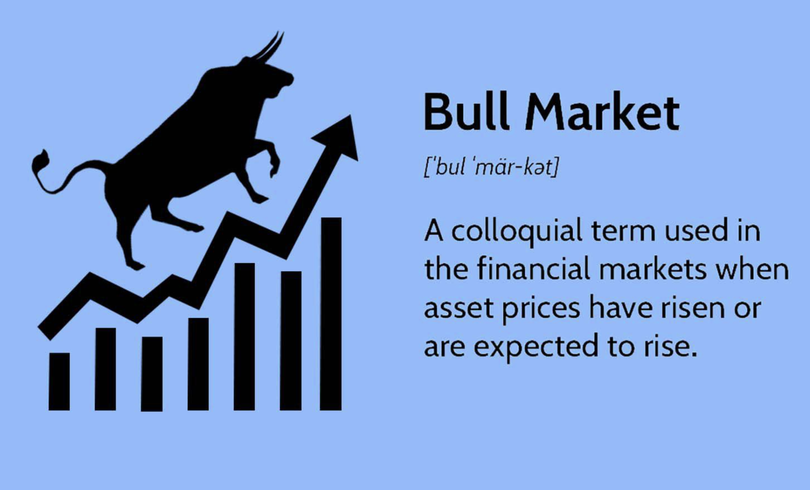

## Table of Contents

## What is a bull market?

A bull market is a time when the prices of stocks and other investments are going up. It's called a "bull market" because a bull charges forward and upward with its horns, which is like how the market is moving during this time. People feel confident and happy about their investments because they are making money. This good feeling makes more people want to buy stocks, which helps keep the prices going up.

During a bull market, the economy is usually doing well. Businesses are making more money, and people are spending more. This can last for a long time, sometimes even years. But, it's important to remember that bull markets don't last forever. Eventually, the market might start to go down, and then it becomes what's called a bear market. But while the bull market is happening, it's a good time for investors to see their investments grow.

## How can you identify the start of a bull market?

You can tell a bull market is starting when stock prices begin to go up after being down for a while. Usually, people look for a big increase, like when a main stock index goes up by 20% or more from its lowest point. This big jump shows that more people are feeling good about the market and want to buy stocks. It's like a signal that the market is turning around and getting ready to grow.

Another way to spot the beginning of a bull market is by watching how people feel about the economy. When businesses start making more money and people are spending more, it can mean a bull market is on the way. Also, if the news starts talking more about good things happening in the economy, it can make more people want to invest. So, by keeping an eye on these signs, you can get a sense that a bull market might be starting.

## What are the general benefits of investing during a bull market?

When you invest during a bull market, your investments can grow a lot. This is because stock prices are going up. If you buy stocks or other investments at the beginning of a bull market, you might see their value increase a lot over time. This can make you more money than if you invested during a time when the market was not doing so well. It's like catching a wave at the right time; it can [carry](/wiki/carry-trading) you far.

Another good thing about investing in a bull market is that it can make you feel more confident about your money. When you see your investments growing, you might feel happier and more willing to keep investing. This positive feeling can help you stay calm even if the market goes down a bit later. Plus, if you need to take money out of your investments, you might be able to sell them for more than you paid, which is a big plus.

## How does a bull market affect stock prices?

During a bull market, stock prices go up. This happens because more people want to buy stocks. When lots of people want to buy, the demand for stocks gets higher. This higher demand makes the price of stocks go up. It's like when lots of kids want the same toy; the price of that toy goes up because everyone wants it.

As stock prices keep going up in a bull market, more people feel good about investing. They see that their stocks are worth more money, so they want to buy even more. This cycle of buying and price increases can keep going for a while. But, it's important to remember that bull markets don't last forever. Eventually, the market might change, and stock prices could start going down.

## What are the risks of investing in a bull market?

Investing in a bull market can be risky because the market might change suddenly. Even though prices are going up, they could start going down without warning. If you buy stocks when they are very high and then the market turns into a bear market, you could lose money. It's like buying a toy at its highest price and then finding out it's not popular anymore; you might not be able to sell it for as much as you paid.

Another risk is that people can get too excited during a bull market. They might start buying stocks without thinking carefully about whether they are good investments. This can lead to making bad choices, like buying stocks that are overpriced or risky. When the market changes, these bad choices can hurt your investments a lot. So, it's important to stay calm and make smart choices even when everyone around you is getting excited.

## How can beginners take advantage of a bull market?

Beginners can take advantage of a bull market by starting to invest early. When stock prices are going up, it's a good time to buy stocks or funds that follow the market. You don't need a lot of money to start. Even small investments can grow a lot if you buy at the right time. It's like planting a seed at the start of spring; with time and care, it can grow into a big plant.

Another way for beginners to benefit from a bull market is by learning and staying informed. You can read about different companies and watch the news to understand what's happening in the market. This can help you make better choices about what to buy. It's also a good idea to talk to people who know more about investing. They can give you tips and help you avoid common mistakes. By being patient and learning as you go, you can make the most of a bull market.

## What investment strategies work best during a bull market?

During a bull market, one good strategy is to buy and hold. This means you buy stocks or funds that you think will do well over time and keep them even if the market goes up and down a bit. This works well in a bull market because stock prices are going up, so your investments can grow a lot if you hold onto them. It's like planting a tree and waiting for it to grow big and strong.

Another strategy is to invest in index funds or ETFs. These are funds that follow the whole market or a big part of it. When the market is going up, these funds usually go up too. This is a good way for beginners because it's easy and you don't have to pick individual stocks. It's like buying a ticket to a big show; you get to enjoy the whole performance without choosing each act.

A third strategy is to diversify your investments. This means you spread your money across different types of investments, like stocks, bonds, and maybe even real estate. In a bull market, this can help you make money from different places. If one investment doesn't do well, others might still go up. It's like having different toys to play with; if one breaks, you still have others to enjoy.

## How do bull markets impact different sectors of the economy?

During a bull market, different parts of the economy can be affected in different ways. Some sectors, like technology and consumer goods, often do really well. This is because people feel more confident and are willing to spend more money on things like new gadgets or going out to eat. Companies in these sectors make more money, and their stock prices go up a lot. It's like when everyone wants to buy the newest toy; the stores that sell those toys do great.

On the other hand, some sectors might not do as well during a bull market. For example, utility companies, which provide things like electricity and water, might not see their stock prices go up as much. This is because people always need these services, so their demand doesn't change much even when the economy is doing well. These companies are more stable but don't grow as fast as others. It's like a toy that everyone needs but doesn't get excited about; it sells steadily but doesn't become a big hit.

Overall, a bull market can make some parts of the economy grow faster than others. It's important for investors to look at which sectors are doing well and think about how they want to invest their money. By understanding how different sectors are affected, you can make smarter choices and maybe make more money during a bull market.

## What historical examples illustrate the effects of bull markets?

One famous example of a bull market happened in the 1990s. This was called the dot-com bull market. During this time, lots of people got excited about the internet and technology. They started buying stocks in tech companies, hoping to make a lot of money. Stock prices went up and up, and many people did make money. But then, in 2000, the market changed, and many of those tech stocks lost a lot of value. This shows how a bull market can make people feel very hopeful and excited, but it can also lead to big losses if you're not careful.

Another example is the bull market that started after the 2008 financial crisis. After the crisis, the economy was bad, and stock prices were low. But then, slowly, things started to get better. People began to feel more confident, and they started buying stocks again. This bull market lasted for a long time, from about 2009 to 2020. During this time, stock prices went up a lot, and many people made money. It shows how a bull market can help the economy recover and grow after a tough time.

## How can investors protect their gains during the later stages of a bull market?

As a bull market goes on, it's important for investors to think about how to keep the money they've made. One way to do this is by taking some of your profits out of the market. This means selling some of your stocks when their prices are high. By doing this, you can keep some of the money you've made safe, even if the market goes down later. It's like taking some toys home after playing at a friend's house so you don't lose them all if something goes wrong.

Another way to protect your gains is by diversifying your investments. This means not putting all your money into one type of investment. Instead, you can spread it out across different kinds of stocks, bonds, and maybe even real estate. If the stock market goes down, your other investments might still be okay. This can help you keep more of your money safe. It's like having different toys to play with; if one breaks, you still have others to enjoy.

## What are the indicators that a bull market might be ending?

When a bull market might be ending, you can see some signs. One big sign is when stock prices start to go up and down a lot more than before. This means the market is getting unsure and people are not as confident as they were. Another sign is when the economy starts to slow down. If businesses are making less money and people are spending less, it can mean the bull market is getting ready to end. It's like when the fun at a party starts to die down; people start leaving, and the energy isn't the same.

Another way to tell if a bull market might be over is by looking at how people feel about the market. If people start to feel less excited and more worried, it can be a sign that the market is changing. Also, if stock prices are very high and don't seem to be going up anymore, it might mean the bull market is running out of steam. It's important to watch these signs and be ready to make changes to your investments if you think the bull market is ending.

## How do bull markets influence long-term investment planning?

Bull markets can really help with long-term investment planning. When stock prices are going up, it's a good time to invest because your money can grow a lot. If you start investing early in a bull market, you can see your investments get bigger and bigger over time. This can help you reach your long-term goals, like saving for a house or retirement. It's like planting a seed at the start of spring; with time and care, it can grow into a big plant that gives you lots of fruits.

But it's also important to think about what happens after a bull market. Even though it's great to see your investments grow, bull markets don't last forever. So, part of long-term planning is being ready for when the market changes. You might want to take some of your profits out of the market or spread your money across different types of investments. This way, if the market goes down, you won't lose all the money you made during the bull market. It's like saving some of your toys so you still have something to play with even if the fun at the party ends.

## References & Further Reading

[1]: Bergstra, J., Bardenet, R., Bengio, Y., & Kégl, B. (2011). ["Algorithms for Hyper-Parameter Optimization."](https://papers.nips.cc/paper/4443-algorithms-for-hyper-parameter-optimization) Advances in Neural Information Processing Systems 24.

[2]: ["Advances in Financial Machine Learning"](https://www.amazon.com/Advances-Financial-Machine-Learning-Marcos/dp/1119482089) by Marcos Lopez de Prado

[3]: ["Evidence-Based Technical Analysis: Applying the Scientific Method and Statistical Inference to Trading Signals"](https://www.amazon.com/Evidence-Based-Technical-Analysis-Scientific-Statistical/dp/0470008741) by David Aronson

[4]: ["Machine Learning for Algorithmic Trading"](https://github.com/stefan-jansen/machine-learning-for-trading) by Stefan Jansen

[5]: ["Quantitative Trading: How to Build Your Own Algorithmic Trading Business"](https://www.amazon.com/Quantitative-Trading-Build-Algorithmic-Business/dp/1119800064) by Ernest P. Chan