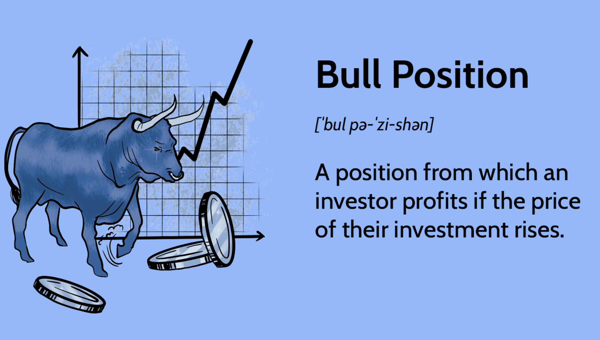

In the ever-evolving world of finance, understanding different investment strategies is crucial for achieving financial success. The concept of a 'bull position' stands out as a fundamental strategy that traders and investors use to capitalize on rising asset values. A bull position, often referred to as going long, involves purchasing assets with the expectation that their prices will rise over time, thereby generating profits when they are sold at a higher price. This optimism about an asset's future performance is central to bullish investing, which contrasts with bearish strategies that anticipate price declines.

Algorithmic trading has revolutionized how traders implement bullish strategies, blending modern technological advances with traditional trading philosophies. By using computer algorithms to execute trades, investors can significantly enhance the efficiency and precision of their operations, minimizing emotional bias and improving decision-making processes. This integration of technology helps in identifying bullish trends and optimizing entry and exit points in the market.



As we explore the intricacies of algorithmic trading and its intersection with bullish strategies, this article aims to equip investors with the knowledge to effectively harness these tools. By understanding how modern technology complements time-tested trading philosophies, traders can better navigate the complexities of financial markets. Let's begin by examining the concept of a bull position and its relevance in today's trading environment.

## Table of Contents

## Understanding Bull Position in Trading

Bull positions, also known as long positions, are a staple in the investment world and refer to strategies where investors anticipate profit through rising asset prices. This optimistic outlook involves purchasing and retaining assets with the expectation of future appreciation in value. 

Historically, several successful bull markets exemplify this concept. For instance, the 1990s, often referred to as the Dot-com Boom, was characterized by substantial gains driven by burgeoning technology companies. More recently, the prolonged bull market following the 2008 financial crisis saw significant gains in various sectors, particularly technology and consumer services, driven by low-interest rates and robust corporate earnings.

Maintaining a bull position offers several advantages. Foremost is the potential for substantial capital appreciation as markets rise. Investors benefit from compounding returns as asset values increase over time. Additionally, bull positions do not require constant monitoring as commonly needed in bearish or short-selling strategies. However, bullish investing is not without its challenges. Market [volatility](/wiki/volatility-trading-strategies) can erode paper profits quickly, and over-optimism can lead to buying at inflated prices, risking substantial losses if markets reverse unexpectedly.

To successfully maintain a bull position, investors must be adept at reading market sentiments and economic indicators. Factors such as GDP growth, employment rates, and investor confidence can significantly influence bullish strategies. For instance, robust GDP growth typically signals a healthy economy, conducive to rising market prices. Similarly, favorable employment data can boost consumer spending, further propelling market gains.

In summary, successful bullish investments require a keen understanding of both market conditions and macroeconomic indicators. By leveraging these insights, investors can make informed decisions that align with their optimistic outlook, maximizing their potential for profit.

## Algorithmic Trading and Bull Strategies

Algorithmic trading uses advanced computational algorithms to conduct trades at optimal times, enhancing the implementation of bullish strategies. These algorithms operate by executing pre-programmed instructions that account for variables such as timing, price, and [volume](/wiki/volume-trading-strategy). By utilizing this technology, traders can access a number of advantages that aid in capturing bullish trends effectively.

One of the primary benefits of [algorithmic trading](/wiki/algorithmic-trading) is the enhancement of speed and efficiency in trade execution. Algorithms can analyze vast amounts of data across multiple markets and execute trades faster than any human trader. This results in reduced latency in capturing favorable market conditions, a crucial [factor](/wiki/factor-investing) for success in bullish markets where moments of opportunity can be fleeting.

Additionally, algorithmic trading minimizes the impact of emotional biases in trading decisions. Human emotions like fear and greed can lead to poor decision-making, particularly in volatile markets. Algorithms adhere strictly to predefined criteria, eliminating emotional influences and thus ensuring consistent adherence to trading strategies.

Improved accuracy is another significant advantage of algorithmic trading. Algorithms process historical and real-time data to identify and act upon trading signals that align with bullish trends. This precision reduces the risk of errors associated with manual trading, allowing for more reliable returns on investments.

Popular algorithmic trading strategies that complement bullish approaches include trend-following algorithms. Such algorithms identify and exploit upward price movements. Trend-following strategies analyze historical price patterns to predict future movements, generating signals to initiate or [exit](/wiki/exit-strategy) positions based on the sustained direction of asset prices. These algorithms are designed for capturing longer-term price trends, typical of a bull market, rather than short-term fluctuations.

Here is a Python example of a simple trend-following algorithm using moving averages:

```python
import pandas as pd
import numpy as np

def moving_average(signal, window_size):
    return signal.rolling(window=window_size).mean()

# Example stock price data
stock_prices = pd.Series([20, 21, 22, 21, 23, 24, 25, 26, 27, 28])

# Calculate short and long moving averages
short_window = 2
long_window = 5

short_ma = moving_average(stock_prices, short_window)
long_ma = moving_average(stock_prices, long_window)

# Define bullish signal: Buy when short MA crosses above long MA
signals = np.where(short_ma > long_ma, "Buy", "Hold")
print(signals)
```

In this example, the algorithm generates a "Buy" signal when a short-term moving average exceeds a long-term moving average, indicating a bullish trend. This simple strategy can be enhanced to include more sophisticated models and risk management techniques.

Algorithmic trading not only amplifies the effectiveness of bullish strategies but also supports traders in managing and mitigating risks. By harnessing data-driven insights and maintaining a disciplined approach, traders are better equipped to navigate bullish markets with the aid of algorithmic frameworks.

## Key Factors Influencing Bull Position

Understanding the key factors influencing a bull position is crucial for traders and investors aiming to capitalize on rising asset prices effectively. Economic indicators are essential in forecasting potential bullish markets. Indicators such as GDP growth, employment rates, and inflation provide insights into the overall health of an economy. A robust GDP growth rate often indicates a thriving economy, fostering an environment where companies can expand, potentially leading to higher stock prices. Similarly, low unemployment rates suggest a strong labor market, which generally supports consumer spending and business profits. However, inflation is a double-edged sword; moderate inflation can be a sign of economic growth, but excessive inflation may lead to higher interest rates, which can dampen market enthusiasm.

Market psychology and investor sentiment also play a pivotal role in predicting bullish trends. The behavior of investors can be assessed through various sentiment indices like the Fear & Greed Index, which aggregates emotions driving the market and provides a snapshot of investor sentiment. Bullish markets often coincide with high investor confidence, reflected in a predominance of positive sentiment and risk-taking behavior.

Monetary and fiscal policies are significant determinants of market direction. The Federal Reserve's policies, particularly on interest rates and quantitative easing, directly affect [liquidity](/wiki/liquidity-risk-premium) in the market. Lower interest rates typically encourage borrowing and investment, while policies aimed at increasing money supply can lead to bullish market conditions. Conversely, government fiscal policies, such as tax cuts or increased public spending, can boost consumer and business confidence, prompting upward trends in stock markets.

Investors need to skillfully assess financial data to make informed decisions regarding bull positions. This involves a combination of technical and [fundamental analysis](/wiki/fundamental-analysis). Technical analysis focuses on price patterns and market [statistics](/wiki/bayesian-statistics), while fundamental analysis evaluates a company's financial health through key indicators like earnings, revenue, and profit margins. Techniques such as the Price-to-Earnings (P/E) ratio and Earnings Per Share (EPS) are fundamental tools that provide insights into a company's valuation and growth potential, supporting decisions to enter or maintain bull positions.

In sum, successful bullish investments hinge on understanding and interpreting a blend of economic indicators, investor sentiment, and regulatory policies. Systematic analysis of these factors enables traders to anticipate market movements and adjust their strategies accordingly, ensuring optimal utilization of bull positions.

## Best Practices for Bull Position Algo Trading

Combining traditional trading principles with modern technology is crucial in today's financial markets, enabling traders to enhance their strategies and improve their chances of success. Bull position algorithmic trading focuses on capturing upward market trends using computational techniques. Here are some best practices to optimize such strategies:

1. **Setting Clear Trading Goals and Risk Management**: Establishing well-defined trading objectives is fundamental. Traders should decide their risk tolerance, return expectations, and timeline upfront. Efficient risk management is just as important, ensuring exposure does not exceed the pre-defined risk levels. Strategies like setting a maximum drawdown limit or using position sizing algorithms can help manage risk appropriately.

2. **Regular Backtesting of Strategies**: Before deploying any algorithmic strategy, it's imperative to rigorously backtest it using historical data. This process helps identify how the strategy would have performed under past market conditions, allowing traders to fine-tune their algorithms. For example, using Python, one might utilize libraries like pandas for data manipulation and backtrader for testing the strategy:

   ```python
   import backtrader as bt

   class BullStrategy(bt.Strategy):
       def __init__(self):
           self.dataclose = self.datas[0].close

       def next(self):
           if self.dataclose[0] > self.dataclose[-1]:
               self.buy()

   cerebro = bt.Cerebro()
   cerebro.addstrategy(BullStrategy)
   data = bt.feeds.YahooFinanceData(dataname='AAPL', fromdate=datetime(2020, 1, 1), todate=datetime(2021, 1, 1))
   cerebro.adddata(data)
   cerebro.run()
   ```

   This example outlines a straightforward bullish strategy where a buy order is executed if today's closing price is above yesterday's.

3. **Portfolio Diversification**: While focusing on bullish strategies, it's important to maintain a diversified portfolio to mitigate risk. Holding a variety of non-correlated assets can reduce exposure to specific market conditions. Diversification minimizes the impact of market volatility on overall portfolio performance.

4. **Use of Stop-loss Orders**: Implementing stop-loss orders is a critical risk management tool, safeguarding investments from unexpected market downturns. A stop-loss order automatically sells a security when it reaches a certain price, limiting potential losses. For instance, traders might set a stop-loss at 95% of the purchase price, ensuring a maximum loss of 5%.

In conclusion, successful bull position algorithmic trading requires a harmonious integration of traditional trading principles with modern algorithmic techniques. By setting clear goals, performing regular backtests, maintaining a diversified portfolio, and employing robust risk management practices, traders can better navigate the complexities of bullish markets.

## Conclusion

Combining bull position strategies with algorithmic trading can greatly enhance investment outcomes by capitalizing on market trends efficiently. A thorough understanding of macroeconomic factors, such as GDP growth, inflation rates, and fiscal policies, enables investors to identify favorable conditions for bullish investments. In parallel, microeconomic factors, including company performance metrics and industry trends, provide detailed insights that aid in making informed decisions.

As technology rapidly advances, it becomes crucial for investors to stay abreast of new tools and methodologies in trading. Emerging technologies can offer unprecedented insights and opportunities, making it essential for investors to continuously learn and adapt their strategies. Algorithmic trading, with its ability to process vast amounts of data rapidly and execute trades at precise moments, presents a powerful tool for implementing bull strategies. It reduces the emotional bias in trading decisions, enhances precision, and often leads to improved performance.

Investors must prioritize continuous learning and adaptability to navigate the ever-changing market dynamics effectively. This involves regularly updating knowledge on economic indicators, refining algorithmic strategies, and incorporating new technological advancements into their trading frameworks.

In summary, leveraging a bull position with algorithmic trading presents new profit avenues for discerning investors. By combining traditional insights with modern technology, traders can optimize their investment strategies, improve their decision-making processes, and ultimately enhance their financial outcomes. As the financial landscape evolves, embracing these developments will be key to achieving and maintaining investment success.

## References & Further Reading

[1]: Bergstra, J., Bardenet, R., Bengio, Y., & Kégl, B. (2011). ["Algorithms for Hyper-Parameter Optimization."](https://papers.nips.cc/paper/4443-algorithms-for-hyper-parameter-optimization) Advances in Neural Information Processing Systems 24.

[2]: ["Advances in Financial Machine Learning"](https://www.amazon.com/Advances-Financial-Machine-Learning-Marcos/dp/1119482089) by Marcos Lopez de Prado

[3]: ["Evidence-Based Technical Analysis: Applying the Scientific Method and Statistical Inference to Trading Signals"](https://www.amazon.com/Evidence-Based-Technical-Analysis-Scientific-Statistical/dp/0470008741) by David Aronson

[4]: ["Machine Learning for Algorithmic Trading"](https://github.com/stefan-jansen/machine-learning-for-trading) by Stefan Jansen

[5]: ["Quantitative Trading: How to Build Your Own Algorithmic Trading Business"](https://www.amazon.com/Quantitative-Trading-Build-Algorithmic-Business/dp/1119800064) by Ernest P. Chan