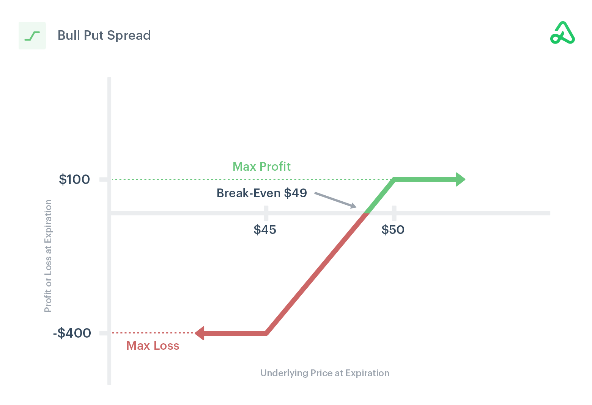

Options trading attracts many investors due to its potential for significant gains and strategic flexibility. One popular options strategy within this domain is the Bull Put Spread. This strategy caters to those with a moderately bullish outlook on the market, offering a balanced approach between risk and reward. As this article will examine, the Bull Put Spread strategy involves the strategic use of put options to create a spread with limited risk and profit potential, making it an attractive choice for traders.

In the evolving landscape of finance, algorithmic trading plays a pivotal role by executing trades at high speeds and volumes, thereby enhancing the efficiency of strategies like the Bull Put Spread. Algorithmic trading utilizes advanced mathematical models and the processing power of computers to make trading decisions based on real-time data. This high-speed trade execution minimizes human error and emotion, enabling traders to capitalize more effectively on short-term market movements.



The Bull Put Spread involves selling a put option at a higher strike price while simultaneously purchasing another put option at a lower strike price, both within the same expiration date. This setup allows traders to profit when the underlying asset's price stays stable or rises slightly, with the net premium from the sold option bolstering income and the bought option serving to cap potential losses.

Incorporating algorithmic trading into Bull Put Spreads offers an avenue for optimization, enhancing decision-making, and maintaining consistency. By leveraging algorithms, traders can systematically select optimal strike prices, time market entries and exits, and manage positions with precision. This technological integration represents a transformative approach, making it imperative for those engaging in options trading to consider how algorithms might refine their strategy execution.

In this article, we will provide a comprehensive guide on utilizing algorithmic strategies to optimize Bull Put Spreads, equipping traders with insights on maximizing potential gains while managing risks effectively.

## Table of Contents

## Understanding the Bull Put Spread

A Bull Put Spread is an options trading strategy designed to profit from bullish market conditions while managing risk. This strategy involves the simultaneous selling of a put option at a higher strike price and purchasing another put option at a lower strike price, both with the same expiration date. The primary objective is to generate income through the net premium received from these transactions.

For a Bull Put Spread to be profitable, the price of the underlying asset should remain stable or increase slightly. This strategy is therefore suitable for investors who have a moderately bullish outlook on the market. The risk and reward profile of this strategy is limited, offering protection against significant downside movements in the market.

The mechanics of the Bull Put Spread can be summarized as follows:
1. **Selling a Put Option**: The trader sells a put option with a higher strike price. This transaction generates a premium, which contributes to the strategy's potential profit.
2. **Buying a Put Option**: Simultaneously, the trader buys a put option with a lower strike price. This serves as a protective measure, limiting potential losses if the market moves against the trader’s expectation.
3. **Net Premium**: The net premium refers to the difference between the premium received from the sold put option and the premium paid for the purchased put option. This amount represents the maximum potential profit for the strategy if the asset's price remains above the higher strike price until expiration.

The maximum profit of a Bull Put Spread is realized when the underlying asset’s price is above the higher strike price at expiration, rendering both put options worthless and allowing the trader to keep the net premium. Conversely, if the asset price falls below the lower strike price, the maximum loss is incurred, calculated as the difference between the strike prices minus the net premium received.

In conclusion, the Bull Put Spread is favored by traders who are confident in a stable to slightly rising market. By collecting premiums from the sold put option and hedging potential losses with the purchased put option, traders can navigate the complexities of the market with a clearly defined risk profile.

## Constructing a Bull Put Spread

To construct a Bull Put Spread, traders begin by selecting an appropriate underlying asset, such as stocks, indices, or ETFs, based on those assets' potential for stable or slightly rising prices. This options strategy involves the simultaneous execution of two put options with the same expiration date but differing strike prices, specifically:

1. **Selling a Put Option at a Higher Strike Price**: This component of the Bull Put Spread generates income for the trader through the collection of a premium. The higher strike price, generally close to the current market value of the underlying asset, frames a boundary where profit potential peaks if the asset remains above this value by expiration.

2. **Buying a Put Option at a Lower Strike Price**: The purchase of a cheaper put option serves as a protective measure, limiting potential losses should the market decline unexpectedly. This option is purchased with a strike price lower than the sold put option, effectively capping the maximum risk to the trader.

The critical feature of a Bull Put Spread lies in the "spread" between the two strike prices. The net premium received forms the maximum potential profit, achieved when the underlying asset's price closes above the higher strike price at expiry.

$$
\text{Net Premium Received} = \text{Premium of Sold Put} - \text{Premium of Purchased Put}
$$

### Key Considerations:

- **Strike Price Selection**: The choice of strike prices directly influences the risk-reward profile of the strategy. A closer higher strike price to the current market price increases the probability of profit but also augments risk exposure if the asset declines sharply. Conversely, selecting a higher strike price further from the market price might protect against potential losses but diminishes premium income.

- **Market Conditions Assessment**: Traders must analyze current market trends, volatility, and economic indicators to anticipate price movements of the underlying asset. Tools such as technical analysis, fundamental analysis, and market sentiment evaluations can be invaluable.

Constructing a Bull Put Spread requires a careful balance between the anticipated market direction and the risk tolerance of the trader. This strategic framework, with its limited risk and defined profit potential, serves well-suited for markets expected to remain neutral or increase modestly. However, the success hinges on precise execution and astute selection of market parameters.

## Profits and Losses in a Bull Put Spread

The profits and losses in a Bull Put Spread strategy primarily depend on the relationship between the expiration price of the underlying asset and the strike prices of the put options involved. The core concept of this strategy is to capitalize on stable or slightly rising asset prices while managing risk exposure.

### Maximum Profit

The maximum profit in a Bull Put Spread occurs when both put options expire worthless. This scenario unfolds when the underlying asset's price is above the higher strike price at expiration. Under these circumstances, the trader retains the entire net premium received from the put options. Mathematically, the maximum profit can be expressed as follows:

$$
\text{Max Profit} = \text{Net Premium Received}
$$

For example, if a trader sells a put option with a strike price of $50 and buys a put option with a strike price of $45, and receives a net premium of $2 per share, the maximum profit per share would be $2 if the asset's price is above $50 at expiration.

### Maximum Loss

The strategy's maximum loss occurs when the asset price falls below the lower strike price at expiration. In this situation, both options are in-the-money, and the trader experiences a loss. The maximum loss is calculated as the difference between the strike prices minus the net premium received. This can be represented as:

$$
\text{Max Loss} = (\text{Higher Strike Price} - \text{Lower Strike Price}) - \text{Net Premium Received}
$$

Continuing with the previous example, if the asset price falls below $45, the maximum loss would be $3 per share ($50 - $45 - $2).

### Risk Management

Effective risk management is critical in a Bull Put Spread strategy to mitigate potential losses and optimize returns. Traders should closely monitor the underlying asset's price movements and be prepared to adjust positions as market conditions fluctuate. Techniques such as stop-loss orders can be utilized to manage downside risk. Additionally, leveraging analytical tools, traders can incorporate statistical models to predict asset price movements and refine strike price selection.

Employing [algorithmic trading](/wiki/algorithmic-trading) systems can also enhance risk management by allowing real-time data analysis and quicker execution of trades, which may help traders react swiftly to market changes and potentially reduce losses.

By understanding the potential profits and losses inherent in a Bull Put Spread, traders can better align this strategy with their overall risk-return objectives and market outlook.

## Incorporating Algorithmic Trading

Algorithmic trading, often referred to as algo-trading, involves the use of computer algorithms to automate the execution of trading strategies at speeds and frequencies that are faster and more efficient than human traders. In the context of executing a Bull Put Spread strategy, algorithmic trading offers notable advantages in terms of speed, precision, and the ability to process vast amounts of market data.

Algorithms can be particularly useful in optimizing the execution of Bull Put Spreads by performing tasks such as selecting optimal strike prices, timing trades, and managing positions dynamically. The selection of optimal strike prices is critical for maximizing potential profit and minimizing risk. By leveraging historical data and sophisticated mathematical models, algorithms can analyze market trends and [volatility](/wiki/volatility-trading-strategies) to identify the most advantageous strike prices for the put options involved in the spread.

Moreover, timing is a crucial element of any trading strategy. Algorithms can monitor real-time market data to execute trades at the most opportune moments, thus optimizing the entry and [exit](/wiki/exit-strategy) points of the Bull Put Spread. This minimizes the impact of price fluctuations and ensures that trades are executed at the most favorable terms. 

In terms of risk management, an algorithmic trading system can automatically adjust positions based on predefined criteria, such as changes in market volatility or shifts in the underlying asset's price. This capability is beneficial for maintaining the desired risk-reward ratio within the strategy, as the system can close positions or open new ones according to the market conditions, without the need for human intervention.

Here is a simplified Python example demonstrating how an algorithm might be structured to execute a Bull Put Spread:

```python
import numpy as np
import pandas as pd

# Sample market data
market_data = pd.DataFrame({
    'timestamp': [1, 2, 3, 4, 5],
    'asset_price': [100, 102, 101, 103, 104]
})

# Parameters for Bull Put Spread
higher_strike_price = 102
lower_strike_price = 98
premium_received = 2

def place_trade(asset_price):
    # Determine if conditions are favorable for executing the spread
    if asset_price > higher_strike_price:
        print("Execute Bull Put Spread Trade")
    else:
        print("Conditions not favorable")

# Run algorithm using market data
for _, row in market_data.iterrows():
    place_trade(row['asset_price'])
```

This basic example illustrates the decision-making process an algorithm might follow. In practice, algorithmic systems are far more sophisticated, incorporating [machine learning](/wiki/machine-learning) techniques and complex statistical models to enhance accuracy and predictive power.

Another significant benefit of algorithmic trading is its ability to reduce emotional decision-making. Human traders can be influenced by psychological biases, leading to irrational trading decisions, especially under stress or volatile market conditions. Automated systems, by contrast, operate based on pre-defined logic and parameters, ensuring consistent application of the Bull Put Spread strategy.

Overall, incorporating algorithmic trading into the execution of Bull Put Spreads provides traders with the tools needed to manage trades more efficiently and effectively, maximizing the strategy's potential while minimizing human-related errors.

## Pros and Cons of Bull Put Spreads

Bull Put Spreads offer several advantages that make them appealing to traders. A key benefit is the limited risk exposure inherent in the strategy. By simultaneously selling a higher strike put option and buying a lower strike put option, traders cap their potential losses to the difference in strike prices minus the net premium received. This capped risk profile allows traders to engage in bearish markets with a predefined maximum loss.

Furthermore, Bull Put Spreads can generate income through the collection of net premiums. When the underlying asset's price remains stable or increases slightly, both put options expire worthless, allowing traders to retain the entire premium as profit. This income-generation aspect can be particularly attractive in flat or moderately bullish market conditions.

Flexibility in adjusting strategies is another advantage. Traders can modify positions or strike prices to adapt to evolving market conditions, adding a layer of strategic depth. For instance, if the market turns bearish unexpectedly, traders may choose to roll their Bull Put Spread to lower strike prices, accommodating changing market dynamics while maintaining controlled risk.

Conversely, Bull Put Spreads come with certain limitations. The profit potential is capped, limiting gains to the net premium received. While this may not pose a significant issue in stable markets, it can be disadvantageous when the asset's price surges beyond expectations, leaving traders unable to fully capitalize on substantial upward movements.

Precise predictions of market movements are also crucial. The strategy's profitability hinges on the underlying asset remaining above the sold option's strike price at expiration. Inaccurate market forecasts can lead to losses, underscoring the necessity for diligent market analysis.

Incorporating algorithmic trading can mitigate some drawbacks. Algorithms enhance decision-making speed and accuracy by analyzing market data in real-time, optimizing strike price selection, trade timing, and position management. This data-driven approach minimizes emotional bias, potentially improving the strategy's overall efficacy. By leveraging the computational power of algorithms, traders can refine their Bull Put Spread strategies, aligning them more closely with dynamic market conditions.

## Real-world Applications and Conclusion

Bull Put Spreads find practical use among a wide range of traders and institutional firms aiming to profit from moderately bullish market conditions. This strategy is particularly attractive because it allows traders to benefit from stable or slightly rising asset prices, while capping potential losses. By selling a put option at a higher strike price and purchasing another at a lower strike price, traders can generate income through the net premium received.

The strategic flexibility of Bull Put Spreads enhances their applicability within diversified trading portfolios. Integrating algorithmic trading strategies further enhances this benefit by optimizing each component of the strategy. For example, algorithms can be programmed to identify ideal market conditions, execute trades at optimal times, and manage positions based on real-time data. This reduces human error and emotional bias, improving the consistency of outcomes.

Algorithmic trading systems can utilize Python libraries like `pandas`, `numpy`, and `quantlib` to build models that simulate market movements and determine appropriate strike prices. A basic Python script may look like this:

```python
import pandas as pd
import numpy as np

# Hypothetical function to calculate option premium
def calculate_option_premium(strike_price, asset_price, volatility, time_to_exp):
    # Basic Black-Scholes model implementation
    # Hypothetical parameters for demonstration
    premium = np.exp(-0.5 * volatility * time_to_exp) * max(0, asset_price - strike_price)
    return premium

# Example usage
high_strike_price = 105
low_strike_price = 100
current_asset_price = 102
volatility = 0.2
time_to_exp = 0.5 # 6 months

premium_received = calculate_option_premium(high_strike_price, current_asset_price, 
                                            volatility, time_to_exp)
premium_paid = calculate_option_premium(low_strike_price, current_asset_price, 
                                        volatility, time_to_exp)

net_premium = premium_received - premium_paid
print(f"Net premium received: {net_premium}")
```

Traders are advised to conduct thorough analysis and rigorous [backtesting](/wiki/backtesting) before employing Bull Put Spreads within their trading strategies. This will ensure they understand the strategy’s nuances and potential risks. Moreover, comprehensive backtesting using historical data allows traders to anticipate how the Bull Put Spread might perform under various market conditions, thereby refining their approach.

In conclusion, the Bull Put Spread is an effective tool for those anticipating steady or slightly increasing market prices. When effectively combined with algorithmic trading methodologies, it provides a strategic advantage, enabling traders to act swiftly and accurately in the fast-paced financial markets. With careful planning and execution, Bull Put Spreads can significantly contribute to a well-balanced trading strategy.

## References & Further Reading

[1]: Chance, D. M., & Brooks, R. (2015). ["Introduction to Derivatives and Risk Management."](https://books.google.com/books/about/Introduction_to_Derivatives_and_Risk_Man.html?id=b8PgBQAAQBAJ) Cengage Learning.

[2]: Natenberg, S. (1994). ["Option Volatility and Pricing: Advanced Trading Strategies and Techniques."](https://www.amazon.com/Option-Volatility-Pricing-Strategies-Techniques/dp/0071818774) McGraw-Hill Education.

[3]: Hull, J. C. (2017). ["Options, Futures, and Other Derivatives."](https://www.semanticscholar.org/paper/Options%2C-Futures%2C-and-Other-Derivatives-Hull/89bdee500c8623864fc9eb7a471546aa713acc44) Pearson.

[4]: Lopez de Prado, M. (2018). ["Advances in Financial Machine Learning."](https://www.amazon.com/Advances-Financial-Machine-Learning-Marcos/dp/1119482089) Wiley.

[5]: Chan, E. (2008). ["Quantitative Trading: How to Build Your Own Algorithmic Trading Business."](https://github.com/ftvision/quant_trading_echan_book) Wiley.