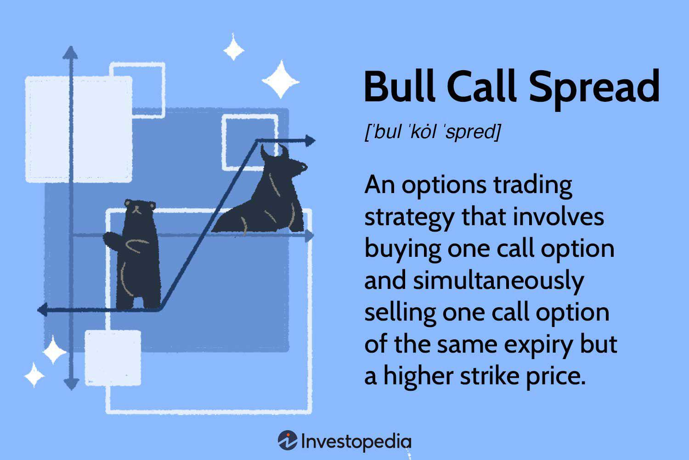

Options trading has become a significant tool for investors, enabling them to diversify their portfolios while providing a hedge against potential market downturns. At its core, options trading involves contracts that confer the right, but not the obligation, to buy or sell an underlying asset at a predetermined price within a specified period. Among the various strategies available, the bull spread stands out for those seeking to benefit from a moderate increase in stock prices. This strategy is particularly appealing as it allows investors to limit potential losses while maintaining upside potential.

Simultaneously, the rise of algorithmic trading has transformed the landscape of financial markets. By allowing for automated, real-time trade execution, algorithmic trading introduces speed and precision, minimizing the influence of human emotion and potential errors in decision-making processes. Algorithms can process vast amounts of data more quickly than humans, enabling traders to execute complex strategies with greater efficiency.



This article aims to examine how options trading, specifically bull spread strategies, can be effectively integrated with algorithmic trading. By combining these elements, traders can enhance their ability to manage risk and pursue profits in dynamic market environments. Understanding the synergy between options strategies and automated trading systems will offer valuable insights to those looking to optimize their trading approaches.

Moreover, for traders aspiring to implement these advanced strategies, it's crucial to grasp not only the technical mechanics of options and algorithmic systems but also to recognize the broader market implications and potential risks. This discussion will cover the foundational aspects of options trading and algorithmic strategies, highlight the benefits of their integration, and provide guidance on overcoming the challenges associated with their implementation. With these insights, traders can effectively harness the advantages of these innovative financial instruments.

## Table of Contents

## Understanding Options Trading

Options trading represents a sophisticated financial mechanism where traders engage in contracts, granting them the right, though not the obligation, to execute a transaction involving an asset at a predetermined price. This form of trading has a storied history, stemming back to ancient civilizations but gaining contemporary prominence in the 20th century. The establishment of the Chicago Board Options Exchange (CBOE) in 1973 marked a pivotal moment, standardizing options contracts and significantly expanding market participation.

The primary appeal of options trading lies in its advantages: leverage, flexibility, and risk management. Leverage permits traders to control substantial asset quantities with minimal upfront capital, magnifying potential returns. This flexibility allows for diverse strategies tailored to various financial objectives and market scenarios. Furthermore, options offer inherent risk management features by acting as insurance against unfavorable price movements, enabling traders to hedge positions in their broader portfolios.

Key terminologies in options trading are crucial for understanding the intricacies involved. A 'call option' grants the right to purchase an asset at a designated strike price, while a 'put option' conveys the right to sell. The 'premium' is the price paid for the option, which represents the cost of securing these rights. The 'strike price' determines the fixed price at which the asset may be bought or sold upon exercising the option. Each option contract also comes with an 'expiration date', the deadline by which the holder must exercise their rights.

Despite its advantages, options trading is often misunderstood. A common misconception is equating options with high-risk speculation. In reality, options are versatile tools that, when used judiciously, can mitigate risk and secure investment returns. It is vital for traders to recognize options as instruments complementary to shares and bonds in crafting well-rounded investment strategies. Understanding the accurate function and potential application of options can dispel myths and better inform traders' decisions. 

Overall, mastering the foundational aspects of options trading is essential for investors seeking to leverage its significant benefits effectively.

## What is a Bull Spread Strategy?

A bull spread strategy is an options trading technique designed to profit from the expected rise in the price of the underlying asset, while also providing a mechanism that limits both the potential risk and reward. This strategy comes in two main forms: the bull call spread and the bull put spread. Each of these strategies takes advantage of the intrinsic characteristics of call and put options to create a scenario where the trader benefits from a bullish market sentiment.

### Bull Call Spread

The bull call spread is a popular choice among traders anticipating a moderate increase in the price of an asset. This strategy involves the simultaneous purchase and sale of call options with different strike prices but the same expiration date. Specifically, the trader buys a call option with a lower strike price and sells another call option with a higher strike price. The dynamics of this setup ensure that the initial premium paid for purchasing the lower strike call is partially offset by the premium received from selling the higher strike call.

Mathematically, the maximum profit of a bull call spread is calculated as follows:

$$
\text{Maximum Profit} = \text{Difference between Strike Prices} - \text{Net Premium Paid}
$$

Whereas the maximum loss is limited to:

$$
\text{Maximum Loss} = \text{Net Premium Paid}
$$

This strategy is typically employed when the trader predicts that the underlying asset's price will rise moderately, allowing them to capitalize on the price movement within a predefined range.

### Bull Put Spread

Conversely, the bull put spread targets a similar market outlook but utilizes put options. In this strategy, the trader buys a put option with a higher strike price and sells another put option with a lower strike price, both with the same expiration date. The goal is to benefit from a rise or stability in the underlying asset's price, leading to the options expiring worthlessly or at a minimal expense for the trader.

The maximum gain for a bull put spread is restricted to the net premium received:

$$
\text{Maximum Profit} = \text{Net Premium Received}
$$

While the maximum potential loss is:

$$
\text{Maximum Loss} = \text{Difference between Strike Prices} - \text{Net Premium Received}
$$

### Benefits and Risks

Bull spread strategies offer distinct benefits, primarily the limited risk and capital required for entry compared to owning the underlying asset outright or other more complex strategies. The risk is capped due to the nature of the options utilized—ensuring any adverse price movement is met with only limited exposure. However, these strategies also inherently limit potential profits. The predefined maximum gain might not appeal to traders seeking unlimited profit scenarios.

Both bull call and bull put spreads serve as versatile tools for traders aiming to harness the profit potential of a rising market with managed risk. Given their inherent characteristics, these strategies are widely used to capitalize on anticipated price movements while retaining tight control over potential losses.

 to Algorithmic Trading

Algorithmic trading refers to the use of computer algorithms to automate trading decisions and execute trades in financial markets. This method distinguishes itself from traditional manual trading by leveraging computational power to analyze market data and execute trades with enhanced speed and precision.

### Historical Context

Algorithmic trading started gaining prominence in the late 20th century, particularly with the advent of electronic trading platforms. Its growth was fueled by technological advancements and the increasing availability of market data. In the early 2000s, [algorithmic trading](/wiki/algorithmic-trading) accounted for a significant portion of global trading activity, transforming financial markets by enhancing [liquidity](/wiki/liquidity-risk-premium), reducing transaction costs, and introducing new market dynamics.

### Advantages

The primary advantage of algorithmic trading lies in its ability to process large volumes of market data rapidly, allowing traders to identify and capitalize on opportunities that would be difficult to detect manually. Algorithms can execute trades within fractions of a second, capturing favorable prices and efficiently managing order flows. Additionally, unlike human traders who are susceptible to emotional biases, algorithmic systems objectively follow pre-defined rules, ensuring consistent execution.

### Types of Algorithmic Strategies

Several algorithmic strategies are prevalent in the market, each with distinct methodologies:

1. **Mean Reversion**: This strategy is predicated on the idea that asset prices tend to revert to their historical average over time. Algorithms identify short-term deviations from this average and exploit these discrepancies by initiating trades that assume a return to the mean.

2. **Statistical Arbitrage**: This involves exploiting price inefficiencies between related financial instruments. Algorithms use statistical models to identify pairs or groups of assets that historically exhibit a stable relationship and trade away from this equilibrium.

3. **Trend-Following**: Based on the identification and exploitation of prevailing market trends, this strategy involves algorithms analyzing price movements to determine the direction of the market momentum and placing trades accordingly.

### Critical Components of an Algorithmic Trading System

The effectiveness of an algorithmic trading system is contingent on several vital components:

- **Trade Execution**: Efficient execution mechanisms are essential for successful algorithmic trading. This involves routing and placing trades in a manner that minimizes market impact while ensuring swift order fulfillment.

- **Risk Management**: Comprehensive risk management protocols are integral to mitigate potential losses. Algorithms are programmed to monitor market conditions and adjust trading parameters to manage risk exposure effectively.

- **Backtesting**: This component involves testing trading strategies on historical market data to evaluate their potential effectiveness before deployment. Backtesting helps in identifying any deficiencies and optimizing the algorithm's performance.

Collectively, these elements form the backbone of an algorithmic trading system, enabling traders to navigate the complexities of modern financial markets with automation and precision.

## Integrating Bull Spread Strategy with Algo Trading

Algorithmic trading can significantly enhance the execution of bull spread strategies by automating the placement and management of trades, providing traders with precise and rapid responses to market conditions. This automated process enables the consistent application of a strategy devoid of emotional bias, which is particularly advantageous when executing time-sensitive options strategies like bull spreads.

### Technical Requirements and Skills

To program and implement a bull spread strategy using algorithms, a robust understanding of both the financial markets and programming is essential. Traders need to be proficient in a programming language such as Python, which is widely used due to its extensive libraries and ease of use for financial applications. Libraries such as Pandas for data manipulation, NumPy for numerical calculations, and specialized trading frameworks like Zipline or PyAlgoTrade can streamline the development process.

Below is a simple example of setting up a bull call spread strategy in Python using a hypothetical options data structure:

```python
import numpy as np

# Assume these are market prices
call_long_price = 2.50
call_short_price = 1.00
stock_price_at_expiration = np.linspace(0, 100, num=100)  # Price range for evaluation
strike_long = 50
strike_short = 60

# Calculate profit for Bull Call Spread
profit = np.where(stock_price_at_expiration > strike_short,
                  (strike_short - strike_long) - (call_long_price - call_short_price),
                  np.where(stock_price_at_expiration > strike_long,
                           stock_price_at_expiration - strike_long - call_long_price,
                           -call_long_price + call_short_price))

import matplotlib.pyplot as plt

plt.plot(stock_price_at_expiration, profit)
plt.axhline(0, color='black', lw=1)
plt.title('Bull Call Spread Profit/Loss')
plt.xlabel('Stock Price at Expiration')
plt.ylabel('Profit/Loss')
plt.grid(True)
plt.show()
```

### Platforms and Tools

Several platforms exist where traders can develop, test, and execute algorithmic trading strategies:

- **MetaTrader 5**: Known for forex trading, it also supports trading in futures and options.
- **Interactive Brokers' API**: Offers a rich set of features for dynamic trading strategies in various asset classes, including options trading.
- **QuantConnect and AlgoTrader**: These provide cloud-based environments where traders can backtest and deploy their strategies, integrating seamlessly with options data.

### Challenges and Solutions

Integrating complex options strategies into an algorithmic trading system poses several challenges:

- **Data Challenges**: Accessing and processing high-quality historical options data for backtesting can be complex. This can be mitigated by partnering with data providers like Bloomberg or using open data sources, where available.

- **Computational Complexity**: Options strategies often require continuous recalibration and computation of Greeks for risk management, which demands substantial processing power. Using cloud-based computing resources can alleviate local resource constraints.

- **Regulatory Compliance**: Automated trading systems must comply with financial regulations. This requires a robust compliance framework to ensure transparent operations and reporting.

### Real-World Scenarios

Several hedge funds and proprietary trading firms have successfully implemented algorithmic strategies for options trading. For instance, high-frequency trading firms utilize algorithms to rapidly adjust options positions based on minute price changes, capturing the spread between the bid and ask prices. In another example, a portfolio manager might use an algorithm to manage a systematic options strategy that continuously adjusts based on pre-set market conditions, such as [volatility](/wiki/volatility-trading-strategies) and price [momentum](/wiki/momentum) indicators.

These examples highlight the potential of algorithms to enhance traditional trading strategies, providing a strategic edge in fast-moving markets. By automating the execution of bull spread strategies, traders can more effectively manage portfolios, optimize performance, and reduce operational risks.

## Risks and Considerations

Options trading, algorithmic trading, and bull spread strategies [carry](/wiki/carry-trading) significant risks that traders must carefully consider. The complexity of these financial strategies means that understanding the interplay of market conditions, volatility, and liquidity is crucial.

**Inherent Risks in Options and Algorithmic Trading**

Options trading involves the potential for substantial losses, especially if the market moves contrary to the positions taken. A primary concern is the volatility of the underlying asset, which can exacerbate price swings and lead to unexpected results. Algorithmic trading, while offering precision and efficiency, amplifies certain risks like technical failures or algorithmic errors, which can result in significant financial harm if not properly monitored.

Bull spreads, both call and put spreads, introduce their own risk profiles by capping potential profits and losses. While they limit maximum loss, they also restrict the maximum gain. This structure means that market timing and correct prediction of movement within a predetermined range are essential for profitability.

**Importance of Market Conditions**

A comprehensive understanding of current market conditions is essential when implementing these strategies. Market liquidity is particularly critical as it affects the ability to enter and [exit](/wiki/exit-strategy) positions at desired prices. In illiquid markets, large spreads between bid and ask prices can erode potential profits and escalate costs.

Volatility is another key [factor](/wiki/factor-investing). High volatility can benefit options by increasing the price of options premiums, which can favorably affect positions if correctly timed. However, excessive or misjudged volatility remains a significant risk.

**Risk Management Techniques**

For algorithmic traders employing bull spreads, effective risk management techniques are indispensable. Hedging strategies, such as using opposite options positions or diversifying across multiple assets, can mitigate potential downsides. 

Stop-loss orders automated within the algorithm can prevent excessive losses by automatically executing a sale when a position moves unfavorably beyond a set threshold. Additionally, ongoing volatility assessments and adjusting algorithm parameters to reflect current market conditions can prevent significant discrepancies between expected and actual outcomes.

**Ethical Considerations and Regulatory Compliance**

Algorithmic trading often involves adherence to strict regulatory frameworks to prevent market manipulation and ensure fair trading practices. Compliance with regulations, such as those implemented by the U.S. Securities and Exchange Commission (SEC) or the Commodities Futures Trading Commission (CFTC), involves rigorous scrutiny of algorithms to ensure ethical trading standards. Transparency and accountability in algorithm design and execution play a pivotal role.

**Resources and Tools for Continuous Learning**

To remain competitive and compliant, traders must continually expand their knowledge of market trends and technological advancements. Participating in industry conferences, enrolling in financial and technical courses, and utilizing webinars from financial institutions are valuable resources.

Additionally, leveraging platforms like TradingView or MetaTrader for [backtesting](/wiki/backtesting) strategies allows traders to refine and test algorithms before deploying them in live markets. Staying informed on regulatory updates via publications from key financial oversight bodies can enhance compliance and ethical strategy development.

By acknowledging and addressing these risks and considerations, traders can better navigate the complex landscape of options trading and algorithmic strategies.

## Conclusion

The integration of options trading, bull spread strategies, and algorithmic trading offers a synergistic approach to market engagement, enhancing both strategic depth and execution efficiency. Options trading itself provides the versatility to exploit various market movements with predefined risk-reward ratios, and the specific use of bull spread strategies allows traders to capitalize on moderate stock price increases with limited risk exposure. By introducing algorithmic trading, these strategies see a marked improvement through automation and precision, minimizing human error and responding to market shifts at unprecedented speeds.

For traders, experimenting with the fusion of these strategies requires a keen understanding of their risk tolerance and investment goals. It's crucial to balance the complexity of algorithmic models with the strategic nuances of options trading, ensuring that execution aligns with their broader trading objectives.

Looking ahead, the financial landscape is poised for continued evolution, driven by technological advancements and regulatory changes. Options trading, complemented by algorithmic techniques, will likely adapt to embrace [artificial intelligence](/wiki/ai-artificial-intelligence), [machine learning](/wiki/machine-learning) capabilities, and larger data sets. This digital transformation promises to provide more sophisticated tools and indicators, enabling traders to develop more predictive and responsive trading models.

To remain competitive, traders must embrace continuous learning and adopt a mindset of adaptability. Staying informed about the latest developments in financial markets, algorithmic trading technologies, and emerging trends in options strategies is essential. Educational resources, online courses, and active participation in trading communities will support this endeavor, equipping traders with the necessary insights and skills.

For further reading and deeper exploration, some recommended resources include "Option Volatility and Pricing" by Sheldon Natenberg for understanding options complexities, "Algorithmic Trading" by Ernest Chan for insights into automating trading strategies, and financial news resources like Bloomberg and Investopedia for the latest market updates. Engaging with these materials will empower aspiring traders to navigate and thrive in the dynamic landscape of options and algorithmic trading.

## References & Further Reading

[1]: Natenberg, S. (1994). ["Option Volatility and Pricing: Advanced Trading Strategies and Techniques."](https://www.amazon.com/Option-Volatility-Pricing-Strategies-Techniques/dp/0071818774) McGraw-Hill Education.

[2]: Chan, E. (2009). ["Algorithmic Trading: Winning Strategies and Their Rationale."](https://github.com/ftvision/quant_trading_echan_book) Wiley Trading.

[3]: Jansen, S. (2020). ["Machine Learning for Algorithmic Trading: Predictive models to extract signals from market and alternative data for systematic trading strategies with Python."](https://github.com/stefan-jansen/machine-learning-for-trading) Packt Publishing.

[4]: Hull, J. C. (2017). ["Options, Futures, and Other Derivatives."](https://www.semanticscholar.org/paper/Options%2C-Futures%2C-and-Other-Derivatives-Hull/89bdee500c8623864fc9eb7a471546aa713acc44) Pearson.

[5]: Lopez de Prado, M. (2018). ["Advances in Financial Machine Learning."](https://books.google.com/books/about/Advances_in_Financial_Machine_Learning.html?id=oU9KDwAAQBAJ) Wiley.

[6]: Black, F., & Scholes, M. (1973). ["The Pricing of Options and Corporate Liabilities."](https://www.cs.princeton.edu/courses/archive/fall09/cos323/papers/black_scholes73.pdf) Journal of Political Economy, 81(3), 637-654.