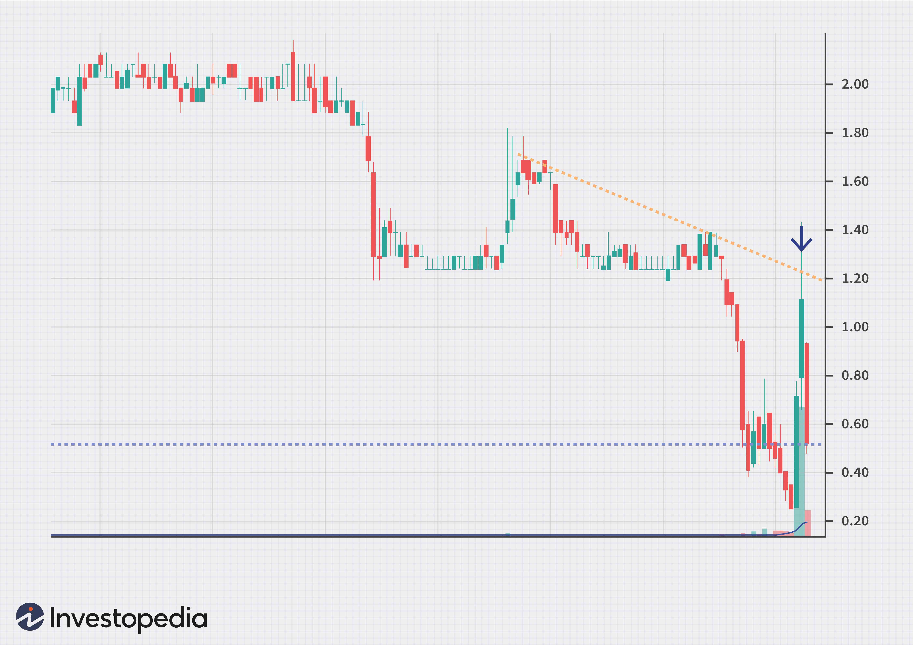

## Table of Contents

## What is a bull trap in the stock market?

A bull trap in the stock market happens when it looks like the price of a stock is going up, but then it suddenly drops down again. This tricks people into thinking it's a good time to buy the stock because they believe the price will keep going up. But, after they buy, the price falls, and they might lose money.

It's called a "bull trap" because a bull market is when prices are going up, and people expect that to continue. But in a bull trap, the price increase is just a trick. It's important for investors to be careful and look at more than just the recent price changes to avoid getting caught in a bull trap.

## How can you identify a bull trap?

To spot a bull trap, you need to watch the price of a stock closely. Sometimes, the price might go up a lot in a short time, making it look like the stock is doing really well. But if this big jump happens without any good news or reason, it might be a bull trap. Also, if the price goes up but not many people are buying the stock, that could be a sign of a bull trap.

Another way to identify a bull trap is by looking at what happens after the price goes up. If the price starts to go down quickly after it went up, that's a clue that it might have been a bull trap. It's also helpful to look at other things like how much the stock is being traded and what's happening in the overall market. If everything else seems normal but the stock price is acting weird, it could be a bull trap.

## What are the common causes of bull traps?

Bull traps often happen because of too much excitement or fear in the market. When people hear good news or see a stock's price going up, they might rush to buy it, thinking the price will keep going up. But sometimes, this excitement is based on rumors or not enough information. When the excitement dies down and people realize there's no real reason for the price to keep going up, they start selling, and the price drops.

Another common cause of bull traps is when big investors or traders try to trick the market. They might buy a lot of a stock to make its price go up, then sell it when other people start buying because of the rising price. This is called "pump and dump." It's a way to make money by creating a fake increase in price, which then traps other investors when the price falls back down.

## Can you explain the psychological impact of falling into a bull trap?

Falling into a bull trap can make people feel really bad. When someone buys a stock because they think it will keep going up, but then it suddenly drops, they can feel tricked and upset. This can make them lose trust in the market and feel like they made a mistake. It's not just about losing money; it's also about feeling embarrassed or foolish for believing the price would keep rising.

The emotional impact can also make people more careful or scared in the future. After getting caught in a bull trap, someone might be less likely to take risks or invest in stocks again. They might always be worried that it will happen again, which can stop them from trying to make money in the stock market. This fear can lead to missed chances and a more cautious way of thinking about investing.

## What are some historical examples of bull traps?

One famous bull trap happened in 2000 with the dot-com bubble. Many internet companies saw their stock prices go way up because people thought the internet was the future. But a lot of these companies didn't have good plans to make money, and their stock prices were too high. When people realized this, they started selling, and the prices crashed. People who bought in at the high prices got caught in a bull trap and lost a lot of money.

Another example is the housing market in 2007. Before the big financial crisis, housing prices were going up a lot, and people thought it would keep going. Many bought houses or invested in housing, expecting to make money. But when the bubble burst, housing prices fell fast, and many people lost their homes and money. This was a big bull trap that affected a lot of people and the whole economy.

## How do bull traps affect market trends and investor behavior?

Bull traps can make the whole stock market go up and down a lot. When a lot of people get tricked by a bull trap, they might all start selling at the same time. This can make the market go down fast. On the other hand, when people see prices going up because of a bull trap, they might buy more, thinking the market is doing well. This can make the market go up for a little while, but it's not real growth. So, bull traps can make the market seem more exciting and risky than it really is.

Bull traps also change how people act when they invest. After getting caught in a bull trap, people might become more careful. They might not want to take big risks anymore because they're scared it will happen again. This can make them miss out on good chances to make money. On the other hand, some people might get too excited about small price increases and jump into the market without thinking, hoping to catch the next big rise. This can lead to more bull traps in the future because people are not looking at the big picture.

## What technical indicators can help in detecting a potential bull trap?

One helpful tool for spotting a bull trap is the [volume](/wiki/volume-trading-strategy) indicator. When a stock's price goes up a lot but the trading volume is low, it might mean that not many people are really buying the stock. This can be a sign of a bull trap because a real price increase usually comes with a lot of people buying. So, if the price is going up but the volume isn't, it's good to be careful.

Another useful indicator is the Relative Strength Index (RSI). The RSI helps show if a stock is being bought too much or sold too much. If the RSI goes over 70, it might mean the stock is overbought and could be due for a price drop. If you see the price going up and the RSI is over 70, it could be a sign of a bull trap. Watching the RSI can help you see if the price increase might not last.

Lastly, chart patterns can also give clues about bull traps. A common pattern to watch for is a false [breakout](/wiki/breakout-trading). This happens when a stock's price breaks above a resistance level but then quickly falls back down. If you see this happen, it might be a bull trap. Looking at these patterns can help you decide if the price increase is real or just a trick.

## What strategies can traders use to avoid falling into a bull trap?

To avoid falling into a bull trap, traders should always do their homework before buying a stock. They need to look at more than just the price going up. They should check the news to see if there's a good reason for the price increase. If there's no news or the news doesn't match the big price jump, it could be a bull trap. Traders should also watch the trading volume. If the price is going up but not many people are buying, it might be a trick. Using tools like the Relative Strength Index (RSI) can help too. If the RSI shows the stock is overbought, it might be a sign to wait before buying.

Another good strategy is to use stop-loss orders. A stop-loss order helps limit how much money a trader can lose. If the stock price starts to drop after going up, the stop-loss order can automatically sell the stock to stop the losses from getting too big. Traders should also pay attention to chart patterns. A false breakout, where the price goes above a certain level but then falls back down, can be a warning sign of a bull trap. By being patient and waiting for more signs that the price increase is real, traders can avoid getting caught in a bull trap.

## How does a bull trap differ from a bear trap?

A bull trap and a bear trap are both tricks in the stock market, but they happen in opposite ways. A bull trap happens when the price of a stock goes up and makes people think it will keep going up, but then it suddenly drops. People buy the stock because they think it's a good time, but they end up losing money when the price falls. This is called a bull trap because it tricks people during what looks like a bull market, where prices are going up.

On the other hand, a bear trap happens when the price of a stock goes down and makes people think it will keep going down, but then it suddenly goes back up. People sell the stock or short sell it because they think the price will keep dropping, but they end up losing money when the price goes up again. This is called a bear trap because it tricks people during what looks like a bear market, where prices are going down. Both traps can make people lose money and feel tricked, but they work in opposite directions.

## What role do market manipulators play in creating bull traps?

Market manipulators can make bull traps happen by playing tricks with stock prices. They might buy a lot of a stock to make its price go up fast. This makes other people think the stock is doing well and they start buying it too. But the manipulators were just trying to trick everyone. Once the price is high enough, they sell their stock and make money, while the people who bought because of the price increase are left holding the stock when the price drops.

This kind of trick can make the whole market feel unsure and shaky. When people see these sudden price changes, they might get scared and start selling their stocks too, making the market go down even more. It's hard to trust the market when these tricks happen, and it can make people more careful about buying stocks in the future.

## How can advanced traders use bull traps to their advantage?

Advanced traders can use bull traps to make money by understanding how they work. They watch the market closely and look for signs that a bull trap might be happening. For example, if they see a stock's price go up a lot but the trading volume is low, they might guess it's a bull trap. Instead of buying the stock when the price is high, they might wait for the price to drop after the trap. Then, they can buy the stock at a lower price and sell it later when the price goes back up.

These traders can also use short selling to take advantage of bull traps. Short selling is when you borrow a stock and sell it, hoping to buy it back later at a lower price. If an advanced trader thinks a bull trap is about to happen, they might short sell the stock when the price is high. When the price drops because of the bull trap, they can buy the stock back at the lower price and make money from the difference. This way, they turn the bull trap into a chance to make money instead of losing it.

## What are the long-term implications of frequent bull traps on market integrity?

Frequent bull traps can hurt how much people trust the stock market. When people see prices go up and down a lot because of bull traps, they might think the market is not fair. They might feel tricked and start to believe that the market is full of traps and tricks. This can make fewer people want to invest their money in stocks. If a lot of people stop trusting the market, it can make the whole market less stable and harder for companies to get money they need to grow.

Over time, if bull traps happen a lot, it can also make the rules about the market stricter. The people who watch over the market might make new rules to stop these tricks from happening so much. This can make the market safer but might also make it harder for everyone to buy and sell stocks. In the end, a market with a lot of bull traps can be less healthy and less good at helping the economy grow.

## References & Further Reading

[1]: Bergstra, J., Bardenet, R., Bengio, Y., & Kégl, B. (2011). ["Algorithms for Hyper-Parameter Optimization."](https://proceedings.neurips.cc/paper/2011/file/86e8f7ab32cfd12577bc2619bc635690-Paper.pdf) Advances in Neural Information Processing Systems 24.

[2]: ["Advances in Financial Machine Learning"](https://www.amazon.com/Advances-Financial-Machine-Learning-Marcos/dp/1119482089) by Marcos Lopez de Prado

[3]: ["Evidence-Based Technical Analysis: Applying the Scientific Method and Statistical Inference to Trading Signals"](https://www.amazon.com/Evidence-Based-Technical-Analysis-Scientific-Statistical/dp/0470008741) by David Aronson

[4]: ["Machine Learning for Algorithmic Trading"](https://github.com/stefan-jansen/machine-learning-for-trading) by Stefan Jansen

[5]: ["Quantitative Trading: How to Build Your Own Algorithmic Trading Business"](https://www.amazon.com/Quantitative-Trading-Build-Algorithmic-Business/dp/1119800064) by Ernest P. Chan