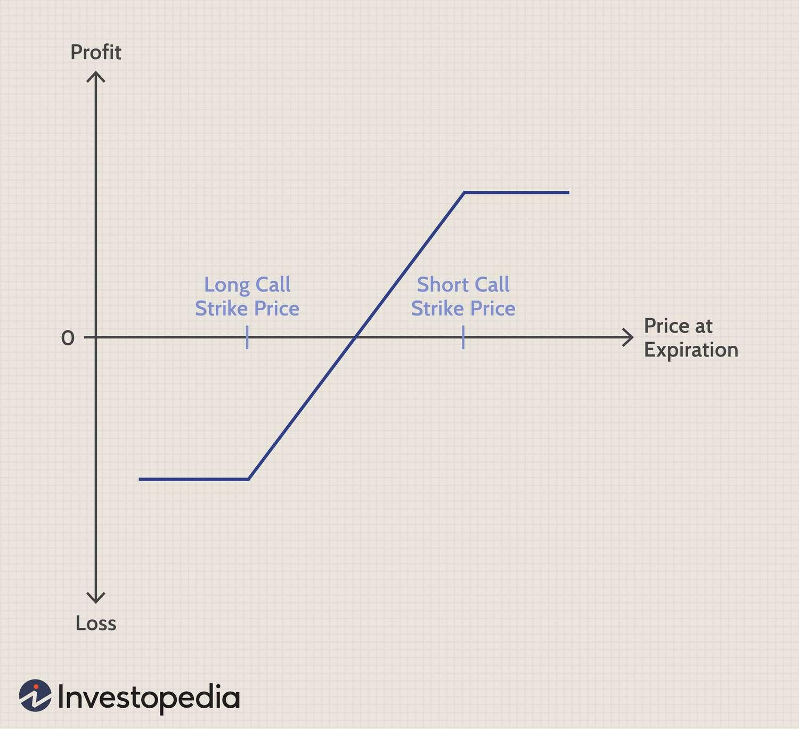

## Table of Contents

## What is a bull vertical spread?

A bull vertical spread is a type of options trading strategy used when you think the price of a stock will go up a little bit. It involves buying and selling two options of the same kind (either calls or puts) on the same stock with the same expiration date, but with different strike prices. The option you buy will have a lower strike price than the option you sell. This setup lets you make money if the stock price goes up, but your profit is limited because you also sold an option.

This strategy is called "bull" because it's used when you're optimistic about the stock's future. It's called "vertical" because the options you buy and sell have different strike prices, which are shown vertically on an options chain. The main advantage of a bull vertical spread is that it costs less than just buying a call option, making it a cheaper way to bet on a stock going up. However, your potential profit is also smaller because of the option you sell.

## What are the key components of a bull vertical spread?

A bull vertical spread involves two key parts: buying and selling options. You buy one option and sell another option on the same stock. Both options must have the same expiration date, but they have different strike prices. The option you buy has a lower strike price than the option you sell. Both options can be either calls or puts, but most people use calls for a bull vertical spread.

The main idea is to make money if the stock price goes up a bit. When you buy the option with the lower strike price, you're betting the stock will go above that price. By selling the option with the higher strike price, you're limiting how much you can make but also reducing how much you have to pay to set up the spread. This strategy is cheaper than just buying a call option, but your potential profit is also smaller because of the option you sell.

## How does a bull vertical spread work?

A bull vertical spread is a way to make money if you think a stock's price will go up a little bit. To do this, you buy one option and sell another option on the same stock. Both options have the same expiration date, but they have different strike prices. The option you buy has a lower strike price than the option you sell. Most people use call options for this, but you can also use put options.

Here's how it works: When you buy the option with the lower strike price, you're hoping the stock will go above that price. If it does, that option becomes more valuable. But you also sell an option with a higher strike price. This limits how much you can make because if the stock goes way above the higher strike price, the option you sold will start to lose you money. The good thing is, this strategy is cheaper than just buying a call option, but your potential profit is also smaller because of the option you sold.

## What are the benefits of using a bull vertical spread?

Using a bull vertical spread can help you save money. When you want to bet on a stock going up, you could just buy a call option. But that can be expensive. With a bull vertical spread, you buy one option and sell another. This makes it cheaper because the money you get from selling the option helps pay for the one you buy. So, you spend less money to start, which means less risk if the stock doesn't go up like you thought.

Another benefit is that you know exactly how much you can make and lose. Because you're buying and selling options at different prices, your profit and loss are set within a certain range. If the stock goes up just a little bit, you can make money. But even if it goes up a lot, you won't make more than a certain amount because of the option you sold. This can be good if you want to limit your risk and know exactly what you're getting into.

## What are the risks associated with a bull vertical spread?

Using a bull vertical spread means you could lose money if the stock doesn't go up like you thought. Even though it's cheaper to set up than just buying a call option, you still pay some money upfront. If the stock stays the same or goes down, both options you bought and sold might not be worth anything at the end, and you lose what you paid to start the spread.

Another risk is that your profit is limited. Because you sold an option with a higher strike price, there's a cap on how much money you can make, even if the stock goes way up. If the stock goes above the higher strike price, the option you sold starts to lose you money, which eats into your profit from the option you bought. So, you might miss out on bigger gains if the stock does really well.

## How do you set up a bull vertical spread?

To set up a bull vertical spread, you need to buy and sell two options on the same stock. Both options should have the same expiration date, but they will have different strike prices. You buy the option with the lower strike price and sell the option with the higher strike price. Most people use call options for this, but you can also use put options. For example, if you think XYZ stock, currently at $50, will go up a bit, you could buy a call option with a strike price of $50 and sell a call option with a strike price of $55.

Once you've chosen your options, you need to place the trades. You'll buy the lower strike price option and sell the higher strike price option at the same time. This can be done through your brokerage account, usually by selecting the "vertical spread" option when setting up your trade. The money you get from selling the higher strike price option helps pay for the lower strike price option you buy, making the overall cost lower than just buying a call option. If the stock price goes up but stays below the higher strike price by expiration, you can make a profit. But if it goes above the higher strike price, your profit is limited due to the option you sold.

## What is the difference between a bull call spread and a bull put spread?

A bull call spread and a bull put spread are both types of options strategies used when you think a stock's price will go up a little bit. The main difference is the type of options you use. In a bull call spread, you use call options. You buy a call option with a lower strike price and sell a call option with a higher strike price. In a bull put spread, you use put options. You sell a put option with a higher strike price and buy a put option with a lower strike price.

Both strategies aim to make money if the stock price goes up, but they work differently. With a bull call spread, you make money if the stock price goes above the lower strike price but not too far above the higher strike price. Your profit is limited because of the call option you sold. With a bull put spread, you make money if the stock price stays above the higher strike price you sold. If it goes below the lower strike price, you start to lose money. Both strategies limit your risk and potential profit, but they use different options to achieve similar goals.

## How do market conditions affect the performance of a bull vertical spread?

Market conditions can really change how well a bull vertical spread does. If the stock market is going up and the stock you picked is doing well, your bull vertical spread can make you money. This is because you bought an option with a lower price and sold one with a higher price, betting the stock would go up a bit. If it goes up just right, you can make a profit. But if the market is going down or the stock isn't moving, your spread might not make any money. You could lose what you paid to set it up because both options might not be worth anything at the end.

Another thing to think about is how much the stock moves. If the stock goes up a lot, your bull vertical spread won't make you as much money as it could because of the option you sold. That option limits how much you can make. If the stock stays the same or goes down, you might lose money. So, it's important to pick the right stock and the right strike prices for your spread based on what you think the market will do. If you guess wrong about the market, your bull vertical spread might not work out the way you hoped.

## What are the best practices for managing a bull vertical spread?

When managing a bull vertical spread, it's important to keep an eye on the stock's price and how much time is left until the options expire. If the stock is moving in the direction you hoped, you might want to hold onto your spread until it's close to expiration to see if you can make more money. But if the stock isn't moving up like you thought, you might want to close the spread early to cut your losses. It's all about watching the market and being ready to make a move if things aren't going your way.

Another good practice is to set clear goals for your spread. Decide how much profit you want to make and how much loss you're willing to take before you even start. This can help you know when to close the spread, whether you're making money or losing it. Also, think about adjusting your spread if the market changes a lot. You might be able to roll your options to different strike prices or expiration dates to give your spread a better chance of making money. Keeping these things in mind can help you manage your bull vertical spread better.

## How can you calculate the maximum profit and loss of a bull vertical spread?

To calculate the maximum profit of a bull vertical spread, you need to look at the difference between the strike prices of the two options you bought and sold. Let's say you bought a call option with a strike price of $50 and sold a call option with a strike price of $55. The difference between these strike prices is $5. This $5 is the most you can make per share if the stock goes above $55 by the time the options expire. But you have to subtract what you paid to set up the spread. If you paid $2 per share to start, your maximum profit would be $5 - $2 = $3 per share.

To figure out the maximum loss, it's easier because it's just what you paid to set up the spread. Using the same example, if you paid $2 per share to buy the $50 call and sell the $55 call, the most you can lose is $2 per share. This happens if the stock stays below $50 by the time the options expire, making both options worthless. So, knowing these numbers helps you understand what you could win or lose with a bull vertical spread.

## What advanced strategies can be used to enhance a bull vertical spread?

One way to make a bull vertical spread better is by rolling the options. If the stock isn't moving up as fast as you thought, you can close your current spread and open a new one with a later expiration date. This gives the stock more time to go up. You might also change the strike prices to fit the new market conditions. Rolling can help you keep your bet on the stock going up without starting over from scratch.

Another advanced strategy is to use a bull vertical spread as part of a bigger plan. You could combine it with other options strategies, like buying a call option on the same stock to give you more room to make money if the stock goes up a lot. Or you could use a bull vertical spread on different stocks to spread out your risk. By mixing and matching different strategies, you can make your bull vertical spread work better for you and fit your overall goals in the market.

## How do tax implications affect the returns from a bull vertical spread?

When you make money from a bull vertical spread, you have to think about taxes. The money you make is usually seen as short-term capital gains because options usually don't last long. This means you'll pay taxes on your profit at your regular income tax rate, which can be pretty high. So, the more money you make from your spread, the more you'll have to pay in taxes, which can cut into your overall profit.

If you lose money on your bull vertical spread, you can use those losses to help with your taxes. You can use the losses to lower the taxes you owe on other money you made that year. This is called tax loss harvesting. But you have to be careful because there are rules about how much you can use and when. So, taxes can really change how much money you end up keeping from your bull vertical spread, and it's good to think about them when you're planning your strategy.

## How do you calculate profits and losses?

For bull call spreads, the calculation of profits and losses is straightforward. The maximum profit is realized if the underlying asset's price is at or above the higher strike price at expiration. The formula to calculate the maximum profit for a bull call spread is as follows:

$$
\text{Maximum Profit} = (K_2 - K_1) - \text{Net Premium Paid}
$$

where $K_1$ is the lower strike price and $K_2$ is the higher strike price.

The maximum loss for a bull call spread is limited to the net premium paid for initiating the spread:

$$
\text{Maximum Loss} = \text{Net Premium Paid}
$$

This net premium represents the cost of buying the lower strike price option minus the premium received from selling the higher strike price option.

For bull put spreads, the maximum profit is equal to the net premium received when the position is set up. This happens if the underlying asset’s price is at or above the higher strike price, rendering both options worthless at expiration:

$$
\text{Maximum Profit} = \text{Net Premium Received}
$$

The risk in a bull put spread is limited to the difference between the strike prices minus the net premium. This potential loss is calculated as:

$$
\text{Maximum Loss} = (K_1 - K_2) - \text{Net Premium Received}
$$

where $K_1$ is the higher strike price and $K_2$ is the lower strike price. Understanding these calculations is crucial for managing potential gains and losses effectively within options trading strategies.

## What is an Example of a Bull Vertical Spread?

Consider an investor who anticipates a modest increase in the stock price of Company ABC, currently trading at $50 per share. To capitalize on this expectation, the investor implements a bull call spread, an options strategy designed to benefit from a moderate upward movement in the stock price.

In this strategy, the investor purchases a call option with a lower strike price and simultaneously sells another call option with a higher strike price, both with the same expiration date. Specifically, the investor buys a call option with a $45 strike price and sells a call option with a $55 strike price. This configuration creates a vertical spread that involves two strike prices but a single expiration.

The maximum profit from this bull call spread is achieved if the stock price at expiration is equal to or above the higher strike price of $55. The profit can be calculated as:

$$
\text{Maximum Profit} = (K_2 - K_1) - \text{Net Premium Paid}
$$

where $K_1$ is the lower strike price ($45), $K_2$ is the higher strike price ($55), and the net premium paid is the difference between the cost of the purchased call option and the revenue from the sold call option. The profit is capped because any stock price above $55 at expiration does not increase the payoff.

However, if the stock price does not rise above $45, the options expire worthless, and the investor's loss equals the net premium paid for the options. Thus, the maximum loss is limited to the initial cost, providing a degree of risk management compared to outright purchasing a single call option:

$$
\text{Maximum Loss} = \text{Net Premium Paid}
$$

This example of a bull call spread illustrates its effectiveness as a risk-managed way to leverage a predicted moderate increase in the stock price of Company ABC. The strategy's defined profit and loss limits make it favorable for investors seeking controlled exposure to potential upward market movements.

## References & Further Reading

[1]: Pasternack, B. (2020). ["Options Trading: The Hidden Reality - Risk Doctor Guide to Position Adjustment and Hedging, 2nd Edition"](https://www.amazon.com/Options-Trading-Adjustment-Perception-Deception/dp/0977869172)

[2]: Natenberg, S. (1994). ["Option Volatility and Pricing: Advanced Trading Strategies and Techniques, 2nd Edition"](https://www.amazon.com/Option-Volatility-Pricing-Strategies-Techniques/dp/0071818774)

[3]: Hull, J. C. (2018). ["Options, Futures, and Other Derivatives, 10th Edition"](https://www.semanticscholar.org/paper/Options%2C-Futures%2C-and-Other-Derivatives-Hull/89bdee500c8623864fc9eb7a471546aa713acc44) by John C. Hull

[4]: "The CBOE Options Institute's website" ([CBOE](https://en.wikipedia.org/wiki/Cboe_Global_Markets)) offers a wealth of educational material about different options trading strategies, including bull spreads.

[5]: Smith, M. (2022). ["The Complete Guide to Options Trading: How to Generate Profits under any Market Condition"](https://www.amazon.com/OPTIONS-TRADING-BIBLE-Beginners-Strategies/dp/B0CRPX3VJW)

[6]: Sinclair, E. J. (2013). ["Volatility Trading, 2nd Edition"](https://onlinelibrary.wiley.com/doi/book/10.1002/9781118662724)