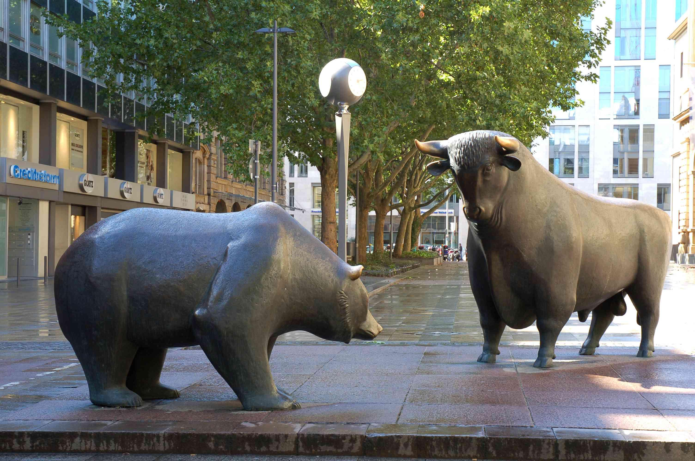

## Table of Contents

## What is a bull in trading?

In trading, a bull is someone who believes that the prices of stocks, commodities, or other financial assets will go up. They are optimistic about the market and often buy assets with the expectation that they can sell them later at a higher price. This positive outlook is called a "bullish" market sentiment.

When there are many bulls in the market, it can lead to a bull market, where prices keep rising over a long period. Bulls might use different strategies, like buying stocks they think will grow or using financial tools to bet on rising prices. Their actions can drive the market upward as more people start buying and pushing prices higher.

## How does a bull market differ from a bear market?

A bull market is when the prices of things like stocks go up over time. People feel good about the market and think prices will keep going up. They buy more stocks, which makes prices rise even more. It's a time when everyone is hopeful and wants to invest because they think they can make money as prices go up.

A bear market is the opposite. It's when prices are going down and people are worried. They think prices will keep falling, so they might sell their stocks to avoid losing more money. This selling makes prices drop even more. During a bear market, people are less likely to invest because they're scared of losing money as prices go down.

The main difference is the direction of prices and how people feel about the market. In a bull market, prices go up and people are happy and hopeful. In a bear market, prices go down and people are worried and cautious.

## What are the common characteristics of a bull market?

A bull market happens when the prices of stocks and other things keep going up for a long time. People feel good about the economy and think it will keep getting better. They buy more stocks because they believe the prices will keep rising, which makes the prices go up even more. Companies also do well during this time, making more money and growing bigger. This good feeling spreads, and more people want to invest because they see others making money.

During a bull market, you'll see a lot of buying and not much selling. The stock market keeps setting new high records as prices climb. People are happy and confident, and they're more willing to take risks because they think they can make a lot of money. News about the economy is usually good, and this makes everyone feel even more positive about the future.

## What causes a bull market to start?

A bull market starts when people start feeling good about the economy. This can happen because of things like lower unemployment, good news about companies, or when the government does something to help the economy grow. When people see these signs, they start to believe that things will keep getting better. This makes them want to buy stocks and other investments because they think the prices will go up.

As more people buy, the demand for stocks goes up, which pushes the prices higher. This creates a cycle where rising prices make people even more confident, and they keep buying. Companies also do better during this time because they make more money and grow. This good news spreads, making everyone feel even more positive and willing to invest. That's how a bull market gets going and keeps going strong.

## How can investors identify the beginning of a bull market?

Investors can spot the start of a bull market by watching for a few key signs. One big sign is when the stock market starts going up after being down for a while. This means that more people are buying stocks than selling them, which pushes prices up. Another thing to look for is good news about the economy, like lower unemployment or companies making more money. When people see this, they start to feel more confident and want to invest, which can help start a bull market.

Another way to tell is by paying attention to how people feel about the market. If people start talking more positively about stocks and the economy, it's a good sign that a bull market might be starting. Also, when companies start doing better and growing, it can make investors feel more hopeful. All these things together can help investors see that a bull market is beginning, and it's a good time to think about buying stocks.

## What are some strategies for investing during a bull market?

During a bull market, one good strategy is to buy and hold stocks. This means you pick stocks of strong companies that you believe will keep growing. You buy these stocks and keep them for a long time, even if the prices go up and down a bit. This works well in a bull market because the overall trend is for prices to go up, so your stocks will likely be worth more in the future.

Another strategy is to diversify your investments. This means you don't put all your money into one stock or one type of investment. Instead, you spread it out across different stocks, industries, and maybe even other things like bonds or real estate. This helps you take advantage of the bull market while also reducing the risk if one of your investments doesn't do as well as you hoped.

You can also consider using a growth investing approach. This means you focus on buying stocks of companies that are growing fast and have the potential to keep growing. These companies might not pay dividends, but their stock prices can go up a lot in a bull market. By [picking](/wiki/asset-class-picking) the right [growth stocks](/wiki/growth-stocks), you can make a lot of money as the market keeps going up.

## What are the risks associated with investing in a bull market?

Even though a bull market can be a great time to make money, there are still risks to think about. One big risk is that prices can go down suddenly. Just because the market is going up now doesn't mean it will keep going up forever. If something bad happens, like a big company going bankrupt or a problem in the economy, the market can drop fast. This can make your investments lose value quickly, and you might lose money if you need to sell at the wrong time.

Another risk is that people can get too excited during a bull market. When everyone is feeling good and prices are going up, some investors might start taking bigger risks than they should. They might buy stocks without doing enough research or put too much money into one stock, hoping to make a quick profit. If the market turns around, these risky investments can lead to big losses. It's important to stay careful and not let the excitement of a bull market make you forget about the risks.

## How do bull markets typically end?

Bull markets usually end when something changes in the economy or something unexpected happens. It could be that interest rates go up, making it harder for people and companies to borrow money. Or maybe a big company has a problem, which makes people worried about the whole market. When these things happen, people start to think that prices might not keep going up. They start selling their stocks to avoid losing money, and this selling can make prices go down.

As more people sell, the market can start to fall faster. This can turn into a bear market, where prices keep going down for a while. The good feelings from the bull market turn into worry and fear. People become more careful about investing, and they might even stop buying stocks altogether. This change in how people feel and act can mark the end of a bull market and the start of a new, different time in the market.

## What indicators should investors watch to predict the end of a bull market?

Investors should keep an eye on a few things to guess when a bull market might end. One big thing to watch is the economy. If unemployment starts going up, or if companies start making less money, it might mean the bull market is about to end. Another thing to look at is interest rates. If the government raises interest rates, it can make borrowing money harder for people and businesses, which can slow down the economy and the stock market.

Another sign to watch is how people feel about the market. If people start feeling less confident and start selling their stocks, it can be a sign that the bull market is ending. You can also look at stock market indicators, like if the market starts making lower highs and lower lows. This means the market isn't going up as much as before and could be a sign that a bear market is coming. By paying attention to these things, investors can get a sense of when a bull market might be ending and start planning their next moves.

## How can investors protect their gains as a bull market matures?

As a bull market gets older, one way investors can protect their gains is by taking some profits. This means selling some of their stocks that have gone up a lot and keeping the money. By doing this, they can make sure they don't lose all their gains if the market goes down. It's also a good idea to keep some money in safer investments, like bonds or savings accounts, so they have money to use if the stock market falls.

Another way to protect gains is by diversifying their investments. This means not putting all their money into one stock or one type of investment. Instead, they spread their money across different stocks, industries, and maybe even other things like real estate or bonds. This way, if one investment goes down, they won't lose everything because their other investments might still be doing well. Diversifying can help keep their gains safe as the bull market matures and gets closer to ending.

## What historical examples illustrate successful bull market investing?

One great example of successful bull market investing happened in the 1990s during the dot-com boom. People were excited about new internet companies, and the stock market went up a lot. Investors who bought stocks in companies like Amazon and Microsoft early on made a lot of money. Even though the market crashed in 2000, those who sold their stocks at the right time kept their big gains. This shows how important it is to know when to sell during a bull market.

Another example is the bull market that started after the 2008 financial crisis and lasted until early 2020. People who bought stocks when the market was low in 2009 saw their investments grow a lot over the next ten years. Companies like Apple and Netflix did really well during this time. Investors who stayed calm and kept their stocks even when the market went up and down a bit made a lot of money. This shows how holding onto good stocks during a long bull market can lead to big gains.

## How do global economic factors influence bull markets?

Global economic factors can have a big impact on bull markets. When countries around the world are doing well, it can make people feel more confident about investing. For example, if other countries are growing their economies and buying more stuff, it can help companies in the U.S. make more money. This good news can make stock prices go up and start or keep a bull market going. On the other hand, if there are problems in other countries, like a financial crisis or a war, it can scare people and make them sell their stocks. This can cause the bull market to end or slow down.

Another way global economic factors affect bull markets is through things like interest rates and currency values. If other countries raise their interest rates, it can make people move their money to those countries to get better returns. This can take money away from the U.S. stock market and make it harder for a bull market to keep going. Also, if the value of the U.S. dollar goes up compared to other currencies, it can make U.S. products more expensive for other countries to buy. This can hurt U.S. companies and slow down the bull market. So, what happens in the global economy can really change how long and how strong a bull market lasts.

## References & Further Reading

[1]: Bergstra, J., Bardenet, R., Bengio, Y., & Kégl, B. (2011). ["Algorithms for Hyper-Parameter Optimization."](https://dl.acm.org/doi/10.5555/2986459.2986743) Advances in Neural Information Processing Systems 24.

[2]: ["Advances in Financial Machine Learning"](https://www.amazon.com/Advances-Financial-Machine-Learning-Marcos/dp/1119482089) by Marcos Lopez de Prado

[3]: ["Evidence-Based Technical Analysis: Applying the Scientific Method and Statistical Inference to Trading Signals"](https://www.amazon.com/Evidence-Based-Technical-Analysis-Scientific-Statistical/dp/0470008741) by David Aronson

[4]: ["Machine Learning for Algorithmic Trading"](https://github.com/stefan-jansen/machine-learning-for-trading) by Stefan Jansen

[5]: ["Quantitative Trading: How to Build Your Own Algorithmic Trading Business"](https://www.amazon.com/Quantitative-Trading-Build-Algorithmic-Business/dp/1119800064) by Ernest P. Chan