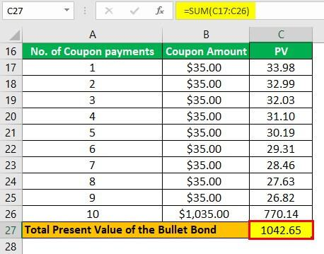

Bond investments play a crucial role in diversifying portfolios and ensuring steady income for investors. These financial instruments are essential for both individual and institutional portfolios as they offer varying levels of risk and return to suit different investment strategies. Bonds essentially represent a loan made by an investor to a borrower, typically corporate or governmental entities, with a predetermined interest rate and maturity date.

Understanding the different types of bonds, such as amortized and bullet bonds, is essential for making informed investment choices. Amortized bonds involve regular payments that contribute toward both the principal and interest over the bond's life, allowing investors to mitigate risk by receiving steady cash flows. Bullet bonds, on the other hand, provide periodic interest payments with the return of principal occurring in a lump sum at maturity. These differences in structure lead to varied benefits and risk profiles for investors.



This article will focus on comparing amortizing bonds and bullet bonds, exploring the nuances of each type and their respective roles in portfolio management. Additionally, it will address the growing influence of algorithmic trading strategies in the bond markets. These strategies leverage data and advanced algorithms to optimize bond investments, manage portfolios more effectively, and take advantage of market opportunities. By examining these elements, the article aims to equip investors with the knowledge needed to make informed decisions regarding their bond investments.

## Table of Contents

## What is an Amortized Bond?

Amortized bonds are a type of debt instrument where the borrower makes periodic payments that consist of both interest and principal amounts. This structure contrasts with bonds that repay the principal in a lump sum at maturity, such as bullet bonds. The primary characteristic of amortized bonds is their structured repayment schedule, which reduces the outstanding principal with each payment over the bond's term. 

### Repayment Schedule

The regular repayments in amortized bonds are designed to return capital to the investor progressively. By consistently reducing the principal owed, the borrower decreases the overall risk to the investor, since each payment diminishes the remaining debt obligation. This structure can be particularly appealing for conservative investors who prioritize the return of capital and stable income streams.

### Predictable Cash Flows

For investors, the advantage of amortized bonds lies in the predictability of cash flows. Each payment is typically fixed, leading to a consistent cash flow pattern. This predictability enables investors to plan their cash management strategies with greater certainty. In terms of financial planning, the expected return on an amortized bond can often be calculated in advance, using the formula for calculating the value of an amortizing loan:

$$

PMT = \frac{P \times r \times (1 + r)^n}{(1 + r)^n - 1} 
$$

where:
- $PMT$ is the periodic payment amount,
- $P$ is the initial loan principal,
- $r$ is the periodic interest rate, and
- $n$ is the total number of payments.

### Suitability for Investors

Amortized bonds are well-suited for investors seeking a steady flow of income with minimal risk of principal loss. In uncertain economic conditions, the regular return of principal can serve as a protective financial strategy. The stability offered by amortizing bonds contrasts with more volatile investments, appealing to risk-averse individuals and institutions.

The built-in feature of decreasing risk exposure over time makes amortized bonds a strategic choice in diversified portfolios, providing balance alongside higher-risk investments. This characteristic not only aids in financial stability but also allows for more precise future cash flow projections, which are essential for sound financial planning.

## Understanding Bullet Bonds

Bullet bonds are a type of fixed-income security distinguished by their principal repayment structure. These bonds pay interest to bondholders at regular intervals but differ from other types of bonds by returning the entire principal amount in one lump-sum payment at the bond's maturity date. This unique feature contrasts with amortized bonds, where principal is gradually repaid over the bond’s lifespan.

Issuers often favor bullet bonds as they allow for deferred repayment of the principal, which can be particularly advantageous for managing large capital outflows. By avoiding periodic principal payments, issuers can utilize the retained capital for other investment opportunities or operational needs until maturity. This characteristic makes bullet bonds particularly attractive for corporate issuers who prefer to retain cash flow flexibility during the bond's life.

From an investor's perspective, bullet bonds might be appealing because they often offer higher yields compared to bonds with more frequent principal repayments, such as amortizing bonds. The potential for higher yields arises from the inherent risk associated with the deferred principal repayment. Investors are compensated for this risk, especially in situations where the bond issuer's creditworthiness or future market conditions are uncertain at the time of the bond's issuance.

Overall, while bullet bonds present an attractive opportunity for both issuers and investors, they come with specific risks, such as reinvestment risk, as investors receive the principal amount at maturity and face the challenge of reinvesting the lump sum in potentially less favorable market conditions. Therefore, understanding the yield dynamics and [interest rate](/wiki/interest-rate-trading-strategies) environments is crucial when considering investment in bullet bonds.

## Amortized Bonds vs. Bullet Bonds: Key Differences

Amortized bonds and bullet bonds are primarily distinguished by their principal repayment schedules. With amortized bonds, the principal is repaid gradually over the term of the bond. This means that with each scheduled payment, a portion goes towards reducing the principal, while the remainder pays the accrued interest. This structure provides a steady return of capital to the investor throughout the life of the bond, thereby reducing default risk incrementally.

To illustrate, if an investor holds an amortized bond worth $10,000 at an interest rate of 5% over five years, the periodic payments would include both principal and interest components. The formula for calculating the periodic payment (A) is derived from the standard amortization formula:

$$
A = \frac{P \cdot r \cdot (1 + r)^n}{(1 + r)^n - 1}
$$

Where:
- $P$ is the principal amount ($10,000),
- $r$ is the periodic interest rate (0.05/1),
- $n$ is the total number of payments (5).

In contrast, bullet bonds require the repayment of the entire principal amount at maturity. These bonds pay interest throughout their term but do not amortize, meaning the principal remains unchanged until the end of the term. This backend-loaded structure can present benefits such as higher potential yields, as the issuer can utilize the capital until maturity, but it also introduces elevated risks. The significant principal repayment at maturity heightens default risk, and investors may face reinvestment risk, particularly if interest rates decline over the bond's term.

From an investment perspective, bullet bonds may present higher risk and return potential than their amortized counterparts. The non-amortizing nature contributes to higher [volatility](/wiki/volatility-trading-strategies) and sensitivity to interest rate fluctuations. As a result, investors in bullet bonds must weigh the potential for increased yields against the possibility of greater financial exposure at maturity. This difference in risk and return profiles makes the choice between amortized and bullet bonds a strategic decision, influenced by factors such as interest rate forecasts, [liquidity](/wiki/liquidity-risk-premium) considerations, and individual risk tolerance.

## Pros and Cons of Amortized Bonds

Amortized bonds provide investors with predictable cash flows and a lower risk investment option due to their structured repayment schedule. These bonds involve systematic repayment of both interest and principal over the life of the bond, which minimizes the chance of capital loss for investors. This is particularly beneficial for those seeking reliable income streams, as they receive regular payments throughout the bond's term. This consistent cash flow pattern aids in financial planning, offering a stable source of income which is crucial for retirees or others dependent on fixed income investments.

However, the structured nature of amortized bonds may lead to potential drawbacks, notably the possibility of lower overall yields compared to bullet bonds. Since investors receive principal back throughout the life of the bond, there is less principal remaining to accrue interest over time. This results in potentially lower total returns, especially in environments where interest rates rise substantially after the bond's issuance. Investors might find that the returns from amortized bonds do not keep pace with opportunities available in the market if interest rates trend upwards, limiting potential profit growth. 

In summary, while amortized bonds offer the advantages of predictable cash flows and reduced risk, they might not be the best fit for investors seeking maximal return on investment, prompting a consideration of these factors based on individual financial objectives.

## Evaluating Bullet Bonds: Advantages and Challenges

Bullet bonds are a popular choice for both investors and issuers due to their distinctive structure and potential benefits. These bonds, characterized by periodic interest payments and a lump sum repayment of the principal at the end of the term, offer several advantages and pose certain challenges.

**Advantages of Bullet Bonds**

1. **Potential for Higher Yields:** Bullet bonds often offer higher yields compared to amortized bonds. This results from the issuer's deferral of principal repayment until maturity, which typically requires the bond to compensate investors with a higher interest rate to account for the additional risk associated with a delayed principal repayment.

2. **Flexibility in Cash Flow Management for Issuers:** The structure of bullet bonds provides issuers with significant flexibility in managing their cash flows. By postponing the principal repayment to the end of the bond's term, issuers can utilize the available capital for other operational or strategic investments, potentially enhancing their financial performance.

**Challenges of Bullet Bonds**

1. **Reinvestment Risk:** Bullet bonds are more susceptible to reinvestment risk. Since the principal is repaid as a lump sum at maturity, investors face the uncertainty of finding a comparable investment opportunity with equal or better returns at the time of maturity. This risk is particularly significant in a declining interest rate environment where future investment options may yield lower returns.

2. **Liquidity Management Challenges at Bond Maturity:** The lump-sum principal repayment at maturity can pose liquidity management challenges. Issuers must ensure they have sufficient funds available to meet this obligation, especially if they have several bullet bonds maturing simultaneously. Failure to manage these liquidity needs can lead to financial strain or the need to refinance under potentially less favorable conditions.

In summary, bullet bonds present an attractive investment option for those seeking higher yields, offering operational benefits to issuers. However, both parties must be cognizant of the increased reinvestment risk for investors and the liquidity management requirements for issuers. These factors play a crucial role in the effective inclusion of bullet bonds in a comprehensive investment strategy.

## Comparing Risk and Return Profiles

Amortized bonds and bullet bonds present distinct risk-return profiles that investors must evaluate. Amortized bonds provide a balanced risk-return profile through their structure of regular principal repayments. This feature progressively reduces the investor's exposure to the bond over time, thereby mitigating both credit risk—arising from the issuer's potential inability to meet financial obligations—and interest rate risk, which refers to the possibility of fluctuating interest rates affecting the bond's value. By receiving portions of the principal along with periodic interest payments throughout the bond's term, investors in amortized bonds enjoy greater predictability of cash flows, which can be particularly appealing during volatile market conditions.

Bullet bonds, by contrast, offer the potential for higher returns, largely due to their lump-sum principal repayment at maturity. This structure involves leaving the entire principal at risk until the bond's term concludes. Consequently, bullet bonds are more susceptible to interest rate risk. For instance, if interest rates rise significantly during the bond's term, the price of existing bonds may fall, diminishing their market value. Furthermore, the absence of interim principal repayments could amplify reinvestment risk, which is the challenge of reinvesting interim cash flows (such as coupon payments) at a comparable return. Investors who opt for bullet bonds generally accept these heightened risks in anticipation of receiving higher yields to compensate for the increased uncertainty.

The decision between amortized and bullet bonds often hinges on an investor's risk tolerance and their anticipation of future interest rate movements. While amortized bonds offer a more stable and conservative investment route, bullet bonds provide an opportunity for higher gains but require a greater tolerance for potential volatility and financial unpredictability. Investors must weigh these factors carefully when constructing a bond portfolio that aligns with their financial objectives and market expectations.

## Factors to Consider When Choosing Between Bond Types

When selecting between bond types, several critical factors must be considered to align with an investor's portfolio objectives. These factors primarily include risk tolerance, investment time horizon, and income needs.

1. **Risk Tolerance**: Risk tolerance refers to an investor's capacity to endure the potential loss of principal or fluctuations in investment value. Amortized bonds, with their regular principal repayments, generally offer lower risk as they progressively return capital. This feature makes them appealing to risk-averse investors. Conversely, bullet bonds carry a higher risk level due to their lump-sum principal payment at maturity, making them suitable for investors comfortable with higher risk in anticipation of potentially higher yields.

2. **Investment Time Horizon**: The investment time horizon signifies the period an investor plans to hold an investment before taking the money out. Amortized bonds often benefit those with a shorter to medium time horizon by providing steady cash flows and reducing duration risk over time. Bullet bonds, with their full principal repayment at maturity, might align better with long-term investment goals where the investor is less concerned about immediate cash flows.

3. **Income Needs**: Investors might have varying income requirements based on their financial goals. Amortized bonds provide stable and predictable income through regular coupon and principal payments, making them ideal for investors needing consistent cash flow. In contrast, bullet bonds could be attractive for those who can defer income until maturity or anticipate a higher lump sum payment.

### Market Considerations

In addition to personal financial goals, external market conditions and interest rate expectations hold substantial importance. Interest rates significantly influence bond prices and yields. When interest rate increases are anticipated, shorter-duration bonds, like amortized bonds, might become more favorable due to their less sensitivity to interest rate changes. Alternatively, if interest rates are expected to decline, investors may prefer the higher potential capital gains from holding bullet bonds, which tend to appreciate more in a declining rate environment due to their longer duration.

Python code to evaluate bond price sensitivity to interest rate changes could look like this:

```python
def bond_price(face_value, coupon_rate, market_rate, periods):
    coupon_payment = face_value * coupon_rate
    price = 0
    for t in range(1, periods + 1):
        price += coupon_payment / ((1 + market_rate) ** t)
    price += face_value / ((1 + market_rate) ** periods)
    return price

# Example: calculate price of a bond with 5% coupon rate, $1000 face value, and market rate changes
face_value = 1000
coupon_rate = 0.05
market_rate_initial = 0.04
market_rate_new = 0.05
periods = 10

initial_price = bond_price(face_value, coupon_rate, market_rate_initial, periods)
new_price = bond_price(face_value, coupon_rate, market_rate_new, periods)

price_change = new_price - initial_price
percentage_change = (price_change / initial_price) * 100
```

This code helps in understanding how changes in market rates can impact bond pricing, assisting investors in forming strategic decisions based on rate movements. Overall, aligning bond investment with personal financial goals and prevailing market conditions is crucial for making informed decisions.

## Algorithmic Trading with Bonds

Algorithmic trading has transformed the landscape of bond investments by utilizing advanced data analysis and automated trading strategies to optimize portfolio performance. This approach leverages computational algorithms to execute trades based on pre-defined criteria, allowing for swift and efficient decision-making that can capitalize on fleeting market opportunities. 

In bond markets, [algorithmic trading](/wiki/algorithmic-trading) strategies can be employed to manage large portfolios with greater precision. These strategies typically involve the automation of processes such as order placement and execution, which minimizes human error and enhances the speed and efficiency of trades. For instance, algorithms can be designed to monitor and analyze a multitude of financial indicators, assessing interest rate trends, liquidity conditions, and economic forecasts to make informed trading decisions.

One common technique used in algorithmic bond trading is statistical [arbitrage](/wiki/arbitrage), which identifies and exploits price inefficiencies between bonds or between bonds and derivatives. By using historical data to establish expected price relationships, traders can develop models to predict deviations and generate profits from pricing errors. Additionally, [machine learning](/wiki/machine-learning) algorithms can further refine these models by continuously updating them with new data, improving prediction accuracy over time.

The use of machine learning in algorithmic trading supports sophisticated predictive analytics. Techniques such as support vector machines, neural networks, and decision trees can be employed to identify complex patterns in data that might be overlooked by traditional analysis methods. This not only allows for better risk management but also aids in devising strategies that optimize returns under varying market conditions.

Here's an example of how Python can be used to implement a simple moving average crossover strategy for bond trading:

```python
import pandas as pd
import numpy as np

# Load bond price data
data = pd.read_csv('bond_prices.csv')

# Calculate moving averages
data['short_term_ma'] = data['Close'].rolling(window=5).mean()
data['long_term_ma'] = data['Close'].rolling(window=20).mean()

# Generate buy/sell signals
data['signal'] = 0
data['signal'][5:] = np.where(data['short_term_ma'][5:] > data['long_term_ma'][5:], 1, -1)

# Calculate returns
data['returns'] = data['Close'].pct_change()
data['strategy_returns'] = data['returns'] * data['signal'].shift(1)

# Evaluate strategy performance
cumulative_returns = (1 + data['strategy_returns']).cumprod() - 1
print(cumulative_returns.tail())
```

This script calculates short-term and long-term moving averages of bond prices to generate buy or sell signals when the short-term average crosses above or below the long-term average. The cumulative returns of this strategy can then be evaluated to determine its effectiveness in a particular bond market environment.

By integrating algorithmic trading strategies, investors can better manage bond portfolios by efficiently balancing risks and returns and swiftly adapting to market dynamics. This technological advancement enhances the ability to navigate complex bond markets and optimize investment outcomes.

## Conclusion: Making an Informed Investment Decision

Investing in bonds necessitates a comprehensive understanding of the various types and their potential impacts on market behavior and personal portfolios. Both amortized and bullet bonds present distinct advantages that cater to diverse investment needs and objectives. Amortized bonds provide predictable cash flows and lower risk due to their consistent repayment structure, making them suitable for investors prioritizing stability and income. Conversely, bullet bonds may offer higher yields, appealing to those with a greater risk appetite and longer investment horizons who are prepared to handle the eventual lump-sum principal repayment.

Algorithmic trading represents a powerful tool that can enhance investment decision-making and portfolio management in bond markets. By utilizing sophisticated algorithms, investors can analyze vast datasets efficiently, identify market trends, and execute trades at optimal times. These technologies can implement strategies that balance risk and return, enabling investors to adapt dynamically to evolving market conditions. Algorithmic trading minimizes human error and capitalizes on rapid market movements, offering a strategic edge in managing bond portfolios.

Investors are encouraged to carefully assess their individual risk tolerance, investment objectives, and market outlook when choosing between amortized and bullet bonds. Integrating algorithmic trading into their strategies can provide significant advantages, enabling informed investment decisions that align with their financial goals. As the bond market continues to evolve, leveraging diverse bond structures alongside advanced trading techniques can drive successful outcomes in portfolio management.

## References & Further Reading

[1]: Fabozzi, F. J. (2012). ["Bond Markets, Analysis, and Strategies"](https://books.google.com/books/about/Bond_Markets_Analysis_and_Strategies_ten.html?id=bQpNEAAAQBAJ) (8th Edition). Pearson.

[2]: Choudhry, M. (2010). ["The Bond and Money Markets: Strategy, Trading, Analysis"](https://www.sciencedirect.com/book/9780750646772/the-bond-and-money-markets). Wiley.

[3]: Narang, R. (2009). ["Inside the Black Box: A Simple Guide to Quantitative and High-Frequency Trading"](https://onlinelibrary.wiley.com/doi/book/10.1002/9781118267738). Wiley.

[4]: Lopez de Prado, M. (2018). ["Advances in Financial Machine Learning"](https://www.amazon.com/Advances-Financial-Machine-Learning-Marcos/dp/1119482089). Wiley.

[5]: Fabozzi, F. J., & Mann, S. V. (2012). ["Handbook of Fixed-Income Securities"](https://www.amazon.com/Handbook-Fixed-Income-Securities-Ninth/dp/1260473899) (8th Edition). McGraw-Hill Education.

[6]: Chan, E. P. (2009). ["Quantitative Trading: How to Build Your Own Algorithmic Trading Business"](https://github.com/ftvision/quant_trading_echan_book). Wiley.

[7]: Aronson, D. R. (2007). ["Evidence-Based Technical Analysis: Applying the Scientific Method and Statistical Inference to Trading Signals"](https://onlinelibrary.wiley.com/doi/book/10.1002/9781118268315). Wiley.