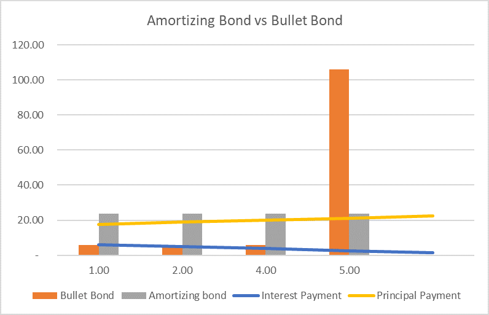

## Table of Contents

## What is a bullet bond?

A bullet bond is a type of bond where the entire principal amount is paid back to the investor all at once when the bond matures. Unlike other bonds that might pay back the principal in installments, a bullet bond pays everything at the end. This means that if you buy a bullet bond, you will get regular interest payments during the bond's life, but you won't get any of your initial investment back until the very end.

Bullet bonds are popular because they are simple and predictable. Investors know exactly when they will get their money back, which can help with planning and managing finances. However, because the principal is paid back in one big payment at the end, there is more risk if the issuer of the bond runs into financial trouble right before the bond matures. Despite this risk, many people and institutions like bullet bonds for their straightforward nature and the potential for reinvesting the lump sum payment at maturity.

## What is an amortizing bond?

An amortizing bond is a type of bond where the principal amount is paid back to the investor gradually over time, rather than all at once at the end. This means that with each payment, part of the money goes towards the interest and part goes towards paying back the principal. This is different from a bullet bond, where you only get the principal back when the bond matures.

These bonds are often used for things like mortgages or car loans, where the borrower pays a little bit of the loan back each month. For investors, amortizing bonds can be a good choice because they start getting some of their money back sooner, which can help with cash flow. However, because the principal is paid back over time, the total interest paid over the life of the bond might be less than with a bullet bond.

## How do bullet bonds and amortizing bonds differ in terms of principal repayment?

Bullet bonds and amortizing bonds have different ways of paying back the principal. With a bullet bond, you get all your money back at once when the bond matures. This means you get regular interest payments while the bond is active, but you don't get any of your initial investment back until the end. This can be good if you want a big payment at the end, but it can also be risky if the company issuing the bond has money problems right before it's supposed to pay you back.

On the other hand, an amortizing bond pays back the principal little by little over time. Each payment you receive includes both interest and a part of the principal. This is similar to how you might pay back a car loan or a mortgage, where you pay a bit of the loan each month. For investors, this means you start getting your money back sooner, which can help with managing your cash flow. However, because you're getting the principal back over time, you might end up paying less interest overall compared to a bullet bond.

## What are the key features of a bullet bond?

A bullet bond is a type of bond where you get all your money back at once when the bond ends. This means you get regular interest payments while the bond is active, but you don't get any of your initial investment back until the end. This can be good if you want a big payment at the end, but it can also be risky if the company issuing the bond has money problems right before it's supposed to pay you back.

Bullet bonds are popular because they are simple and easy to understand. Investors know exactly when they will get their money back, which helps with planning. Because the principal is paid back in one big payment at the end, bullet bonds can be a good choice if you want to reinvest that lump sum into something else when the bond matures.

## What are the key features of an amortizing bond?

An amortizing bond is a type of bond where the principal amount is paid back to you little by little over time. Each payment you get includes both interest and a part of the principal. This is similar to paying back a car loan or a mortgage, where you pay a bit of the loan each month. For investors, this means you start getting your money back sooner, which can help with managing your cash flow.

Because the principal is paid back over time, the total interest you pay over the life of the bond might be less than with a bullet bond. Amortizing bonds are often used for things like mortgages or car loans, where the borrower needs to pay back the loan gradually. This type of bond can be a good choice if you want to start getting some of your money back right away, rather than waiting until the end.

## In what scenarios might an investor prefer a bullet bond over an amortizing bond?

An investor might prefer a bullet bond if they want to get a big payment all at once at the end of the bond's term. This can be useful if they are planning to use that lump sum for a big purchase or to invest in something else. Bullet bonds are also simpler and easier to understand because you know exactly when you will get your money back, which can make planning easier. 

However, choosing a bullet bond comes with more risk because if the company that issued the bond has money problems right before it's supposed to pay you back, you could lose your entire investment. Despite this risk, many investors like bullet bonds because they can reinvest the lump sum at the end, possibly into something that could give them a higher return.

## In what scenarios might an investor prefer an amortizing bond over a bullet bond?

An investor might prefer an amortizing bond if they need money coming in regularly. With an amortizing bond, you start getting your money back little by little over time. This can help with managing your cash flow, especially if you need money to pay bills or other regular expenses. It's like getting a steady paycheck from your investment, which can be really helpful if you don't want to wait until the end of the bond's term to get your money back.

Also, amortizing bonds might be a good choice if you want to reduce the total amount of interest you pay. Because you're getting the principal back over time, the overall interest can be less than with a bullet bond. This can be important if you're trying to save money on interest payments. So, if you need regular payments and want to keep your interest costs down, an amortizing bond could be the better option for you.

## How do the cash flow patterns of bullet bonds and amortizing bonds affect investment strategies?

The cash flow patterns of bullet bonds and amortizing bonds can really change how you plan your investments. With a bullet bond, you get all your money back at once when the bond ends. This means you need to plan for a big payment coming in at the end, which can be great if you want to use that money for something big or invest it somewhere else. But it also means you have to wait until the end to get your money back, which can be tough if you need money sooner. So, if you're okay with waiting and want a lump sum at the end, a bullet bond might fit well into your investment strategy.

On the other hand, an amortizing bond gives you money back little by little over time. Each payment includes some interest and some of your original investment, so you start getting your money back sooner. This can be really helpful if you need regular payments to cover your bills or other expenses. It's like getting a steady paycheck from your investment. If you need money coming in regularly and want to keep your interest costs down, an amortizing bond could be a better choice for your investment strategy.

## What are the typical durations and maturities for bullet bonds versus amortizing bonds?

Bullet bonds usually have a wide range of durations and maturities. They can last anywhere from a few months to 30 years or even more. The key thing about bullet bonds is that no matter how long they last, you get all your money back at the very end. So, if you buy a bullet bond that matures in 10 years, you won't see any of your original investment until those 10 years are up. This makes bullet bonds a good choice if you're planning for something in the future and want a big payment all at once.

Amortizing bonds also come in different durations and maturities, but they tend to be used more for shorter to medium-term loans, like mortgages or car loans. These bonds might last from 5 to 30 years, but you start getting your money back little by little over that time. Each payment you get includes some interest and some of your original investment, so you don't have to wait until the end to see any of your money. This makes amortizing bonds a good fit if you need regular payments to help with your cash flow.

## How do interest rate risks differ between bullet bonds and amortizing bonds?

Interest rate risk is how changes in interest rates can affect the value of your bond. With bullet bonds, the risk is bigger because you get all your money back at the end. If interest rates go up while you're waiting for your bond to mature, the value of your bond goes down. That's because new bonds being sold will have higher interest rates, making your old bond less attractive to other investors. So, if you need to sell your bullet bond before it matures, you might get less money back than you expected. This makes bullet bonds more sensitive to changes in interest rates.

On the other hand, amortizing bonds have a bit less interest rate risk because you get your money back little by little over time. If interest rates go up, the value of your bond might go down, but since you're already getting some of your money back, the impact isn't as big. Also, because you're getting regular payments, you can use that money to invest in other things that might have better interest rates. So, amortizing bonds can help you manage interest rate risk better because you're not waiting until the end to get all your money back.

## Can you provide examples of bullet bonds and amortizing bonds in the market?

A good example of a bullet bond is a U.S. Treasury Bond. These are bonds issued by the U.S. government, and they pay interest every six months. When the bond reaches its maturity date, which could be anywhere from 10 to 30 years after you buy it, you get all your money back at once. People like these bonds because they are very safe and you know exactly when you'll get your money back. For example, if you buy a 10-year Treasury Bond, you'll get your money back after 10 years, no matter what happens with interest rates in between.

An example of an amortizing bond is a home mortgage. When you take out a mortgage to buy a house, you usually pay it back over a long time, like 15 or 30 years. Each monthly payment you make includes both interest and a part of the money you borrowed. So, little by little, you're paying back the loan. This is good for people who need to spread out their payments over time and can't afford to pay everything back at once. It's also good for investors who want to start getting their money back right away, rather than waiting until the end.

## How do tax implications vary between bullet bonds and amortizing bonds?

The tax implications for bullet bonds and amortizing bonds can be different. With a bullet bond, you pay taxes on the interest you get each year. But you don't pay taxes on the principal until you get it back at the end. So, if you have a 10-year bullet bond, you'll pay taxes on the interest every year for 10 years, but you won't pay taxes on the principal until the 10th year when you get it all back. This can be good if you want to delay paying taxes on the principal, but it means you might have a bigger tax bill at the end.

For an amortizing bond, you pay taxes on the interest part of each payment you get. But since you're also getting some of the principal back with each payment, you don't have to pay taxes on that part. This means you're paying taxes on less money each year compared to a bullet bond, because some of your payment is principal, which isn't taxed. This can be helpful if you want to spread out your tax payments over time and not have a big tax bill at the end.

## What is an Amortized Bond?

Amortized bonds are a type of debt instrument where the borrower makes periodic payments that consist of both interest and principal amounts. This structure contrasts with bonds that repay the principal in a lump sum at maturity, such as bullet bonds. The primary characteristic of amortized bonds is their structured repayment schedule, which reduces the outstanding principal with each payment over the bond's term. 

### Repayment Schedule

The regular repayments in amortized bonds are designed to return capital to the investor progressively. By consistently reducing the principal owed, the borrower decreases the overall risk to the investor, since each payment diminishes the remaining debt obligation. This structure can be particularly appealing for conservative investors who prioritize the return of capital and stable income streams.

### Predictable Cash Flows

For investors, the advantage of amortized bonds lies in the predictability of cash flows. Each payment is typically fixed, leading to a consistent cash flow pattern. This predictability enables investors to plan their cash management strategies with greater certainty. In terms of financial planning, the expected return on an amortized bond can often be calculated in advance, using the formula for calculating the value of an amortizing loan:

$$

PMT = \frac{P \times r \times (1 + r)^n}{(1 + r)^n - 1} 
$$

where:
- $PMT$ is the periodic payment amount,
- $P$ is the initial loan principal,
- $r$ is the periodic interest rate, and
- $n$ is the total number of payments.

### Suitability for Investors

Amortized bonds are well-suited for investors seeking a steady flow of income with minimal risk of principal loss. In uncertain economic conditions, the regular return of principal can serve as a protective financial strategy. The stability offered by amortizing bonds contrasts with more volatile investments, appealing to risk-averse individuals and institutions.

The built-in feature of decreasing risk exposure over time makes amortized bonds a strategic choice in diversified portfolios, providing balance alongside higher-risk investments. This characteristic not only aids in financial stability but also allows for more precise future cash flow projections, which are essential for sound financial planning.

## What are the key differences between Amortized Bonds and Bullet Bonds?

Amortized bonds and bullet bonds are primarily distinguished by their principal repayment schedules. With amortized bonds, the principal is repaid gradually over the term of the bond. This means that with each scheduled payment, a portion goes towards reducing the principal, while the remainder pays the accrued interest. This structure provides a steady return of capital to the investor throughout the life of the bond, thereby reducing default risk incrementally.

To illustrate, if an investor holds an amortized bond worth $10,000 at an interest rate of 5% over five years, the periodic payments would include both principal and interest components. The formula for calculating the periodic payment (A) is derived from the standard amortization formula:

$$
A = \frac{P \cdot r \cdot (1 + r)^n}{(1 + r)^n - 1}
$$

Where:
- $P$ is the principal amount ($10,000),
- $r$ is the periodic interest rate (0.05/1),
- $n$ is the total number of payments (5).

In contrast, bullet bonds require the repayment of the entire principal amount at maturity. These bonds pay interest throughout their term but do not amortize, meaning the principal remains unchanged until the end of the term. This backend-loaded structure can present benefits such as higher potential yields, as the issuer can utilize the capital until maturity, but it also introduces elevated risks. The significant principal repayment at maturity heightens default risk, and investors may face reinvestment risk, particularly if interest rates decline over the bond's term.

From an investment perspective, bullet bonds may present higher risk and return potential than their amortized counterparts. The non-amortizing nature contributes to higher [volatility](/wiki/volatility-trading-strategies) and sensitivity to interest rate fluctuations. As a result, investors in bullet bonds must weigh the potential for increased yields against the possibility of greater financial exposure at maturity. This difference in risk and return profiles makes the choice between amortized and bullet bonds a strategic decision, influenced by factors such as interest rate forecasts, [liquidity](/wiki/liquidity-risk-premium) considerations, and individual risk tolerance.

## References & Further Reading

[1]: Fabozzi, F. J. (2012). ["Bond Markets, Analysis, and Strategies"](https://books.google.com/books/about/Bond_Markets_Analysis_and_Strategies_ten.html?id=bQpNEAAAQBAJ) (8th Edition). Pearson.

[2]: Choudhry, M. (2010). ["The Bond and Money Markets: Strategy, Trading, Analysis"](https://www.sciencedirect.com/book/9780750646772/the-bond-and-money-markets). Wiley.

[3]: Narang, R. (2009). ["Inside the Black Box: A Simple Guide to Quantitative and High-Frequency Trading"](https://onlinelibrary.wiley.com/doi/book/10.1002/9781118267738). Wiley.

[4]: Lopez de Prado, M. (2018). ["Advances in Financial Machine Learning"](https://www.amazon.com/Advances-Financial-Machine-Learning-Marcos/dp/1119482089). Wiley.

[5]: Fabozzi, F. J., & Mann, S. V. (2012). ["Handbook of Fixed-Income Securities"](https://www.amazon.com/Handbook-Fixed-Income-Securities-Ninth/dp/1260473899) (8th Edition). McGraw-Hill Education.

[6]: Chan, E. P. (2009). ["Quantitative Trading: How to Build Your Own Algorithmic Trading Business"](https://github.com/ftvision/quant_trading_echan_book). Wiley.

[7]: Aronson, D. R. (2007). ["Evidence-Based Technical Analysis: Applying the Scientific Method and Statistical Inference to Trading Signals"](https://onlinelibrary.wiley.com/doi/book/10.1002/9781118268315). Wiley.